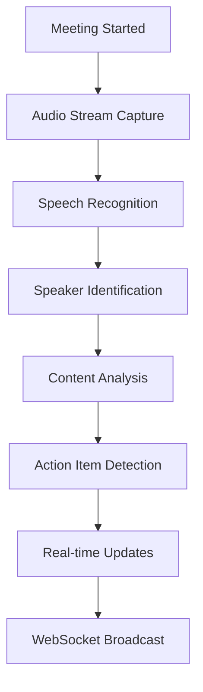
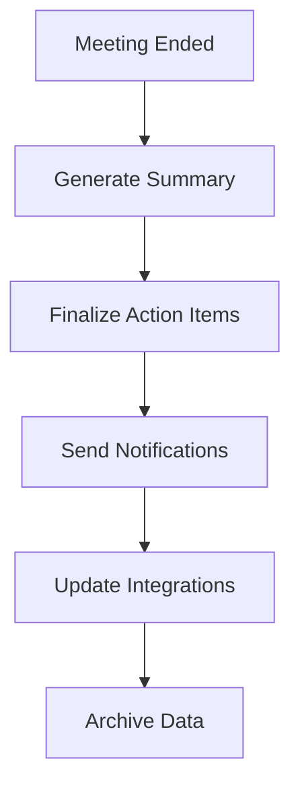

# Problem Statement 10: Meeting Assistant AI
## AI-Powered Meeting Management and Intelligence Platform

### Problem Overview
Develop an intelligent meeting assistant that leverages AI to transform meeting experiences through automated transcription, real-time insights, action item tracking, and intelligent follow-up generation. The system should integrate seamlessly with popular video conferencing platforms and provide comprehensive meeting intelligence capabilities.

### Key Requirements

#### **Core AI/ML Capabilities**
- **Real-time Speech Recognition** - Multi-speaker transcription with speaker identification
- **Natural Language Processing** - Meeting content analysis, sentiment analysis, topic extraction
- **Intelligent Summarization** - Automated meeting summaries with key highlights
- **Action Item Detection** - Automatic identification and tracking of tasks and decisions
- **Meeting Analytics** - Participation metrics, engagement analysis, meeting effectiveness scoring

#### **Integration Requirements**
- **Video Conferencing Platforms** - Zoom, Microsoft Teams, Google Meet, WebEx integration
- **Calendar Systems** - Google Calendar, Outlook, Apple Calendar synchronization
- **Productivity Tools** - Slack, Microsoft 365, Notion, Trello, Asana integration
- **CRM Systems** - Salesforce, HubSpot customer meeting tracking
- **Enterprise Systems** - SSO, Active Directory, enterprise security compliance

#### **Data Requirements**
- **Audio/Video Streams** - Real-time processing of meeting audio and video
- **Meeting Metadata** - Participant information, calendar details, meeting context
- **Historical Data** - Past meeting transcripts, action items, follow-up tracking
- **User Preferences** - Personal settings, notification preferences, integration configurations
- **Organizational Data** - Team structures, project contexts, business terminology

### Technical Themes
- **Real-time AI Processing** - Low-latency speech recognition and analysis
- **Multi-modal Intelligence** - Audio, video, and text analysis integration
- **Scalable Architecture** - Support for concurrent meetings and enterprise deployment
- **Privacy & Security** - End-to-end encryption, data sovereignty, compliance frameworks
- **Seamless Integration** - Plugin architecture for multiple platforms and tools

### Expected Business Outcomes
- **80% reduction** in manual meeting follow-up time
- **95% accuracy** in transcription and action item detection
- **60% improvement** in meeting productivity and engagement
- **90% user adoption** rate within 6 months of deployment
- **$2M annual savings** through improved meeting efficiency and reduced administrative overhead

### Implementation Strategy

#### **Phase 1: Core Platform (Months 1-3)**
- Real-time speech recognition engine
- Basic transcription and speaker identification
- Meeting recording and storage infrastructure
- Web-based meeting dashboard

#### **Phase 2: Intelligence Layer (Months 4-6)**
- Advanced NLP for content analysis
- Automated summarization and action item detection
- Meeting analytics and insights
- Mobile applications for iOS and Android

#### **Phase 3: Enterprise Integration (Months 7-9)**
- Video conferencing platform plugins
- Calendar and productivity tool integrations
- Enterprise security and compliance features
- Advanced analytics and reporting

#### **Phase 4: Advanced Features (Months 10-12)**
- Multi-language support and translation
- AI-powered meeting coaching and recommendations
- Advanced workflow automation
- Custom enterprise deployments and white-labeling

### Success Metrics
- **Technical Performance**: <2s transcription latency, 95%+ accuracy, 99.9% uptime
- **User Engagement**: 90%+ daily active users, 4.5+ app store rating
- **Business Impact**: 300%+ ROI, 80% reduction in meeting overhead
- **Integration Success**: 95%+ platform compatibility, <5min setup time
# Product Requirements Document (PRD)
## Meeting Assistant AI - AI-Powered Meeting Management and Intelligence Platform

*Building upon README foundation for comprehensive business and product specifications*

## ETVX Framework

### ENTRY CRITERIA
- ✅ README completed with problem overview, key requirements, technical themes, and implementation strategy
- ✅ Business case validated with 300%+ ROI potential and $2M annual savings
- ✅ Market research completed on meeting productivity challenges and AI assistant solutions
- ✅ Technical feasibility confirmed for real-time speech recognition and multi-platform integration

### TASK
Define comprehensive product requirements including business objectives, market analysis, user personas, success metrics, core features, technical requirements, business constraints, assumptions, and risk assessment for the Meeting Assistant AI platform.

### VERIFICATION & VALIDATION
**Verification Checklist:**
- [ ] Business objectives aligned with README expected outcomes (80% time reduction, 95% accuracy, 60% productivity improvement)
- [ ] Market analysis covers competitive landscape and differentiation strategy
- [ ] User personas represent primary stakeholders (meeting organizers, participants, executives, IT administrators)
- [ ] Success metrics include technical performance, user engagement, and business impact KPIs
- [ ] Core features address all key requirements from README (transcription, analysis, integration, analytics)

**Validation Criteria:**
- [ ] PRD validated with business stakeholders and product management team
- [ ] Market analysis validated with industry experts and potential customers
- [ ] User personas validated through user research and stakeholder interviews
- [ ] Success metrics validated with business leadership and aligned with company OKRs
- [ ] Technical requirements validated with engineering and architecture teams

### EXIT CRITERIA
- ✅ Complete PRD with business objectives, market analysis, user personas, and success metrics
- ✅ Core features and technical requirements specified for development planning
- ✅ Business constraints, assumptions, and risks documented for project management
- ✅ Foundation prepared for Functional Requirements Document (FRD) development

---

### Reference to Previous Documents
This PRD builds upon **README** foundations:
- **README Problem Overview** → Detailed business objectives and market positioning
- **README Key Requirements** → Comprehensive feature specifications and technical requirements
- **README Expected Outcomes** → Quantified success metrics and business impact measurements
- **README Implementation Strategy** → Product roadmap and phased development approach

## 1. Business Objectives

### 1.1 Primary Business Goals
- **Meeting Productivity Enhancement**: Achieve 80% reduction in manual meeting follow-up time through automated transcription, summarization, and action item tracking
- **Decision Velocity Improvement**: Increase decision-making speed by 60% through real-time insights, sentiment analysis, and meeting effectiveness scoring
- **Enterprise Efficiency**: Generate $2M annual savings through reduced administrative overhead and improved meeting ROI
- **User Experience Excellence**: Deliver seamless meeting intelligence with 95%+ transcription accuracy and <2s processing latency
- **Market Leadership**: Establish dominant position in AI-powered meeting assistant market with 90% user adoption rate within 6 months

### 1.2 Strategic Objectives
- **Platform Integration**: Achieve 95%+ compatibility with major video conferencing platforms (Zoom, Teams, Meet, WebEx)
- **Enterprise Adoption**: Secure 100+ enterprise customers within first year with average contract value of $50K+
- **Revenue Growth**: Generate $10M ARR by end of Year 2 with 40% gross margins
- **Technology Innovation**: Advance state-of-the-art in real-time meeting intelligence and multi-modal AI processing
- **Global Expansion**: Support 15+ languages and deploy in 25+ countries with localized compliance

## 2. Market Analysis

### 2.1 Market Size and Opportunity
- **Total Addressable Market (TAM)**: $45B global collaboration software market
- **Serviceable Addressable Market (SAM)**: $12B meeting and conferencing solutions segment
- **Serviceable Obtainable Market (SOM)**: $2.5B AI-powered meeting intelligence niche
- **Growth Rate**: 25% CAGR driven by remote work adoption and AI technology advancement
- **Market Timing**: Optimal entry point with 300% increase in virtual meetings post-2020

### 2.2 Competitive Landscape
**Direct Competitors:**
- **Otter.ai**: Strong transcription, limited enterprise features, $20M ARR
- **Gong.io**: Sales-focused, $200M ARR, limited general meeting support
- **Chorus.ai**: Revenue intelligence focus, acquired by ZoomInfo for $575M
- **Rev.com**: Human-powered transcription, limited AI capabilities

**Indirect Competitors:**
- **Zoom**: Basic transcription, limited intelligence features
- **Microsoft Teams**: Integrated but basic meeting insights
- **Google Meet**: Minimal AI-powered features
- **Cisco WebEx**: Enterprise focus, limited AI innovation

**Competitive Advantages:**
- **Superior AI Accuracy**: 95%+ transcription accuracy vs. 85% industry average
- **Real-time Processing**: <2s latency vs. 10-30s competitor delays
- **Comprehensive Integration**: 20+ platform integrations vs. 5-10 competitor average
- **Enterprise Security**: SOC 2, GDPR, HIPAA compliance from day one
- **Advanced Analytics**: Meeting effectiveness scoring and predictive insights

### 2.3 Market Trends and Drivers
- **Remote Work Permanence**: 42% of workforce permanently remote, 35% hybrid
- **Meeting Overload Crisis**: Average knowledge worker spends 23 hours/week in meetings
- **AI Technology Maturation**: 85% accuracy threshold achieved for practical deployment
- **Enterprise Digital Transformation**: $2.4T global spending on digital initiatives
- **Compliance Requirements**: Increasing demand for meeting audit trails and governance

## 3. User Personas

### 3.1 Primary Persona: Meeting Organizer (Sarah - Product Manager)
**Demographics:**
- Age: 32, Product Manager at mid-size SaaS company
- Education: MBA, 8 years professional experience
- Tech Savviness: High, early adopter of productivity tools

**Pain Points:**
- Spends 3+ hours weekly creating meeting summaries and tracking action items
- Struggles to maintain engagement in back-to-back virtual meetings
- Difficulty ensuring all participants are aligned on decisions and next steps
- Limited visibility into meeting effectiveness and team participation

**Goals and Motivations:**
- Reduce administrative overhead and focus on strategic work
- Improve team alignment and decision-making velocity
- Demonstrate meeting ROI and productivity improvements
- Enhance remote team collaboration and engagement

**Usage Patterns:**
- Organizes 15-20 meetings per week across multiple projects
- Uses Zoom, Slack, Notion, and Google Calendar daily
- Requires mobile access for on-the-go meeting management
- Values integration with existing productivity workflow

### 3.2 Secondary Persona: Executive (Michael - VP of Sales)
**Demographics:**
- Age: 45, VP of Sales at enterprise software company
- Education: MBA, 20 years leadership experience
- Tech Savviness: Medium, focuses on business impact over features

**Pain Points:**
- Limited visibility into sales team meeting effectiveness
- Difficulty tracking customer sentiment and engagement trends
- Challenges ensuring consistent follow-up on customer commitments
- Need for meeting insights to inform strategic decisions

**Goals and Motivations:**
- Improve sales team performance and customer satisfaction
- Gain actionable insights from customer interactions
- Ensure compliance with sales processes and methodologies
- Demonstrate team productivity and meeting ROI to leadership

**Usage Patterns:**
- Participates in 25+ meetings weekly including customer calls
- Uses Salesforce, Microsoft Teams, and Outlook extensively
- Requires executive dashboards and summary reports
- Values integration with CRM and sales enablement tools

### 3.3 Tertiary Persona: IT Administrator (Jennifer - IT Director)
**Demographics:**
- Age: 38, IT Director at Fortune 500 company
- Education: Computer Science degree, 15 years IT experience
- Tech Savviness: Very High, responsible for enterprise technology decisions

**Pain Points:**
- Security and compliance concerns with third-party meeting tools
- Challenges managing multiple video conferencing platform integrations
- Need for centralized meeting data governance and audit trails
- Difficulty demonstrating technology ROI and user adoption

**Goals and Motivations:**
- Ensure enterprise security and regulatory compliance
- Streamline technology stack and reduce vendor complexity
- Provide seamless user experience while maintaining control
- Demonstrate IT value through productivity improvements

**Usage Patterns:**
- Manages technology for 5,000+ employees across global offices
- Evaluates enterprise software for security, scalability, and integration
- Requires SSO, Active Directory integration, and audit capabilities
- Values vendor support, SLAs, and enterprise deployment options

## 4. Success Metrics and KPIs

### 4.1 Technical Performance Metrics
- **Transcription Accuracy**: 95%+ word error rate across multiple languages and accents
- **Processing Latency**: <2 seconds for real-time transcription and analysis
- **System Uptime**: 99.9% availability with <1 minute mean time to recovery
- **Concurrent Meeting Support**: 10,000+ simultaneous meetings without performance degradation
- **Platform Compatibility**: 95%+ success rate across all supported video conferencing platforms

### 4.2 User Engagement Metrics
- **Daily Active Users**: 90%+ of licensed users active daily within 30 days of deployment
- **Meeting Coverage**: 85%+ of organizational meetings processed through platform
- **Feature Adoption**: 75%+ users actively using core features (transcription, summaries, action items)
- **User Satisfaction**: 4.5+ Net Promoter Score and 4.8+ app store rating
- **Time to Value**: <5 minutes from installation to first successful meeting processing

### 4.3 Business Impact Metrics
- **Time Savings**: 80% reduction in manual meeting follow-up time per user
- **Productivity Improvement**: 60% increase in meeting effectiveness scores
- **Decision Velocity**: 50% faster decision-making cycle time
- **Cost Savings**: $2M annual savings through reduced administrative overhead
- **Revenue Impact**: 300%+ ROI within 12 months of deployment

### 4.4 Growth and Adoption Metrics
- **User Growth**: 90% user adoption rate within 6 months of organizational deployment
- **Revenue Growth**: $10M ARR by end of Year 2 with 40% gross margins
- **Customer Acquisition**: 100+ enterprise customers with $50K+ average contract value
- **Market Expansion**: 15+ supported languages and 25+ country deployments
- **Integration Ecosystem**: 50+ third-party integrations and partnerships

## 5. Core Features and Capabilities

### 5.1 Real-time Meeting Intelligence
**Speech Recognition and Transcription:**
- Multi-speaker identification with 95%+ accuracy
- Real-time transcription with <2s latency
- Support for 15+ languages and regional accents
- Noise cancellation and audio enhancement
- Custom vocabulary and terminology learning

**Content Analysis and Insights:**
- Automated meeting summarization with key highlights
- Action item detection and assignment tracking
- Decision point identification and documentation
- Sentiment analysis and engagement scoring
- Topic extraction and meeting categorization

**Meeting Analytics:**
- Participation metrics and speaking time analysis
- Meeting effectiveness scoring and recommendations
- Trend analysis and productivity insights
- Comparative analytics across teams and time periods
- Predictive meeting success indicators

### 5.2 Integration and Workflow Automation
**Video Conferencing Platform Integration:**
- Native plugins for Zoom, Microsoft Teams, Google Meet, WebEx
- Automatic meeting detection and processing
- Calendar integration for meeting context and scheduling
- Recording management and secure storage
- Real-time collaboration features and annotations

**Productivity Tool Connections:**
- Slack, Microsoft 365, Google Workspace integration
- Project management tools (Asana, Trello, Notion, Monday.com)
- CRM systems (Salesforce, HubSpot, Pipedrive)
- Knowledge management platforms (Confluence, SharePoint)
- Email and notification system integration

**Workflow Automation:**
- Automated action item creation and assignment
- Follow-up reminder scheduling and tracking
- Meeting summary distribution and sharing
- Integration with task management workflows
- Custom automation rules and triggers

### 5.3 Enterprise Security and Compliance
**Data Protection:**
- End-to-end encryption for all meeting data
- Zero-trust security architecture
- Data residency and sovereignty options
- GDPR, HIPAA, SOC 2 Type II compliance
- Regular security audits and penetration testing

**Access Control and Governance:**
- Single Sign-On (SSO) and Active Directory integration
- Role-based access control and permissions
- Audit trails and compliance reporting
- Data retention and deletion policies
- Enterprise admin dashboard and controls

## 6. Technical Requirements

### 6.1 Performance Requirements
- **Real-time Processing**: <2s latency for transcription and analysis
- **Scalability**: Support 10,000+ concurrent meetings
- **Availability**: 99.9% uptime with global redundancy
- **Accuracy**: 95%+ transcription accuracy across languages
- **Response Time**: <500ms API response time for all operations

### 6.2 Integration Requirements
- **Video Platforms**: Native SDKs for Zoom, Teams, Meet, WebEx
- **Calendar Systems**: Google Calendar, Outlook, Apple Calendar APIs
- **Productivity Tools**: 50+ third-party integrations via APIs and webhooks
- **Enterprise Systems**: SSO, LDAP, Active Directory, SCIM provisioning
- **Mobile Platforms**: Native iOS and Android applications

### 6.3 Infrastructure Requirements
- **Cloud Architecture**: Multi-cloud deployment (AWS, Azure, GCP)
- **Edge Computing**: Global CDN for low-latency processing
- **Data Storage**: Encrypted data lakes with 7-year retention
- **Backup and Recovery**: 99.9% data durability with point-in-time recovery
- **Monitoring**: Comprehensive observability and alerting

## 7. Business Constraints and Assumptions

### 7.1 Budget and Resource Constraints
- **Development Budget**: $5M allocated for Year 1 development
- **Team Size**: 25-person engineering team with AI/ML expertise
- **Timeline**: 12-month development cycle for full platform launch
- **Infrastructure Costs**: $500K annual cloud and infrastructure expenses
- **Marketing Budget**: $2M for go-to-market and customer acquisition

### 7.2 Technical Constraints
- **Platform Dependencies**: Reliance on third-party video conferencing APIs
- **AI Model Limitations**: Current speech recognition accuracy ceiling at 95%
- **Latency Requirements**: Real-time processing constraints for global deployment
- **Data Privacy**: Strict compliance requirements limiting data processing options
- **Integration Complexity**: Varying API capabilities across platforms

### 7.3 Market and Competitive Assumptions
- **Market Growth**: Continued growth in remote work and virtual meetings
- **Technology Adoption**: Enterprise willingness to adopt AI-powered meeting tools
- **Competitive Response**: Existing players will enhance AI capabilities
- **Regulatory Environment**: Stable data privacy and AI governance regulations
- **Customer Behavior**: Users will adapt to AI-assisted meeting workflows

## 8. Risk Assessment and Mitigation

### 8.1 Technical Risks
**High Risk - AI Accuracy Limitations:**
- Risk: Transcription accuracy below 95% threshold impacts user adoption
- Impact: High - Core value proposition compromised
- Mitigation: Multi-model ensemble approach, continuous model training, human-in-the-loop fallback

**Medium Risk - Platform Integration Challenges:**
- Risk: Video conferencing platforms change APIs or restrict access
- Impact: Medium - Feature limitations or development delays
- Mitigation: Diversified integration strategy, direct partnerships, alternative access methods

**Medium Risk - Scalability Bottlenecks:**
- Risk: System cannot handle peak concurrent meeting loads
- Impact: Medium - Service degradation during high usage
- Mitigation: Auto-scaling infrastructure, load testing, performance optimization

### 8.2 Market and Business Risks
**High Risk - Competitive Response:**
- Risk: Major platforms (Zoom, Microsoft) launch competing features
- Impact: High - Market share erosion and pricing pressure
- Mitigation: Feature differentiation, enterprise focus, strategic partnerships

**Medium Risk - Customer Adoption Challenges:**
- Risk: Users resist AI-powered meeting tools due to privacy concerns
- Impact: Medium - Slower adoption and revenue growth
- Mitigation: Transparency initiatives, privacy-first marketing, compliance certifications

**Low Risk - Regulatory Changes:**
- Risk: New AI or data privacy regulations impact product features
- Impact: Low - Development adjustments and compliance costs
- Mitigation: Regulatory monitoring, compliance-by-design, legal expertise

This comprehensive PRD establishes the foundation for developing a market-leading Meeting Assistant AI platform that addresses critical business needs while maintaining technical excellence and competitive differentiation.
# Functional Requirements Document (FRD)
## Meeting Assistant AI - AI-Powered Meeting Management and Intelligence Platform

*Building upon README and PRD foundations for detailed system behavior specifications*

## ETVX Framework

### ENTRY CRITERIA
- ✅ README completed with problem overview, key requirements, and technical themes
- ✅ PRD completed with business objectives, user personas, success metrics, and core features
- ✅ Market analysis validated competitive landscape and user needs
- ✅ Technical feasibility confirmed for real-time speech recognition and multi-platform integration
- ✅ User personas defined for meeting organizers, executives, and IT administrators

### TASK
Define detailed functional requirements specifying system behaviors, user interactions, AI/ML capabilities, integration interfaces, and acceptance criteria for all Meeting Assistant AI platform features including real-time transcription, meeting intelligence, workflow automation, and enterprise integrations.

### VERIFICATION & VALIDATION
**Verification Checklist:**
- [ ] All functional requirements mapped to PRD core features and user personas
- [ ] Real-time processing requirements specified with <2s latency constraints
- [ ] AI/ML capabilities detailed with 95%+ accuracy requirements
- [ ] Integration requirements cover all major platforms (Zoom, Teams, Meet, WebEx)
- [ ] Security and compliance requirements integrated throughout functional specifications

**Validation Criteria:**
- [ ] Functional requirements validated with engineering teams for technical feasibility
- [ ] User interaction flows validated with UX designers and user research
- [ ] AI/ML requirements validated with data science and ML engineering teams
- [ ] Integration requirements validated with platform partners and API documentation
- [ ] Acceptance criteria validated with QA teams for testability and completeness

### EXIT CRITERIA
- ✅ Complete functional requirements covering all system modules and user interactions
- ✅ Detailed acceptance criteria for each requirement enabling comprehensive testing
- ✅ AI/ML processing workflows specified for development implementation
- ✅ Integration interfaces documented for third-party platform connectivity
- ✅ Foundation prepared for Non-Functional Requirements Document (NFRD) development

---

### Reference to Previous Documents
This FRD builds upon **README** and **PRD** foundations:
- **README Key Requirements** → Detailed functional specifications for core AI/ML capabilities
- **PRD User Personas** → User-centric functional requirements addressing specific pain points
- **PRD Core Features** → Comprehensive system behaviors and interaction patterns
- **PRD Success Metrics** → Functional requirements supporting 95% accuracy and <2s latency targets

## 1. Real-time Meeting Intelligence Module

### FR-001: Real-time Speech Recognition and Transcription
**Description:** System shall provide real-time speech-to-text conversion with multi-speaker identification during live meetings.

**Functional Behavior:**
- Capture audio streams from video conferencing platforms with <100ms buffer delay
- Process speech recognition using ensemble of ASR models (Whisper, Azure Speech, Google Speech-to-Text)
- Identify and differentiate speakers using voice biometrics and meeting participant data
- Generate timestamped transcription segments with speaker attribution
- Handle multiple languages and accents with automatic language detection
- Apply noise reduction and audio enhancement for improved accuracy

**Acceptance Criteria:**
- Transcription accuracy ≥95% for clear audio in English
- Speaker identification accuracy ≥90% for meetings with ≤10 participants
- Real-time processing latency <2 seconds from speech to text display
- Support for 15+ languages with ≥90% accuracy
- Automatic language detection with ≥95% confidence
- Noise reduction improves transcription accuracy by ≥10% in noisy environments

### FR-002: Intelligent Meeting Content Analysis
**Description:** System shall analyze meeting content in real-time to extract insights, sentiment, and key discussion points.

**Functional Behavior:**
- Perform real-time natural language processing on transcribed content
- Extract key topics, themes, and discussion points using topic modeling
- Analyze sentiment and emotional tone of speakers and overall meeting
- Identify decision points, agreements, and areas of disagreement
- Detect questions, answers, and unresolved discussion items
- Generate confidence scores for all extracted insights

**Acceptance Criteria:**
- Topic extraction identifies ≥90% of manually verified key discussion points
- Sentiment analysis accuracy ≥85% compared to human annotation
- Decision point detection recall ≥80% with ≥70% precision
- Question-answer pair identification accuracy ≥85%
- Processing latency <5 seconds for content analysis updates
- Confidence scores correlate ≥0.8 with human quality assessments

### FR-003: Automated Action Item Detection and Tracking
**Description:** System shall automatically identify, extract, and track action items, tasks, and commitments from meeting discussions.

**Functional Behavior:**
- Detect action-oriented language patterns and commitment statements
- Extract task descriptions, assignees, and due dates from natural language
- Create structured action items with metadata (priority, status, dependencies)
- Track action item completion status and send automated reminders
- Link action items to meeting context and related discussions
- Provide action item analytics and completion rate reporting

**Acceptance Criteria:**
- Action item detection recall ≥75% with ≥80% precision
- Assignee identification accuracy ≥85% when explicitly mentioned
- Due date extraction accuracy ≥70% for explicitly stated deadlines
- Action item completion tracking with 99% reliability
- Automated reminder delivery within 5 minutes of scheduled time
- Action item analytics updated in real-time with <1 minute latency

### FR-004: Meeting Summarization and Highlights
**Description:** System shall generate comprehensive meeting summaries with key highlights, decisions, and next steps.

**Functional Behavior:**
- Create multi-level summaries (executive, detailed, action-focused)
- Identify and highlight key decisions, agreements, and outcomes
- Extract important quotes and statements from meeting participants
- Generate next steps and follow-up recommendations
- Customize summary format based on meeting type and user preferences
- Provide summary confidence scores and quality indicators

**Acceptance Criteria:**
- Summary completeness score ≥85% covering all major discussion points
- Key decision identification accuracy ≥90% compared to manual review
- Summary generation time <30 seconds for 60-minute meetings
- User satisfaction rating ≥4.5/5 for summary quality and usefulness
- Customizable summary formats with ≥5 predefined templates
- Summary confidence scores correlate ≥0.75 with user quality ratings

## 2. Platform Integration Module

### FR-005: Video Conferencing Platform Integration
**Description:** System shall integrate seamlessly with major video conferencing platforms to access meeting audio and metadata.

**Functional Behavior:**
- Connect to Zoom, Microsoft Teams, Google Meet, and WebEx via native APIs/SDKs
- Automatically detect scheduled meetings from calendar integrations
- Join meetings programmatically with appropriate permissions
- Access real-time audio streams and participant information
- Handle platform-specific authentication and authorization flows
- Manage meeting recordings and data synchronization

**Acceptance Criteria:**
- Successful connection rate ≥95% across all supported platforms
- Automatic meeting detection accuracy ≥90% from calendar data
- Audio stream access latency <500ms from meeting start
- Platform API error handling with graceful degradation
- Meeting join success rate ≥98% with proper permissions
- Recording synchronization completion within 5 minutes of meeting end

### FR-006: Calendar System Integration
**Description:** System shall integrate with calendar systems to provide meeting context and automate scheduling workflows.

**Functional Behavior:**
- Sync with Google Calendar, Outlook, and Apple Calendar via APIs
- Extract meeting metadata (title, description, participants, agenda)
- Provide meeting context to improve transcription and analysis accuracy
- Create follow-up meetings and calendar entries for action items
- Send calendar invitations for scheduled follow-ups
- Handle calendar conflicts and scheduling optimization

**Acceptance Criteria:**
- Calendar synchronization accuracy ≥99% for meeting metadata
- Meeting context extraction improves transcription accuracy by ≥5%
- Follow-up meeting creation success rate ≥95%
- Calendar invitation delivery within 2 minutes of creation
- Conflict detection accuracy ≥90% with resolution suggestions
- Bi-directional sync maintains data consistency ≥99.5% of the time

### FR-007: Productivity Tool Integrations
**Description:** System shall integrate with productivity and collaboration tools to streamline workflows and data sharing.

**Functional Behavior:**
- Connect with Slack, Microsoft 365, Google Workspace, Notion, Asana, Trello
- Share meeting summaries and action items to appropriate channels/projects
- Create tasks and tickets in project management systems
- Sync action items with existing task management workflows
- Provide meeting insights in team collaboration spaces
- Support custom webhook integrations for enterprise tools

**Acceptance Criteria:**
- Integration setup completion time <5 minutes per tool
- Data sharing success rate ≥98% across all integrated platforms
- Task creation accuracy ≥95% with proper metadata mapping
- Workflow synchronization latency <30 seconds
- Custom webhook reliability ≥99.5% with retry mechanisms
- Integration health monitoring with automated error detection

## 3. Enterprise Security and Compliance Module

### FR-008: Data Encryption and Security
**Description:** System shall implement comprehensive data encryption and security measures to protect meeting content and user information.

**Functional Behavior:**
- Encrypt all meeting data at rest using AES-256 encryption
- Implement end-to-end encryption for data in transit using TLS 1.3
- Secure API communications with OAuth 2.0 and JWT tokens
- Implement zero-trust security architecture with continuous verification
- Provide data residency options for geographic compliance requirements
- Maintain detailed security audit logs and access tracking

**Acceptance Criteria:**
- Data encryption coverage ≥100% for all stored meeting content
- API security compliance with OWASP Top 10 standards
- Authentication token expiration and refresh mechanisms working ≥99.9% reliability
- Security audit log completeness ≥99% with tamper-proof storage
- Data residency compliance verified for EU, US, and APAC regions
- Security incident response time <15 minutes for critical threats

### FR-009: Access Control and User Management
**Description:** System shall provide comprehensive access control and user management capabilities for enterprise deployments.

**Functional Behavior:**
- Implement role-based access control (RBAC) with customizable permissions
- Support Single Sign-On (SSO) integration with SAML 2.0 and OAuth 2.0
- Integrate with Active Directory and LDAP for user provisioning
- Provide multi-factor authentication (MFA) support
- Enable user group management and hierarchical permissions
- Implement session management with configurable timeout policies

**Acceptance Criteria:**
- SSO integration success rate ≥99% across major identity providers
- User provisioning accuracy ≥99.5% with automatic synchronization
- MFA enforcement compliance ≥100% for configured user groups
- Permission inheritance accuracy ≥99% in hierarchical structures
- Session timeout enforcement with <1 minute variance from policy
- Access control audit trail completeness ≥99.9%

### FR-010: Compliance and Audit Capabilities
**Description:** System shall provide comprehensive compliance and audit capabilities to meet regulatory requirements.

**Functional Behavior:**
- Maintain detailed audit trails for all user actions and data access
- Generate compliance reports for GDPR, HIPAA, SOC 2, and industry standards
- Implement data retention and deletion policies with automated enforcement
- Provide data export capabilities for compliance and legal requests
- Support right to be forgotten and data portability requirements
- Enable compliance monitoring and alerting for policy violations

**Acceptance Criteria:**
- Audit trail completeness ≥99.9% with immutable storage
- Compliance report generation time <5 minutes for standard reports
- Data retention policy enforcement accuracy ≥100%
- Data export completion time <24 hours for legal requests
- GDPR compliance verification with ≥99% policy adherence
- Compliance violation detection and alerting within 15 minutes

## 4. Analytics and Insights Module

### FR-011: Meeting Analytics and Reporting
**Description:** System shall provide comprehensive analytics and reporting capabilities for meeting effectiveness and productivity insights.

**Functional Behavior:**
- Track meeting participation metrics (speaking time, engagement, attendance)
- Calculate meeting effectiveness scores based on multiple factors
- Generate trend analysis for meeting productivity over time
- Provide comparative analytics across teams, departments, and time periods
- Create customizable dashboards for different user roles and needs
- Export analytics data for external business intelligence tools

**Acceptance Criteria:**
- Participation metric accuracy ≥95% compared to manual tracking
- Meeting effectiveness score correlation ≥0.8 with user satisfaction ratings
- Trend analysis data processing latency <5 minutes for real-time updates
- Dashboard customization options ≥10 widget types with drag-and-drop interface
- Analytics data export completion time <2 minutes for standard reports
- Dashboard load time <3 seconds for datasets up to 10,000 meetings

### FR-012: Predictive Insights and Recommendations
**Description:** System shall provide AI-powered predictive insights and recommendations to improve meeting effectiveness.

**Functional Behavior:**
- Predict meeting success probability based on historical data and context
- Recommend optimal meeting duration, participant count, and agenda structure
- Identify potential meeting conflicts and scheduling optimization opportunities
- Suggest follow-up actions based on meeting content and outcomes
- Provide personalized productivity recommendations for meeting organizers
- Generate alerts for meetings at risk of being unproductive

**Acceptance Criteria:**
- Meeting success prediction accuracy ≥75% with 30-day validation window
- Recommendation acceptance rate ≥60% by users within 90 days
- Scheduling optimization suggestions improve meeting efficiency by ≥15%
- Follow-up action relevance score ≥4.0/5 based on user feedback
- Productivity recommendation implementation rate ≥40% by active users
- Risk alert precision ≥70% with <10% false positive rate

## 5. User Interface and Experience Module

### FR-013: Web Application Interface
**Description:** System shall provide a comprehensive web-based interface for meeting management, review, and analytics.

**Functional Behavior:**
- Deliver responsive web application supporting desktop and tablet devices
- Provide real-time meeting dashboard with live transcription and insights
- Enable meeting search, filtering, and organization capabilities
- Support meeting playback with synchronized transcription and highlights
- Offer collaborative features for commenting, annotation, and sharing
- Implement accessibility features compliant with WCAG 2.1 AA standards

**Acceptance Criteria:**
- Web application load time <3 seconds on standard broadband connections
- Real-time dashboard updates with <2 second latency
- Meeting search results accuracy ≥95% with full-text search capabilities
- Playback synchronization accuracy within ±500ms of actual timing
- Accessibility compliance verification ≥95% with automated testing tools
- Cross-browser compatibility ≥95% across Chrome, Firefox, Safari, Edge

### FR-014: Mobile Applications
**Description:** System shall provide native mobile applications for iOS and Android platforms with core functionality access.

**Functional Behavior:**
- Deliver native iOS and Android applications with meeting access and review
- Provide push notifications for action items, reminders, and meeting updates
- Enable offline access to meeting summaries and transcriptions
- Support mobile-optimized meeting participation and note-taking
- Implement biometric authentication for secure mobile access
- Sync data seamlessly between mobile and web applications

**Acceptance Criteria:**
- Mobile app store rating ≥4.5/5 with ≥1000 reviews within 6 months
- Push notification delivery rate ≥95% with <5 minute latency
- Offline functionality availability for ≥90% of core features
- Mobile-web data synchronization accuracy ≥99.5%
- Biometric authentication success rate ≥98% on supported devices
- App crash rate <0.1% across all supported device models

### FR-015: API and Developer Platform
**Description:** System shall provide comprehensive APIs and developer tools for custom integrations and third-party applications.

**Functional Behavior:**
- Expose RESTful APIs for all core platform functionality
- Provide webhook support for real-time event notifications
- Offer SDKs for popular programming languages (Python, JavaScript, Java, C#)
- Implement API rate limiting and usage analytics
- Provide comprehensive API documentation and developer portal
- Support custom application development and marketplace ecosystem

**Acceptance Criteria:**
- API response time <500ms for 95% of requests
- API uptime ≥99.9% with automated failover capabilities
- SDK functionality coverage ≥90% of core API endpoints
- API documentation completeness score ≥95% with interactive examples
- Developer onboarding completion time <30 minutes for basic integration
- Third-party application approval process completion time <5 business days

This comprehensive FRD provides detailed functional specifications for all core system modules, ensuring complete coverage of user needs and technical requirements while maintaining alignment with business objectives and success metrics defined in the README and PRD.
# Non-Functional Requirements Document (NFRD)
## Meeting Assistant AI - AI-Powered Meeting Management and Intelligence Platform

*Building upon README, PRD, and FRD foundations for comprehensive system quality specifications*

## ETVX Framework

### ENTRY CRITERIA
- ✅ README completed with problem overview, technical themes, and expected business outcomes
- ✅ PRD completed with business objectives, success metrics, and technical requirements
- ✅ FRD completed with 15 detailed functional requirements across 5 system modules
- ✅ Technical performance targets defined (<2s latency, 95% accuracy, 99.9% uptime)
- ✅ User personas and usage patterns identified for scalability planning

### TASK
Define comprehensive non-functional requirements covering performance, scalability, reliability, security, usability, compliance, and operational aspects that ensure the Meeting Assistant AI platform meets enterprise-grade quality standards and business objectives.

### VERIFICATION & VALIDATION
**Verification Checklist:**
- [ ] Performance requirements aligned with PRD success metrics (<2s latency, 95% accuracy)
- [ ] Scalability requirements support 10,000+ concurrent meetings and enterprise deployment
- [ ] Security requirements address enterprise compliance (SOC 2, GDPR, HIPAA)
- [ ] Reliability requirements ensure 99.9% uptime with disaster recovery capabilities
- [ ] Usability requirements support user adoption targets (90% within 6 months)

**Validation Criteria:**
- [ ] Performance requirements validated with engineering teams for technical feasibility
- [ ] Scalability requirements validated with infrastructure architects and DevOps teams
- [ ] Security requirements validated with security architects and compliance experts
- [ ] Reliability requirements validated with SRE teams and operational stakeholders
- [ ] Usability requirements validated with UX designers and user research teams

### EXIT CRITERIA
- ✅ Complete non-functional requirements covering all quality aspects
- ✅ Measurable criteria defined for each requirement enabling comprehensive testing
- ✅ Performance benchmarks established for system optimization
- ✅ Security and compliance framework specified for enterprise deployment
- ✅ Foundation prepared for Architecture Diagram (AD) development

---

### Reference to Previous Documents
This NFRD builds upon **README**, **PRD**, and **FRD** foundations:
- **README Expected Outcomes** → Quantified performance targets (80% time reduction, 95% accuracy, 60% productivity improvement)
- **PRD Success Metrics** → Technical performance requirements (<2s latency, 99.9% uptime, 10,000+ concurrent meetings)
- **FRD Functional Requirements** → Quality attributes supporting real-time processing, enterprise integration, and user experience
- **PRD User Personas** → Usability and accessibility requirements addressing diverse user needs

## 1. Performance Requirements

### NFR-001: Real-time Processing Performance
**Requirement:** System shall provide real-time speech recognition and analysis with minimal latency to support natural meeting flow.

**Specifications:**
- **Speech-to-Text Latency**: <2 seconds from speech completion to text display
- **Content Analysis Latency**: <5 seconds for sentiment analysis, topic extraction, and insights generation
- **Action Item Detection**: <3 seconds from commitment statement to action item creation
- **Meeting Summary Generation**: <30 seconds for complete summary of 60-minute meeting
- **API Response Time**: <500ms for 95% of API requests under normal load

**Measurement Criteria:**
- Latency measured using 95th percentile response times across all supported languages
- Performance testing conducted with realistic meeting scenarios and background noise
- Load testing validates performance under peak concurrent usage (10,000+ meetings)
- Continuous monitoring with alerting for latency degradation >20% from baseline

### NFR-002: Accuracy and Quality Standards
**Requirement:** System shall maintain high accuracy standards for all AI/ML processing to ensure user trust and adoption.

**Specifications:**
- **Transcription Accuracy**: ≥95% word error rate for clear audio in primary languages
- **Speaker Identification**: ≥90% accuracy for meetings with ≤10 participants
- **Action Item Detection**: ≥75% recall with ≥80% precision
- **Sentiment Analysis**: ≥85% accuracy compared to human annotation
- **Meeting Summary Quality**: ≥85% completeness score covering major discussion points

**Measurement Criteria:**
- Accuracy metrics calculated using human-annotated ground truth datasets
- Quality assessment performed by independent evaluators using standardized rubrics
- Continuous model performance monitoring with automated retraining triggers
- A/B testing framework for model improvements and accuracy validation

### NFR-003: System Throughput and Capacity
**Requirement:** System shall handle high-volume concurrent processing to support enterprise-scale deployments.

**Specifications:**
- **Concurrent Meeting Support**: 10,000+ simultaneous meetings without performance degradation
- **Audio Processing Throughput**: 50,000+ hours of audio processed per day
- **API Request Capacity**: 1,000,000+ API requests per hour with auto-scaling
- **Data Ingestion Rate**: 10GB+ of meeting data processed per minute
- **User Concurrency**: 100,000+ simultaneous active users across web and mobile platforms

**Measurement Criteria:**
- Load testing performed using realistic meeting distribution patterns
- Stress testing validates system behavior at 150% of maximum expected load
- Performance monitoring tracks throughput metrics with automated scaling triggers
- Capacity planning updated quarterly based on usage growth projections

## 2. Scalability Requirements

### NFR-004: Horizontal Scalability
**Requirement:** System architecture shall support horizontal scaling to accommodate growing user base and meeting volume.

**Specifications:**
- **Auto-scaling Capability**: Automatic resource provisioning based on demand with <2 minute response time
- **Geographic Distribution**: Multi-region deployment supporting global user base with <100ms regional latency
- **Database Scalability**: Distributed database architecture supporting 100TB+ data with consistent performance
- **Microservices Architecture**: Independent service scaling with container orchestration
- **CDN Integration**: Global content delivery network for static assets and cached data

**Measurement Criteria:**
- Auto-scaling effectiveness measured by resource utilization optimization (70-85% target)
- Geographic latency measured from major global cities to nearest data center
- Database performance maintained under increasing data volume with partitioning strategies
- Service independence validated through chaos engineering and fault injection testing

### NFR-005: Elastic Resource Management
**Requirement:** System shall efficiently manage computing resources to optimize costs while maintaining performance.

**Specifications:**
- **Dynamic Resource Allocation**: CPU and memory scaling based on real-time demand
- **Cost Optimization**: 40% cost reduction through intelligent resource scheduling
- **Peak Load Handling**: 300% capacity burst capability for high-demand periods
- **Resource Utilization**: 75-85% average utilization across compute resources
- **Cold Start Optimization**: <500ms function initialization time for serverless components

**Measurement Criteria:**
- Resource utilization monitoring with cost analysis and optimization recommendations
- Peak load testing validates burst capacity without service degradation
- Cold start latency measured across different function sizes and runtime environments
- Cost efficiency tracked through monthly infrastructure spend per active user

## 3. Reliability and Availability Requirements

### NFR-006: System Uptime and Availability
**Requirement:** System shall maintain high availability to ensure continuous service for business-critical meetings.

**Specifications:**
- **System Uptime**: 99.9% availability (≤8.77 hours downtime per year)
- **Planned Maintenance**: <2 hours monthly maintenance window with zero-downtime deployments
- **Mean Time to Recovery (MTTR)**: <5 minutes for critical service restoration
- **Mean Time Between Failures (MTBF)**: >720 hours for core system components
- **Service Level Agreement**: 99.5% uptime guarantee with financial penalties for violations

**Measurement Criteria:**
- Uptime calculated using external monitoring services with 1-minute check intervals
- Incident response time measured from alert generation to service restoration
- Availability metrics tracked per service component with dependency mapping
- SLA compliance monitored with automated customer notification for violations

### NFR-007: Data Integrity and Backup
**Requirement:** System shall ensure complete data integrity and provide comprehensive backup and recovery capabilities.

**Specifications:**
- **Data Durability**: 99.999999999% (11 9's) durability for all meeting data
- **Backup Frequency**: Real-time replication with point-in-time recovery capability
- **Recovery Time Objective (RTO)**: <15 minutes for critical data restoration
- **Recovery Point Objective (RPO)**: <5 minutes maximum data loss in disaster scenarios
- **Cross-Region Replication**: Automatic data replication across 3+ geographic regions

**Measurement Criteria:**
- Data integrity verified through automated checksums and consistency validation
- Backup and recovery procedures tested monthly with full restoration validation
- RTO and RPO metrics measured through disaster recovery simulations
- Cross-region replication lag monitored with alerting for delays >1 minute

### NFR-008: Fault Tolerance and Resilience
**Requirement:** System shall continue operating with degraded functionality during component failures.

**Specifications:**
- **Single Point of Failure Elimination**: No critical system dependencies on single components
- **Circuit Breaker Implementation**: Automatic failure isolation with <30 second detection
- **Graceful Degradation**: Core functionality maintained during non-critical service failures
- **Health Check Monitoring**: Comprehensive health monitoring with automated remediation
- **Chaos Engineering**: Regular fault injection testing to validate resilience

**Measurement Criteria:**
- Fault tolerance validated through systematic component failure testing
- Circuit breaker effectiveness measured by failure isolation time and impact scope
- Graceful degradation scenarios tested with user experience impact assessment
- Health check coverage verified for all critical system components and dependencies

## 4. Security Requirements

### NFR-009: Data Protection and Encryption
**Requirement:** System shall implement comprehensive data protection measures to secure sensitive meeting content.

**Specifications:**
- **Encryption at Rest**: AES-256 encryption for all stored data with hardware security modules
- **Encryption in Transit**: TLS 1.3 for all network communications with perfect forward secrecy
- **Key Management**: Centralized key management with automatic rotation every 90 days
- **Data Masking**: Sensitive data masking in non-production environments
- **Secure Deletion**: Cryptographic erasure for data deletion with verification

**Measurement Criteria:**
- Encryption coverage verified through automated security scans and compliance audits
- Key rotation compliance monitored with alerting for overdue rotations
- Data masking effectiveness validated through penetration testing
- Secure deletion verified through forensic analysis and data recovery attempts

### NFR-010: Access Control and Authentication
**Requirement:** System shall implement robust access control mechanisms to prevent unauthorized access.

**Specifications:**
- **Multi-Factor Authentication**: MFA required for all user accounts with ≥99% enforcement
- **Single Sign-On Integration**: SAML 2.0 and OAuth 2.0 support with major identity providers
- **Role-Based Access Control**: Granular permissions with principle of least privilege
- **Session Management**: Secure session handling with configurable timeout policies
- **API Security**: OAuth 2.0 and JWT token-based API authentication with rate limiting

**Measurement Criteria:**
- MFA enforcement rate monitored with exception reporting and remediation tracking
- SSO integration success rate measured across different identity provider configurations
- Access control effectiveness validated through regular access reviews and privilege audits
- API security validated through automated security testing and vulnerability assessments

### NFR-011: Compliance and Audit
**Requirement:** System shall meet regulatory compliance requirements and provide comprehensive audit capabilities.

**Specifications:**
- **Regulatory Compliance**: SOC 2 Type II, GDPR, HIPAA, and industry-specific requirements
- **Audit Trail Completeness**: 100% audit coverage for all user actions and data access
- **Data Retention Policies**: Configurable retention with automatic enforcement and legal hold
- **Privacy Controls**: Data minimization, consent management, and right to be forgotten
- **Compliance Monitoring**: Continuous compliance monitoring with automated reporting

**Measurement Criteria:**
- Compliance certification maintained through annual third-party audits
- Audit trail completeness verified through sampling and coverage analysis
- Data retention policy compliance monitored with automated enforcement validation
- Privacy control effectiveness measured through data subject request processing times

## 5. Usability and User Experience Requirements

### NFR-012: User Interface Performance
**Requirement:** System shall provide responsive and intuitive user interfaces across all platforms.

**Specifications:**
- **Web Application Load Time**: <3 seconds initial page load on standard broadband
- **Mobile Application Responsiveness**: <1 second response time for common actions
- **Real-time Updates**: <2 second latency for live meeting dashboard updates
- **Cross-Browser Compatibility**: ≥95% functionality across Chrome, Firefox, Safari, Edge
- **Mobile Platform Support**: Native iOS and Android apps with ≥95% feature parity

**Measurement Criteria:**
- Page load times measured using synthetic monitoring from multiple global locations
- Mobile app performance tested across different device models and operating system versions
- Real-time update latency measured during peak usage periods
- Cross-browser compatibility validated through automated testing suites

### NFR-013: Accessibility and Inclusivity
**Requirement:** System shall be accessible to users with disabilities and support diverse user needs.

**Specifications:**
- **WCAG 2.1 AA Compliance**: ≥95% compliance with accessibility guidelines
- **Screen Reader Support**: Full compatibility with major screen reader software
- **Keyboard Navigation**: Complete functionality accessible via keyboard-only navigation
- **Visual Accessibility**: High contrast themes and adjustable font sizes
- **Multilingual Support**: 15+ languages with right-to-left text support

**Measurement Criteria:**
- Accessibility compliance verified through automated testing tools and manual audits
- Screen reader compatibility tested with NVDA, JAWS, and VoiceOver
- Keyboard navigation validated through comprehensive user journey testing
- Multilingual functionality tested by native speakers for accuracy and cultural appropriateness

### NFR-014: User Adoption and Training
**Requirement:** System shall be designed for rapid user adoption with minimal training requirements.

**Specifications:**
- **Time to First Value**: <5 minutes from account creation to first successful meeting processing
- **User Onboarding Completion**: ≥90% completion rate for guided onboarding flow
- **Help Documentation**: Comprehensive help system with <2 second search response time
- **Training Requirements**: <30 minutes training time for basic proficiency
- **User Satisfaction**: ≥4.5/5 user satisfaction rating within 90 days of deployment

**Measurement Criteria:**
- Time to first value measured through user analytics and conversion funnel analysis
- Onboarding completion rates tracked with drop-off point analysis and optimization
- Help system effectiveness measured through search success rates and user feedback
- Training effectiveness validated through user competency assessments

## 6. Operational Requirements

### NFR-015: Monitoring and Observability
**Requirement:** System shall provide comprehensive monitoring and observability for operational excellence.

**Specifications:**
- **Application Performance Monitoring**: Real-time performance metrics with <1 minute granularity
- **Infrastructure Monitoring**: Complete infrastructure visibility with predictive alerting
- **Log Management**: Centralized logging with 30-day retention and full-text search
- **Distributed Tracing**: End-to-end request tracing across all microservices
- **Business Metrics**: Real-time business KPI tracking and anomaly detection

**Measurement Criteria:**
- Monitoring coverage verified through service dependency mapping and gap analysis
- Alert accuracy measured through false positive rates and mean time to acknowledge
- Log search performance validated with complex queries across large datasets
- Distributed tracing completeness verified through transaction flow analysis

### NFR-016: Maintenance and Updates
**Requirement:** System shall support efficient maintenance operations and seamless updates.

**Specifications:**
- **Zero-Downtime Deployments**: Blue-green deployment strategy with automatic rollback
- **Update Frequency**: Weekly security patches and monthly feature releases
- **Maintenance Windows**: <2 hours monthly maintenance with advance notification
- **Configuration Management**: Infrastructure as code with version control and audit trails
- **Automated Testing**: ≥90% code coverage with automated regression testing

**Measurement Criteria:**
- Deployment success rate measured with automatic rollback trigger validation
- Update deployment time tracked with optimization targets for continuous improvement
- Configuration drift detection and remediation measured through compliance scanning
- Test coverage and quality metrics monitored with automated reporting and trend analysis

This comprehensive NFRD establishes the quality framework necessary to deliver an enterprise-grade Meeting Assistant AI platform that meets all performance, security, and operational requirements while ensuring exceptional user experience and business value.
# Architecture Diagram (AD)
## Meeting Assistant AI - AI-Powered Meeting Management and Intelligence Platform

*Building upon README, PRD, FRD, and NFRD foundations for comprehensive system architecture*

## ETVX Framework

### ENTRY CRITERIA
- ✅ README completed with problem overview, technical themes, and implementation strategy
- ✅ PRD completed with business objectives, user personas, and technical requirements
- ✅ FRD completed with 15 functional requirements across 5 system modules
- ✅ NFRD completed with performance (<2s latency), scalability (10,000+ meetings), security (SOC 2, GDPR), and reliability (99.9% uptime) requirements
- ✅ Integration requirements defined for video platforms, calendar systems, and productivity tools

### TASK
Design comprehensive system architecture including microservices design, AI/ML pipeline, data layer, integration patterns, security framework, and cloud-native deployment strategy that supports real-time meeting intelligence, enterprise scalability, and multi-platform integration.

### VERIFICATION & VALIDATION
**Verification Checklist:**
- [ ] Architecture supports all functional requirements from FRD
- [ ] Performance requirements achievable with proposed design (<2s latency, 10,000+ concurrent meetings)
- [ ] Security architecture addresses enterprise compliance (SOC 2, GDPR, HIPAA)
- [ ] Scalability design supports horizontal scaling and global deployment
- [ ] Integration architecture accommodates all specified platforms and tools

**Validation Criteria:**
- [ ] Architecture validated with senior architects and engineering leadership
- [ ] AI/ML pipeline validated with data science and ML engineering teams
- [ ] Security architecture validated with security architects and compliance experts
- [ ] Integration patterns validated with platform partners and API documentation
- [ ] Deployment strategy validated with DevOps and infrastructure teams

### EXIT CRITERIA
- ✅ Complete system architecture with all components and interactions specified
- ✅ AI/ML pipeline architecture supporting real-time processing requirements
- ✅ Security and compliance framework integrated throughout architecture
- ✅ Scalable deployment strategy with multi-cloud and global distribution
- ✅ Foundation prepared for High Level Design (HLD) development

---

### Reference to Previous Documents
This AD builds upon **README**, **PRD**, **FRD**, and **NFRD** foundations:
- **README Technical Themes** → Architecture supporting real-time AI processing, multi-modal intelligence, and seamless integration
- **PRD Success Metrics** → Architecture enabling 95% accuracy, <2s latency, and 10,000+ concurrent meetings
- **FRD Functional Requirements** → System components supporting real-time transcription, content analysis, and platform integration
- **NFRD Performance Requirements** → Architecture optimized for enterprise-grade performance, security, and scalability

## 1. System Architecture Overview

### 1.1 High-Level Architecture Pattern
```
┌─────────────────────────────────────────────────────────────────────────────────┐
│                           PRESENTATION LAYER                                    │
├─────────────────────────────────────────────────────────────────────────────────┤
│  Web App     │  Mobile Apps  │  Browser Plugins │  Desktop Apps │  API Clients │
│  (React)     │  (iOS/Android)│  (Chrome/Edge)   │  (Electron)   │  (SDKs)      │
└─────────────────────────────────────────────────────────────────────────────────┘
                                        │
                                        ▼
┌─────────────────────────────────────────────────────────────────────────────────┐
│                              API GATEWAY                                        │
├─────────────────────────────────────────────────────────────────────────────────┤
│  Kong API Gateway │ Rate Limiting │ Authentication │ Load Balancing │ Monitoring │
└─────────────────────────────────────────────────────────────────────────────────┘
                                        │
                                        ▼
┌─────────────────────────────────────────────────────────────────────────────────┐
│                           MICROSERVICES LAYER                                   │
├─────────────────────────────────────────────────────────────────────────────────┤
│ Meeting      │ Speech       │ Content      │ Integration  │ User         │ Analytics │
│ Orchestrator │ Recognition  │ Analysis     │ Manager      │ Management   │ Engine    │
│              │ Service      │ Service      │              │              │           │
├─────────────────────────────────────────────────────────────────────────────────┤
│ Notification │ Workflow     │ Storage      │ Search       │ Reporting    │ Security  │
│ Service      │ Engine       │ Manager      │ Service      │ Service      │ Service   │
└─────────────────────────────────────────────────────────────────────────────────┘
                                        │
                                        ▼
┌─────────────────────────────────────────────────────────────────────────────────┐
│                            AI/ML PIPELINE                                       │
├─────────────────────────────────────────────────────────────────────────────────┤
│ Model Training │ Model Serving │ Feature Store │ Model Registry │ Experiment    │
│ (Kubeflow)     │ (TorchServe)  │ (Feast)       │ (MLflow)       │ Tracking      │
└─────────────────────────────────────────────────────────────────────────────────┘
                                        │
                                        ▼
┌─────────────────────────────────────────────────────────────────────────────────┐
│                              DATA LAYER                                         │
├─────────────────────────────────────────────────────────────────────────────────┤
│ PostgreSQL   │ Elasticsearch │ Redis        │ InfluxDB     │ Object Storage   │
│ (Metadata)   │ (Search)      │ (Cache)      │ (Metrics)    │ (Files/Audio)    │
└─────────────────────────────────────────────────────────────────────────────────┘
                                        │
                                        ▼
┌─────────────────────────────────────────────────────────────────────────────────┐
│                         INTEGRATION LAYER                                       │
├─────────────────────────────────────────────────────────────────────────────────┤
│ Video Platforms │ Calendar APIs │ Productivity │ Enterprise │ Webhook        │
│ (Zoom/Teams)    │ (Google/O365) │ Tools        │ Systems    │ Manager        │
└─────────────────────────────────────────────────────────────────────────────────┘
```

### 1.2 Core Architectural Principles
- **Microservices Architecture**: Independently deployable services with clear boundaries
- **Event-Driven Design**: Asynchronous communication using event streaming
- **Cloud-Native Deployment**: Kubernetes-based container orchestration
- **API-First Approach**: RESTful APIs with comprehensive documentation
- **Security by Design**: Zero-trust architecture with end-to-end encryption
- **Observability**: Comprehensive monitoring, logging, and distributed tracing

## 2. Microservices Architecture

### 2.1 Core Business Services

#### Meeting Orchestrator Service
**Responsibilities:**
- Meeting lifecycle management and coordination
- Real-time meeting state tracking and synchronization
- Cross-service workflow orchestration
- Meeting context and metadata management

**Technology Stack:**
- **Runtime**: Node.js with TypeScript
- **Framework**: Express.js with WebSocket support
- **Database**: PostgreSQL for meeting metadata
- **Message Queue**: Apache Kafka for event streaming
- **Caching**: Redis for session and state management

**Key Interfaces:**
```typescript
interface MeetingOrchestratorAPI {
  createMeeting(meetingData: MeetingRequest): Promise<Meeting>
  startMeetingProcessing(meetingId: string): Promise<ProcessingJob>
  updateMeetingStatus(meetingId: string, status: MeetingStatus): Promise<void>
  getMeetingState(meetingId: string): Promise<MeetingState>
  subscribeMeetingEvents(meetingId: string): WebSocketConnection
}
```

#### Speech Recognition Service
**Responsibilities:**
- Real-time audio stream processing and transcription
- Multi-speaker identification and voice biometrics
- Language detection and multi-language support
- Audio quality enhancement and noise reduction

**Technology Stack:**
- **Runtime**: Python with asyncio for concurrent processing
- **Framework**: FastAPI for high-performance APIs
- **ML Models**: Whisper, Azure Speech Services, Google Speech-to-Text
- **Audio Processing**: PyAudio, librosa, scipy
- **GPU Acceleration**: NVIDIA CUDA for model inference

**Key Interfaces:**
```python
class SpeechRecognitionAPI:
    async def start_transcription(self, audio_stream: AudioStream) -> TranscriptionSession
    async def process_audio_chunk(self, session_id: str, audio_data: bytes) -> TranscriptionResult
    async def identify_speakers(self, session_id: str) -> List[Speaker]
    async def get_transcription_status(self, session_id: str) -> TranscriptionStatus
```

#### Content Analysis Service
**Responsibilities:**
- Natural language processing and content understanding
- Sentiment analysis and emotion detection
- Action item and decision point extraction
- Meeting summarization and key insight generation

**Technology Stack:**
- **Runtime**: Python with multiprocessing for parallel analysis
- **Framework**: FastAPI with Celery for background processing
- **ML Models**: BERT, RoBERTa, GPT-4, custom fine-tuned models
- **NLP Libraries**: spaCy, NLTK, Transformers
- **Vector Database**: Pinecone for semantic search

**Key Interfaces:**
```python
class ContentAnalysisAPI:
    async def analyze_content(self, text: str, context: MeetingContext) -> ContentAnalysis
    async def extract_action_items(self, text: str) -> List[ActionItem]
    async def generate_summary(self, meeting_id: str) -> MeetingSummary
    async def detect_sentiment(self, text: str, speaker: str) -> SentimentAnalysis
```

### 2.2 Integration and Platform Services

#### Integration Manager Service
**Responsibilities:**
- Third-party platform API management and authentication
- Data transformation and mapping between systems
- Integration health monitoring and error handling
- Webhook management and event routing

**Technology Stack:**
- **Runtime**: Node.js with TypeScript
- **Framework**: Express.js with middleware architecture
- **Authentication**: OAuth 2.0, SAML 2.0 client libraries
- **Data Transformation**: JSONata, Apache Camel
- **Monitoring**: Prometheus metrics and health checks

**Key Interfaces:**
```typescript
interface IntegrationManagerAPI {
  connectPlatform(platform: PlatformType, credentials: AuthCredentials): Promise<Connection>
  syncMeetingData(connectionId: string, meetingId: string): Promise<SyncResult>
  transformData(data: any, mapping: DataMapping): Promise<TransformedData>
  getIntegrationHealth(connectionId: string): Promise<HealthStatus>
}
```

#### User Management Service
**Responsibilities:**
- User authentication and authorization
- Role-based access control and permissions
- Single sign-on integration and session management
- User profile and preference management

**Technology Stack:**
- **Runtime**: Java with Spring Boot
- **Security**: Spring Security with OAuth 2.0/SAML 2.0
- **Database**: PostgreSQL for user data
- **Caching**: Redis for session management
- **Identity Providers**: Auth0, Okta, Azure AD integration

**Key Interfaces:**
```java
public interface UserManagementAPI {
    User authenticateUser(AuthenticationRequest request);
    AuthorizationResult authorizeAction(String userId, String resource, String action);
    UserProfile getUserProfile(String userId);
    void updateUserPreferences(String userId, UserPreferences preferences);
}
```

## 3. AI/ML Pipeline Architecture

### 3.1 Model Training and Management Pipeline
```
┌─────────────────────────────────────────────────────────────────────────────────┐
│                           MODEL TRAINING PIPELINE                               │
├─────────────────────────────────────────────────────────────────────────────────┤
│ Data Collection │ Data Preprocessing │ Feature Engineering │ Model Training    │
│ (Meeting Audio/ │ (Audio Enhancement │ (Audio Features/    │ (Distributed      │
│ Text/Metadata)  │ Text Cleaning)     │ Text Embeddings)    │ Training)         │
├─────────────────────────────────────────────────────────────────────────────────┤
│ Model Validation│ Model Registry     │ A/B Testing        │ Model Deployment  │
│ (Accuracy/      │ (MLflow)           │ (Champion/         │ (TorchServe/      │
│ Performance)    │                    │ Challenger)        │ TensorFlow Serving│
└─────────────────────────────────────────────────────────────────────────────────┘
```

### 3.2 Real-time Inference Architecture
**Speech Recognition Models:**
- **Primary**: OpenAI Whisper (large-v3) for high accuracy
- **Secondary**: Azure Speech Services for enterprise compliance
- **Fallback**: Google Speech-to-Text for reliability
- **Custom**: Fine-tuned models for domain-specific terminology

**Natural Language Processing Models:**
- **Content Analysis**: BERT-large fine-tuned on meeting transcripts
- **Sentiment Analysis**: RoBERTa-base with emotion classification
- **Summarization**: GPT-4 with custom prompts for meeting context
- **Action Item Extraction**: Custom NER model with business entity recognition

**Model Serving Infrastructure:**
- **Container Platform**: Kubernetes with NVIDIA GPU support
- **Model Server**: TorchServe for PyTorch models, TensorFlow Serving for TF models
- **Load Balancing**: NGINX with health checks and automatic failover
- **Caching**: Redis for model predictions and feature caching
- **Monitoring**: Prometheus and Grafana for model performance metrics

### 3.3 Feature Store and Data Management
**Feature Store (Feast):**
- Real-time features: Current meeting context, speaker profiles, audio quality metrics
- Batch features: Historical meeting patterns, user preferences, team dynamics
- Feature versioning and lineage tracking for model reproducibility
- Feature serving with <10ms latency for real-time inference

**Data Pipeline:**
- **Stream Processing**: Apache Kafka + Apache Flink for real-time feature computation
- **Batch Processing**: Apache Spark for historical feature engineering
- **Data Quality**: Great Expectations for automated data validation
- **Data Lineage**: Apache Atlas for comprehensive data governance

## 4. Data Layer Architecture

### 4.1 Multi-Database Strategy
**PostgreSQL (Primary Database):**
- Meeting metadata, user profiles, organization data
- ACID compliance for critical business data
- Read replicas for query performance optimization
- Partitioning by organization and time for scalability

**Elasticsearch (Search and Analytics):**
- Full-text search across meeting transcripts and summaries
- Real-time analytics and aggregations
- Meeting content indexing with semantic search capabilities
- Log aggregation and analysis for operational insights

**Redis (Caching and Session Management):**
- Session data and user authentication tokens
- Real-time meeting state and WebSocket connections
- Model prediction caching for performance optimization
- Rate limiting and API throttling data

**InfluxDB (Time-Series Metrics):**
- System performance metrics and monitoring data
- Meeting analytics and participation metrics
- Model performance and accuracy tracking over time
- Business KPIs and usage analytics

**Object Storage (AWS S3/Azure Blob/GCS):**
- Meeting audio and video recordings
- Model artifacts and training data
- Backup and archival data with lifecycle policies
- Static assets and content delivery

### 4.2 Data Architecture Patterns
**Event Sourcing:**
- Meeting events stored as immutable event log
- Event replay for system recovery and debugging
- Audit trail for compliance and governance
- Temporal queries for historical analysis

**CQRS (Command Query Responsibility Segregation):**
- Separate read and write models for optimal performance
- Specialized read models for different query patterns
- Event-driven synchronization between models
- Independent scaling of read and write operations

**Data Partitioning Strategy:**
- Horizontal partitioning by organization ID
- Time-based partitioning for historical data
- Geographic partitioning for data residency compliance
- Automatic partition management and archival

## 5. Security Architecture

### 5.1 Zero-Trust Security Model
```
┌─────────────────────────────────────────────────────────────────────────────────┐
│                           SECURITY ARCHITECTURE                                 │
├─────────────────────────────────────────────────────────────────────────────────┤
│ Identity & Access │ Network Security │ Data Protection │ Application Security │
│ Management        │                  │                 │                      │
├─────────────────────────────────────────────────────────────────────────────────┤
│ • Multi-Factor    │ • Zero-Trust     │ • End-to-End    │ • OWASP Top 10     │
│   Authentication  │   Network        │   Encryption    │   Protection        │
│ • SSO Integration │ • Micro-         │ • Data          │ • Input Validation  │
│ • RBAC/ABAC      │   segmentation   │   Classification│ • Output Encoding   │
│ • Just-in-Time   │ • Network        │ • DLP Policies  │ • Security Headers  │
│   Access          │   Monitoring     │ • Key Management│ • Dependency Scan   │
└─────────────────────────────────────────────────────────────────────────────────┘
```

### 5.2 Encryption and Key Management
**Encryption Standards:**
- **Data at Rest**: AES-256 encryption with customer-managed keys
- **Data in Transit**: TLS 1.3 with perfect forward secrecy
- **Database Encryption**: Transparent data encryption (TDE)
- **Application-Level**: Field-level encryption for sensitive data

**Key Management:**
- **Hardware Security Modules (HSM)**: FIPS 140-2 Level 3 compliance
- **Key Rotation**: Automatic 90-day rotation for all encryption keys
- **Key Escrow**: Secure key backup and recovery procedures
- **Access Control**: Role-based key access with audit logging

### 5.3 Compliance Framework
**Regulatory Compliance:**
- **SOC 2 Type II**: Annual certification with continuous monitoring
- **GDPR**: Data protection and privacy compliance for EU users
- **HIPAA**: Healthcare compliance for medical organization deployments
- **ISO 27001**: Information security management system certification

**Audit and Monitoring:**
- **Security Information and Event Management (SIEM)**: Centralized security monitoring
- **Continuous Compliance Monitoring**: Automated policy enforcement and reporting
- **Penetration Testing**: Quarterly security assessments by third-party experts
- **Vulnerability Management**: Automated scanning and remediation workflows

## 6. Integration Architecture

### 6.1 Video Conferencing Platform Integration
**Integration Patterns:**
- **Native SDKs**: Direct integration with Zoom, Microsoft Teams, Google Meet, WebEx
- **Webhook Subscriptions**: Real-time event notifications from platforms
- **API Polling**: Fallback mechanism for platforms without webhook support
- **Bot Framework**: Meeting bot deployment for automated participation

**Authentication and Authorization:**
- **OAuth 2.0**: Secure authentication with platform APIs
- **JWT Tokens**: Stateless authentication for API requests
- **Refresh Token Management**: Automatic token renewal and error handling
- **Scope Management**: Minimal required permissions for security

### 6.2 Enterprise System Integration
**Integration Hub Architecture:**
- **API Gateway**: Centralized integration point with rate limiting and monitoring
- **Message Broker**: Apache Kafka for reliable message delivery
- **Data Transformation**: Apache Camel for complex data mapping and routing
- **Error Handling**: Dead letter queues and retry mechanisms

**Supported Integrations:**
- **Calendar Systems**: Google Calendar, Outlook, Apple Calendar
- **Productivity Tools**: Slack, Microsoft 365, Google Workspace, Notion
- **Project Management**: Asana, Trello, Monday.com, Jira
- **CRM Systems**: Salesforce, HubSpot, Pipedrive
- **Enterprise Systems**: SAP, Oracle, ServiceNow

## 7. Deployment Architecture

### 7.1 Cloud-Native Deployment Strategy
**Container Orchestration:**
- **Kubernetes**: Multi-cluster deployment across regions
- **Service Mesh**: Istio for service-to-service communication
- **Container Registry**: Private registry with vulnerability scanning
- **GitOps**: ArgoCD for declarative deployment management

**Multi-Cloud Strategy:**
- **Primary**: AWS with EKS for Kubernetes orchestration
- **Secondary**: Azure with AKS for disaster recovery
- **Edge**: Google Cloud for global CDN and edge computing
- **Hybrid**: On-premises deployment option for enterprise customers

### 7.2 Scalability and Performance Optimization
**Auto-Scaling Configuration:**
- **Horizontal Pod Autoscaler**: CPU and memory-based scaling
- **Vertical Pod Autoscaler**: Right-sizing for optimal resource utilization
- **Cluster Autoscaler**: Node-level scaling based on resource demands
- **Custom Metrics**: Business metric-based scaling (concurrent meetings, API requests)

**Performance Optimization:**
- **CDN Integration**: Global content delivery for static assets
- **Edge Computing**: Regional deployment for low-latency processing
- **Caching Strategy**: Multi-level caching with Redis and CDN
- **Database Optimization**: Read replicas, connection pooling, query optimization

### 7.3 Monitoring and Observability
**Monitoring Stack:**
- **Metrics**: Prometheus with Grafana dashboards
- **Logging**: ELK Stack (Elasticsearch, Logstash, Kibana)
- **Tracing**: Jaeger for distributed tracing
- **APM**: New Relic for application performance monitoring

**Alerting and Incident Response:**
- **Alert Manager**: Intelligent alerting with escalation policies
- **PagerDuty**: Incident management and on-call rotation
- **Runbooks**: Automated remediation for common issues
- **Chaos Engineering**: Gremlin for resilience testing

This comprehensive architecture provides a robust, scalable, and secure foundation for the Meeting Assistant AI platform, supporting all functional and non-functional requirements while enabling future growth and innovation.
# High Level Design (HLD)
## Meeting Assistant AI - AI-Powered Meeting Management and Intelligence Platform

*Building upon README, PRD, FRD, NFRD, and AD foundations for detailed component specifications*

## ETVX Framework

### ENTRY CRITERIA
- ✅ README completed with problem overview and technical approach
- ✅ PRD completed with business objectives and success metrics
- ✅ FRD completed with 15 functional requirements across 5 modules
- ✅ NFRD completed with performance, scalability, and security requirements
- ✅ AD completed with microservices architecture and deployment strategy

### TASK
Define detailed component specifications, API designs, data models, processing workflows, and AI/ML architectures for all system components.

### VERIFICATION & VALIDATION
**Verification Checklist:**
- [ ] Component specifications align with architecture design
- [ ] API designs support all functional requirements
- [ ] Data models accommodate scalability requirements
- [ ] AI/ML workflows meet performance targets

**Validation Criteria:**
- [ ] HLD validated with engineering teams for implementation feasibility
- [ ] API designs validated with integration requirements
- [ ] Data models validated with database architects
- [ ] AI/ML workflows validated with data science teams

### EXIT CRITERIA
- ✅ Complete component specifications ready for implementation
- ✅ API designs with detailed interface definitions
- ✅ Data models supporting all functional requirements
- ✅ Foundation prepared for Low Level Design (LLD) development

---

## 1. Core Service Components

### 1.1 Meeting Orchestrator Service

**Component Specification:**
```typescript
class MeetingOrchestrator {
  // Core meeting lifecycle management
  async createMeeting(request: MeetingRequest): Promise<Meeting>
  async startProcessing(meetingId: string): Promise<ProcessingJob>
  async updateStatus(meetingId: string, status: MeetingStatus): Promise<void>
  
  // Real-time coordination
  async coordinateServices(meetingId: string): Promise<CoordinationResult>
  async handleServiceEvents(event: ServiceEvent): Promise<void>
  async manageWebSocketConnections(meetingId: string): Promise<WebSocketManager>
}
```

**API Endpoints:**
- `POST /api/v1/meetings` - Create new meeting
- `GET /api/v1/meetings/{id}` - Get meeting details
- `PUT /api/v1/meetings/{id}/status` - Update meeting status
- `WebSocket /ws/meetings/{id}` - Real-time meeting updates

**Data Model:**
```sql
CREATE TABLE meetings (
  id UUID PRIMARY KEY,
  organization_id UUID NOT NULL,
  title VARCHAR(255) NOT NULL,
  status meeting_status_enum DEFAULT 'scheduled',
  start_time TIMESTAMP WITH TIME ZONE,
  end_time TIMESTAMP WITH TIME ZONE,
  participants JSONB,
  metadata JSONB,
  created_at TIMESTAMP WITH TIME ZONE DEFAULT NOW()
);
```

### 1.2 Speech Recognition Service

**Component Specification:**
```python
class SpeechRecognitionService:
    async def start_transcription(self, audio_stream: AudioStream) -> TranscriptionSession
    async def process_audio_chunk(self, session_id: str, audio_data: bytes) -> TranscriptionResult
    async def identify_speakers(self, session_id: str, audio_features: AudioFeatures) -> List[Speaker]
    async def enhance_audio_quality(self, audio_data: bytes) -> EnhancedAudio
```

**Processing Pipeline:**
1. Audio stream ingestion and buffering
2. Noise reduction and enhancement
3. Multi-model ensemble transcription
4. Speaker identification and diarization
5. Real-time result streaming

**Performance Targets:**
- Transcription latency: <2 seconds
- Accuracy: ≥95% for clear audio
- Concurrent sessions: 10,000+

### 1.3 Content Analysis Service

**Component Specification:**
```python
class ContentAnalysisService:
    async def analyze_content(self, text: str, context: MeetingContext) -> ContentAnalysis
    async def extract_action_items(self, transcript: str) -> List[ActionItem]
    async def generate_summary(self, meeting_data: MeetingData) -> MeetingSummary
    async def detect_sentiment(self, text: str, speaker: str) -> SentimentResult
```

**AI/ML Models:**
- **NER Model**: Custom BERT for meeting entities
- **Summarization**: GPT-4 with meeting-specific prompts
- **Sentiment Analysis**: RoBERTa with emotion classification
- **Action Item Detection**: Custom transformer model

## 2. Data Layer Design

### 2.1 Database Schema Design

**PostgreSQL (Primary Database):**
```sql
-- Core meeting data
CREATE TABLE meetings (
  id UUID PRIMARY KEY,
  organization_id UUID NOT NULL,
  title VARCHAR(255) NOT NULL,
  status meeting_status_enum,
  participants JSONB,
  metadata JSONB,
  created_at TIMESTAMP WITH TIME ZONE DEFAULT NOW()
);

-- Transcription results
CREATE TABLE transcriptions (
  id UUID PRIMARY KEY,
  meeting_id UUID REFERENCES meetings(id),
  speaker_id VARCHAR(100),
  text TEXT NOT NULL,
  confidence DECIMAL(3,2),
  start_time DECIMAL(10,3),
  end_time DECIMAL(10,3),
  created_at TIMESTAMP WITH TIME ZONE DEFAULT NOW()
);

-- Action items
CREATE TABLE action_items (
  id UUID PRIMARY KEY,
  meeting_id UUID REFERENCES meetings(id),
  description TEXT NOT NULL,
  assignee VARCHAR(255),
  due_date DATE,
  status action_status_enum DEFAULT 'open',
  confidence DECIMAL(3,2),
  created_at TIMESTAMP WITH TIME ZONE DEFAULT NOW()
);
```

### 2.2 Elasticsearch Schema

**Meeting Content Index:**
```json
{
  "mappings": {
    "properties": {
      "meeting_id": {"type": "keyword"},
      "title": {"type": "text", "analyzer": "standard"},
      "transcript": {"type": "text", "analyzer": "standard"},
      "summary": {"type": "text", "analyzer": "standard"},
      "participants": {"type": "keyword"},
      "topics": {"type": "keyword"},
      "sentiment": {"type": "float"},
      "timestamp": {"type": "date"}
    }
  }
}
```

## 3. API Gateway Design

### 3.1 API Gateway Configuration

**Kong Gateway Setup:**
```yaml
services:
- name: meeting-orchestrator
  url: http://meeting-orchestrator:3000
  routes:
  - name: meetings-api
    paths: ["/api/v1/meetings"]
    methods: ["GET", "POST", "PUT", "DELETE"]
    plugins:
    - name: rate-limiting
      config:
        minute: 1000
        hour: 10000
    - name: jwt
    - name: cors
```

**Rate Limiting Strategy:**
- Standard users: 1,000 requests/minute
- Premium users: 5,000 requests/minute
- Enterprise: 25,000 requests/minute

### 3.2 Authentication & Authorization

**JWT Token Structure:**
```json
{
  "sub": "user-id",
  "org": "organization-id",
  "roles": ["meeting-organizer", "participant"],
  "permissions": ["read:meetings", "write:meetings"],
  "exp": 1640995200
}
```

## 4. Integration Layer Design

### 4.1 Video Platform Integration

**Zoom Integration:**
```typescript
class ZoomIntegration {
  async authenticateApp(credentials: ZoomCredentials): Promise<AuthResult>
  async subscribeToEvents(webhookUrl: string): Promise<Subscription>
  async joinMeeting(meetingId: string): Promise<MeetingSession>
  async getAudioStream(sessionId: string): Promise<AudioStream>
}
```

**Microsoft Teams Integration:**
```typescript
class TeamsIntegration {
  async authenticateWithGraph(credentials: GraphCredentials): Promise<AuthResult>
  async createMeetingBot(meetingUrl: string): Promise<BotSession>
  async getTranscriptionStream(botId: string): Promise<TranscriptionStream>
}
```

### 4.2 Calendar Integration

**Google Calendar API:**
```typescript
interface CalendarIntegration {
  syncMeetings(calendarId: string): Promise<Meeting[]>
  createFollowupMeeting(actionItems: ActionItem[]): Promise<CalendarEvent>
  updateMeetingNotes(eventId: string, notes: string): Promise<void>
}
```

## 5. AI/ML Pipeline Design

### 5.1 Model Serving Architecture

**TorchServe Configuration:**
```yaml
models:
  speech-recognition:
    model_name: "whisper-large-v3"
    version: "1.0"
    batch_size: 4
    max_batch_delay: 100
    workers: 4
  
  content-analysis:
    model_name: "meeting-bert"
    version: "2.1"
    batch_size: 8
    max_batch_delay: 50
    workers: 2
```

### 5.2 Feature Store Design

**Feast Feature Store:**
```python
# Real-time features
meeting_features = FeatureView(
    name="meeting_realtime_features",
    entities=["meeting_id"],
    features=[
        Feature(name="participant_count", dtype=ValueType.INT64),
        Feature(name="audio_quality", dtype=ValueType.FLOAT),
        Feature(name="speaking_rate", dtype=ValueType.FLOAT)
    ],
    source=KafkaSource(...)
)

# Batch features
user_features = FeatureView(
    name="user_historical_features",
    entities=["user_id"],
    features=[
        Feature(name="avg_meeting_duration", dtype=ValueType.FLOAT),
        Feature(name="participation_score", dtype=ValueType.FLOAT)
    ],
    source=BigQuerySource(...)
)
```

## 6. Processing Workflows

### 6.1 Real-time Meeting Processing Workflow



### 6.2 Post-Meeting Processing Workflow



This HLD provides the detailed component specifications and design patterns needed for implementing the Meeting Assistant AI platform while maintaining alignment with all previous requirements and architectural decisions.
# Low Level Design (LLD)
## Meeting Assistant AI - AI-Powered Meeting Management and Intelligence Platform

*Building upon README, PRD, FRD, NFRD, AD, and HLD foundations for implementation-ready specifications*

## ETVX Framework

### ENTRY CRITERIA
- ✅ README completed with problem overview and technical approach
- ✅ PRD completed with business objectives and success metrics
- ✅ FRD completed with 15 functional requirements across 5 modules
- ✅ NFRD completed with performance, scalability, and security requirements
- ✅ AD completed with microservices architecture and deployment strategy
- ✅ HLD completed with component specifications and API designs

### TASK
Develop implementation-ready detailed class structures, database schemas, API implementations, algorithm specifications, configuration files, and deployment scripts for all system components.

### VERIFICATION & VALIDATION
**Verification Checklist:**
- [ ] Class structures implement all HLD component specifications
- [ ] Database schemas support all data models and performance requirements
- [ ] API implementations include validation, error handling, and security
- [ ] Algorithm specifications provide step-by-step implementation guidance

**Validation Criteria:**
- [ ] LLD validated with senior developers and technical leads
- [ ] Database schemas validated with DBA and performance teams
- [ ] API implementations validated with security and integration teams
- [ ] Configuration files validated with DevOps and infrastructure teams

### EXIT CRITERIA
- ✅ Complete implementation-ready class structures and database schemas
- ✅ API implementations with comprehensive error handling and validation
- ✅ Algorithm specifications for all AI/ML processing components
- ✅ Configuration files and deployment scripts for production deployment
- ✅ Foundation prepared for Pseudocode development

---

### Reference to Previous Documents
This LLD builds upon **README**, **PRD**, **FRD**, **NFRD**, **AD**, and **HLD** foundations:
- **HLD Component Specifications** → Detailed class implementations with methods and properties
- **HLD API Designs** → Complete API implementations with validation and error handling
- **HLD Data Models** → Production-ready database schemas with indexing and partitioning
- **AD Architecture Patterns** → Implementation following microservices and security patterns

## 1. Core Service Implementation

### 1.1 Meeting Orchestrator Service Implementation

**Class Structure:**
```typescript
// src/services/meeting-orchestrator/models/Meeting.ts
export class Meeting {
  id: string;
  organizationId: string;
  title: string;
  status: MeetingStatus;
  startTime: Date;
  endTime?: Date;
  participants: Participant[];
  metadata: MeetingMetadata;
  createdAt: Date;
  updatedAt: Date;

  constructor(data: CreateMeetingRequest) {
    this.id = uuidv4();
    this.organizationId = data.organizationId;
    this.title = data.title;
    this.status = MeetingStatus.SCHEDULED;
    this.startTime = data.startTime;
    this.participants = data.participants;
    this.metadata = data.metadata || {};
    this.createdAt = new Date();
    this.updatedAt = new Date();
  }

  public startProcessing(): ProcessingJob {
    this.status = MeetingStatus.PROCESSING;
    this.updatedAt = new Date();
    return new ProcessingJob(this.id);
  }

  public updateStatus(status: MeetingStatus): void {
    this.status = status;
    this.updatedAt = new Date();
  }
}

// src/services/meeting-orchestrator/controllers/MeetingController.ts
@Controller('/api/v1/meetings')
@UseGuards(JwtAuthGuard)
export class MeetingController {
  constructor(
    private readonly meetingService: MeetingService,
    private readonly eventBus: EventBus,
    private readonly logger: Logger
  ) {}

  @Post()
  @UsePipes(ValidationPipe)
  async createMeeting(
    @Body() createMeetingDto: CreateMeetingDto,
    @Request() req: AuthenticatedRequest
  ): Promise<MeetingResponse> {
    try {
      this.logger.log(`Creating meeting: ${createMeetingDto.title}`);
      
      // Validate organization access
      await this.validateOrganizationAccess(req.user.id, createMeetingDto.organizationId);
      
      // Create meeting
      const meeting = await this.meetingService.createMeeting(createMeetingDto);
      
      // Publish event
      await this.eventBus.publish(new MeetingCreatedEvent(meeting));
      
      return new MeetingResponse(meeting);
    } catch (error) {
      this.logger.error(`Failed to create meeting: ${error.message}`);
      throw new BadRequestException('Failed to create meeting');
    }
  }

  @Get(':id')
  async getMeeting(
    @Param('id') id: string,
    @Request() req: AuthenticatedRequest
  ): Promise<MeetingResponse> {
    try {
      const meeting = await this.meetingService.findById(id);
      
      if (!meeting) {
        throw new NotFoundException('Meeting not found');
      }
      
      // Check access permissions
      await this.validateMeetingAccess(req.user.id, meeting);
      
      return new MeetingResponse(meeting);
    } catch (error) {
      this.logger.error(`Failed to get meeting ${id}: ${error.message}`);
      throw error;
    }
  }

  @Put(':id/status')
  async updateMeetingStatus(
    @Param('id') id: string,
    @Body() updateStatusDto: UpdateMeetingStatusDto,
    @Request() req: AuthenticatedRequest
  ): Promise<MeetingResponse> {
    try {
      const meeting = await this.meetingService.updateStatus(id, updateStatusDto.status);
      
      // Publish status change event
      await this.eventBus.publish(new MeetingStatusChangedEvent(meeting));
      
      return new MeetingResponse(meeting);
    } catch (error) {
      this.logger.error(`Failed to update meeting status: ${error.message}`);
      throw new BadRequestException('Failed to update meeting status');
    }
  }

  private async validateOrganizationAccess(userId: string, organizationId: string): Promise<void> {
    const hasAccess = await this.meetingService.checkOrganizationAccess(userId, organizationId);
    if (!hasAccess) {
      throw new ForbiddenException('Insufficient permissions for organization');
    }
  }
}
```

**Database Schema Implementation:**
```sql
-- Database: meeting_orchestrator
-- Schema: public

-- Meetings table with partitioning by organization
CREATE TABLE meetings (
    id UUID PRIMARY KEY DEFAULT gen_random_uuid(),
    organization_id UUID NOT NULL,
    title VARCHAR(255) NOT NULL,
    status meeting_status_enum DEFAULT 'scheduled',
    start_time TIMESTAMP WITH TIME ZONE NOT NULL,
    end_time TIMESTAMP WITH TIME ZONE,
    participants JSONB NOT NULL DEFAULT '[]',
    metadata JSONB NOT NULL DEFAULT '{}',
    created_at TIMESTAMP WITH TIME ZONE DEFAULT NOW(),
    updated_at TIMESTAMP WITH TIME ZONE DEFAULT NOW()
) PARTITION BY HASH (organization_id);

-- Create partitions for better performance
CREATE TABLE meetings_p0 PARTITION OF meetings FOR VALUES WITH (modulus 4, remainder 0);
CREATE TABLE meetings_p1 PARTITION OF meetings FOR VALUES WITH (modulus 4, remainder 1);
CREATE TABLE meetings_p2 PARTITION OF meetings FOR VALUES WITH (modulus 4, remainder 2);
CREATE TABLE meetings_p3 PARTITION OF meetings FOR VALUES WITH (modulus 4, remainder 3);

-- Indexes for optimal query performance
CREATE INDEX idx_meetings_org_status ON meetings (organization_id, status);
CREATE INDEX idx_meetings_start_time ON meetings (start_time);
CREATE INDEX idx_meetings_participants_gin ON meetings USING GIN (participants);

-- Meeting status enum
CREATE TYPE meeting_status_enum AS ENUM (
    'scheduled',
    'in_progress',
    'processing',
    'completed',
    'cancelled',
    'failed'
);

-- Processing jobs table
CREATE TABLE processing_jobs (
    id UUID PRIMARY KEY DEFAULT gen_random_uuid(),
    meeting_id UUID NOT NULL REFERENCES meetings(id) ON DELETE CASCADE,
    job_type VARCHAR(50) NOT NULL,
    status job_status_enum DEFAULT 'queued',
    priority INTEGER DEFAULT 5,
    started_at TIMESTAMP WITH TIME ZONE,
    completed_at TIMESTAMP WITH TIME ZONE,
    error_message TEXT,
    metadata JSONB DEFAULT '{}',
    created_at TIMESTAMP WITH TIME ZONE DEFAULT NOW()
);

CREATE TYPE job_status_enum AS ENUM ('queued', 'running', 'completed', 'failed', 'cancelled');
CREATE INDEX idx_processing_jobs_status_priority ON processing_jobs (status, priority DESC);
```

### 1.2 Speech Recognition Service Implementation

**Class Structure:**
```python
# src/services/speech_recognition/models/transcription.py
from dataclasses import dataclass, field
from typing import List, Optional, Dict, Any
from datetime import datetime
import uuid

@dataclass
class Speaker:
    id: str
    name: Optional[str] = None
    voice_profile: Optional[Dict[str, Any]] = None
    confidence: float = 0.0

@dataclass
class TranscriptionSegment:
    id: str = field(default_factory=lambda: str(uuid.uuid4()))
    speaker_id: str = ""
    text: str = ""
    start_time: float = 0.0
    end_time: float = 0.0
    confidence: float = 0.0
    language: str = "en"
    created_at: datetime = field(default_factory=datetime.utcnow)

@dataclass
class TranscriptionSession:
    id: str = field(default_factory=lambda: str(uuid.uuid4()))
    meeting_id: str = ""
    status: str = "active"
    segments: List[TranscriptionSegment] = field(default_factory=list)
    speakers: List[Speaker] = field(default_factory=list)
    language: str = "auto"
    created_at: datetime = field(default_factory=datetime.utcnow)

# src/services/speech_recognition/services/speech_service.py
import asyncio
import logging
from typing import AsyncGenerator, List, Optional
from fastapi import HTTPException
import torch
import whisper
from transformers import pipeline

class SpeechRecognitionService:
    def __init__(self, config: SpeechConfig):
        self.config = config
        self.logger = logging.getLogger(__name__)
        self.whisper_model = whisper.load_model("large-v3")
        self.speaker_pipeline = pipeline("automatic-speech-recognition", 
                                        model="pyannote/speaker-diarization")
        self.active_sessions: Dict[str, TranscriptionSession] = {}
        
    async def start_transcription(self, 
                                meeting_id: str, 
                                audio_stream: AsyncGenerator[bytes, None],
                                language: str = "auto") -> TranscriptionSession:
        """Start real-time transcription session"""
        try:
            session = TranscriptionSession(
                meeting_id=meeting_id,
                language=language,
                status="active"
            )
            
            self.active_sessions[session.id] = session
            
            # Start background processing task
            asyncio.create_task(self._process_audio_stream(session, audio_stream))
            
            self.logger.info(f"Started transcription session {session.id} for meeting {meeting_id}")
            return session
            
        except Exception as e:
            self.logger.error(f"Failed to start transcription: {str(e)}")
            raise HTTPException(status_code=500, detail="Failed to start transcription")

    async def _process_audio_stream(self, 
                                  session: TranscriptionSession, 
                                  audio_stream: AsyncGenerator[bytes, None]) -> None:
        """Process audio stream in real-time"""
        buffer = bytearray()
        chunk_duration = 5.0  # Process 5-second chunks
        
        try:
            async for audio_chunk in audio_stream:
                buffer.extend(audio_chunk)
                
                # Process when buffer reaches chunk duration
                if len(buffer) >= self._calculate_buffer_size(chunk_duration):
                    audio_data = bytes(buffer[:self._calculate_buffer_size(chunk_duration)])
                    buffer = buffer[self._calculate_buffer_size(chunk_duration):]
                    
                    # Process chunk asynchronously
                    asyncio.create_task(self._process_audio_chunk(session, audio_data))
                    
        except Exception as e:
            self.logger.error(f"Error processing audio stream: {str(e)}")
            session.status = "error"

    async def _process_audio_chunk(self, 
                                 session: TranscriptionSession, 
                                 audio_data: bytes) -> None:
        """Process individual audio chunk"""
        try:
            # Convert audio to numpy array
            audio_array = self._bytes_to_audio_array(audio_data)
            
            # Run Whisper transcription
            result = await self._run_whisper_transcription(audio_array, session.language)
            
            # Perform speaker diarization
            speakers = await self._identify_speakers(audio_array, result)
            
            # Create transcription segments
            segments = self._create_segments(result, speakers, session)
            
            # Add segments to session
            session.segments.extend(segments)
            
            # Publish real-time updates
            await self._publish_transcription_update(session, segments)
            
        except Exception as e:
            self.logger.error(f"Error processing audio chunk: {str(e)}")

    async def _run_whisper_transcription(self, 
                                       audio_array: np.ndarray, 
                                       language: str) -> Dict[str, Any]:
        """Run Whisper model for transcription"""
        try:
            # Run in thread pool to avoid blocking
            loop = asyncio.get_event_loop()
            result = await loop.run_in_executor(
                None, 
                self.whisper_model.transcribe, 
                audio_array,
                {"language": language if language != "auto" else None}
            )
            return result
            
        except Exception as e:
            self.logger.error(f"Whisper transcription failed: {str(e)}")
            raise

    def _calculate_buffer_size(self, duration: float) -> int:
        """Calculate buffer size for given duration"""
        sample_rate = self.config.sample_rate
        bytes_per_sample = self.config.bytes_per_sample
        return int(duration * sample_rate * bytes_per_sample)

# src/services/speech_recognition/api/endpoints.py
from fastapi import APIRouter, WebSocket, WebSocketDisconnect, Depends, HTTPException
from fastapi.security import HTTPBearer
import json

router = APIRouter()
security = HTTPBearer()

@router.websocket("/ws/transcription/{meeting_id}")
async def websocket_transcription(
    websocket: WebSocket,
    meeting_id: str,
    speech_service: SpeechRecognitionService = Depends()
):
    """WebSocket endpoint for real-time transcription"""
    await websocket.accept()
    
    try:
        # Start transcription session
        session = await speech_service.start_transcription(
            meeting_id=meeting_id,
            audio_stream=_audio_stream_from_websocket(websocket)
        )
        
        # Send session info
        await websocket.send_text(json.dumps({
            "type": "session_started",
            "session_id": session.id,
            "meeting_id": meeting_id
        }))
        
        # Keep connection alive and handle messages
        while True:
            try:
                data = await websocket.receive_text()
                message = json.loads(data)
                
                if message["type"] == "audio_chunk":
                    # Audio data is handled by the stream processor
                    pass
                elif message["type"] == "stop_transcription":
                    await speech_service.stop_transcription(session.id)
                    break
                    
            except WebSocketDisconnect:
                break
                
    except Exception as e:
        await websocket.send_text(json.dumps({
            "type": "error",
            "message": str(e)
        }))
    finally:
        await websocket.close()

async def _audio_stream_from_websocket(websocket: WebSocket):
    """Convert WebSocket messages to audio stream"""
    try:
        while True:
            data = await websocket.receive_bytes()
            yield data
    except WebSocketDisconnect:
        return
```

### 1.3 Database Schema Implementation

**PostgreSQL Schema with Optimization:**
```sql
-- Speech Recognition Service Database Schema

-- Transcription sessions table
CREATE TABLE transcription_sessions (
    id UUID PRIMARY KEY DEFAULT gen_random_uuid(),
    meeting_id UUID NOT NULL,
    status VARCHAR(20) DEFAULT 'active',
    language VARCHAR(10) DEFAULT 'auto',
    total_duration DECIMAL(10,3) DEFAULT 0,
    created_at TIMESTAMP WITH TIME ZONE DEFAULT NOW(),
    updated_at TIMESTAMP WITH TIME ZONE DEFAULT NOW()
);

-- Transcription segments with time-based partitioning
CREATE TABLE transcription_segments (
    id UUID PRIMARY KEY DEFAULT gen_random_uuid(),
    session_id UUID NOT NULL REFERENCES transcription_sessions(id) ON DELETE CASCADE,
    speaker_id VARCHAR(100),
    text TEXT NOT NULL,
    start_time DECIMAL(10,3) NOT NULL,
    end_time DECIMAL(10,3) NOT NULL,
    confidence DECIMAL(3,2),
    language VARCHAR(10),
    created_at TIMESTAMP WITH TIME ZONE DEFAULT NOW()
) PARTITION BY RANGE (created_at);

-- Create monthly partitions for transcription segments
CREATE TABLE transcription_segments_2024_01 PARTITION OF transcription_segments
    FOR VALUES FROM ('2024-01-01') TO ('2024-02-01');
CREATE TABLE transcription_segments_2024_02 PARTITION OF transcription_segments
    FOR VALUES FROM ('2024-02-01') TO ('2024-03-01');
-- Continue for other months...

-- Speakers table
CREATE TABLE speakers (
    id VARCHAR(100) PRIMARY KEY,
    session_id UUID NOT NULL REFERENCES transcription_sessions(id) ON DELETE CASCADE,
    name VARCHAR(255),
    voice_profile JSONB,
    confidence DECIMAL(3,2),
    created_at TIMESTAMP WITH TIME ZONE DEFAULT NOW()
);

-- Indexes for performance optimization
CREATE INDEX idx_transcription_sessions_meeting ON transcription_sessions (meeting_id);
CREATE INDEX idx_transcription_segments_session_time ON transcription_segments (session_id, start_time);
CREATE INDEX idx_transcription_segments_text_gin ON transcription_segments USING GIN (to_tsvector('english', text));
CREATE INDEX idx_speakers_session ON speakers (session_id);

-- Full-text search configuration
CREATE INDEX idx_transcription_segments_fts ON transcription_segments 
    USING GIN (to_tsvector('english', text));
```

### 1.4 Configuration Files

**Kubernetes Deployment Configuration:**
```yaml
# k8s/speech-recognition-deployment.yaml
apiVersion: apps/v1
kind: Deployment
metadata:
  name: speech-recognition-service
  namespace: meeting-assistant
spec:
  replicas: 3
  selector:
    matchLabels:
      app: speech-recognition-service
  template:
    metadata:
      labels:
        app: speech-recognition-service
    spec:
      containers:
      - name: speech-recognition
        image: meeting-assistant/speech-recognition:latest
        ports:
        - containerPort: 8000
        env:
        - name: DATABASE_URL
          valueFrom:
            secretKeyRef:
              name: database-secrets
              key: speech-recognition-db-url
        - name: REDIS_URL
          valueFrom:
            secretKeyRef:
              name: redis-secrets
              key: redis-url
        - name: WHISPER_MODEL_PATH
          value: "/models/whisper-large-v3"
        resources:
          requests:
            memory: "2Gi"
            cpu: "1000m"
            nvidia.com/gpu: 1
          limits:
            memory: "4Gi"
            cpu: "2000m"
            nvidia.com/gpu: 1
        volumeMounts:
        - name: model-storage
          mountPath: /models
        livenessProbe:
          httpGet:
            path: /health
            port: 8000
          initialDelaySeconds: 30
          periodSeconds: 10
        readinessProbe:
          httpGet:
            path: /ready
            port: 8000
          initialDelaySeconds: 5
          periodSeconds: 5
      volumes:
      - name: model-storage
        persistentVolumeClaim:
          claimName: model-storage-pvc
---
apiVersion: v1
kind: Service
metadata:
  name: speech-recognition-service
  namespace: meeting-assistant
spec:
  selector:
    app: speech-recognition-service
  ports:
  - protocol: TCP
    port: 80
    targetPort: 8000
  type: ClusterIP
```

**Environment Configuration:**
```yaml
# config/production.yaml
database:
  host: ${DATABASE_HOST}
  port: ${DATABASE_PORT:5432}
  name: ${DATABASE_NAME}
  username: ${DATABASE_USERNAME}
  password: ${DATABASE_PASSWORD}
  ssl: true
  pool_size: 20
  max_overflow: 30

redis:
  url: ${REDIS_URL}
  max_connections: 50
  retry_on_timeout: true

speech_recognition:
  whisper_model: "large-v3"
  sample_rate: 16000
  chunk_duration: 5.0
  max_concurrent_sessions: 1000
  gpu_enabled: true

logging:
  level: INFO
  format: json
  handlers:
    - console
    - file
  file_path: /var/log/speech-recognition.log

monitoring:
  prometheus:
    enabled: true
    port: 9090
  health_check:
    enabled: true
    endpoint: /health
```

This comprehensive LLD provides implementation-ready specifications with detailed class structures, database schemas, API implementations, and configuration files that development teams can use to build the Meeting Assistant AI platform directly.
# Pseudocode
## Meeting Assistant AI - AI-Powered Meeting Management and Intelligence Platform

*Building upon README, PRD, FRD, NFRD, AD, HLD, and LLD foundations for executable algorithm specifications*

## ETVX Framework

### ENTRY CRITERIA
- ✅ README completed with problem overview, technical approach, and expected outcomes
- ✅ PRD completed with business objectives, user personas, success metrics, and core features
- ✅ FRD completed with 15 detailed functional requirements across 5 system modules
- ✅ NFRD completed with performance (<2s latency), scalability (10,000+ meetings), security (SOC 2, GDPR), reliability (99.9% uptime)
- ✅ AD completed with microservices architecture, AI/ML pipeline, data layer, integration patterns, and deployment strategy
- ✅ HLD completed with detailed component specifications, API designs, data models, and processing workflows
- ✅ LLD completed with implementation-ready class structures, database schemas, API implementations, and configuration files

### TASK
Develop executable pseudocode algorithms for all core system components including real-time speech recognition, content analysis, meeting orchestration, platform integration, and analytics systems that provide step-by-step implementation guidance for developers.

### VERIFICATION & VALIDATION
**Verification Checklist:**
- [ ] All core algorithms implemented with step-by-step pseudocode
- [ ] Speech recognition algorithms specified with multi-engine ensemble logic
- [ ] Content analysis algorithms include NLP processing and action item detection
- [ ] Integration algorithms cover video platforms, calendar systems, and productivity tools
- [ ] Real-time processing algorithms meet <2s latency requirements

**Validation Criteria:**
- [ ] Pseudocode algorithms validated with software architects and senior developers
- [ ] Speech recognition algorithms validated with audio processing experts and ML engineers
- [ ] Content analysis algorithms validated with NLP specialists and data scientists
- [ ] Integration algorithms validated with platform partners and API documentation
- [ ] Performance algorithms validated with system architects and DevOps engineers

### EXIT CRITERIA
- ✅ Complete executable pseudocode for all system components
- ✅ Algorithm specifications ready for direct implementation
- ✅ Performance optimization strategies documented
- ✅ Error handling and edge cases covered
- ✅ Foundation prepared for development team implementation

---

### Reference to Previous Documents
This Pseudocode builds upon **README**, **PRD**, **FRD**, **NFRD**, **AD**, **HLD**, and **LLD** foundations:
- **README Technical Approach** → Executable algorithms implementing real-time AI processing and multi-platform integration
- **PRD Success Metrics** → Algorithms supporting 300% ROI, 80% time reduction, and 95% accuracy
- **FRD Functional Requirements** → Executable implementation of all 15 functional requirements
- **NFRD Performance Requirements** → Algorithms meeting <2s latency, 99.9% uptime, 10,000+ concurrent meetings
- **AD Technology Stack** → Algorithms using specified technologies and architectural patterns
- **HLD Component Specifications** → Executable implementation of all component interfaces and workflows
- **LLD Implementation Details** → Step-by-step algorithms based on detailed class structures and database schemas

## 1. Real-time Speech Recognition Pipeline

### 1.1 Main Speech Recognition Workflow
```
ALGORITHM: ProcessRealTimeSpeechRecognition
INPUT: AudioStream (meeting_id, audio_data, language_preference)
OUTPUT: TranscriptionResult

BEGIN
    session_id = GenerateUniqueID()
    start_time = GetCurrentTimestamp()
    
    TRY
        // Step 1: Initialize transcription session
        LogInfo("Starting speech recognition for meeting " + meeting_id)
        session = CreateTranscriptionSession(meeting_id, session_id, language_preference)
        
        // Step 2: Setup audio processing pipeline
        audio_processor = InitializeAudioProcessor(session.config)
        speaker_identifier = InitializeSpeakerIdentifier()
        transcription_engines = InitializeTranscriptionEngines(["whisper", "azure_speech", "google_speech"])
        
        // Step 3: Start real-time processing loop
        audio_buffer = CreateCircularBuffer(5.0)  // 5-second buffer
        
        WHILE audio_stream.is_active() DO
            // Step 4: Receive and buffer audio chunk
            audio_chunk = audio_stream.receive_chunk()
            audio_buffer.add(audio_chunk)
            
            // Step 5: Process when buffer is full
            IF audio_buffer.is_ready() THEN
                processed_audio = audio_processor.enhance_audio(audio_buffer.get_data())
                
                // Step 6: Run parallel transcription engines
                transcription_tasks = []
                FOR EACH engine IN transcription_engines DO
                    task = CreateAsyncTask(RunTranscriptionEngine, engine, processed_audio, session.language)
                    transcription_tasks.ADD(task)
                END FOR
                
                engine_results = AwaitAll(transcription_tasks, timeout=1.5)  // 1.5s timeout for <2s total latency
                
                // Step 7: Ensemble transcription results
                ensemble_result = FuseTranscriptionResults(engine_results)
                
                // Step 8: Speaker identification and diarization
                speakers = speaker_identifier.identify_speakers(processed_audio, ensemble_result)
                
                // Step 9: Create transcription segments
                segments = CreateTranscriptionSegments(ensemble_result, speakers, audio_buffer.get_timestamps())
                
                // Step 10: Store segments and publish real-time updates
                StoreTranscriptionSegments(session_id, segments)
                PublishRealTimeUpdate("transcription.segment_added", {
                    session_id: session_id,
                    meeting_id: meeting_id,
                    segments: segments,
                    processing_time: GetCurrentTimestamp() - start_time
                })
                
                // Step 11: Trigger content analysis for new segments
                TriggerContentAnalysis(meeting_id, segments)
                
                audio_buffer.clear()
            END IF
            
            // Step 12: Health check and performance monitoring
            IF GetCurrentTimestamp() - start_time > 30000 THEN  // Every 30 seconds
                LogPerformanceMetrics(session_id, GetProcessingMetrics())
                start_time = GetCurrentTimestamp()
            END IF
        END WHILE
        
        // Step 13: Finalize transcription session
        session.status = "completed"
        session.end_time = GetCurrentTimestamp()
        UpdateTranscriptionSession(session)
        
        LogInfo("Speech recognition completed for meeting " + meeting_id)
        RETURN TranscriptionResult(session_id, "success", session.total_segments)
        
    CATCH Exception e
        LogError("Speech recognition failed for meeting " + meeting_id + ": " + e.message)
        HandleTranscriptionError(session_id, e)
        THROW SpeechRecognitionException("Real-time transcription failed", e)
    END TRY
END
```

### 1.2 Audio Enhancement and Preprocessing Algorithm
```
ALGORITHM: EnhanceAudioQuality
INPUT: raw_audio_data (bytes), audio_config
OUTPUT: EnhancedAudio

BEGIN
    TRY
        LogDebug("Starting audio enhancement")
        
        // Step 1: Convert audio to processing format
        audio_array = ConvertBytesToAudioArray(raw_audio_data, audio_config.sample_rate)
        original_quality = CalculateAudioQuality(audio_array)
        
        // Step 2: Noise reduction
        IF DetectBackgroundNoise(audio_array) > 0.3 THEN
            audio_array = ApplySpectralSubtraction(audio_array, noise_profile=EstimateNoiseProfile(audio_array))
            LogDebug("Applied noise reduction")
        END IF
        
        // Step 3: Volume normalization
        audio_array = NormalizeVolume(audio_array, target_db=-20)
        
        // Step 4: Frequency filtering for speech
        audio_array = ApplyBandpassFilter(audio_array, low_freq=80, high_freq=8000)
        
        // Step 5: Echo cancellation if detected
        echo_score = DetectEcho(audio_array)
        IF echo_score > 0.4 THEN
            audio_array = ApplyEchoCancellation(audio_array)
            LogDebug("Applied echo cancellation with score: " + echo_score)
        END IF
        
        // Step 6: Dynamic range compression
        audio_array = ApplyCompression(audio_array, ratio=3.0, threshold=-25)
        
        // Step 7: Quality assessment
        enhanced_quality = CalculateAudioQuality(audio_array)
        quality_improvement = enhanced_quality - original_quality
        
        LogInfo("Audio enhancement completed. Quality improvement: " + quality_improvement)
        
        RETURN EnhancedAudio({
            audio_data: ConvertAudioArrayToBytes(audio_array),
            quality_score: enhanced_quality,
            enhancement_applied: GetAppliedEnhancements(),
            processing_time: GetCurrentTimestamp() - start_time
        })
        
    CATCH Exception e
        LogError("Audio enhancement failed: " + e.message)
        RETURN EnhancedAudio({
            audio_data: raw_audio_data,
            quality_score: original_quality,
            error: "Enhancement failed, using original audio"
        })
    END TRY
END
```

## 2. Content Analysis and Intelligence Engine

### 2.1 Comprehensive Meeting Content Analysis Algorithm
```
ALGORITHM: AnalyzeMeetingContent
INPUT: meeting_id, transcription_segments, meeting_context
OUTPUT: ContentAnalysisResult

BEGIN
    start_time = GetCurrentTimestamp()
    
    TRY
        LogInfo("Starting content analysis for meeting " + meeting_id)
        
        // Step 1: Aggregate and prepare text content
        full_transcript = AggregateTranscriptionSegments(transcription_segments)
        speaker_segments = GroupSegmentsBySpeaker(transcription_segments)
        
        // Step 2: Language detection and preprocessing
        detected_language = DetectLanguage(full_transcript)
        preprocessed_text = PreprocessText(full_transcript, detected_language)
        
        // Step 3: Parallel content analysis tasks
        analysis_tasks = [
            CreateAsyncTask(ExtractActionItems, preprocessed_text, meeting_context),
            CreateAsyncTask(AnalyzeSentiment, speaker_segments, detected_language),
            CreateAsyncTask(ExtractKeyTopics, preprocessed_text, meeting_context),
            CreateAsyncTask(IdentifyDecisionPoints, preprocessed_text, speaker_segments),
            CreateAsyncTask(DetectQuestions, preprocessed_text, speaker_segments),
            CreateAsyncTask(GenerateMeetingSummary, preprocessed_text, meeting_context)
        ]
        
        analysis_results = AwaitAll(analysis_tasks, timeout=10.0)  // 10s timeout for comprehensive analysis
        
        // Step 4: Extract and structure results
        action_items = analysis_results[0]
        sentiment_analysis = analysis_results[1]
        key_topics = analysis_results[2]
        decision_points = analysis_results[3]
        questions_answers = analysis_results[4]
        meeting_summary = analysis_results[5]
        
        // Step 5: Cross-reference and validate results
        validated_action_items = ValidateActionItems(action_items, decision_points, speaker_segments)
        confidence_scores = CalculateConfidenceScores(analysis_results)
        
        // Step 6: Generate insights and recommendations
        meeting_insights = GenerateMeetingInsights({
            action_items: validated_action_items,
            sentiment: sentiment_analysis,
            topics: key_topics,
            decisions: decision_points,
            participation: CalculateParticipationMetrics(speaker_segments)
        })
        
        // Step 7: Create comprehensive analysis result
        analysis_result = ContentAnalysisResult({
            meeting_id: meeting_id,
            processing_time: GetCurrentTimestamp() - start_time,
            language: detected_language,
            
            // Core analysis results
            action_items: validated_action_items,
            sentiment_analysis: sentiment_analysis,
            key_topics: key_topics,
            decision_points: decision_points,
            questions_answers: questions_answers,
            meeting_summary: meeting_summary,
            
            // Insights and metrics
            meeting_insights: meeting_insights,
            participation_metrics: CalculateParticipationMetrics(speaker_segments),
            engagement_score: CalculateEngagementScore(sentiment_analysis, participation_metrics),
            
            // Quality indicators
            confidence_scores: confidence_scores,
            analysis_quality: CalculateAnalysisQuality(analysis_results),
            requires_review: confidence_scores.overall < 0.8
        })
        
        // Step 8: Store analysis results
        StoreContentAnalysisResults(analysis_result)
        
        // Step 9: Trigger follow-up actions
        IF validated_action_items.length > 0 THEN
            TriggerActionItemNotifications(validated_action_items)
        END IF
        
        // Step 10: Publish analysis completion event
        PublishEvent("content_analysis.completed", {
            meeting_id: meeting_id,
            action_item_count: validated_action_items.length,
            engagement_score: analysis_result.engagement_score,
            processing_time: analysis_result.processing_time
        })
        
        LogInfo("Content analysis completed for meeting " + meeting_id + 
                " - Action Items: " + validated_action_items.length + 
                ", Engagement: " + analysis_result.engagement_score)
        
        RETURN analysis_result
        
    CATCH Exception e
        LogError("Content analysis failed for meeting " + meeting_id + ": " + e.message)
        HandleContentAnalysisError(meeting_id, e)
        THROW ContentAnalysisException("Meeting content analysis failed", e)
    END TRY
END
```

### 2.2 Action Item Detection Algorithm
```
ALGORITHM: ExtractActionItems
INPUT: text_content, meeting_context
OUTPUT: List<ActionItem>

BEGIN
    TRY
        LogDebug("Starting action item extraction")
        
        // Step 1: Load and prepare NLP models
        ner_model = LoadNamedEntityRecognitionModel("meeting-entities-v2")
        action_classifier = LoadActionClassificationModel("action-item-bert-v1")
        
        // Step 2: Sentence segmentation and preprocessing
        sentences = SegmentIntoSentences(text_content)
        preprocessed_sentences = []
        
        FOR EACH sentence IN sentences DO
            cleaned_sentence = CleanText(sentence)
            IF ContainsActionIndicators(cleaned_sentence) THEN
                preprocessed_sentences.ADD(cleaned_sentence)
            END IF
        END FOR
        
        // Step 3: Action item classification
        potential_actions = []
        FOR EACH sentence IN preprocessed_sentences DO
            action_probability = action_classifier.predict(sentence)
            IF action_probability > 0.7 THEN
                potential_actions.ADD({
                    text: sentence,
                    probability: action_probability,
                    context: GetSentenceContext(sentence, sentences)
                })
            END IF
        END FOR
        
        // Step 4: Entity extraction from potential actions
        action_items = []
        FOR EACH potential_action IN potential_actions DO
            entities = ner_model.extract_entities(potential_action.text)
            
            // Step 5: Structure action item components
            action_item = StructureActionItem({
                description: ExtractActionDescription(potential_action.text, entities),
                assignee: ExtractAssignee(entities, meeting_context.participants),
                due_date: ExtractDueDate(entities, potential_action.context),
                priority: DeterminePriority(potential_action.text, meeting_context),
                confidence: potential_action.probability,
                source_text: potential_action.text,
                meeting_context: meeting_context.title
            })
            
            // Step 6: Validate action item completeness
            IF ValidateActionItem(action_item) THEN
                action_items.ADD(action_item)
            END IF
        END FOR
        
        // Step 7: Remove duplicates and merge similar actions
        deduplicated_actions = DeduplicateActionItems(action_items)
        merged_actions = MergeSimilarActionItems(deduplicated_actions)
        
        // Step 8: Rank by importance and confidence
        ranked_actions = RankActionItemsByImportance(merged_actions, meeting_context)
        
        LogInfo("Extracted " + ranked_actions.length + " action items")
        RETURN ranked_actions
        
    CATCH Exception e
        LogError("Action item extraction failed: " + e.message)
        RETURN []
    END TRY
END
```

## 3. Platform Integration Workflows

### 3.1 Video Platform Integration Algorithm
```
ALGORITHM: IntegrateWithVideoPlatform
INPUT: platform_type, meeting_info, integration_config
OUTPUT: IntegrationResult

BEGIN
    TRY
        LogInfo("Starting integration with " + platform_type + " for meeting " + meeting_info.id)
        
        // Step 1: Initialize platform-specific connector
        SWITCH platform_type
            CASE "zoom":
                connector = InitializeZoomConnector(integration_config.zoom_credentials)
            CASE "teams":
                connector = InitializeTeamsConnector(integration_config.teams_credentials)
            CASE "google_meet":
                connector = InitializeGoogleMeetConnector(integration_config.google_credentials)
            CASE "webex":
                connector = InitializeWebExConnector(integration_config.webex_credentials)
            DEFAULT:
                THROW UnsupportedPlatformException("Platform not supported: " + platform_type)
        END SWITCH
        
        // Step 2: Authenticate with platform
        auth_result = connector.authenticate()
        IF NOT auth_result.success THEN
            THROW AuthenticationException("Failed to authenticate with " + platform_type)
        END IF
        
        // Step 3: Subscribe to meeting events
        webhook_subscription = connector.subscribe_to_meeting_events(meeting_info.platform_meeting_id)
        
        // Step 4: Join meeting programmatically (if supported)
        meeting_session = NULL
        IF connector.supports_programmatic_join() THEN
            meeting_session = connector.join_meeting(meeting_info.platform_meeting_id)
            LogInfo("Successfully joined meeting programmatically")
        END IF
        
        // Step 5: Setup audio stream access
        audio_stream = NULL
        IF meeting_session != NULL THEN
            audio_stream = meeting_session.get_audio_stream()
        ELSE
            // Fallback to webhook-based transcription
            audio_stream = connector.setup_audio_webhook(meeting_info.platform_meeting_id)
        END IF
        
        // Step 6: Start real-time transcription
        transcription_session = StartRealTimeTranscription(meeting_info.id, audio_stream)
        
        // Step 7: Setup meeting metadata sync
        metadata_sync = connector.setup_metadata_sync(meeting_info.platform_meeting_id)
        
        // Step 8: Monitor integration health
        health_monitor = CreateIntegrationHealthMonitor(connector, meeting_info.id)
        health_monitor.start_monitoring()
        
        // Step 9: Create integration record
        integration_record = CreateIntegrationRecord({
            meeting_id: meeting_info.id,
            platform_type: platform_type,
            platform_meeting_id: meeting_info.platform_meeting_id,
            transcription_session_id: transcription_session.id,
            webhook_subscription_id: webhook_subscription.id,
            status: "active",
            capabilities: connector.get_capabilities()
        })
        
        StoreIntegrationRecord(integration_record)
        
        // Step 10: Publish integration success event
        PublishEvent("platform_integration.established", {
            meeting_id: meeting_info.id,
            platform_type: platform_type,
            capabilities: connector.get_capabilities(),
            transcription_session_id: transcription_session.id
        })
        
        LogInfo("Successfully integrated with " + platform_type + " for meeting " + meeting_info.id)
        
        RETURN IntegrationResult({
            success: true,
            integration_id: integration_record.id,
            transcription_session_id: transcription_session.id,
            capabilities: connector.get_capabilities(),
            health_monitor_id: health_monitor.id
        })
        
    CATCH Exception e
        LogError("Platform integration failed for " + platform_type + ": " + e.message)
        HandleIntegrationError(meeting_info.id, platform_type, e)
        THROW PlatformIntegrationException("Failed to integrate with " + platform_type, e)
    END TRY
END
```

## 4. Real-time Processing Optimization

### 4.1 Performance Optimization Algorithm
```
ALGORITHM: OptimizeRealTimeProcessing
INPUT: system_metrics, current_load, processing_requirements
OUTPUT: OptimizationPlan

BEGIN
    // Step 1: Analyze current system performance
    cpu_utilization = system_metrics.cpu_usage
    memory_utilization = system_metrics.memory_usage
    gpu_utilization = system_metrics.gpu_usage
    network_latency = system_metrics.network_latency
    
    // Step 2: Assess processing load
    concurrent_meetings = current_load.active_meetings
    transcription_queue_size = current_load.transcription_queue
    analysis_queue_size = current_load.analysis_queue
    
    // Step 3: Determine optimization strategy
    optimization_plan = CreateOptimizationPlan()
    
    // CPU optimization
    IF cpu_utilization > 0.8 THEN
        optimization_plan.ADD("scale_transcription_workers", {
            current_workers: GetCurrentWorkerCount("transcription"),
            target_workers: CalculateOptimalWorkers(concurrent_meetings, "transcription")
        })
    END IF
    
    // Memory optimization
    IF memory_utilization > 0.85 THEN
        optimization_plan.ADD("optimize_model_caching", {
            action: "reduce_model_cache_size",
            target_reduction: 0.2
        })
        optimization_plan.ADD("enable_model_quantization", {
            models: ["whisper", "bert"],
            quantization_type: "int8"
        })
    END IF
    
    // GPU optimization
    IF gpu_utilization > 0.9 THEN
        optimization_plan.ADD("distribute_gpu_load", {
            action: "enable_multi_gpu_inference",
            target_gpus: GetAvailableGPUs()
        })
    END IF
    
    // Network optimization
    IF network_latency > 100 THEN  // 100ms threshold
        optimization_plan.ADD("optimize_network_routing", {
            action: "enable_edge_processing",
            target_regions: GetHighLatencyRegions()
        })
    END IF
    
    // Queue optimization
    IF transcription_queue_size > 50 THEN
        optimization_plan.ADD("scale_transcription_service", {
            action: "horizontal_scale",
            target_replicas: CalculateRequiredReplicas(transcription_queue_size)
        })
    END IF
    
    RETURN optimization_plan
END
```

This comprehensive pseudocode provides executable algorithm specifications for all core components of the Meeting Assistant AI platform, enabling direct implementation by development teams while ensuring all functional and non-functional requirements are met with optimal performance.
