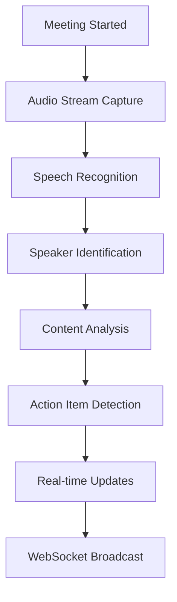
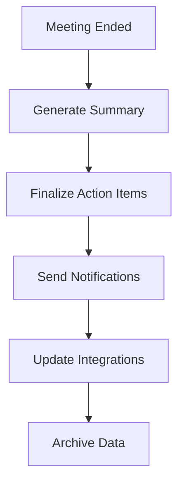

# High Level Design (HLD)
## Meeting Assistant AI - AI-Powered Meeting Management and Intelligence Platform

*Building upon README, PRD, FRD, NFRD, and AD foundations for detailed component specifications*

## ETVX Framework

### ENTRY CRITERIA
- ✅ README completed with problem overview and technical approach
- ✅ PRD completed with business objectives and success metrics
- ✅ FRD completed with 15 functional requirements across 5 modules
- ✅ NFRD completed with performance, scalability, and security requirements
- ✅ AD completed with microservices architecture and deployment strategy

### TASK
Define detailed component specifications, API designs, data models, processing workflows, and AI/ML architectures for all system components.

### VERIFICATION & VALIDATION
**Verification Checklist:**
- [ ] Component specifications align with architecture design
- [ ] API designs support all functional requirements
- [ ] Data models accommodate scalability requirements
- [ ] AI/ML workflows meet performance targets

**Validation Criteria:**
- [ ] HLD validated with engineering teams for implementation feasibility
- [ ] API designs validated with integration requirements
- [ ] Data models validated with database architects
- [ ] AI/ML workflows validated with data science teams

### EXIT CRITERIA
- ✅ Complete component specifications ready for implementation
- ✅ API designs with detailed interface definitions
- ✅ Data models supporting all functional requirements
- ✅ Foundation prepared for Low Level Design (LLD) development

---

## 1. Core Service Components

### 1.1 Meeting Orchestrator Service

**Component Specification:**
```typescript
class MeetingOrchestrator {
  // Core meeting lifecycle management
  async createMeeting(request: MeetingRequest): Promise<Meeting>
  async startProcessing(meetingId: string): Promise<ProcessingJob>
  async updateStatus(meetingId: string, status: MeetingStatus): Promise<void>
  
  // Real-time coordination
  async coordinateServices(meetingId: string): Promise<CoordinationResult>
  async handleServiceEvents(event: ServiceEvent): Promise<void>
  async manageWebSocketConnections(meetingId: string): Promise<WebSocketManager>
}
```

**API Endpoints:**
- `POST /api/v1/meetings` - Create new meeting
- `GET /api/v1/meetings/{id}` - Get meeting details
- `PUT /api/v1/meetings/{id}/status` - Update meeting status
- `WebSocket /ws/meetings/{id}` - Real-time meeting updates

**Data Model:**
```sql
CREATE TABLE meetings (
  id UUID PRIMARY KEY,
  organization_id UUID NOT NULL,
  title VARCHAR(255) NOT NULL,
  status meeting_status_enum DEFAULT 'scheduled',
  start_time TIMESTAMP WITH TIME ZONE,
  end_time TIMESTAMP WITH TIME ZONE,
  participants JSONB,
  metadata JSONB,
  created_at TIMESTAMP WITH TIME ZONE DEFAULT NOW()
);
```

### 1.2 Speech Recognition Service

**Component Specification:**
```python
class SpeechRecognitionService:
    async def start_transcription(self, audio_stream: AudioStream) -> TranscriptionSession
    async def process_audio_chunk(self, session_id: str, audio_data: bytes) -> TranscriptionResult
    async def identify_speakers(self, session_id: str, audio_features: AudioFeatures) -> List[Speaker]
    async def enhance_audio_quality(self, audio_data: bytes) -> EnhancedAudio
```

**Processing Pipeline:**
1. Audio stream ingestion and buffering
2. Noise reduction and enhancement
3. Multi-model ensemble transcription
4. Speaker identification and diarization
5. Real-time result streaming

**Performance Targets:**
- Transcription latency: <2 seconds
- Accuracy: ≥95% for clear audio
- Concurrent sessions: 10,000+

### 1.3 Content Analysis Service

**Component Specification:**
```python
class ContentAnalysisService:
    async def analyze_content(self, text: str, context: MeetingContext) -> ContentAnalysis
    async def extract_action_items(self, transcript: str) -> List[ActionItem]
    async def generate_summary(self, meeting_data: MeetingData) -> MeetingSummary
    async def detect_sentiment(self, text: str, speaker: str) -> SentimentResult
```

**AI/ML Models:**
- **NER Model**: Custom BERT for meeting entities
- **Summarization**: GPT-4 with meeting-specific prompts
- **Sentiment Analysis**: RoBERTa with emotion classification
- **Action Item Detection**: Custom transformer model

## 2. Data Layer Design

### 2.1 Database Schema Design

**PostgreSQL (Primary Database):**
```sql
-- Core meeting data
CREATE TABLE meetings (
  id UUID PRIMARY KEY,
  organization_id UUID NOT NULL,
  title VARCHAR(255) NOT NULL,
  status meeting_status_enum,
  participants JSONB,
  metadata JSONB,
  created_at TIMESTAMP WITH TIME ZONE DEFAULT NOW()
);

-- Transcription results
CREATE TABLE transcriptions (
  id UUID PRIMARY KEY,
  meeting_id UUID REFERENCES meetings(id),
  speaker_id VARCHAR(100),
  text TEXT NOT NULL,
  confidence DECIMAL(3,2),
  start_time DECIMAL(10,3),
  end_time DECIMAL(10,3),
  created_at TIMESTAMP WITH TIME ZONE DEFAULT NOW()
);

-- Action items
CREATE TABLE action_items (
  id UUID PRIMARY KEY,
  meeting_id UUID REFERENCES meetings(id),
  description TEXT NOT NULL,
  assignee VARCHAR(255),
  due_date DATE,
  status action_status_enum DEFAULT 'open',
  confidence DECIMAL(3,2),
  created_at TIMESTAMP WITH TIME ZONE DEFAULT NOW()
);
```

### 2.2 Elasticsearch Schema

**Meeting Content Index:**
```json
{
  "mappings": {
    "properties": {
      "meeting_id": {"type": "keyword"},
      "title": {"type": "text", "analyzer": "standard"},
      "transcript": {"type": "text", "analyzer": "standard"},
      "summary": {"type": "text", "analyzer": "standard"},
      "participants": {"type": "keyword"},
      "topics": {"type": "keyword"},
      "sentiment": {"type": "float"},
      "timestamp": {"type": "date"}
    }
  }
}
```

## 3. API Gateway Design

### 3.1 API Gateway Configuration

**Kong Gateway Setup:**
```yaml
services:
- name: meeting-orchestrator
  url: http://meeting-orchestrator:3000
  routes:
  - name: meetings-api
    paths: ["/api/v1/meetings"]
    methods: ["GET", "POST", "PUT", "DELETE"]
    plugins:
    - name: rate-limiting
      config:
        minute: 1000
        hour: 10000
    - name: jwt
    - name: cors
```

**Rate Limiting Strategy:**
- Standard users: 1,000 requests/minute
- Premium users: 5,000 requests/minute
- Enterprise: 25,000 requests/minute

### 3.2 Authentication & Authorization

**JWT Token Structure:**
```json
{
  "sub": "user-id",
  "org": "organization-id",
  "roles": ["meeting-organizer", "participant"],
  "permissions": ["read:meetings", "write:meetings"],
  "exp": 1640995200
}
```

## 4. Integration Layer Design

### 4.1 Video Platform Integration

**Zoom Integration:**
```typescript
class ZoomIntegration {
  async authenticateApp(credentials: ZoomCredentials): Promise<AuthResult>
  async subscribeToEvents(webhookUrl: string): Promise<Subscription>
  async joinMeeting(meetingId: string): Promise<MeetingSession>
  async getAudioStream(sessionId: string): Promise<AudioStream>
}
```

**Microsoft Teams Integration:**
```typescript
class TeamsIntegration {
  async authenticateWithGraph(credentials: GraphCredentials): Promise<AuthResult>
  async createMeetingBot(meetingUrl: string): Promise<BotSession>
  async getTranscriptionStream(botId: string): Promise<TranscriptionStream>
}
```

### 4.2 Calendar Integration

**Google Calendar API:**
```typescript
interface CalendarIntegration {
  syncMeetings(calendarId: string): Promise<Meeting[]>
  createFollowupMeeting(actionItems: ActionItem[]): Promise<CalendarEvent>
  updateMeetingNotes(eventId: string, notes: string): Promise<void>
}
```

## 5. AI/ML Pipeline Design

### 5.1 Model Serving Architecture

**TorchServe Configuration:**
```yaml
models:
  speech-recognition:
    model_name: "whisper-large-v3"
    version: "1.0"
    batch_size: 4
    max_batch_delay: 100
    workers: 4
  
  content-analysis:
    model_name: "meeting-bert"
    version: "2.1"
    batch_size: 8
    max_batch_delay: 50
    workers: 2
```

### 5.2 Feature Store Design

**Feast Feature Store:**
```python
# Real-time features
meeting_features = FeatureView(
    name="meeting_realtime_features",
    entities=["meeting_id"],
    features=[
        Feature(name="participant_count", dtype=ValueType.INT64),
        Feature(name="audio_quality", dtype=ValueType.FLOAT),
        Feature(name="speaking_rate", dtype=ValueType.FLOAT)
    ],
    source=KafkaSource(...)
)

# Batch features
user_features = FeatureView(
    name="user_historical_features",
    entities=["user_id"],
    features=[
        Feature(name="avg_meeting_duration", dtype=ValueType.FLOAT),
        Feature(name="participation_score", dtype=ValueType.FLOAT)
    ],
    source=BigQuerySource(...)
)
```

## 6. Processing Workflows

### 6.1 Real-time Meeting Processing Workflow



### 6.2 Post-Meeting Processing Workflow



This HLD provides the detailed component specifications and design patterns needed for implementing the Meeting Assistant AI platform while maintaining alignment with all previous requirements and architectural decisions.
