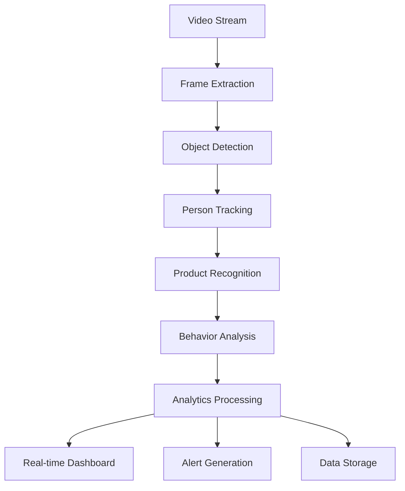

# High Level Design (HLD)
## Smart Retail Edge Vision - AI-Powered Computer Vision System for Retail Analytics and Automation

*Building upon README, PRD, FRD, NFRD, and AD foundations for detailed component specifications*

## ETVX Framework

### ENTRY CRITERIA
- ✅ README completed with problem overview and technical approach
- ✅ PRD completed with business objectives and success metrics
- ✅ FRD completed with 15 functional requirements across 5 modules
- ✅ NFRD completed with performance, scalability, and security requirements
- ✅ AD completed with edge computing architecture and deployment strategy

### TASK
Define detailed component specifications, API designs, data models, processing workflows, and AI/ML architectures for all system components.

### VERIFICATION & VALIDATION
**Verification Checklist:**
- [ ] Component specifications align with edge computing architecture
- [ ] API designs support all functional requirements with <100ms latency
- [ ] Data models accommodate retail analytics and privacy requirements
- [ ] AI/ML workflows meet accuracy targets (95%+ object detection)

**Validation Criteria:**
- [ ] HLD validated with retail technology experts and computer vision specialists
- [ ] API designs validated with edge computing and integration requirements
- [ ] Data models validated with retail operations teams and privacy experts
- [ ] AI/ML workflows validated with data science and ML engineering teams

### EXIT CRITERIA
- ✅ Complete component specifications ready for implementation
- ✅ API designs with detailed interface definitions
- ✅ Data models supporting all functional requirements
- ✅ Foundation prepared for Low Level Design (LLD) development

---

## 1. Core System Components

### 1.1 Computer Vision Engine

**Component Specification:**
```python
class ComputerVisionEngine:
    def __init__(self, config: CVConfig):
        self.object_detector = ObjectDetector(model="yolov8n", device="cuda")
        self.person_tracker = PersonTracker(algorithm="deepsort")
        self.product_recognizer = ProductRecognizer(catalog_size=100000)
        self.behavior_analyzer = BehaviorAnalyzer(models=["activity", "gesture"])
        
    async def process_frame(self, frame: np.ndarray, camera_id: str) -> CVResult:
        # Multi-stage processing pipeline
        objects = await self.object_detector.detect(frame)
        persons = await self.person_tracker.update(objects.persons, camera_id)
        products = await self.product_recognizer.identify(objects.products)
        behaviors = await self.behavior_analyzer.analyze(persons, frame)
        
        return CVResult(objects, persons, products, behaviors)
```

**API Endpoints:**
- `POST /api/v1/cv/process` - Process single frame
- `WebSocket /ws/cv/stream/{camera_id}` - Real-time video processing
- `GET /api/v1/cv/models` - Available AI models
- `PUT /api/v1/cv/models/{model_id}` - Update AI model

**Performance Specifications:**
- Processing latency: <100ms per frame
- Throughput: 30 FPS per camera stream
- Accuracy: 95%+ object detection, 90%+ person tracking
- Concurrent streams: 16+ cameras simultaneously

### 1.2 Retail Analytics Service

**Component Specification:**
```python
class RetailAnalyticsService:
    def __init__(self, store_config: StoreConfig):
        self.customer_tracker = CustomerTracker()
        self.inventory_monitor = InventoryMonitor()
        self.behavior_analyzer = BehaviorAnalyzer()
        self.metrics_calculator = MetricsCalculator()
        
    async def analyze_customer_behavior(self, tracking_data: List[PersonTrack]) -> CustomerAnalytics:
        journeys = self.customer_tracker.generate_journeys(tracking_data)
        dwell_times = self.calculate_dwell_times(journeys)
        heat_maps = self.generate_heat_maps(journeys)
        engagement = self.analyze_engagement(journeys)
        
        return CustomerAnalytics(journeys, dwell_times, heat_maps, engagement)
    
    async def monitor_inventory(self, shelf_data: List[ShelfDetection]) -> InventoryStatus:
        stock_levels = self.inventory_monitor.estimate_levels(shelf_data)
        out_of_stock = self.detect_stockouts(stock_levels)
        compliance = self.check_planogram_compliance(shelf_data)
        
        return InventoryStatus(stock_levels, out_of_stock, compliance)
```

**Data Models:**
```sql
-- Customer behavior analytics
CREATE TABLE customer_journeys (
    id UUID PRIMARY KEY,
    store_id UUID NOT NULL,
    anonymous_id VARCHAR(64) NOT NULL,
    start_time TIMESTAMP WITH TIME ZONE,
    end_time TIMESTAMP WITH TIME ZONE,
    path JSONB NOT NULL,
    zones_visited TEXT[],
    total_dwell_time INTEGER,
    created_at TIMESTAMP WITH TIME ZONE DEFAULT NOW()
);

-- Inventory monitoring
CREATE TABLE inventory_snapshots (
    id UUID PRIMARY KEY,
    store_id UUID NOT NULL,
    shelf_id VARCHAR(50) NOT NULL,
    product_sku VARCHAR(100) NOT NULL,
    estimated_quantity INTEGER,
    confidence DECIMAL(3,2),
    out_of_stock BOOLEAN DEFAULT FALSE,
    snapshot_time TIMESTAMP WITH TIME ZONE DEFAULT NOW()
);
```

### 1.3 Security Monitoring System

**Component Specification:**
```python
class SecurityMonitoringSystem:
    def __init__(self, security_config: SecurityConfig):
        self.anomaly_detector = AnomalyDetector()
        self.threat_classifier = ThreatClassifier()
        self.alert_manager = AlertManager()
        self.incident_recorder = IncidentRecorder()
        
    async def monitor_security(self, cv_results: CVResult, camera_id: str) -> SecurityAssessment:
        anomalies = await self.anomaly_detector.detect(cv_results)
        threats = await self.threat_classifier.classify(anomalies)
        
        if threats:
            alerts = await self.alert_manager.generate_alerts(threats)
            incidents = await self.incident_recorder.record(threats, camera_id)
            
        return SecurityAssessment(anomalies, threats, alerts)
```

**Alert System:**
- Real-time threat detection with <30 second response
- Multi-level alert severity (Low, Medium, High, Critical)
- Integration with existing security systems
- Automated incident documentation and evidence collection

## 2. AI/ML Model Architecture

### 2.1 Object Detection Pipeline

**YOLOv8 Optimization for Retail:**
```python
class RetailObjectDetector:
    def __init__(self):
        self.model = YOLO("yolov8n.pt")  # Nano version for edge
        self.retail_classes = [
            "person", "shopping_cart", "product", "shelf", 
            "checkout_counter", "entrance", "exit"
        ]
        
    def optimize_for_edge(self):
        # TensorRT optimization
        self.model.export(format="engine", device="cuda", half=True)
        # INT8 quantization for 3x speedup
        self.model = TRTInference("yolov8n.engine")
        
    async def detect_objects(self, frame: np.ndarray) -> DetectionResult:
        results = self.model(frame, conf=0.5, iou=0.4)
        return self.parse_results(results)
```

**Model Performance Targets:**
- Inference time: <50ms per frame on Jetson AGX Xavier
- Accuracy: 95%+ mAP@0.5 for retail objects
- Model size: <50MB for edge deployment
- Memory usage: <2GB GPU memory

### 2.2 Product Recognition System

**Multi-Modal Product Recognition:**
```python
class ProductRecognitionSystem:
    def __init__(self, catalog_path: str):
        self.visual_encoder = ResNet50(pretrained=True)
        self.product_database = ProductDatabase(catalog_path)
        self.similarity_matcher = SimilarityMatcher()
        
    async def recognize_product(self, product_image: np.ndarray) -> ProductMatch:
        # Extract visual features
        features = self.visual_encoder.encode(product_image)
        
        # Search product database
        candidates = self.product_database.search(features, top_k=5)
        
        # Calculate similarity scores
        matches = self.similarity_matcher.match(features, candidates)
        
        return ProductMatch(matches[0] if matches else None, confidence=matches[0].score)
```

**Product Database Schema:**
```sql
CREATE TABLE products (
    sku VARCHAR(100) PRIMARY KEY,
    name VARCHAR(255) NOT NULL,
    category VARCHAR(100),
    brand VARCHAR(100),
    visual_features VECTOR(2048),
    barcode VARCHAR(50),
    price DECIMAL(10,2),
    created_at TIMESTAMP WITH TIME ZONE DEFAULT NOW()
);

CREATE INDEX idx_products_visual_features ON products USING ivfflat (visual_features vector_cosine_ops);
```

### 2.3 Behavior Analysis Models

**Customer Behavior Classification:**
```python
class BehaviorAnalyzer:
    def __init__(self):
        self.activity_classifier = ActivityClassifier()
        self.gesture_recognizer = GestureRecognizer()
        self.engagement_scorer = EngagementScorer()
        
    async def analyze_behavior(self, person_track: PersonTrack, context: StoreContext) -> BehaviorAnalysis:
        activities = await self.activity_classifier.classify(person_track.poses)
        gestures = await self.gesture_recognizer.recognize(person_track.keypoints)
        engagement = await self.engagement_scorer.score(person_track, context)
        
        return BehaviorAnalysis(activities, gestures, engagement)
```

**Behavior Categories:**
- **Shopping Activities**: browsing, examining, selecting, purchasing
- **Movement Patterns**: walking, standing, queuing, exiting
- **Engagement Levels**: high, medium, low based on dwell time and interactions
- **Suspicious Behaviors**: concealment, switching, unusual patterns

## 3. Data Processing Workflows

### 3.1 Real-time Processing Pipeline



**Processing Stages:**
1. **Video Ingestion**: RTSP stream capture and buffering
2. **Frame Processing**: Object detection and tracking
3. **Feature Extraction**: Product and behavior recognition
4. **Analytics Computation**: Real-time metrics calculation
5. **Output Generation**: Dashboards, alerts, and data storage

### 3.2 Batch Processing Workflows

**Daily Analytics Processing:**
```python
class BatchAnalyticsProcessor:
    def __init__(self):
        self.data_aggregator = DataAggregator()
        self.report_generator = ReportGenerator()
        self.insight_extractor = InsightExtractor()
        
    async def process_daily_analytics(self, store_id: str, date: datetime) -> DailyReport:
        # Aggregate raw data
        customer_data = await self.data_aggregator.aggregate_customers(store_id, date)
        inventory_data = await self.data_aggregator.aggregate_inventory(store_id, date)
        security_data = await self.data_aggregator.aggregate_security(store_id, date)
        
        # Generate insights
        insights = await self.insight_extractor.extract(customer_data, inventory_data)
        
        # Create comprehensive report
        report = await self.report_generator.generate(
            customer_data, inventory_data, security_data, insights
        )
        
        return report
```

## 4. Integration Layer Design

### 4.1 POS System Integration

**Universal POS Connector:**
```python
class POSIntegrationHub:
    def __init__(self):
        self.connectors = {
            "square": SquareConnector(),
            "shopify": ShopifyConnector(),
            "ncr": NCRConnector(),
            "toast": ToastConnector()
        }
        
    async def sync_transaction(self, pos_type: str, transaction_data: TransactionData) -> SyncResult:
        connector = self.connectors.get(pos_type)
        if not connector:
            raise UnsupportedPOSException(f"POS type {pos_type} not supported")
            
        result = await connector.sync_transaction(transaction_data)
        return result
        
    async def update_inventory(self, pos_type: str, inventory_updates: List[InventoryUpdate]) -> UpdateResult:
        connector = self.connectors[pos_type]
        return await connector.update_inventory(inventory_updates)
```

**API Integration Patterns:**
- **REST APIs**: Standard HTTP-based integration for most POS systems
- **Webhooks**: Real-time event notifications for transaction updates
- **File-based**: CSV/XML file exchange for legacy systems
- **Database Direct**: Direct database integration for supported systems

### 4.2 Cloud Synchronization Service

**Hybrid Cloud-Edge Data Sync:**
```python
class CloudSyncService:
    def __init__(self, cloud_config: CloudConfig):
        self.cloud_client = CloudClient(cloud_config)
        self.sync_scheduler = SyncScheduler()
        self.data_compressor = DataCompressor()
        
    async def sync_analytics_data(self, store_id: str) -> SyncStatus:
        # Prepare data for sync
        local_data = await self.collect_local_data(store_id)
        compressed_data = await self.data_compressor.compress(local_data)
        
        # Upload to cloud
        sync_result = await self.cloud_client.upload_analytics(compressed_data)
        
        # Update sync status
        await self.update_sync_status(store_id, sync_result)
        
        return sync_result
```

## 5. Security and Privacy Implementation

### 5.1 Privacy-Preserving Analytics

**Anonymous Customer Tracking:**
```python
class PrivacyPreservingTracker:
    def __init__(self):
        self.face_anonymizer = FaceAnonymizer()
        self.demographic_estimator = DemographicEstimator()
        self.journey_tracker = JourneyTracker()
        
    async def track_customer(self, person_detection: PersonDetection) -> AnonymousCustomer:
        # Anonymize personal features
        anonymized_features = await self.face_anonymizer.anonymize(person_detection.face)
        
        # Extract demographic info without identification
        demographics = await self.demographic_estimator.estimate(anonymized_features)
        
        # Generate anonymous tracking ID
        tracking_id = self.generate_anonymous_id(anonymized_features)
        
        return AnonymousCustomer(tracking_id, demographics, anonymized_features)
```

**Data Minimization Strategy:**
- Collect only necessary data for business operations
- Automatic data expiration and deletion policies
- On-device processing to minimize data transmission
- Encrypted storage with access controls

### 5.2 Compliance Framework

**GDPR/CCPA Compliance Implementation:**
```python
class ComplianceManager:
    def __init__(self):
        self.data_processor = DataProcessor()
        self.consent_manager = ConsentManager()
        self.audit_logger = AuditLogger()
        
    async def handle_data_request(self, request: DataRequest) -> DataResponse:
        # Validate request
        if not await self.validate_request(request):
            raise InvalidRequestException("Invalid data request")
            
        # Process based on request type
        if request.type == "access":
            data = await self.data_processor.extract_user_data(request.user_id)
            return DataResponse(data)
        elif request.type == "deletion":
            await self.data_processor.delete_user_data(request.user_id)
            return DataResponse(status="deleted")
            
        # Log for audit
        await self.audit_logger.log_request(request)
```

## 6. Performance Optimization

### 6.1 Edge Computing Optimization

**Resource Management:**
```python
class EdgeResourceManager:
    def __init__(self):
        self.gpu_scheduler = GPUScheduler()
        self.memory_manager = MemoryManager()
        self.model_cache = ModelCache()
        
    async def optimize_inference(self, workload: InferenceWorkload) -> OptimizationPlan:
        # Analyze current resource usage
        gpu_usage = await self.gpu_scheduler.get_usage()
        memory_usage = await self.memory_manager.get_usage()
        
        # Create optimization plan
        plan = OptimizationPlan()
        
        if gpu_usage > 0.9:
            plan.add_action("reduce_batch_size")
            plan.add_action("enable_model_quantization")
            
        if memory_usage > 0.8:
            plan.add_action("clear_model_cache")
            plan.add_action("reduce_buffer_size")
            
        return plan
```

**Performance Monitoring:**
- Real-time resource utilization tracking
- Automatic performance optimization
- Predictive scaling based on store traffic patterns
- Alert generation for performance degradation

This comprehensive HLD provides detailed component specifications and design patterns needed for implementing the Smart Retail Edge Vision platform while maintaining alignment with all previous requirements and architectural decisions.
