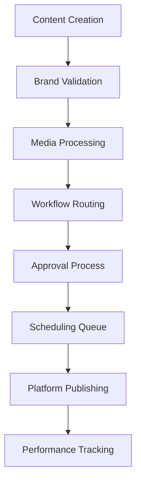
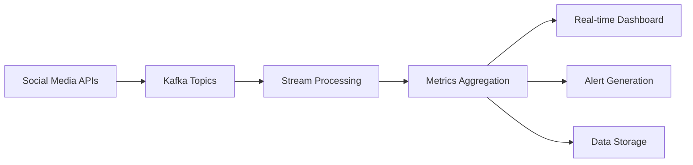

# High Level Design (HLD)
## Social Media Management Agent - AI-Powered Intelligent Social Media Management and Content Optimization Platform

*Building upon README, PRD, FRD, NFRD, and AD foundations for detailed component specifications*

## ETVX Framework

### ENTRY CRITERIA
- ✅ README completed with problem overview and technical approach
- ✅ PRD completed with business objectives, market analysis, and success metrics
- ✅ FRD completed with 22 detailed functional requirements across 6 modules
- ✅ NFRD completed with 26 non-functional requirements covering performance, security, and scalability
- ✅ AD completed with microservices architecture and cloud-native deployment strategy

### TASK
Define detailed component specifications, API designs, data models, processing workflows, and AI/ML architectures for all system components.

### VERIFICATION & VALIDATION
**Verification Checklist:**
- [ ] Component specifications align with microservices architecture from AD
- [ ] API designs support all functional requirements with performance targets
- [ ] Data models accommodate social media management and analytics requirements
- [ ] AI/ML workflows meet content generation and optimization objectives

**Validation Criteria:**
- [ ] HLD validated with social media platform experts and AI/ML specialists
- [ ] API designs validated with frontend and integration teams
- [ ] Data models validated with database architects and performance teams
- [ ] AI/ML workflows validated with data science and machine learning teams

### EXIT CRITERIA
- ✅ Complete component specifications ready for implementation
- ✅ API designs with detailed interface definitions
- ✅ Data models supporting all functional requirements
- ✅ Foundation prepared for Low Level Design (LLD) development

---

## 1. Core Service Components

### 1.1 User Management Service

**Component Architecture:**
```python
class UserManagementService:
    def __init__(self):
        self.auth_provider = AuthProvider()
        self.user_repository = UserRepository()
        self.team_manager = TeamManager()
        self.permission_engine = PermissionEngine()
        self.audit_logger = AuditLogger()
        
    async def authenticate_user(self, credentials: AuthCredentials) -> AuthResult:
        # Multi-factor authentication with SSO support
        
    async def manage_permissions(self, user_id: str, permissions: List[Permission]) -> PermissionResult:
        # Role-based access control with granular permissions
```

**API Specifications:**
```yaml
# User Management API
/api/v1/auth:
  post:
    summary: Authenticate user
    requestBody:
      required: true
      content:
        application/json:
          schema:
            type: object
            properties:
              email: { type: string, format: email }
              password: { type: string, minLength: 8 }
              mfa_token: { type: string }
    responses:
      200:
        description: Authentication successful
        content:
          application/json:
            schema:
              type: object
              properties:
                access_token: { type: string }
                refresh_token: { type: string }
                expires_in: { type: integer }
                user_profile: { $ref: '#/components/schemas/UserProfile' }

/api/v1/users/{userId}/permissions:
  get:
    summary: Get user permissions
    parameters:
      - name: userId
        in: path
        required: true
        schema: { type: string, format: uuid }
    responses:
      200:
        description: User permissions retrieved
        content:
          application/json:
            schema:
              type: object
              properties:
                permissions: 
                  type: array
                  items: { $ref: '#/components/schemas/Permission' }
```

**Data Models:**
```sql
-- User Management Schema
CREATE TABLE users (
    id UUID PRIMARY KEY DEFAULT gen_random_uuid(),
    email VARCHAR(255) UNIQUE NOT NULL,
    password_hash VARCHAR(255) NOT NULL,
    first_name VARCHAR(100) NOT NULL,
    last_name VARCHAR(100) NOT NULL,
    profile_image_url VARCHAR(500),
    timezone VARCHAR(50) DEFAULT 'UTC',
    language VARCHAR(10) DEFAULT 'en',
    status user_status_enum DEFAULT 'active',
    last_login TIMESTAMP WITH TIME ZONE,
    created_at TIMESTAMP WITH TIME ZONE DEFAULT NOW(),
    updated_at TIMESTAMP WITH TIME ZONE DEFAULT NOW()
);

CREATE TABLE teams (
    id UUID PRIMARY KEY DEFAULT gen_random_uuid(),
    name VARCHAR(255) NOT NULL,
    description TEXT,
    owner_id UUID NOT NULL REFERENCES users(id),
    settings JSONB DEFAULT '{}',
    created_at TIMESTAMP WITH TIME ZONE DEFAULT NOW()
);

CREATE TABLE user_teams (
    user_id UUID REFERENCES users(id) ON DELETE CASCADE,
    team_id UUID REFERENCES teams(id) ON DELETE CASCADE,
    role team_role_enum NOT NULL,
    permissions JSONB DEFAULT '{}',
    joined_at TIMESTAMP WITH TIME ZONE DEFAULT NOW(),
    PRIMARY KEY (user_id, team_id)
);

CREATE TYPE user_status_enum AS ENUM ('active', 'inactive', 'suspended');
CREATE TYPE team_role_enum AS ENUM ('owner', 'admin', 'manager', 'creator', 'viewer');
```

### 1.2 Content Management Service

**Component Architecture:**
```python
class ContentManagementService:
    def __init__(self):
        self.content_repository = ContentRepository()
        self.media_processor = MediaProcessor()
        self.workflow_engine = WorkflowEngine()
        self.brand_validator = BrandValidator()
        self.scheduler = ContentScheduler()
        
    async def create_content(self, content_data: ContentData) -> Content:
        # Content creation with brand validation and workflow routing
        
    async def schedule_content(self, content_id: str, schedule: ScheduleData) -> ScheduleResult:
        # Intelligent scheduling with optimization recommendations
```

**Content Processing Workflow:**


**API Specifications:**
```yaml
/api/v1/content:
  post:
    summary: Create new content
    requestBody:
      required: true
      content:
        application/json:
          schema:
            type: object
            properties:
              title: { type: string, maxLength: 255 }
              body: { type: string, maxLength: 10000 }
              media_ids: 
                type: array
                items: { type: string, format: uuid }
              platforms: 
                type: array
                items: { type: string, enum: [facebook, instagram, twitter, linkedin] }
              tags: 
                type: array
                items: { type: string }
    responses:
      201:
        description: Content created successfully
        content:
          application/json:
            schema:
              $ref: '#/components/schemas/Content'

/api/v1/content/{contentId}/schedule:
  post:
    summary: Schedule content for publishing
    parameters:
      - name: contentId
        in: path
        required: true
        schema: { type: string, format: uuid }
    requestBody:
      required: true
      content:
        application/json:
          schema:
            type: object
            properties:
              publish_at: { type: string, format: date-time }
              platforms: 
                type: array
                items: { type: string }
              optimization_enabled: { type: boolean, default: true }
```

### 1.3 Social Media Integration Service

**Component Architecture:**
```python
class SocialMediaIntegrationService:
    def __init__(self):
        self.platform_connectors = {
            'facebook': FacebookConnector(),
            'instagram': InstagramConnector(),
            'twitter': TwitterConnector(),
            'linkedin': LinkedInConnector(),
            'tiktok': TikTokConnector(),
            'youtube': YouTubeConnector()
        }
        self.rate_limiter = RateLimiter()
        self.circuit_breaker = CircuitBreaker()
        self.retry_handler = RetryHandler()
        
    async def publish_content(self, content: Content, platforms: List[str]) -> PublishResult:
        # Multi-platform publishing with error handling and retry logic
        
    async def sync_metrics(self, account_id: str, platform: str) -> MetricsResult:
        # Real-time metrics synchronization with rate limiting
```

**Platform Connector Interface:**
```python
from abc import ABC, abstractmethod

class PlatformConnector(ABC):
    @abstractmethod
    async def authenticate(self, credentials: dict) -> AuthResult:
        pass
        
    @abstractmethod
    async def publish_post(self, content: Content) -> PublishResult:
        pass
        
    @abstractmethod
    async def get_metrics(self, post_id: str) -> MetricsData:
        pass
        
    @abstractmethod
    async def get_account_info(self) -> AccountInfo:
        pass

class FacebookConnector(PlatformConnector):
    def __init__(self):
        self.graph_api = FacebookGraphAPI()
        self.webhook_handler = FacebookWebhookHandler()
        
    async def publish_post(self, content: Content) -> PublishResult:
        # Facebook-specific publishing logic with Graph API
        try:
            response = await self.graph_api.post(
                endpoint=f"/{content.account_id}/feed",
                data={
                    "message": content.text,
                    "link": content.link,
                    "published": content.published
                }
            )
            return PublishResult(
                success=True,
                platform_post_id=response["id"],
                published_at=datetime.utcnow()
            )
        except FacebookAPIException as e:
            return PublishResult(
                success=False,
                error=str(e),
                retry_after=e.retry_after if hasattr(e, 'retry_after') else None
            )
```

## 2. AI/ML Service Architecture

### 2.1 Content Generation Service

**AI Model Pipeline:**
```python
class ContentGenerationService:
    def __init__(self):
        self.text_generator = TextGenerator()
        self.image_generator = ImageGenerator()
        self.brand_adapter = BrandAdapter()
        self.quality_validator = QualityValidator()
        self.performance_predictor = PerformancePredictor()
        
    async def generate_text_content(self, prompt: ContentPrompt) -> GeneratedContent:
        # Multi-model text generation with brand consistency
        
    async def generate_visual_content(self, description: str, brand_guidelines: BrandGuidelines) -> GeneratedImage:
        # AI-powered image generation with brand compliance
```

**Text Generation Pipeline:**
```python
class TextGenerator:
    def __init__(self):
        self.primary_model = GPT4Model()
        self.fallback_model = GPT35TurboModel()
        self.brand_fine_tuned_models = {}
        self.prompt_optimizer = PromptOptimizer()
        
    async def generate_content(self, prompt: ContentPrompt, brand_context: BrandContext) -> List[GeneratedText]:
        # Enhanced prompt with brand context
        enhanced_prompt = await self.prompt_optimizer.enhance_prompt(
            base_prompt=prompt.text,
            brand_voice=brand_context.voice_guidelines,
            target_audience=prompt.target_audience,
            platform_requirements=prompt.platform_specs
        )
        
        # Primary model generation
        try:
            primary_results = await self.primary_model.generate(
                prompt=enhanced_prompt,
                max_tokens=prompt.max_length,
                temperature=0.7,
                n=3  # Generate 3 variations
            )
            
            # Brand consistency validation
            validated_results = []
            for result in primary_results:
                brand_score = await self.brand_adapter.validate_consistency(
                    content=result.text,
                    brand_guidelines=brand_context.guidelines
                )
                if brand_score >= 0.8:  # 80% brand consistency threshold
                    validated_results.append(result)
            
            return validated_results
            
        except ModelException as e:
            # Fallback to secondary model
            return await self.fallback_model.generate(enhanced_prompt)
```

**Image Generation Pipeline:**
```python
class ImageGenerator:
    def __init__(self):
        self.dalle_model = DALLEModel()
        self.stable_diffusion = StableDiffusionModel()
        self.brand_style_adapter = BrandStyleAdapter()
        self.image_optimizer = ImageOptimizer()
        
    async def generate_branded_image(self, description: str, brand_guidelines: BrandGuidelines) -> GeneratedImage:
        # Brand-adapted prompt generation
        branded_prompt = await self.brand_style_adapter.adapt_prompt(
            base_description=description,
            color_palette=brand_guidelines.colors,
            style_preferences=brand_guidelines.visual_style,
            logo_placement=brand_guidelines.logo_usage
        )
        
        # Multi-model generation with quality selection
        dalle_result = await self.dalle_model.generate(branded_prompt)
        sd_result = await self.stable_diffusion.generate(branded_prompt)
        
        # Quality assessment and selection
        best_image = await self.select_best_image([dalle_result, sd_result])
        
        # Platform-specific optimization
        optimized_images = await self.image_optimizer.optimize_for_platforms(
            image=best_image,
            platforms=["facebook", "instagram", "twitter", "linkedin"]
        )
        
        return GeneratedImage(
            original=best_image,
            platform_optimized=optimized_images,
            brand_compliance_score=await self.validate_brand_compliance(best_image, brand_guidelines)
        )
```

### 2.2 Performance Optimization Service

**Optimization Engine:**
```python
class PerformanceOptimizationService:
    def __init__(self):
        self.engagement_predictor = EngagementPredictor()
        self.timing_optimizer = TimingOptimizer()
        self.hashtag_recommender = HashtagRecommender()
        self.ab_test_manager = ABTestManager()
        self.performance_analyzer = PerformanceAnalyzer()
        
    async def optimize_content(self, content: Content, historical_data: HistoricalData) -> OptimizationRecommendations:
        # Comprehensive content optimization with ML predictions
```

**Engagement Prediction Model:**
```python
class EngagementPredictor:
    def __init__(self):
        self.model = self.load_trained_model()
        self.feature_extractor = FeatureExtractor()
        self.scaler = StandardScaler()
        
    async def predict_engagement(self, content: Content, context: PostingContext) -> EngagementPrediction:
        # Extract features from content and context
        features = await self.feature_extractor.extract_features(
            text=content.text,
            media=content.media,
            posting_time=context.posting_time,
            audience_size=context.audience_size,
            historical_performance=context.historical_data
        )
        
        # Normalize features
        normalized_features = self.scaler.transform(features)
        
        # Generate predictions
        predictions = self.model.predict(normalized_features)
        
        return EngagementPrediction(
            expected_likes=predictions[0],
            expected_shares=predictions[1],
            expected_comments=predictions[2],
            engagement_rate=predictions[3],
            confidence_interval=predictions[4]
        )
```

### 2.3 Social Listening Service

**Real-Time Monitoring Pipeline:**
```python
class SocialListeningService:
    def __init__(self):
        self.stream_processor = StreamProcessor()
        self.sentiment_analyzer = SentimentAnalyzer()
        self.entity_extractor = EntityExtractor()
        self.trend_detector = TrendDetector()
        self.crisis_detector = CrisisDetector()
        
    async def process_social_stream(self, stream_data: SocialStreamData) -> ProcessedMention:
        # Real-time social media mention processing and analysis
```

**Sentiment Analysis Pipeline:**
```python
class SentimentAnalyzer:
    def __init__(self):
        self.transformer_model = BERTSentimentModel()
        self.lexicon_analyzer = VaderSentiment()
        self.ensemble_weights = [0.7, 0.3]  # Transformer: 70%, Lexicon: 30%
        
    async def analyze_sentiment(self, text: str, context: MentionContext) -> SentimentResult:
        # Ensemble sentiment analysis with context awareness
        transformer_result = await self.transformer_model.predict(text)
        lexicon_result = self.lexicon_analyzer.polarity_scores(text)
        
        # Weighted ensemble prediction
        final_sentiment = (
            transformer_result.sentiment * self.ensemble_weights[0] +
            lexicon_result['compound'] * self.ensemble_weights[1]
        )
        
        # Context-aware adjustment
        if context.is_customer_service:
            final_sentiment = self.adjust_for_customer_service_context(final_sentiment)
        
        return SentimentResult(
            sentiment_score=final_sentiment,
            sentiment_label=self.score_to_label(final_sentiment),
            confidence=transformer_result.confidence,
            emotions=transformer_result.emotions
        )
```

## 3. Data Processing Workflows

### 3.1 Real-Time Analytics Pipeline

**Stream Processing Architecture:**
```python
class RealTimeAnalyticsProcessor:
    def __init__(self):
        self.kafka_consumer = KafkaConsumer()
        self.stream_processor = StreamProcessor()
        self.metrics_aggregator = MetricsAggregator()
        self.alert_manager = AlertManager()
        
    async def process_engagement_events(self, event_stream: EventStream) -> ProcessedMetrics:
        # Real-time engagement event processing and aggregation
```

**Event Processing Flow:**


### 3.2 Batch Analytics Processing

**ETL Pipeline:**
```python
class BatchAnalyticsProcessor:
    def __init__(self):
        self.data_extractor = DataExtractor()
        self.data_transformer = DataTransformer()
        self.data_loader = DataLoader()
        self.report_generator = ReportGenerator()
        
    async def process_daily_analytics(self, date: datetime) -> AnalyticsReport:
        # Daily batch processing for comprehensive analytics
        
        # Extract data from multiple sources
        social_media_data = await self.data_extractor.extract_social_media_metrics(date)
        user_engagement_data = await self.data_extractor.extract_user_engagement(date)
        content_performance_data = await self.data_extractor.extract_content_performance(date)
        
        # Transform and enrich data
        transformed_data = await self.data_transformer.transform_and_enrich(
            social_media_data,
            user_engagement_data,
            content_performance_data
        )
        
        # Load into analytics database
        await self.data_loader.load_to_analytics_db(transformed_data)
        
        # Generate insights and reports
        insights = await self.generate_insights(transformed_data)
        report = await self.report_generator.generate_daily_report(insights)
        
        return report
```

## 4. Integration Layer Design

### 4.1 API Gateway Architecture

**Gateway Configuration:**
```python
class APIGateway:
    def __init__(self):
        self.rate_limiter = RateLimiter()
        self.auth_validator = AuthValidator()
        self.request_router = RequestRouter()
        self.response_transformer = ResponseTransformer()
        self.circuit_breaker = CircuitBreaker()
        
    async def handle_request(self, request: HTTPRequest) -> HTTPResponse:
        # Comprehensive request handling with security and performance controls
```

**Rate Limiting Strategy:**
```python
class RateLimiter:
    def __init__(self):
        self.redis_client = RedisClient()
        self.rate_limit_configs = {
            'free_tier': {'requests_per_minute': 100, 'burst': 20},
            'pro_tier': {'requests_per_minute': 1000, 'burst': 200},
            'enterprise_tier': {'requests_per_minute': 10000, 'burst': 2000}
        }
        
    async def check_rate_limit(self, user_id: str, tier: str) -> RateLimitResult:
        config = self.rate_limit_configs[tier]
        current_usage = await self.redis_client.get_usage(user_id)
        
        if current_usage >= config['requests_per_minute']:
            return RateLimitResult(
                allowed=False,
                retry_after=60,
                remaining=0
            )
        
        await self.redis_client.increment_usage(user_id)
        return RateLimitResult(
            allowed=True,
            remaining=config['requests_per_minute'] - current_usage - 1
        )
```

### 4.2 Webhook Management System

**Webhook Processing:**
```python
class WebhookManager:
    def __init__(self):
        self.webhook_registry = WebhookRegistry()
        self.event_processor = EventProcessor()
        self.delivery_manager = DeliveryManager()
        self.retry_handler = RetryHandler()
        
    async def process_webhook_event(self, event: WebhookEvent) -> ProcessingResult:
        # Reliable webhook event processing with retry logic
        
        # Validate webhook signature
        if not await self.validate_signature(event):
            return ProcessingResult(success=False, error="Invalid signature")
        
        # Process event
        processing_result = await self.event_processor.process(event)
        
        # Deliver to registered endpoints
        delivery_results = await self.delivery_manager.deliver_to_subscribers(
            event=event,
            processing_result=processing_result
        )
        
        return ProcessingResult(
            success=True,
            delivery_results=delivery_results
        )
```

## 5. Security Implementation

### 5.1 Authentication and Authorization

**JWT Token Management:**
```python
class JWTTokenManager:
    def __init__(self):
        self.private_key = self.load_private_key()
        self.public_key = self.load_public_key()
        self.token_blacklist = TokenBlacklist()
        
    async def generate_token(self, user: User, permissions: List[Permission]) -> JWTToken:
        payload = {
            'user_id': user.id,
            'email': user.email,
            'permissions': [p.name for p in permissions],
            'iat': datetime.utcnow(),
            'exp': datetime.utcnow() + timedelta(hours=24),
            'iss': 'social-media-agent',
            'aud': 'api-clients'
        }
        
        token = jwt.encode(payload, self.private_key, algorithm='RS256')
        
        # Store token metadata for tracking
        await self.store_token_metadata(user.id, token)
        
        return JWTToken(
            access_token=token,
            token_type='Bearer',
            expires_in=86400,  # 24 hours
            refresh_token=await self.generate_refresh_token(user.id)
        )
```

### 5.2 Data Encryption and Protection

**Encryption Service:**
```python
class EncryptionService:
    def __init__(self):
        self.encryption_key = self.load_encryption_key()
        self.cipher_suite = Fernet(self.encryption_key)
        
    async def encrypt_sensitive_data(self, data: str) -> EncryptedData:
        encrypted_bytes = self.cipher_suite.encrypt(data.encode())
        return EncryptedData(
            encrypted_value=base64.b64encode(encrypted_bytes).decode(),
            encryption_algorithm='AES-256',
            key_version=self.get_key_version()
        )
        
    async def decrypt_sensitive_data(self, encrypted_data: EncryptedData) -> str:
        encrypted_bytes = base64.b64decode(encrypted_data.encrypted_value)
        decrypted_bytes = self.cipher_suite.decrypt(encrypted_bytes)
        return decrypted_bytes.decode()
```

This comprehensive HLD provides detailed component specifications, API designs, and processing workflows that enable the development team to implement a robust, scalable, and secure social media management platform.
