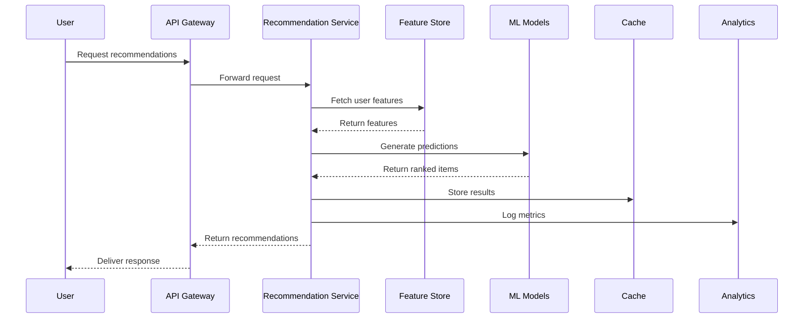
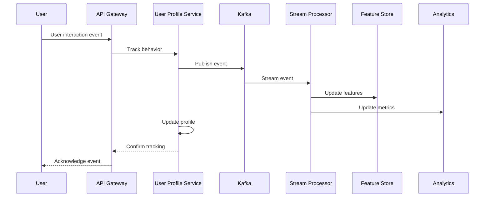
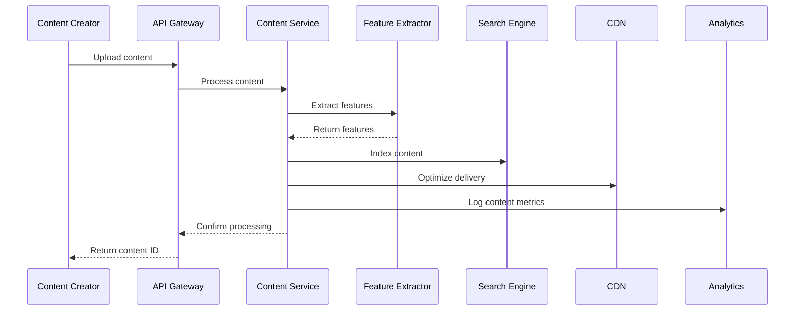

# High Level Design (HLD)
## Content Recommendation Engine

### Document Control
- **Document Version**: 1.0
- **Created**: 2025-01-XX
- **Document Owner**: Engineering & Architecture Team

---

## ETVX Framework Application

### Entry Criteria
- ✅ **README.md completed** - Problem statement and business case established
- ✅ **01_PRD.md completed** - Product requirements and business objectives defined
- ✅ **02_FRD.md completed** - Functional modules and system behaviors specified
- ✅ **03_NFRD.md completed** - Non-functional requirements and quality constraints defined
- ✅ **04_AD.md completed** - System architecture and component design established

### Task (This Document)
Define detailed component designs, API specifications, data models, business workflows, and implementation strategies that realize the architecture defined in the AD while satisfying all functional and non-functional requirements.

### Verification & Validation
- **Design Review** - Technical design committee validation
- **API Contract Validation** - Interface specification review
- **Data Model Review** - Database design and schema validation

### Exit Criteria
- ✅ **Component Designs Detailed** - Complete service and component specifications
- ✅ **API Specifications Defined** - RESTful API contracts and data models
- ✅ **Business Workflows Documented** - End-to-end process flows and logic

---

## System Overview

Building upon the README problem statement, PRD business objectives, FRD functional modules, NFRD quality requirements, and AD system architecture, this HLD defines detailed component designs for a cloud-native Content Recommendation Engine that delivers personalized recommendations with <100ms response time, 99.9% availability, and enterprise-grade security.

---

## Component Design Specifications

### 1. Recommendation Service (Python/ML)

#### Service Architecture
```python
class RecommendationService:
    def __init__(self):
        self.model_registry = MLflowModelRegistry()
        self.feature_store = FeastFeatureStore()
        self.cache_manager = RedisCache()
        self.metrics_collector = PrometheusMetrics()
```

#### Core Components
- **Model Manager**: Handles model loading, versioning, and A/B testing
- **Feature Engine**: Real-time feature computation and serving
- **Ranking Engine**: Multi-objective optimization for recommendation ranking
- **Explanation Generator**: Provides reasoning for recommendation decisions

#### API Endpoints
```yaml
/api/v1/recommendations:
  POST:
    summary: Generate personalized recommendations
    parameters:
      - user_id: string (required)
      - content_type: enum [product, video, article, post]
      - context: object (device, location, time)
      - count: integer (default: 10, max: 100)
    response:
      recommendations: array of recommendation objects
      metadata: response metadata (latency, model_version)
```

#### Data Models
```python
@dataclass
class RecommendationRequest:
    user_id: str
    content_type: ContentType
    context: UserContext
    count: int = 10
    filters: Optional[Dict] = None

@dataclass
class RecommendationResponse:
    recommendations: List[RecommendationItem]
    metadata: ResponseMetadata
    explanations: Optional[List[str]] = None
```

#### Business Logic
1. **User Context Extraction**: Parse request and extract user context
2. **Feature Retrieval**: Fetch real-time and historical features
3. **Model Inference**: Execute ensemble ML models for prediction
4. **Post-Processing**: Apply business rules, diversity, and ranking
5. **Response Generation**: Format response with explanations and metadata

### 2. User Profile Service (Java Spring Boot)

#### Service Architecture
```java
@RestController
@RequestMapping("/api/v1/users")
public class UserProfileController {
    @Autowired
    private UserProfileService userProfileService;
    @Autowired
    private BehaviorTrackingService behaviorService;
    @Autowired
    private SegmentationService segmentationService;
}
```

#### Core Components
- **Profile Manager**: User profile CRUD operations and management
- **Behavior Tracker**: Real-time behavioral event processing
- **Segmentation Engine**: User clustering and segment assignment
- **Preference Learner**: Implicit and explicit preference extraction

#### API Endpoints
```yaml
/api/v1/users/{user_id}/profile:
  GET:
    summary: Retrieve user profile
    response:
      user_profile: complete user profile object
  PUT:
    summary: Update user profile
    parameters:
      profile_updates: partial profile object

/api/v1/users/{user_id}/behavior:
  POST:
    summary: Track user behavior event
    parameters:
      event_type: enum [click, view, purchase, rating]
      content_id: string
      timestamp: datetime
      metadata: object
```

#### Data Models
```java
@Entity
@Table(name = "user_profiles")
public class UserProfile {
    @Id
    private String userId;
    private Demographics demographics;
    private Map<String, Object> preferences;
    private List<String> segments;
    private Timestamp lastUpdated;
}

@Entity
@Table(name = "user_behaviors")
public class UserBehavior {
    @Id
    private String eventId;
    private String userId;
    private String contentId;
    private EventType eventType;
    private Timestamp timestamp;
    private Map<String, Object> metadata;
}
```

#### Business Logic
1. **Profile Initialization**: Create profile for new users with cold start data
2. **Behavior Processing**: Process and store behavioral events in real-time
3. **Preference Learning**: Extract preferences from implicit feedback
4. **Segmentation**: Assign users to behavioral and demographic segments
5. **Profile Updates**: Maintain up-to-date user profiles with privacy controls

### 3. Content Management Service (Node.js)

#### Service Architecture
```javascript
class ContentManagementService {
    constructor() {
        this.contentRepository = new MongoContentRepository();
        this.searchEngine = new ElasticsearchEngine();
        this.featureExtractor = new ContentFeatureExtractor();
        this.cdnManager = new CloudFrontCDN();
    }
}
```

#### Core Components
- **Content Repository**: Content storage and metadata management
- **Feature Extractor**: Multi-modal content feature extraction
- **Search Engine**: Content discovery and similarity search
- **CDN Manager**: Content delivery optimization

#### API Endpoints
```yaml
/api/v1/content:
  POST:
    summary: Create new content item
    parameters:
      content_data: content object with metadata
    response:
      content_id: unique identifier
      processing_status: enum [pending, processing, completed]

/api/v1/content/{content_id}:
  GET:
    summary: Retrieve content details
    response:
      content: complete content object with features
  PUT:
    summary: Update content metadata
    parameters:
      metadata_updates: partial content object

/api/v1/content/search:
  GET:
    summary: Search content catalog
    parameters:
      query: search query string
      filters: content filters object
      limit: integer (default: 20)
```

#### Data Models
```javascript
const ContentSchema = new mongoose.Schema({
    contentId: { type: String, required: true, unique: true },
    title: { type: String, required: true },
    description: { type: String },
    contentType: { type: String, enum: ['product', 'video', 'article', 'post'] },
    category: { type: String },
    tags: [String],
    features: {
        textFeatures: mongoose.Schema.Types.Mixed,
        visualFeatures: mongoose.Schema.Types.Mixed,
        audioFeatures: mongoose.Schema.Types.Mixed
    },
    metadata: {
        createdAt: { type: Date, default: Date.now },
        updatedAt: { type: Date, default: Date.now },
        author: String,
        source: String
    },
    performance: {
        viewCount: { type: Number, default: 0 },
        engagementRate: { type: Number, default: 0 },
        conversionRate: { type: Number, default: 0 }
    }
});
```

#### Business Logic
1. **Content Ingestion**: Process and validate new content submissions
2. **Feature Extraction**: Extract multi-modal features using ML models
3. **Content Indexing**: Index content for search and recommendation
4. **Performance Tracking**: Monitor content engagement and performance
5. **Content Optimization**: Optimize content delivery and caching

### 4. Analytics Service (Python)

#### Service Architecture
```python
class AnalyticsService:
    def __init__(self):
        self.metrics_store = InfluxDBClient()
        self.batch_processor = SparkSession.builder.getOrCreate()
        self.real_time_processor = FlinkStreamProcessor()
        self.dashboard_generator = GrafanaDashboard()
```

#### Core Components
- **Metrics Collector**: Real-time metrics ingestion and processing
- **Batch Analytics**: Historical data analysis and reporting
- **Real-time Analytics**: Stream processing for live metrics
- **Dashboard Manager**: Business intelligence dashboard generation

#### API Endpoints
```yaml
/api/v1/analytics/metrics:
  GET:
    summary: Retrieve system metrics
    parameters:
      metric_type: enum [performance, business, user, content]
      time_range: time range object
      aggregation: enum [sum, avg, count, percentile]
    response:
      metrics: array of metric data points

/api/v1/analytics/reports:
  POST:
    summary: Generate custom report
    parameters:
      report_config: report configuration object
    response:
      report_id: unique report identifier
      status: enum [pending, processing, completed]

/api/v1/analytics/experiments:
  GET:
    summary: Retrieve A/B test results
    parameters:
      experiment_id: string
    response:
      experiment_results: statistical analysis results
```

#### Data Models
```python
@dataclass
class MetricDataPoint:
    timestamp: datetime
    metric_name: str
    value: float
    tags: Dict[str, str]
    metadata: Optional[Dict] = None

@dataclass
class ExperimentResult:
    experiment_id: str
    control_group: GroupMetrics
    treatment_group: GroupMetrics
    statistical_significance: float
    confidence_interval: Tuple[float, float]
    recommendation: str
```

#### Business Logic
1. **Data Collection**: Ingest metrics from all system components
2. **Real-time Processing**: Process streaming data for live dashboards
3. **Batch Analysis**: Perform complex analytics on historical data
4. **Report Generation**: Create automated and custom reports
5. **Experiment Analysis**: Statistical analysis of A/B test results

### 5. A/B Testing Service (Java)

#### Service Architecture
```java
@Service
public class ABTestingService {
    @Autowired
    private ExperimentRepository experimentRepository;
    @Autowired
    private VariantAssignmentService variantService;
    @Autowired
    private StatisticalAnalysisService statisticsService;
    @Autowired
    private FeatureFlagService featureFlagService;
}
```

#### Core Components
- **Experiment Manager**: Experiment lifecycle management
- **Variant Assignment**: User assignment to experiment variants
- **Statistical Engine**: Statistical significance testing
- **Feature Flag Manager**: Dynamic feature flag management

#### API Endpoints
```yaml
/api/v1/experiments:
  POST:
    summary: Create new experiment
    parameters:
      experiment_config: experiment configuration object
    response:
      experiment_id: unique identifier
      status: enum [draft, active, paused, completed]

/api/v1/experiments/{experiment_id}/assignment:
  GET:
    summary: Get user variant assignment
    parameters:
      user_id: string
    response:
      variant: assigned variant identifier
      experiment_metadata: experiment context

/api/v1/experiments/{experiment_id}/results:
  GET:
    summary: Get experiment results
    response:
      statistical_results: complete analysis results
```

#### Data Models
```java
@Entity
@Table(name = "experiments")
public class Experiment {
    @Id
    private String experimentId;
    private String name;
    private String description;
    private ExperimentStatus status;
    private Date startDate;
    private Date endDate;
    private List<Variant> variants;
    private Map<String, Object> configuration;
}

@Entity
@Table(name = "variant_assignments")
public class VariantAssignment {
    @Id
    private String assignmentId;
    private String experimentId;
    private String userId;
    private String variantId;
    private Timestamp assignedAt;
}
```

#### Business Logic
1. **Experiment Setup**: Configure experiments with variants and targeting
2. **User Assignment**: Assign users to variants using consistent hashing
3. **Event Tracking**: Track experiment-related events and conversions
4. **Statistical Analysis**: Perform significance testing and confidence intervals
5. **Result Reporting**: Generate experiment reports and recommendations

---

## Data Flow Workflows

### 1. Real-Time Recommendation Workflow



### 2. User Behavior Processing Workflow



### 3. Content Processing Workflow



---

## API Specifications

### Authentication & Authorization

#### OAuth 2.0 Flow
```yaml
/oauth/token:
  POST:
    summary: Obtain access token
    parameters:
      grant_type: client_credentials
      client_id: application identifier
      client_secret: application secret
    response:
      access_token: JWT access token
      token_type: Bearer
      expires_in: token expiration time

/oauth/refresh:
  POST:
    summary: Refresh access token
    parameters:
      refresh_token: valid refresh token
    response:
      access_token: new JWT access token
      refresh_token: new refresh token
```

#### JWT Token Structure
```json
{
  "header": {
    "alg": "RS256",
    "typ": "JWT"
  },
  "payload": {
    "sub": "user_id",
    "iss": "recommendation-engine",
    "aud": "api-clients",
    "exp": 1640995200,
    "iat": 1640908800,
    "scope": ["read:recommendations", "write:profile"]
  }
}
```

### Error Handling

#### Standard Error Response
```json
{
  "error": {
    "code": "INVALID_REQUEST",
    "message": "The request is missing required parameters",
    "details": {
      "missing_fields": ["user_id", "content_type"],
      "request_id": "req_123456789"
    },
    "timestamp": "2025-01-01T12:00:00Z"
  }
}
```

#### HTTP Status Codes
- **200 OK**: Successful request
- **400 Bad Request**: Invalid request parameters
- **401 Unauthorized**: Authentication required
- **403 Forbidden**: Insufficient permissions
- **404 Not Found**: Resource not found
- **429 Too Many Requests**: Rate limit exceeded
- **500 Internal Server Error**: Server error
- **503 Service Unavailable**: Service temporarily unavailable

### Rate Limiting

#### Rate Limit Headers
```http
X-RateLimit-Limit: 1000
X-RateLimit-Remaining: 999
X-RateLimit-Reset: 1640995200
X-RateLimit-Window: 3600
```

#### Rate Limiting Rules
- **Free Tier**: 100 requests per hour per API key
- **Professional**: 10,000 requests per hour per API key
- **Enterprise**: Custom limits based on contract
- **Burst Allowance**: 2x normal rate for 60 seconds

---

## Database Design

### PostgreSQL Schema (User Profile Service)

```sql
-- User profiles table
CREATE TABLE user_profiles (
    user_id VARCHAR(255) PRIMARY KEY,
    email VARCHAR(255) UNIQUE,
    demographics JSONB,
    preferences JSONB,
    segments TEXT[],
    created_at TIMESTAMP DEFAULT CURRENT_TIMESTAMP,
    updated_at TIMESTAMP DEFAULT CURRENT_TIMESTAMP
);

-- User behaviors table
CREATE TABLE user_behaviors (
    event_id UUID PRIMARY KEY DEFAULT gen_random_uuid(),
    user_id VARCHAR(255) REFERENCES user_profiles(user_id),
    content_id VARCHAR(255),
    event_type VARCHAR(50),
    timestamp TIMESTAMP DEFAULT CURRENT_TIMESTAMP,
    metadata JSONB,
    session_id VARCHAR(255)
);

-- Indexes for performance
CREATE INDEX idx_user_behaviors_user_id ON user_behaviors(user_id);
CREATE INDEX idx_user_behaviors_timestamp ON user_behaviors(timestamp);
CREATE INDEX idx_user_behaviors_event_type ON user_behaviors(event_type);
```

### MongoDB Schema (Content Service)

```javascript
// Content collection
db.createCollection("content", {
    validator: {
        $jsonSchema: {
            bsonType: "object",
            required: ["contentId", "title", "contentType"],
            properties: {
                contentId: { bsonType: "string" },
                title: { bsonType: "string" },
                description: { bsonType: "string" },
                contentType: { 
                    bsonType: "string",
                    enum: ["product", "video", "article", "post"]
                },
                category: { bsonType: "string" },
                tags: { 
                    bsonType: "array",
                    items: { bsonType: "string" }
                },
                features: { bsonType: "object" },
                metadata: { bsonType: "object" },
                performance: { bsonType: "object" }
            }
        }
    }
});

// Indexes for content collection
db.content.createIndex({ "contentId": 1 }, { unique: true });
db.content.createIndex({ "contentType": 1, "category": 1 });
db.content.createIndex({ "tags": 1 });
db.content.createIndex({ "metadata.createdAt": -1 });
```

### InfluxDB Schema (Analytics Service)

```sql
-- Measurement for recommendation metrics
CREATE MEASUREMENT recommendation_metrics (
    time TIMESTAMP,
    user_id TAG,
    content_type TAG,
    model_version TAG,
    response_time FIELD,
    accuracy_score FIELD,
    click_through_rate FIELD
);

-- Measurement for system performance
CREATE MEASUREMENT system_performance (
    time TIMESTAMP,
    service_name TAG,
    instance_id TAG,
    cpu_usage FIELD,
    memory_usage FIELD,
    request_count FIELD,
    error_count FIELD
);
```

---

## Security Implementation

### Authentication Service

```python
class AuthenticationService:
    def __init__(self):
        self.jwt_manager = JWTManager()
        self.oauth_provider = OAuthProvider()
        self.mfa_service = MFAService()
    
    def authenticate_user(self, credentials):
        # Validate credentials
        user = self.validate_credentials(credentials)
        if not user:
            raise AuthenticationError("Invalid credentials")
        
        # Check MFA if enabled
        if user.mfa_enabled:
            mfa_token = self.mfa_service.generate_token(user.id)
            return {"mfa_required": True, "mfa_token": mfa_token}
        
        # Generate JWT token
        access_token = self.jwt_manager.generate_token(user)
        refresh_token = self.jwt_manager.generate_refresh_token(user)
        
        return {
            "access_token": access_token,
            "refresh_token": refresh_token,
            "expires_in": 3600
        }
```

### Data Encryption

```python
class EncryptionService:
    def __init__(self):
        self.aes_cipher = AESCipher()
        self.rsa_cipher = RSACipher()
        self.key_manager = AWSKMSKeyManager()
    
    def encrypt_sensitive_data(self, data):
        # Generate data encryption key
        dek = self.key_manager.generate_data_key()
        
        # Encrypt data with DEK
        encrypted_data = self.aes_cipher.encrypt(data, dek)
        
        # Encrypt DEK with master key
        encrypted_dek = self.key_manager.encrypt_key(dek)
        
        return {
            "encrypted_data": encrypted_data,
            "encrypted_key": encrypted_dek
        }
```

---

## Performance Optimization

### Caching Strategy

```python
class CacheManager:
    def __init__(self):
        self.l1_cache = InMemoryCache()  # Application cache
        self.l2_cache = RedisCache()     # Distributed cache
        self.l3_cache = CDNCache()       # Edge cache
    
    def get_recommendations(self, cache_key):
        # Try L1 cache first
        result = self.l1_cache.get(cache_key)
        if result:
            return result
        
        # Try L2 cache
        result = self.l2_cache.get(cache_key)
        if result:
            self.l1_cache.set(cache_key, result, ttl=300)
            return result
        
        # Cache miss - generate recommendations
        return None
    
    def set_recommendations(self, cache_key, recommendations):
        # Set in all cache levels
        self.l1_cache.set(cache_key, recommendations, ttl=300)
        self.l2_cache.set(cache_key, recommendations, ttl=3600)
        # L3 cache set via CDN headers
```

### Database Connection Pooling

```java
@Configuration
public class DatabaseConfig {
    
    @Bean
    @Primary
    public DataSource primaryDataSource() {
        HikariConfig config = new HikariConfig();
        config.setJdbcUrl("jdbc:postgresql://primary-db:5432/recommendations");
        config.setUsername("app_user");
        config.setPassword("secure_password");
        config.setMaximumPoolSize(50);
        config.setMinimumIdle(10);
        config.setConnectionTimeout(30000);
        config.setIdleTimeout(600000);
        config.setMaxLifetime(1800000);
        return new HikariDataSource(config);
    }
    
    @Bean
    public DataSource readOnlyDataSource() {
        HikariConfig config = new HikariConfig();
        config.setJdbcUrl("jdbc:postgresql://readonly-db:5432/recommendations");
        config.setUsername("readonly_user");
        config.setPassword("secure_password");
        config.setMaximumPoolSize(30);
        config.setMinimumIdle(5);
        config.setReadOnly(true);
        return new HikariDataSource(config);
    }
}
```

---

## Monitoring and Observability

### Metrics Collection

```python
class MetricsCollector:
    def __init__(self):
        self.prometheus = PrometheusClient()
        self.custom_metrics = CustomMetrics()
    
    def track_recommendation_request(self, user_id, response_time, accuracy):
        # Prometheus metrics
        self.prometheus.histogram('recommendation_response_time').observe(response_time)
        self.prometheus.counter('recommendation_requests_total').inc()
        
        # Custom business metrics
        self.custom_metrics.track_user_engagement(user_id, accuracy)
    
    def track_system_health(self, service_name, cpu_usage, memory_usage):
        self.prometheus.gauge('cpu_usage_percent').labels(service=service_name).set(cpu_usage)
        self.prometheus.gauge('memory_usage_percent').labels(service=service_name).set(memory_usage)
```

### Distributed Tracing

```python
from opentelemetry import trace
from opentelemetry.exporter.jaeger.thrift import JaegerExporter
from opentelemetry.sdk.trace import TracerProvider
from opentelemetry.sdk.trace.export import BatchSpanProcessor

class TracingService:
    def __init__(self):
        trace.set_tracer_provider(TracerProvider())
        tracer = trace.get_tracer(__name__)
        
        jaeger_exporter = JaegerExporter(
            agent_host_name="jaeger-agent",
            agent_port=6831,
        )
        
        span_processor = BatchSpanProcessor(jaeger_exporter)
        trace.get_tracer_provider().add_span_processor(span_processor)
    
    @trace_method
    def generate_recommendations(self, user_id, content_type):
        with tracer.start_as_current_span("generate_recommendations") as span:
            span.set_attribute("user.id", user_id)
            span.set_attribute("content.type", content_type)
            
            # Implementation here
            pass
```

---

## Conclusion

This High Level Design builds upon the README problem statement, PRD business objectives, FRD functional specifications, NFRD quality requirements, and AD system architecture to provide detailed component designs, API specifications, and implementation strategies for the Content Recommendation Engine.

The HLD defines comprehensive service architectures, data models, business workflows, and technical implementations that ensure scalability, reliability, security, and performance while maintaining code quality and operational excellence.

**Next Steps**: Proceed to Low Level Design (LLD) development to define implementation-ready database schemas, service class implementations, deployment configurations, and detailed technical specifications.

---

*This document is confidential and proprietary. Distribution is restricted to authorized personnel only.*
