# 140509_30.md - AI-Powered Design Generation Platform

## README

**Summary:** Create a platform that generates creative designs for various media (logos, posters, web layouts) based on user requirements and brand guidelines.

**Problem Statement:** Creative design requires balancing aesthetic appeal with functional requirements and brand consistency. Your task is to build an AI platform that generates designs across multiple formats, considers brand guidelines and user preferences, and provides iterative refinement capabilities. The system should understand design principles, maintain style consistency, and enable collaborative design workflows.

**Steps:**
- Design generative models for different design formats (logos, layouts, illustrations)
- Implement style transfer and brand guideline adherence mechanisms
- Create user preference learning and iterative refinement systems
- Build collaborative design tools with version control and feedback integration
- Develop design principle evaluation and quality assessment frameworks
- Include export capabilities for various formats and design software integration

**Suggested Data Requirements:**
- Design portfolio datasets across different styles and formats
- Brand guideline examples and style specifications
- User feedback and preference data
- Design principle documentation and best practices

**Themes:** AI for creative, GenAI & its techniques

---

## PRD (Product Requirements Document)

### Product Vision
Create an AI-powered design generation platform that democratizes creative design by enabling users to generate professional-quality designs across multiple formats while maintaining brand consistency and design principles.

### Target Users
- **Primary:** Small to medium businesses, marketing teams, freelance designers
- **Secondary:** Large enterprises, design agencies, non-design professionals
- **Tertiary:** Educational institutions, students learning design

### Core Value Propositions
1. **Speed:** Generate designs in minutes instead of hours
2. **Consistency:** Maintain brand guidelines across all generated content
3. **Accessibility:** Enable non-designers to create professional designs
4. **Scalability:** Generate multiple design variations efficiently
5. **Collaboration:** Support team-based design workflows

### Key Features
1. **Multi-Format Generation:** Support for logos, posters, web layouts, social media graphics, business cards
2. **Brand Guideline Integration:** Upload and enforce brand colors, fonts, style guidelines
3. **Intelligent Design Assistance:** AI-powered suggestions based on design principles
4. **Iterative Refinement:** Progressive improvement through user feedback
5. **Template Library:** Extensive collection of customizable design templates
6. **Collaboration Tools:** Real-time editing, commenting, and version control
7. **Export Capabilities:** Support for multiple file formats (SVG, PNG, PDF, AI, PSD)

### Success Metrics
- Design generation time reduction: >80%
- User satisfaction score: >4.2/5.0
- Brand compliance rate: >95%
- Design iteration cycles: <5 per project
- Platform adoption rate: 40% within 6 months

---

## FRD (Functional Requirements Document)

### Core Functional Requirements

#### F1: Multi-Format Design Generation
- **F1.1:** Generate logos with scalable vector formats
- **F1.2:** Create poster designs with customizable dimensions
- **F1.3:** Produce web layouts responsive to different screen sizes
- **F1.4:** Generate social media graphics for major platforms
- **F1.5:** Create print materials (business cards, brochures, flyers)

#### F2: Brand Guideline Management
- **F2.1:** Upload and parse brand guideline documents
- **F2.2:** Extract brand colors, fonts, and style elements
- **F2.3:** Enforce brand compliance during design generation
- **F2.4:** Validate designs against brand standards
- **F2.5:** Suggest brand-compliant alternatives

#### F3: User Preference Learning
- **F3.1:** Track user interactions and preferences
- **F3.2:** Learn from user feedback and ratings
- **F3.3:** Personalize design suggestions
- **F3.4:** Adapt style recommendations over time
- **F3.5:** Provide preference-based filtering

#### F4: Iterative Design Refinement
- **F4.1:** Enable real-time design modifications
- **F4.2:** Support text, color, and layout adjustments
- **F4.3:** Provide variation generation
- **F4.4:** Implement feedback incorporation mechanisms
- **F4.5:** Track design evolution history

#### F5: Collaboration Features
- **F5.1:** Support multi-user project sharing
- **F5.2:** Implement real-time collaborative editing
- **F5.3:** Provide commenting and annotation tools
- **F5.4:** Enable version control and rollback
- **F5.5:** Manage user permissions and access levels

#### F6: Quality Assessment
- **F6.1:** Evaluate designs against design principles
- **F6.2:** Assess visual hierarchy and balance
- **F6.3:** Check color harmony and contrast
- **F6.4:** Validate typography and readability
- **F6.5:** Generate design quality scores

#### F7: Export and Integration
- **F7.1:** Export to multiple file formats
- **F7.2:** Integrate with Adobe Creative Suite
- **F7.3:** Support design software compatibility
- **F7.4:** Provide API access for third-party integrations
- **F7.5:** Enable batch export capabilities

---

## NFRD (Non-Functional Requirements Document)

### Performance Requirements
- **NFR-P1:** Design generation response time: <10 seconds for simple designs, <30 seconds for complex layouts
- **NFR-P2:** System availability: 99.9% uptime
- **NFR-P3:** Concurrent user support: 10,000+ simultaneous users
- **NFR-P4:** Design export time: <5 seconds for standard formats
- **NFR-P5:** Real-time collaboration latency: <200ms

### Scalability Requirements
- **NFR-S1:** Horizontal scaling capability to handle 100x load increase
- **NFR-S2:** Auto-scaling based on demand patterns
- **NFR-S3:** Database scaling for millions of design assets
- **NFR-S4:** CDN integration for global content delivery
- **NFR-S5:** Microservices architecture for independent scaling

### Security Requirements
- **NFR-SE1:** End-to-end encryption for user data and designs
- **NFR-SE2:** OAuth 2.0 and SAML integration for enterprise SSO
- **NFR-SE3:** GDPR and CCPA compliance for data privacy
- **NFR-SE4:** Regular security audits and penetration testing
- **NFR-SE5:** Secure API endpoints with rate limiting

### Usability Requirements
- **NFR-U1:** Intuitive interface requiring <5 minutes onboarding
- **NFR-U2:** Mobile-responsive design for tablet and phone access
- **NFR-U3:** Accessibility compliance (WCAG 2.1 AA)
- **NFR-U4:** Multi-language support for global markets
- **NFR-U5:** Offline capability for basic design editing

### Reliability Requirements
- **NFR-R1:** Data backup and recovery (RPO: 1 hour, RTO: 30 minutes)
- **NFR-R2:** Graceful degradation during high load
- **NFR-R3:** Error handling with user-friendly messages
- **NFR-R4:** Design version history preservation
- **NFR-R5:** Redundancy across multiple data centers

### Compatibility Requirements
- **NFR-C1:** Cross-browser compatibility (Chrome, Firefox, Safari, Edge)
- **NFR-C2:** Integration with popular design tools
- **NFR-C3:** API compatibility with existing marketing platforms
- **NFR-C4:** File format compatibility with industry standards
- **NFR-C5:** Operating system independence (web-based platform)

---

## AD (Architecture Diagram)

```mermaid
graph TB
    subgraph "Client Layer"
        WEB[Web Application]
        MOB[Mobile App]
        API_CLIENT[API Clients]
    end
    
    subgraph "Load Balancer"
        LB[Application Load Balancer]
    end
    
    subgraph "API Gateway"
        GW[API Gateway]
        AUTH[Authentication Service]
        RATE[Rate Limiter]
    end
    
    subgraph "Core Services"
        DESIGN[Design Generation Service]
        BRAND[Brand Management Service]
        COLLAB[Collaboration Service]
        QUAL[Quality Assessment Service]
        EXPORT[Export Service]
        USER[User Preference Service]
    end
    
    subgraph "AI/ML Layer"
        GAN[GAN Models]
        STYLE[Style Transfer Models]
        QUAL_AI[Quality Assessment AI]
        PREF[Preference Learning ML]
        NLP[Text Processing NLP]
    end
    
    subgraph "Data Layer"
        POSTGRES[PostgreSQL]
        MONGO[MongoDB]
        REDIS[Redis Cache]
        S3[Object Storage]
        ELASTIC[Elasticsearch]
    end
    
    subgraph "External Services"
        CDN[Content Delivery Network]
        FONTS[Font APIs]
        STOCK[Stock Image APIs]
        ANALYTICS[Analytics Service]
    end
    
    WEB --> LB
    MOB --> LB
    API_CLIENT --> LB
    
    LB --> GW
    GW --> AUTH
    GW --> RATE
    
    GW --> DESIGN
    GW --> BRAND
    GW --> COLLAB
    GW --> QUAL
    GW --> EXPORT
    GW --> USER
    
    DESIGN --> GAN
    DESIGN --> STYLE
    BRAND --> NLP
    QUAL --> QUAL_AI
    USER --> PREF
    
    DESIGN --> POSTGRES
    BRAND --> MONGO
    COLLAB --> REDIS
    USER --> POSTGRES
    
    EXPORT --> S3
    DESIGN --> S3
    QUAL --> ELASTIC
    
    DESIGN --> CDN
    EXPORT --> CDN
    DESIGN --> FONTS
    DESIGN --> STOCK
    USER --> ANALYTICS
```



---

## HLD (High Level Design)

### System Architecture Overview

The AI-Powered Design Generation Platform follows a microservices architecture with clear separation of concerns:

#### 1. Client Layer
- **Web Application:** React-based responsive interface
- **Mobile Application:** React Native for iOS/Android
- **API Clients:** RESTful APIs for third-party integrations

#### 2. API Gateway Layer
- **Authentication:** JWT-based authentication with OAuth2 support
- **Rate Limiting:** Prevents API abuse and ensures fair usage
- **Request Routing:** Directs requests to appropriate microservices
- **API Versioning:** Supports multiple API versions for backward compatibility

#### 3. Core Microservices

##### Design Generation Service
- **Responsibilities:** Orchestrates AI model inference for design creation
- **Components:**
  - Design Request Handler
  - Model Selection Engine
  - Generation Coordinator
  - Post-processing Pipeline
- **Technologies:** Python, FastAPI, Celery for async processing

##### Brand Management Service
- **Responsibilities:** Manages brand guidelines and enforcement
- **Components:**
  - Brand Parser (extracts guidelines from documents)
  - Style Validator
  - Brand Asset Manager
  - Compliance Checker
- **Technologies:** Python, OpenCV, PIL for image processing

##### Collaboration Service
- **Responsibilities:** Enables real-time collaboration features
- **Components:**
  - WebSocket Manager
  - Version Control System
  - Comment/Annotation Handler
  - Permission Manager
- **Technologies:** Node.js, Socket.io, Redis for real-time features

##### Quality Assessment Service
- **Responsibilities:** Evaluates design quality using AI models
- **Components:**
  - Design Analyzer
  - Principle Checker
  - Quality Scorer
  - Improvement Suggester
- **Technologies:** Python, TensorFlow, custom evaluation models

#### 4. AI/ML Layer
- **Generative Models:** StyleGAN, CLIP-based models for design generation
- **Style Transfer:** Neural style transfer for brand consistency
- **NLP Models:** BERT/GPT for text understanding and generation
- **Recommendation System:** Collaborative filtering for personalization

#### 5. Data Architecture
- **PostgreSQL:** Relational data (users, projects, metadata)
- **MongoDB:** Document storage (brand guidelines, design templates)
- **Redis:** Caching and session management
- **Object Storage:** Design assets, images, generated files
- **Elasticsearch:** Search functionality and analytics

### Data Flow

1. **Design Request:** User submits design requirements through UI
2. **Authentication:** Request authenticated via API Gateway
3. **Brand Processing:** Brand guidelines parsed and validated
4. **AI Generation:** Appropriate models selected and executed
5. **Quality Check:** Generated design evaluated for quality
6. **User Feedback:** Iterative refinement based on user input
7. **Export:** Final design exported in requested formats

### Scalability Strategy
- **Horizontal Scaling:** Microservices can scale independently
- **Async Processing:** Heavy AI computations handled asynchronously
- **Caching Strategy:** Multi-layer caching for performance optimization
- **CDN Integration:** Global content distribution for assets

---

## LLD (Low Level Design)

### Design Generation Service - Detailed Implementation

#### Core Components

##### 1. Design Request Handler
```python
class DesignRequestHandler:
    def __init__(self):
        self.validator = RequestValidator()
        self.model_selector = ModelSelector()
        
    async def handle_request(self, request: DesignRequest) -> DesignResponse:
        # Validate request parameters
        validation_result = self.validator.validate(request)
        if not validation_result.is_valid:
            raise ValidationError(validation_result.errors)
            
        # Select appropriate AI models
        models = self.model_selector.select_models(request.design_type)
        
        # Queue generation task
        task = await self.queue_generation_task(request, models)
        return DesignResponse(task_id=task.id, status="queued")
```

##### 2. Model Selection Engine
```python
class ModelSelector:
    def __init__(self):
        self.model_registry = ModelRegistry()
        self.performance_tracker = PerformanceTracker()
        
    def select_models(self, design_type: str) -> List[ModelConfig]:
        available_models = self.model_registry.get_models_for_type(design_type)
        
        # Select best performing models based on historical data
        selected = []
        for category in ['generation', 'style_transfer', 'quality_check']:
            best_model = self.performance_tracker.get_best_model(
                design_type, category
            )
            selected.append(best_model)
            
        return selected
```

##### 3. Generation Pipeline
```python
class GenerationPipeline:
    def __init__(self):
        self.generators = {
            'logo': LogoGenerator(),
            'poster': PosterGenerator(),
            'layout': LayoutGenerator(),
        }
        self.style_transfer = StyleTransferModel()
        self.post_processor = PostProcessor()
        
    async def generate_design(self, request: DesignRequest) -> GeneratedDesign:
        # Primary generation
        generator = self.generators[request.design_type]
        base_design = await generator.generate(request.specifications)
        
        # Apply brand guidelines
        if request.brand_guidelines:
            styled_design = await self.style_transfer.apply_brand_style(
                base_design, request.brand_guidelines
            )
        else:
            styled_design = base_design
            
        # Post-processing and optimization
        final_design = self.post_processor.optimize(styled_design)
        
        return GeneratedDesign(
            design_data=final_design,
            metadata=self.extract_metadata(final_design),
            quality_score=await self.assess_quality(final_design)
        )
```

#### AI Model Integration

##### Logo Generation Model
```python
class LogoGenerator(BaseGenerator):
    def __init__(self):
        self.model = self.load_model('logo_stylegan_v2')
        self.text_encoder = CLIPTextEncoder()
        
    async def generate(self, specs: LogoSpecs) -> LogoDesign:
        # Encode text description
        text_embedding = self.text_encoder.encode(specs.description)
        
        # Generate logo variations
        latent_codes = self.generate_latent_codes(
            text_embedding, 
            num_variations=specs.num_variations
        )
        
        logos = []
        for code in latent_codes:
            logo_image = self.model.generate(code)
            logo_svg = self.convert_to_svg(logo_image)
            logos.append(LogoDesign(image=logo_image, svg=logo_svg))
            
        return self.select_best_logo(logos, specs.criteria)
```

##### Style Transfer Implementation
```python
class StyleTransferModel:
    def __init__(self):
        self.neural_style_model = self.load_neural_style_model()
        self.color_transfer = ColorTransferModel()
        
    async def apply_brand_style(self, design: Design, guidelines: BrandGuidelines) -> Design:
        styled_design = design.copy()
        
        # Apply color palette
        if guidelines.color_palette:
            styled_design = self.color_transfer.apply_palette(
                styled_design, guidelines.color_palette
            )
            
        # Apply typography
        if guidelines.fonts:
            styled_design = self.apply_typography(
                styled_design, guidelines.fonts
            )
            
        # Apply style patterns
        if guidelines.style_elements:
            styled_design = self.neural_style_model.transfer(
                styled_design, guidelines.style_elements
            )
            
        return styled_design
```

### Database Schema Design

#### PostgreSQL Tables
```sql
-- Users table
CREATE TABLE users (
    id UUID PRIMARY KEY DEFAULT gen_random_uuid(),
    email VARCHAR(255) UNIQUE NOT NULL,
    username VARCHAR(100) UNIQUE NOT NULL,
    created_at TIMESTAMP DEFAULT CURRENT_TIMESTAMP,
    updated_at TIMESTAMP DEFAULT CURRENT_TIMESTAMP,
    subscription_tier VARCHAR(50) DEFAULT 'free'
);

-- Projects table
CREATE TABLE projects (
    id UUID PRIMARY KEY DEFAULT gen_random_uuid(),
    user_id UUID REFERENCES users(id),
    name VARCHAR(255) NOT NULL,
    design_type VARCHAR(100) NOT NULL,
    status VARCHAR(50) DEFAULT 'draft',
    created_at TIMESTAMP DEFAULT CURRENT_TIMESTAMP,
    updated_at TIMESTAMP DEFAULT CURRENT_TIMESTAMP
);

-- Designs table
CREATE TABLE designs (
    id UUID PRIMARY KEY DEFAULT gen_random_uuid(),
    project_id UUID REFERENCES projects(id),
    version_number INTEGER DEFAULT 1,
    design_data JSONB NOT NULL,
    quality_score FLOAT,
    created_at TIMESTAMP DEFAULT CURRENT_TIMESTAMP,
    is_final BOOLEAN DEFAULT FALSE
);

-- Brand guidelines table
CREATE TABLE brand_guidelines (
    id UUID PRIMARY KEY DEFAULT gen_random_uuid(),
    user_id UUID REFERENCES users(id),
    name VARCHAR(255) NOT NULL,
    guidelines_data JSONB NOT NULL,
    created_at TIMESTAMP DEFAULT CURRENT_TIMESTAMP,
    updated_at TIMESTAMP DEFAULT CURRENT_TIMESTAMP
);
```

#### MongoDB Collections
```javascript
// Design templates collection
{
  "_id": ObjectId,
  "template_name": String,
  "category": String, // logo, poster, layout, etc.
  "style_tags": [String],
  "template_data": {
    "layers": [Object],
    "dimensions": Object,
    "color_scheme": [String],
    "fonts": [String]
  },
  "usage_count": Number,
  "rating": Number,
  "created_at": Date,
  "updated_at": Date
}

// User preferences collection
{
  "_id": ObjectId,
  "user_id": String,
  "preferences": {
    "color_preferences": [String],
    "style_preferences": [String],
    "layout_preferences": Object,
    "font_preferences": [String]
  },
  "interaction_history": [Object],
  "learning_model_state": Object,
  "updated_at": Date
}
```

### API Design

#### RESTful API Endpoints
```yaml
# Design generation endpoints
POST /api/v1/designs/generate
GET /api/v1/designs/{design_id}
PUT /api/v1/designs/{design_id}/refine
DELETE /api/v1/designs/{design_id}

# Brand management endpoints
POST /api/v1/brands
GET /api/v1/brands/{brand_id}
PUT /api/v1/brands/{brand_id}
DELETE /api/v1/brands/{brand_id}

# Project management endpoints
POST /api/v1/projects
GET /api/v1/projects
GET /api/v1/projects/{project_id}
PUT /api/v1/projects/{project_id}
DELETE /api/v1/projects/{project_id}

# Export endpoints
POST /api/v1/exports/generate
GET /api/v1/exports/{export_id}/download
```

---

## Pseudocode

### Main Design Generation Workflow

```
ALGORITHM DesignGenerationWorkflow
INPUT: design_request (type, specifications, brand_guidelines, user_preferences)
OUTPUT: generated_design (design_data, metadata, quality_score)

BEGIN
    // Step 1: Validate and preprocess request
    validation_result = VALIDATE_REQUEST(design_request)
    IF validation_result.is_invalid THEN
        RETURN ERROR(validation_result.errors)
    END IF
    
    // Step 2: Select appropriate AI models
    models = SELECT_MODELS(design_request.type)
    
    // Step 3: Load user preferences and brand guidelines
    user_prefs = LOAD_USER_PREFERENCES(design_request.user_id)
    brand_constraints = PROCESS_BRAND_GUIDELINES(design_request.brand_guidelines)
    
    // Step 4: Generate base design
    base_design = GENERATE_BASE_DESIGN(
        design_request.specifications,
        models.generation_model,
        user_prefs
    )
    
    // Step 5: Apply brand styling
    IF brand_constraints.exists THEN
        styled_design = APPLY_BRAND_STYLE(base_design, brand_constraints)
    ELSE
        styled_design = base_design
    END IF
    
    // Step 6: Quality assessment and improvement
    quality_score = ASSESS_DESIGN_QUALITY(styled_design)
    IF quality_score < MINIMUM_THRESHOLD THEN
        improved_design = IMPROVE_DESIGN(styled_design, models.improvement_model)
        quality_score = ASSESS_DESIGN_QUALITY(improved_design)
        styled_design = improved_design
    END IF
    
    // Step 7: Generate variations if requested
    variations = []
    IF design_request.num_variations > 1 THEN
        FOR i = 1 TO design_request.num_variations - 1 DO
            variation = GENERATE_VARIATION(styled_design, models.variation_model)
            variations.APPEND(variation)
        END FOR
    END IF
    
    // Step 8: Prepare final output
    final_design = CREATE_DESIGN_PACKAGE(
        primary_design = styled_design,
        variations = variations,
        metadata = EXTRACT_METADATA(styled_design),
        quality_score = quality_score
    )
    
    // Step 9: Save and return
    SAVE_DESIGN_TO_DATABASE(final_design, design_request.project_id)
    UPDATE_USER_PREFERENCES(design_request.user_id, final_design)
    
    RETURN final_design
END

FUNCTION GENERATE_BASE_DESIGN(specifications, model, user_prefs)
BEGIN
    // Encode text description using CLIP or similar
    text_embedding = ENCODE_TEXT(specifications.description)
    
    // Incorporate user preferences
    preference_vector = ENCODE_PREFERENCES(user_prefs)
    combined_embedding = COMBINE_EMBEDDINGS(text_embedding, preference_vector)
    
    // Generate latent code
    latent_code = SAMPLE_LATENT_SPACE(combined_embedding, specifications.creativity_level)
    
    // Generate design using GAN or diffusion model
    raw_design = model.GENERATE(latent_code)
    
    // Post-process for format-specific requirements
    processed_design = POST_PROCESS_DESIGN(raw_design, specifications.format)
    
    RETURN processed_design
END

FUNCTION APPLY_BRAND_STYLE(design, brand_constraints)
BEGIN
    styled_design = COPY(design)
    
    // Apply color palette constraints
    IF brand_constraints.color_palette.exists THEN
        styled_design = TRANSFER_COLORS(styled_design, brand_constraints.color_palette)
    END IF
    
    // Apply typography constraints
    IF brand_constraints.fonts.exists THEN
        styled_design = APPLY_FONTS(styled_design, brand_constraints.fonts)
    END IF
    
    // Apply style pattern constraints
    IF brand_constraints.style_patterns.exists THEN
        styled_design = NEURAL_STYLE_TRANSFER(
            styled_design, 
            brand_constraints.style_patterns
        )
    END IF
    
    // Validate brand compliance
    compliance_score = CHECK_BRAND_COMPLIANCE(styled_design, brand_constraints)
    IF compliance_score < BRAND_COMPLIANCE_THRESHOLD THEN
        styled_design = ENFORCE_BRAND_COMPLIANCE(styled_design, brand_constraints)
    END IF
    
    RETURN styled_design
END

FUNCTION ASSESS_DESIGN_QUALITY(design)
BEGIN
    quality_metrics = {}
    
    // Visual hierarchy assessment
    quality_metrics.hierarchy = ASSESS_VISUAL_HIERARCHY(design)
    
    // Color harmony evaluation
    quality_metrics.color_harmony = EVALUATE_COLOR_HARMONY(design)
    
    // Typography quality
    quality_metrics.typography = ASSESS_TYPOGRAPHY(design)
    
    // Composition balance
    quality_metrics.balance = EVALUATE_COMPOSITION_BALANCE(design)
    
    // Overall aesthetic appeal
    quality_metrics.aesthetic = NEURAL_AESTHETIC_SCORER(design)
    
    // Compute weighted quality score
    weights = {
        hierarchy: 0.25,
        color_harmony: 0.20,
        typography: 0.20,
        balance: 0.20,
        aesthetic: 0.15
    }
    
    quality_score = 0
    FOR metric, value IN quality_metrics DO
        quality_score += weights[metric] * value
    END FOR
    
    RETURN quality_score
END

FUNCTION ITERATIVE_REFINEMENT(design, user_feedback, refinement_model)
BEGIN
    current_design = COPY(design)
    iteration_count = 0
    MAX_ITERATIONS = 5
    
    WHILE iteration_count < MAX_ITERATIONS AND user_feedback.satisfied = FALSE DO
        // Process user feedback
        feedback_vector = ENCODE_FEEDBACK(user_feedback)
        
        // Generate refinement suggestions
        refinement_params = refinement_model.PREDICT_REFINEMENTS(
            current_design, 
            feedback_vector
        )
        
        // Apply refinements
        refined_design = APPLY_REFINEMENTS(current_design, refinement_params)
        
        // Present to user for feedback
        user_feedback = REQUEST_USER_FEEDBACK(refined_design)
        
        current_design = refined_design
        iteration_count += 1
    END WHILE
    
    RETURN current_design
END

FUNCTION COLLABORATIVE_WORKFLOW(project_id, collaborators, design_changes)
BEGIN
    // Lock project for concurrent access
    project_lock = ACQUIRE_PROJECT_LOCK(project_id)
    
    TRY
        current_version = GET_LATEST_DESIGN_VERSION(project_id)
        
        // Apply changes from each collaborator
        merged_changes = MERGE_DESIGN_CHANGES(design_changes)
        
        // Check for conflicts
        conflicts = DETECT_CONFLICTS(current_version, merged_changes)
        
        IF conflicts.exist THEN
            resolved_changes = RESOLVE_CONFLICTS_WITH_USERS(conflicts, collaborators)
            final_changes = resolved_changes
        ELSE
            final_changes = merged_changes
        END IF
        
        // Create new version
        new_version = APPLY_CHANGES_TO_DESIGN(current_version, final_changes)
        new_version_number = current_version.version + 1
        
        // Save new version
        SAVE_DESIGN_VERSION(project_id, new_version, new_version_number)
        
        // Notify all collaborators
        NOTIFY_COLLABORATORS(project_id, collaborators, new_version)
        
    FINALLY
        RELEASE_PROJECT_LOCK(project_lock)
    END TRY
    
    RETURN new_version
END
```

### Brand Guideline Processing

```
ALGORITHM ProcessBrandGuidelines
INPUT: brand_document (file_path, document_type)
OUTPUT: brand_constraints (colors, fonts, styles, rules)

BEGIN
    brand_constraints = INITIALIZE_EMPTY_CONSTRAINTS()
    
    // Step 1: Document parsing
    IF document_type = "PDF" THEN
        parsed_content = EXTRACT_PDF_CONTENT(brand_document)
    ELSE IF document_type = "DOCX" THEN
        parsed_content = EXTRACT_DOCX_CONTENT(brand_document)
    ELSE
        parsed_content = READ_TEXT_FILE(brand_document)
    END IF
    
    // Step 2: Extract color palette
    color_mentions = EXTRACT_COLOR_REFERENCES(parsed_content.text)
    color_images = EXTRACT_IMAGES_FROM_DOCUMENT(brand_document)
    
    extracted_colors = []
    FOR color_ref IN color_mentions DO
        rgb_color = CONVERT_COLOR_TO_RGB(color_ref)
        extracted_colors.APPEND(rgb_color)
    END FOR
    
    FOR image IN color_images DO
        dominant_colors = EXTRACT_DOMINANT_COLORS(image)
        extracted_colors.EXTEND(dominant_colors)
    END FOR
    
    brand_constraints.color_palette = DEDUPLICATE_COLORS(extracted_colors)
    
    // Step 3: Extract typography information
    font_mentions = EXTRACT_FONT_REFERENCES(parsed_content.text)
    brand_constraints.fonts = NORMALIZE_FONT_NAMES(font_mentions)
    
    // Step 4: Extract style patterns
    style_images = FILTER_STYLE_IMAGES(color_images)
    style_patterns = []
    FOR image IN style_images DO
        pattern_features = EXTRACT_STYLE_FEATURES(image)
        style_patterns.APPEND(pattern_features)
    END FOR
    brand_constraints.style_patterns = style_patterns
    
    // Step 5: Extract usage rules
    rule_text = EXTRACT_RULE_SECTIONS(parsed_content.text)
    brand_constraints.usage_rules = PARSE_USAGE_RULES(rule_text)
    
    RETURN brand_constraints
END
```

This comprehensive documentation for Problem Statement 30 provides a complete solution architecture from high-level requirements down to detailed implementation pseudocode. Each section builds upon the previous ones to create a cohesive and implementable solution for the AI-Powered Design Generation Platform.
