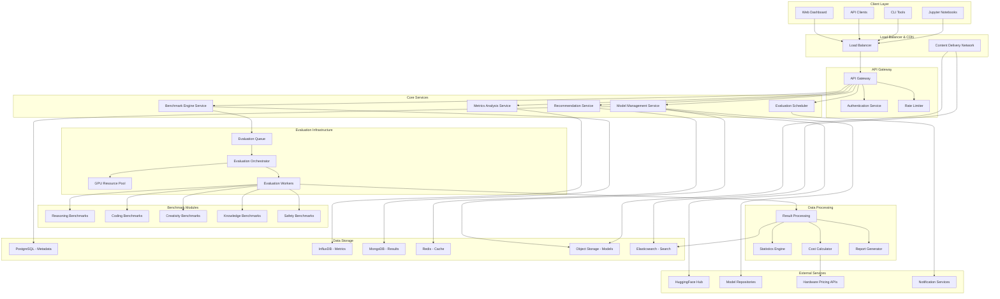

# 140509_33.md - Multi-Model Comparison and Benchmarking Platform

## README

**Summary:** Develop a comprehensive platform for comparing and benchmarking open-source language models across various tasks and performance metrics.

**Problem Statement:** Selecting optimal open-source models requires systematic comparison across multiple dimensions. Your task is to create a benchmarking platform that evaluates open-source models across different tasks, measures performance metrics, and provides recommendations based on specific use case requirements. The system should automate model testing, provide fair comparisons, and maintain updated benchmarks as new models are released.

**Steps:**
- Design automated model loading and evaluation pipelines
- Implement comprehensive benchmark suites covering various tasks (reasoning, coding, creativity)
- Create performance metrics analysis including speed, accuracy, and resource usage
- Build recommendation engine for model selection based on requirements
- Develop cost-benefit analysis tools considering computational resources
- Include model fine-tuning comparison and specialized task evaluation

**Suggested Data Requirements:**
- Standardized benchmark datasets across different domains
- Model performance baselines and historical comparisons
- Hardware resource utilization data
- Task-specific evaluation criteria and scoring methods

**Themes:** Open source / Open weight models, Classical AI/ML/DL for prediction

---

## PRD (Product Requirements Document)

### Product Vision
Create a comprehensive, automated benchmarking platform that enables organizations and researchers to objectively compare open-source language models across multiple dimensions, facilitating informed model selection decisions with detailed performance analytics and cost-benefit analysis.

### Target Users
- **Primary:** ML Engineers, Research Teams, Model Developers
- **Secondary:** Technical Decision Makers, AI Product Managers, Academic Researchers
- **Tertiary:** Open Source Community, Model Publishers, Hardware Vendors

### Core Value Propositions
1. **Objective Comparison:** Standardized benchmarks eliminating selection bias
2. **Comprehensive Evaluation:** Multi-dimensional assessment across diverse tasks
3. **Automated Testing:** Continuous evaluation of new model releases
4. **Cost Optimization:** Resource utilization analysis for informed decisions
5. **Community Driven:** Open platform fostering model improvement and transparency

### Key Features
1. **Automated Model Pipeline:** Seamless model loading, evaluation, and comparison
2. **Multi-Task Benchmarking:** Reasoning, coding, creativity, knowledge, safety assessments
3. **Performance Analytics:** Speed, accuracy, resource consumption metrics
4. **Recommendation Engine:** AI-powered model selection based on use case requirements
5. **Cost-Benefit Analysis:** TCO calculations including compute, memory, storage costs
6. **Fine-tuning Comparison:** Evaluate specialized model variants and adaptations
7. **Real-time Dashboard:** Live benchmarking results and model rankings

### Success Metrics
- Model evaluation throughput: >100 models evaluated per week
- Benchmark accuracy: >95% reproducible results across runs
- User decision confidence: >85% users report improved model selection
- Community adoption: 1000+ registered organizations within 6 months
- Cost optimization impact: Average 30% reduction in model deployment costs

---

## FRD (Functional Requirements Document)

### Core Functional Requirements

#### F1: Automated Model Loading and Evaluation
- **F1.1:** Support major model formats (HuggingFace, GGML, PyTorch, TensorFlow)
- **F1.2:** Automated model downloading and environment setup
- **F1.3:** Dynamic hardware allocation based on model requirements
- **F1.4:** Parallel evaluation across multiple GPUs/nodes
- **F1.5:** Error handling and retry mechanisms for failed evaluations

#### F2: Comprehensive Benchmark Suite Implementation
- **F2.1:** Reasoning benchmarks (MMLU, HellaSwag, ARC, WinoGrande)
- **F2.2:** Coding benchmarks (HumanEval, MBPP, CodeXGLUE)
- **F2.3:** Creativity benchmarks (story generation, poetry, creative writing)
- **F2.4:** Knowledge benchmarks (TriviaQA, Natural Questions, OpenBookQA)
- **F2.5:** Safety and alignment benchmarks (TruthfulQA, toxicity detection)

#### F3: Performance Metrics Analysis
- **F3.1:** Accuracy metrics (exact match, BLEU, ROUGE, BERTScore)
- **F3.2:** Latency measurements (inference time, first token latency)
- **F3.3:** Throughput analysis (tokens/second, requests/second)
- **F3.4:** Resource utilization (GPU memory, CPU usage, energy consumption)
- **F3.5:** Scalability testing across different batch sizes and sequence lengths

#### F4: Model Recommendation Engine
- **F4.1:** Use case requirement specification (accuracy, speed, cost constraints)
- **F4.2:** Multi-objective optimization for model selection
- **F4.3:** Trade-off analysis visualization (Pareto frontiers)
- **F4.4:** Contextual recommendations based on deployment environment
- **F4.5:** Confidence scoring for recommendation reliability

#### F5: Cost-Benefit Analysis Tools
- **F5.1:** Hardware cost estimation for different deployment scenarios
- **F5.2:** Energy consumption and carbon footprint analysis
- **F5.3:** Total cost of ownership (TCO) calculations
- **F5.4:** ROI analysis for model upgrade decisions
- **F5.5:** Cost optimization recommendations

#### F6: Fine-tuning and Specialization Evaluation
- **F6.1:** Compare base models with fine-tuned variants
- **F6.2:** Domain-specific evaluation (medical, legal, financial, scientific)
- **F6.3:** Few-shot vs fine-tuned performance comparison
- **F6.4:** Parameter-efficient fine-tuning (LoRA, AdaLoRA) assessment
- **F6.5:** Transfer learning effectiveness measurement

#### F7: Community and Collaboration Features
- **F7.1:** Public benchmark result sharing and leaderboards
- **F7.2:** Custom benchmark submission and validation
- **F7.3:** Collaborative evaluation campaigns
- **F7.4:** Peer review system for benchmark quality
- **F7.5:** API access for external integrations

---

## NFRD (Non-Functional Requirements Document)

### Performance Requirements
- **NFR-P1:** Model evaluation completion time: <4 hours for standard benchmark suite
- **NFR-P2:** Benchmark result retrieval: <2 seconds for queries
- **NFR-P3:** Concurrent model evaluations: Support 50+ simultaneous evaluations
- **NFR-P4:** Dashboard update frequency: Real-time updates with <30 second latency
- **NFR-P5:** API response time: <500ms for benchmark data requests

### Scalability Requirements
- **NFR-S1:** Horizontal scaling to 1000+ GPU nodes
- **NFR-S2:** Auto-scaling based on evaluation queue length
- **NFR-S3:** Database scaling for millions of benchmark results
- **NFR-S4:** Storage scaling for model artifacts and evaluation data
- **NFR-S5:** Network optimization for large model downloads

### Reliability Requirements
- **NFR-R1:** System uptime: 99.5% availability
- **NFR-R2:** Benchmark result reproducibility: >99% consistency across runs
- **NFR-R3:** Data backup and recovery: RPO 1 hour, RTO 30 minutes
- **NFR-R4:** Fault tolerance for hardware failures
- **NFR-R5:** Graceful degradation during resource constraints

### Accuracy Requirements
- **NFR-A1:** Benchmark implementation accuracy: >99.9% compliance with standards
- **NFR-A2:** Performance measurement precision: ±1% for timing metrics
- **NFR-A3:** Resource utilization accuracy: ±2% for memory and compute metrics
- **NFR-A4:** Cost calculation accuracy: ±5% for TCO estimations
- **NFR-A5:** Model ranking stability: <5% variance in rankings over time

### Security Requirements
- **NFR-SE1:** Secure model artifact storage and access control
- **NFR-SE2:** API authentication and rate limiting
- **NFR-SE3:** Benchmark result integrity and tamper protection
- **NFR-SE4:** Privacy protection for proprietary model evaluations
- **NFR-SE5:** Compliance with open-source license requirements

### Usability Requirements
- **NFR-U1:** Intuitive web interface requiring <10 minutes to learn
- **NFR-U2:** Comprehensive API documentation and SDKs
- **NFR-U3:** Mobile-responsive dashboard for monitoring
- **NFR-U4:** Accessibility compliance (WCAG 2.1 AA)
- **NFR-U5:** Multi-language support for global community

---

## AD (Architecture Diagram)



---

## HLD (High Level Design)

### System Architecture Overview

The Multi-Model Comparison and Benchmarking Platform employs a distributed, microservices architecture optimized for large-scale model evaluation with automated resource management and comprehensive analytics.

#### 1. Core Evaluation Engine Architecture

##### Automated Model Loading System
```python
class ModelManager:
    def __init__(self):
        self.model_registry = ModelRegistry()
        self.downloader = ModelDownloader()
        self.loader = UniversalModelLoader()
        self.resource_estimator = ResourceEstimator()
        
    async def load_model_for_evaluation(self, model_spec: ModelSpec) -> LoadedModel:
        # Check if model already loaded
        if self.model_registry.is_loaded(model_spec.model_id):
            return self.model_registry.get_loaded_model(model_spec.model_id)
        
        # Estimate resource requirements
        resource_requirements = self.resource_estimator.estimate(model_spec)
        
        # Acquire appropriate hardware resources
        hardware_allocation = await self.acquire_hardware(resource_requirements)
        
        # Download model if not cached
        model_path = await self.downloader.ensure_model_available(model_spec)
        
        # Load model with appropriate backend
        loaded_model = await self.loader.load_model(
            model_path, 
            model_spec.model_type,
            hardware_allocation
        )
        
        # Register loaded model
        self.model_registry.register_loaded_model(
            model_spec.model_id, 
            loaded_model,
            resource_requirements
        )
        
        return loaded_model
```

##### Benchmark Execution Framework
```python
class BenchmarkEngine:
    def __init__(self):
        self.benchmark_registry = BenchmarkRegistry()
        self.task_scheduler = TaskScheduler()
        self.result_aggregator = ResultAggregator()
        self.progress_tracker = ProgressTracker()
        
    async def execute_benchmark_suite(self, model: LoadedModel, benchmark_suite: BenchmarkSuite) -> BenchmarkResults:
        results = {}
        
        for benchmark in benchmark_suite.benchmarks:
            # Check if benchmark is applicable to model
            if not self.is_benchmark_applicable(model, benchmark):
                continue
            
            # Execute benchmark with progress tracking
            benchmark_result = await self.execute_single_benchmark(
                model, benchmark
            )
            
            results[benchmark.name] = benchmark_result
            
            # Update progress
            self.progress_tracker.update_progress(
                model.model_id, 
                benchmark_suite.suite_id,
                benchmark.name
            )
        
        # Aggregate results
        aggregated_results = self.result_aggregator.aggregate_results(results)
        
        return BenchmarkResults(
            model_id=model.model_id,
            suite_id=benchmark_suite.suite_id,
            individual_results=results,
            aggregated_metrics=aggregated_results,
            execution_metadata=self.extract_execution_metadata(model, results)
        )
```

#### 2. Multi-Dimensional Performance Analysis

##### Comprehensive Metrics Collection
```python
class MetricsCollector:
    def __init__(self):
        self.accuracy_calculator = AccuracyMetricsCalculator()
        self.performance_monitor = PerformanceMonitor()
        self.resource_tracker = ResourceTracker()
        self.cost_analyzer = CostAnalyzer()
        
    def collect_comprehensive_metrics(self, evaluation_run: EvaluationRun) -> ComprehensiveMetrics:
        metrics = ComprehensiveMetrics()
        
        # Accuracy metrics
        metrics.accuracy = self.accuracy_calculator.calculate_accuracy_metrics(
            predictions=evaluation_run.predictions,
            ground_truth=evaluation_run.ground_truth,
            task_type=evaluation_run.task_type
        )
        
        # Performance metrics
        metrics.performance = self.performance_monitor.calculate_performance_metrics(
            inference_times=evaluation_run.inference_times,
            batch_sizes=evaluation_run.batch_sizes,
            sequence_lengths=evaluation_run.sequence_lengths
        )
        
        # Resource utilization metrics
        metrics.resources = self.resource_tracker.calculate_resource_metrics(
            gpu_utilization=evaluation_run.gpu_utilization,
            memory_usage=evaluation_run.memory_usage,
            energy_consumption=evaluation_run.energy_consumption
        )
        
        # Cost metrics
        metrics.cost = self.cost_analyzer.calculate_cost_metrics(
            resource_usage=metrics.resources,
            evaluation_duration=evaluation_run.duration,
            hardware_configuration=evaluation_run.hardware_config
        )
        
        return metrics
```

#### 3. Intelligent Recommendation System

##### Multi-Objective Model Selection
```python
class ModelRecommendationEngine:
    def __init__(self):
        self.pareto_optimizer = ParetoOptimizer()
        self.constraint_solver = ConstraintSolver()
        self.similarity_matcher = SimilarityMatcher()
        self.confidence_scorer = ConfidenceScorer()
        
    def recommend_models(self, requirements: ModelRequirements) -> List[ModelRecommendation]:
        # Get all evaluated models
        candidate_models = self.get_evaluated_models(requirements.task_types)
        
        # Filter models based on hard constraints
        feasible_models = self.constraint_solver.filter_feasible_models(
            candidate_models, requirements.constraints
        )
        
        # Perform multi-objective optimization
        pareto_optimal_models = self.pareto_optimizer.find_pareto_optimal(
            feasible_models,
            objectives=[
                requirements.accuracy_weight * model.accuracy_score,
                requirements.speed_weight * (1 / model.inference_time),
                requirements.cost_weight * (1 / model.deployment_cost),
                requirements.efficiency_weight * model.efficiency_score
            ]
        )
        
        # Rank recommendations
        ranked_recommendations = []
        for model in pareto_optimal_models:
            # Calculate similarity to requirements
            similarity_score = self.similarity_matcher.calculate_similarity(
                model.characteristics, requirements.preferences
            )
            
            # Calculate confidence score
            confidence_score = self.confidence_scorer.calculate_confidence(
                model.benchmark_results, requirements.reliability_threshold
            )
            
            recommendation = ModelRecommendation(
                model=model,
                similarity_score=similarity_score,
                confidence_score=confidence_score,
                trade_offs=self.analyze_trade_offs(model, requirements),
                deployment_guidance=self.generate_deployment_guidance(model, requirements)
            )
            
            ranked_recommendations.append(recommendation)
        
        # Sort by composite score
        ranked_recommendations.sort(
            key=lambda r: self.calculate_composite_score(r, requirements),
            reverse=True
        )
        
        return ranked_recommendations[:requirements.max_recommendations]
```

#### 4. Cost-Benefit Analysis Framework

##### Total Cost of Ownership Calculator
```python
class TCOCalculator:
    def __init__(self):
        self.hardware_pricing = HardwarePricingAPI()
        self.energy_calculator = EnergyConsumptionCalculator()
        self.maintenance_estimator = MaintenanceEstimator()
        self.scaling_analyzer = ScalingAnalyzer()
        
    def calculate_tco(self, model: Model, deployment_scenario: DeploymentScenario) -> TCOAnalysis:
        tco_components = {}
        
        # Hardware costs
        tco_components['hardware'] = self.calculate_hardware_costs(
            model.resource_requirements,
            deployment_scenario.hardware_config,
            deployment_scenario.time_horizon
        )
        
        # Energy costs
        tco_components['energy'] = self.energy_calculator.calculate_energy_costs(
            model.power_consumption,
            deployment_scenario.usage_pattern,
            deployment_scenario.energy_pricing
        )
        
        # Maintenance and operational costs
        tco_components['operations'] = self.maintenance_estimator.estimate_operational_costs(
            deployment_scenario.infrastructure_complexity,
            deployment_scenario.sla_requirements
        )
        
        # Scaling costs
        tco_components['scaling'] = self.scaling_analyzer.analyze_scaling_costs(
            model.scaling_characteristics,
            deployment_scenario.growth_projections
        )
        
        # Software licensing (if applicable)
        tco_components['licensing'] = self.calculate_licensing_costs(
            model.license_requirements,
            deployment_scenario.usage_volume
        )
        
        total_tco = sum(tco_components.values())
        
        return TCOAnalysis(
            total_cost=total_tco,
            cost_breakdown=tco_components,
            cost_per_inference=total_tco / deployment_scenario.expected_inferences,
            roi_analysis=self.calculate_roi(tco_components, deployment_scenario.expected_benefits),
            sensitivity_analysis=self.perform_sensitivity_analysis(tco_components, deployment_scenario)
        )
```

### Real-Time Evaluation Pipeline

#### Distributed Evaluation Architecture
- **Kubernetes Orchestration:** Dynamic pod scaling based on evaluation queue
- **GPU Resource Pool:** Shared GPU resources with intelligent allocation
- **Priority Queuing:** Evaluation prioritization based on urgency and resource requirements
- **Fault Tolerance:** Automatic retry and recovery mechanisms for failed evaluations
- **Result Streaming:** Real-time progress updates and partial results

#### Performance Optimization Strategies
- **Model Caching:** Intelligent caching of frequently evaluated models
- **Batch Optimization:** Dynamic batching of evaluation tasks
- **Pipeline Parallelization:** Concurrent execution of different benchmark tasks
- **Hardware Optimization:** Automatic selection of optimal hardware configurations
- **Network Optimization:** Efficient model artifact distribution

### Data Architecture

#### Multi-Store Data Management
- **PostgreSQL:** Model metadata, evaluation configurations, user management
- **InfluxDB:** Time-series metrics data for performance analysis
- **MongoDB:** Complex benchmark results and model characteristics
- **Redis:** Caching layer for frequently accessed data
- **Object Storage:** Model artifacts, evaluation datasets, result archives
- **Elasticsearch:** Full-text search and analytics across benchmark results

#### Data Pipeline Architecture
```python
class DataPipeline:
    def __init__(self):
        self.ingestion_service = DataIngestionService()
        self.validation_service = DataValidationService()
        self.transformation_service = DataTransformationService()
        self.storage_service = StorageService()
        self.indexing_service = IndexingService()
        
    async def process_evaluation_results(self, raw_results: RawEvaluationResults) -> ProcessedResults:
        # Data validation
        validation_result = await self.validation_service.validate_results(raw_results)
        if not validation_result.is_valid:
            raise DataValidationError(validation_result.errors)
        
        # Data transformation
        transformed_results = await self.transformation_service.transform_results(
            raw_results, target_schema="benchmark_results_v2"
        )
        
        # Storage across multiple backends
        storage_tasks = [
            self.storage_service.store_metadata(transformed_results.metadata, "postgresql"),
            self.storage_service.store_metrics(transformed_results.metrics, "influxdb"),
            self.storage_service.store_results(transformed_results.detailed_results, "mongodb"),
            self.storage_service.cache_summary(transformed_results.summary, "redis")
        ]
        
        await asyncio.gather(*storage_tasks)
        
        # Update search indices
        await self.indexing_service.update_indices(transformed_results)
        
        return transformed_results
```

---

## LLD (Low Level Design)

### Detailed Component Implementation

#### 1. Universal Model Loader

##### Multi-Format Model Support
```python
class UniversalModelLoader:
    def __init__(self):
        self.format_handlers = {
            'huggingface': HuggingFaceModelHandler(),
            'pytorch': PyTorchModelHandler(),
            'tensorflow': TensorFlowModelHandler(),
            'onnx': ONNXModelHandler(),
            'ggml': GGMLModelHandler(),
            'mlx': MLXModelHandler()
        }
        self.hardware_managers = {
            'cuda': CUDAHardwareManager(),
            'cpu': CPUHardwareManager(),
            'mps': MPSHardwareManager(),
            'xpu': XPUHardwareManager()
        }
        
    async def load_model(self, model_path: str, model_format: str, hardware_config: HardwareConfig) -> LoadedModel:
        # Select appropriate format handler
        format_handler = self.format_handlers.get(model_format)
        if not format_handler:
            raise UnsupportedModelFormatError(f"Format {model_format} not supported")
        
        # Select hardware manager
        hardware_manager = self.hardware_managers.get(hardware_config.device_type)
        if not hardware_manager:
            raise UnsupportedHardwareError(f"Hardware {hardware_config.device_type} not supported")
        
        # Prepare hardware environment
        await hardware_manager.prepare_environment(hardware_config)
        
        # Load model with format-specific handler
        loaded_model = await format_handler.load_model(
            model_path=model_path,
            hardware_config=hardware_config,
            load_options=self._determine_load_options(model_format, hardware_config)
        )
        
        # Validate model loading
        validation_result = await self._validate_loaded_model(loaded_model)
        if not validation_result.is_valid:
            raise ModelLoadingError(f"Model validation failed: {validation_result.errors}")
        
        # Wrap in universal interface
        return UniversalModelWrapper(
            model=loaded_model,
            format=model_format,
            hardware_config=hardware_config,
            capabilities=format_handler.get_model_capabilities(loaded_model)
        )
    
    def _determine_load_options(self, model_format: str, hardware_config: HardwareConfig) -> LoadOptions:
        options = LoadOptions()
        
        # Determine precision based on hardware capabilities
        if hardware_config.supports_fp16:
            options.precision = "fp16"
        elif hardware_config.supports_bf16:
            options.precision = "bf16"
        else:
            options.precision = "fp32"
        
        # Determine quantization options
        if hardware_config.memory_limited:
            options.quantization = "int8"
        
        # Set optimization flags
        options.optimize_for_inference = True
        options.enable_torch_compile = hardware_config.device_type == "cuda"
        
        return options
```

##### Model Wrapper Interface
```python
class UniversalModelWrapper:
    def __init__(self, model, format: str, hardware_config: HardwareConfig, capabilities: ModelCapabilities):
        self.model = model
        self.format = format
        self.hardware_config = hardware_config
        self.capabilities = capabilities
        self.tokenizer = self._initialize_tokenizer()
        
    async def generate(self, prompt: str, generation_config: GenerationConfig) -> GenerationResult:
        # Tokenize input
        input_tokens = await self.tokenizer.encode(
            prompt, 
            add_special_tokens=True,
            return_tensors=self._get_tensor_format()
        )
        
        # Move to appropriate device
        input_tokens = self._move_to_device(input_tokens)
        
        # Generate with timing
        start_time = time.time()
        
        if self.format == 'huggingface':
            output = await self._generate_huggingface(input_tokens, generation_config)
        elif self.format == 'pytorch':
            output = await self._generate_pytorch(input_tokens, generation_config)
        elif self.format == 'ggml':
            output = await self._generate_ggml(prompt, generation_config)  # GGML uses text input
        else:
            raise UnsupportedOperationError(f"Generation not implemented for format {self.format}")
        
        end_time = time.time()
        
        # Decode output
        generated_text = await self.tokenizer.decode(
            output, 
            skip_special_tokens=True,
            clean_up_tokenization_spaces=True
        )
        
        # Calculate metrics
        generation_metrics = self._calculate_generation_metrics(
            input_tokens, output, start_time, end_time
        )
        
        return GenerationResult(
            generated_text=generated_text,
            input_length=len(input_tokens),
            output_length=len(output),
            generation_time=end_time - start_time,
            metrics=generation_metrics
        )
    
    def _calculate_generation_metrics(self, input_tokens, output_tokens, start_time, end_time):
        generation_time = end_time - start_time
        output_length = len(output_tokens) if hasattr(output_tokens, '__len__') else output_tokens.shape[-1]
        
        return GenerationMetrics(
            tokens_per_second=output_length / generation_time,
            first_token_latency=self._measure_first_token_latency(),
            total_tokens=output_length,
            input_tokens=len(input_tokens),
            memory_usage=self._get_memory_usage(),
            energy_consumed=self._estimate_energy_consumption(generation_time)
        )
```

#### 2. Benchmark Implementation Framework

##### Abstract Benchmark Base
```python
class AbstractBenchmark:
    def __init__(self, name: str, description: str, task_type: str):
        self.name = name
        self.description = description
        self.task_type = task_type
        self.dataset = None
        self.evaluator = None
        
    async def load_dataset(self, dataset_path: str):
        """Load benchmark dataset"""
        raise NotImplementedError
    
    async def evaluate_model(self, model: UniversalModelWrapper) -> BenchmarkResult:
        """Evaluate model on this benchmark"""
        raise NotImplementedError
    
    def calculate_metrics(self, predictions: List[str], ground_truth: List[str]) -> Dict[str, float]:
        """Calculate benchmark-specific metrics"""
        raise NotImplementedError

class ReasoningBenchmark(AbstractBenchmark):
    def __init__(self, benchmark_name: str):
        super().__init__(
            name=benchmark_name,
            description=f"Reasoning benchmark: {benchmark_name}",
            task_type="reasoning"
        )
        self.multiple_choice_evaluator = MultipleChoiceEvaluator()
        
    async def load_dataset(self, dataset_path: str):
        self.dataset = await self._load_reasoning_dataset(dataset_path)
        
    async def evaluate_model(self, model: UniversalModelWrapper) -> BenchmarkResult:
        if not self.dataset:
            raise BenchmarkError("Dataset not loaded")
        
        predictions = []
        inference_times = []
        
        for sample in self.dataset:
            # Format prompt for reasoning task
            prompt = self._format_reasoning_prompt(sample)
            
            # Generate model response
            start_time = time.time()
            generation_result = await model.generate(
                prompt=prompt,
                generation_config=GenerationConfig(
                    max_new_tokens=10,  # Short answers for multiple choice
                    temperature=0.0,    # Deterministic for evaluation
                    do_sample=False
                )
            )
            end_time = time.time()
            
            # Extract answer from generation
            predicted_answer = self._extract_answer(generation_result.generated_text)
            predictions.append(predicted_answer)
            inference_times.append(end_time - start_time)
        
        # Calculate metrics
        ground_truth = [sample['answer'] for sample in self.dataset]
        metrics = self.calculate_metrics(predictions, ground_truth)
        
        return BenchmarkResult(
            benchmark_name=self.name,
            model_id=model.model_id if hasattr(model, 'model_id') else 'unknown',
            accuracy=metrics