                # Calculate orthogonal regularization
                # ||A^T A - I||_F^2 + ||B B^T - I||_F^2
                if A.shape[0] >= A.shape[1]:  # More rows than columns
                    AtA = torch.mm(A.t(), A)
                    I = torch.eye(AtA.shape[0], device=A.device, dtype=A.dtype)
                    reg_loss += torch.norm(AtA - I, 'fro') ** 2
                
                if B.shape[1] >= B.shape[0]:  # More columns than rows
                    BBt = torch.mm(B, B.t())
                    I = torch.eye(BBt.shape[0], device=B.device, dtype=B.dtype)
                    reg_loss += torch.norm(BBt - I, 'fro') ** 2
        
        return reg_loss
    
    def update_rank_allocation(self, model, global_step):
        """Update rank allocation based on parameter importance"""
        importance_scores = self.importance_estimator.estimate_importance(model)
        
        # Update ranks based on importance scores
        for name, module in model.named_modules():
            if hasattr(module, 'lora_A') and hasattr(module, 'lora_B'):
                module_importance = importance_scores.get(name, 0.0)
                new_rank = self.rank_scheduler.schedule_rank(
                    current_rank=module.r,
                    importance_score=module_importance,
                    global_step=global_step
                )
                
                if new_rank != module.r:
                    self.resize_lora_module(module, new_rank)
```

#### 3. Distributed Training Implementation

##### Fault-Tolerant Training Coordinator
```python
class FaultTolerantTrainingCoordinator:
    def __init__(self):
        self.checkpoint_manager = CheckpointManager()
        self.health_monitor = NodeHealthMonitor()
        self.recovery_manager = RecoveryManager()
        self.communication_manager = CommunicationManager()
        
    async def coordinate_distributed_training(self, training_job: DistributedTrainingJob):
        # Initialize distributed process group
        await self.initialize_distributed_process_group(training_job)
        
        # Set up health monitoring
        await self.health_monitor.start_monitoring(training_job.nodes)
        
        # Main training loop with fault tolerance
        try:
            await self.fault_tolerant_training_loop(training_job)
        except NodeFailureException as e:
            await self.handle_node_failure(training_job, e)
        except Exception as e:
            await self.handle_training_exception(training_job, e)
        finally:
            await self.cleanup_distributed_training(training_job)
    
    async def fault_tolerant_training_loop(self, training_job: DistributedTrainingJob):
        checkpoint_frequency = training_job.config.checkpoint_frequency
        
        for epoch in range(training_job.config.num_epochs):
            epoch_start_time = time.time()
            
            # Check node health before epoch
            health_status = await self.health_monitor.check_all_nodes_health(training_job.nodes)
            if not health_status.all_healthy:
                await self.handle_unhealthy_nodes(training_job, health_status.unhealthy_nodes)
            
            # Distributed training epoch
            epoch_results = await self.execute_distributed_epoch(training_job, epoch)
            
            # Checkpoint saving (with consensus)
            if epoch % checkpoint_frequency == 0:
                await self.create_distributed_checkpoint(training_job, epoch, epoch_results)
            
            # Synchronize metrics across all nodes
            synchronized_metrics = await self.synchronize_training_metrics(
                training_job, epoch_results
            )
            
            # Update training job state
            training_job.update_epoch_results(epoch, synchronized_metrics)
            
            # Check for early stopping consensus
            if self.should_early_stop(training_job, synchronized_metrics):
                print(f"Early stopping consensus reached at epoch {epoch}")
                break
            
            print(f"Epoch {epoch} completed in {time.time() - epoch_start_time:.2f}s")
    
    async def execute_distributed_epoch(self, training_job: DistributedTrainingJob, epoch: int):
        # Prepare epoch-specific data distribution
        epoch_data_distribution = await self.prepare_epoch_data_distribution(
            training_job.dataset, epoch, training_job.world_size
        )
        
        # Execute training on all nodes simultaneously
        node_tasks = []
        for rank, node in enumerate(training_job.nodes):
            task = asyncio.create_task(
                self.execute_node_training(
                    node, rank, epoch, epoch_data_distribution[rank], training_job
                )
            )
            node_tasks.append(task)
        
        # Wait for all nodes to complete with timeout
        try:
            node_results = await asyncio.wait_for(
                asyncio.gather(*node_tasks, return_exceptions=True),
                timeout=training_job.config.epoch_timeout
            )
        except asyncio.TimeoutError:
            # Handle timeout - some nodes may be slow or stuck
            completed_tasks = [task for task in node_tasks if task.done()]
            pending_tasks = [task for task in node_tasks if not task.done()]
            
            # Cancel pending tasks
            for task in pending_tasks:
                task.cancel()
            
            raise NodeTimeoutException(f"Timeout waiting for {len(pending_tasks)} nodes")
        
        # Process results and handle any node-specific exceptions
        processed_results = self.process_node_results(node_results, training_job.nodes)
        
        return processed_results
    
    async def create_distributed_checkpoint(self, training_job: DistributedTrainingJob, epoch: int, epoch_results):
        """Create checkpoint with consensus mechanism"""
        checkpoint_id = f"{training_job.id}_epoch_{epoch}"
        
        # Each node creates its local checkpoint
        local_checkpoint_tasks = []
        for rank, node in enumerate(training_job.nodes):
            task = asyncio.create_task(
                self.create_node_checkpoint(node, rank, checkpoint_id, epoch_results[rank])
            )
            local_checkpoint_tasks.append(task)
        
        # Wait for all local checkpoints
        local_checkpoint_results = await asyncio.gather(*local_checkpoint_tasks)
        
        # Verify checkpoint consistency across nodes
        consistency_check = self.verify_checkpoint_consistency(local_checkpoint_results)
        
        if not consistency_check.is_consistent:
            raise CheckpointConsistencyError(
                f"Checkpoint consistency check failed: {consistency_check.issues}"
            )
        
        # Create global checkpoint metadata
        global_checkpoint = GlobalCheckpoint(
            checkpoint_id=checkpoint_id,
            epoch=epoch,
            global_step=training_job.global_step,
            node_checkpoints=local_checkpoint_results,
            training_config=training_job.config,
            model_config=training_job.model_config,
            consistency_hash=consistency_check.consensus_hash
        )
        
        # Save global checkpoint metadata
        await self.checkpoint_manager.save_global_checkpoint(global_checkpoint)
        
        print(f"Distributed checkpoint {checkpoint_id} created successfully")

class NodeHealthMonitor:
    def __init__(self):
        self.health_check_interval = 30  # seconds
        self.failure_threshold = 3  # consecutive failures
        self.monitoring_tasks = {}
        
    async def start_monitoring(self, nodes: List[TrainingNode]):
        for node in nodes:
            task = asyncio.create_task(self.monitor_node_health(node))
            self.monitoring_tasks[node.rank] = task
    
    async def monitor_node_health(self, node: TrainingNode):
        consecutive_failures = 0
        
        while True:
            try:
                # Perform comprehensive health check
                health_status = await self.perform_health_check(node)
                
                if health_status.is_healthy:
                    consecutive_failures = 0
                    node.last_healthy_timestamp = time.time()
                else:
                    consecutive_failures += 1
                    
                    if consecutive_failures >= self.failure_threshold:
                        await self.report_node_failure(node, health_status.failure_reasons)
                        break
                
                await asyncio.sleep(self.health_check_interval)
                
            except Exception as e:
                consecutive_failures += 1
                print(f"Health check exception for node {node.rank}: {e}")
                
                if consecutive_failures >= self.failure_threshold:
                    await self.report_node_failure(node, [f"Health check exception: {e}"])
                    break
    
    async def perform_health_check(self, node: TrainingNode) -> NodeHealthStatus:
        health_checks = []
        
        # GPU health check
        gpu_health = await self.check_gpu_health(node)
        health_checks.append(gpu_health)
        
        # Memory usage check
        memory_health = await self.check_memory_usage(node)
        health_checks.append(memory_health)
        
        # Network connectivity check
        network_health = await self.check_network_connectivity(node)
        health_checks.append(network_health)
        
        # Training process health check
        process_health = await self.check_training_process_health(node)
        health_checks.append(process_health)
        
        # Combine all health check results
        overall_healthy = all(check.is_healthy for check in health_checks)
        failure_reasons = [check.failure_reason for check in health_checks if not check.is_healthy]
        
        return NodeHealthStatus(
            node_rank=node.rank,
            is_healthy=overall_healthy,
            failure_reasons=failure_reasons,
            detailed_checks=health_checks,
            timestamp=time.time()
        )
```

#### 4. Advanced Hyperparameter Optimization

##### Multi-Objective Evolutionary Algorithm
```python
class EvolutionaryOptimizer(BaseOptimizer):
    def __init__(self):
        self.population_size = 20
        self.num_generations = 50
        self.mutation_rate = 0.1
        self.crossover_rate = 0.8
        self.elitism_rate = 0.2
        self.current_population = []
        self.fitness_history = []
        
    async def initialize_population(self, search_space: SearchSpace) -> List[Individual]:
        population = []
        
        for i in range(self.population_size):
            # Create random individual
            genes = {}
            for param_name, param_range in search_space.parameters.items():
                if param_range.type == 'continuous':
                    genes[param_name] = random.uniform(param_range.min, param_range.max)
                elif param_range.type == 'integer':
                    genes[param_name] = random.randint(param_range.min, param_range.max)
                elif param_range.type == 'categorical':
                    genes[param_name] = random.choice(param_range.choices)
            
            individual = Individual(
                id=f"gen0_ind{i}",
                genes=genes,
                fitness=None,
                age=0
            )
            population.append(individual)
        
        return population
    
    async def evolve_population(self, current_population: List[Individual], generation: int) -> List[Individual]:
        # Selection: Tournament selection
        selected_parents = self.tournament_selection(
            current_population, 
            num_parents=int(self.population_size * 0.6)
        )
        
        # Crossover: Create offspring
        offspring = []
        for i in range(0, len(selected_parents), 2):
            if i + 1 < len(selected_parents) and random.random() < self.crossover_rate:
                child1, child2 = self.crossover(
                    selected_parents[i], 
                    selected_parents[i + 1],
                    generation
                )
                offspring.extend([child1, child2])
        
        # Mutation: Mutate offspring
        for individual in offspring:
            if random.random() < self.mutation_rate:
                self.mutate(individual, generation)
        
        # Elitism: Keep best individuals from previous generation
        elite_count = int(self.population_size * self.elitism_rate)
        elite_individuals = sorted(
            current_population, 
            key=lambda x: x.fitness.primary_objective if x.fitness else 0,
            reverse=True
        )[:elite_count]
        
        # Combine elite + offspring + some random new individuals
        new_population = elite_individuals + offspring
        
        # Fill remaining slots with new random individuals
        while len(new_population) < self.population_size:
            random_individual = await self.create_random_individual(generation)
            new_population.append(random_individual)
        
        return new_population[:self.population_size]
    
    def crossover(self, parent1: Individual, parent2: Individual, generation: int) -> Tuple[Individual, Individual]:
        """Uniform crossover with domain-specific adaptations"""
        child1_genes = {}
        child2_genes = {}
        
        for param_name in parent1.genes.keys():
            if random.random() < 0.5:
                child1_genes[param_name] = parent1.genes[param_name]
                child2_genes[param_name] = parent2.genes[param_name]
            else:
                child1_genes[param_name] = parent2.genes[param_name]
                child2_genes[param_name] = parent1.genes[param_name]
        
        child1 = Individual(
            id=f"gen{generation}_crossover_{uuid4().hex[:8]}",
            genes=child1_genes,
            fitness=None,
            age=0,
            parent_ids=[parent1.id, parent2.id]
        )
        
        child2 = Individual(
            id=f"gen{generation}_crossover_{uuid4().hex[:8]}",
            genes=child2_genes,
            fitness=None,
            age=0,
            parent_ids=[parent1.id, parent2.id]
        )
        
        return child1, child2
    
    def mutate(self, individual: Individual, generation: int):
        """Adaptive mutation with decreasing intensity"""
        mutation_intensity = 1.0 / (1.0 + generation * 0.1)  # Decreasing mutation intensity
        
        for param_name, param_value in individual.genes.items():
            if random.random() < self.mutation_rate:
                param_range = self.search_space.parameters[param_name]
                
                if param_range.type == 'continuous':
                    # Gaussian mutation with adaptive standard deviation
                    std_dev = (param_range.max - param_range.min) * mutation_intensity * 0.1
                    mutation_delta = random.gauss(0, std_dev)
                    new_value = param_value + mutation_delta
                    
                    # Clip to bounds
                    individual.genes[param_name] = max(
                        param_range.min, 
                        min(param_range.max, new_value)
                    )
                
                elif param_range.type == 'integer':
                    # Integer mutation with adaptive range
                    max_change = max(1, int((param_range.max - param_range.min) * mutation_intensity * 0.2))
                    change = random.randint(-max_change, max_change)
                    new_value = param_value + change
                    
                    # Clip to bounds
                    individual.genes[param_name] = max(
                        param_range.min,
                        min(param_range.max, new_value)
                    )
                
                elif param_range.type == 'categorical':
                    # Random categorical mutation
                    individual.genes[param_name] = random.choice(param_range.choices)
    
    def tournament_selection(self, population: List[Individual], num_parents: int, tournament_size: int = 3) -> List[Individual]:
        """Tournament selection with multi-objective considerations"""
        selected_parents = []
        
        for _ in range(num_parents):
            # Select random individuals for tournament
            tournament_candidates = random.sample(population, min(tournament_size, len(population)))
            
            # Multi-objective tournament selection
            best_candidate = self.select_best_from_tournament(tournament_candidates)
            selected_parents.append(best_candidate)
        
        return selected_parents
    
    def select_best_from_tournament(self, candidates: List[Individual]) -> Individual:
        """Select best individual considering multiple objectives"""
        # Filter candidates with fitness scores
        valid_candidates = [c for c in candidates if c.fitness is not None]
        
        if not valid_candidates:
            return random.choice(candidates)
        
        # Pareto dominance selection
        non_dominated = self.find_pareto_front(valid_candidates)
        
        if len(non_dominated) == 1:
            return non_dominated[0]
        
        # If multiple non-dominated solutions, use crowding distance
        return self.select_by_crowding_distance(non_dominated)
    
    def find_pareto_front(self, individuals: List[Individual]) -> List[Individual]:
        """Find Pareto-optimal individuals"""
        pareto_front = []
        
        for candidate in individuals:
            is_dominated = False
            
            for other in individuals:
                if candidate != other and self.dominates(other.fitness, candidate.fitness):
                    is_dominated = True
                    break
            
            if not is_dominated:
                pareto_front.append(candidate)
        
        return pareto_front if pareto_front else individuals
    
    def dominates(self, fitness1: MultiFitness, fitness2: MultiFitness) -> bool:
        """Check if fitness1 dominates fitness2 (Pareto dominance)"""
        objectives1 = [fitness1.accuracy, fitness1.efficiency, -fitness1.training_time, -fitness1.memory_usage]
        objectives2 = [fitness2.accuracy, fitness2.efficiency, -fitness2.training_time, -fitness2.memory_usage]
        
        # fitness1 dominates fitness2 if it's >= in all objectives and > in at least one
        at_least_as_good_in_all = all(o1 >= o2 for o1, o2 in zip(objectives1, objectives2))
        better_in_at_least_one = any(o1 > o2 for o1, o2 in zip(objectives1, objectives2))
        
        return at_least_as_good_in_all and better_in_at_least_one
```

#### 5. Database Schema Implementation

##### PostgreSQL Schema
```sql
-- Fine-tuning projects
CREATE TABLE finetuning_projects (
    id UUID PRIMARY KEY DEFAULT gen_random_uuid(),
    user_id UUID NOT NULL,
    project_name VARCHAR(255) NOT NULL,
    description TEXT,
    base_model_name VARCHAR(255) NOT NULL,
    task_type VARCHAR(100) NOT NULL, -- 'text-generation', 'classification', 'qa', etc.
    status VARCHAR(50) DEFAULT 'created', -- 'created', 'preprocessing', 'training', 'evaluating', 'completed', 'failed'
    created_at TIMESTAMP DEFAULT CURRENT_TIMESTAMP,
    updated_at TIMESTAMP DEFAULT CURRENT_TIMESTAMP,
    completed_at TIMESTAMP
);

-- Training datasets
CREATE TABLE training_datasets (
    id UUID PRIMARY KEY DEFAULT gen_random_uuid(),
    project_id UUID REFERENCES finetuning_projects(id) ON DELETE CASCADE,
    dataset_name VARCHAR(255) NOT NULL,
    dataset_path TEXT NOT NULL,
    original_format VARCHAR(50) NOT NULL,
    processed_format VARCHAR(50),
    total_samples INTEGER,
    train_samples INTEGER,
    validation_samples INTEGER,
    test_samples INTEGER,
    data_quality_score FLOAT,
    processing_status VARCHAR(50) DEFAULT 'pending',
    quality_report JSONB,
    preprocessing_config JSONB,
    created_at TIMESTAMP DEFAULT CURRENT_TIMESTAMP
);

-- Training jobs
CREATE TABLE training_jobs (
    id UUID PRIMARY KEY DEFAULT gen_random_uuid(),
    project_id UUID REFERENCES finetuning_projects(id) ON DELETE CASCADE,
    job_name VARCHAR(255) NOT NULL,
    training_method VARCHAR(50) NOT NULL, -- 'lora', 'qlora', 'adalora', 'full'
    hyperparameters JSONB NOT NULL,
    hardware_config JSONB NOT NULL,
    distributed_config JSONB,
    status VARCHAR(50) DEFAULT 'queued',
    started_at TIMESTAMP,
    completed_at TIMESTAMP,
    training_time_seconds INTEGER,
    final_loss FLOAT,
    best_validation_metric FLOAT,
    checkpoint_path TEXT,
    logs_path TEXT,
    error_message TEXT,
    created_at TIMESTAMP DEFAULT CURRENT_TIMESTAMP
);

-- Hyperparameter optimization experiments
CREATE TABLE hyperparameter_experiments (
    id UUID PRIMARY KEY DEFAULT gen_random_uuid(),
    project_id UUID REFERENCES finetuning_projects(id) ON DELETE CASCADE,
    optimization_method VARCHAR(50) NOT NULL, -- 'bayesian', 'evolutionary', 'grid'
    search_space JSONB NOT NULL,
    optimization_config JSONB NOT NULL,
    status VARCHAR(50) DEFAULT 'running',
    best_configuration JSONB,
    best_score FLOAT,
    total_trials INTEGER DEFAULT 0,
    completed_trials INTEGER DEFAULT 0,
    pareto_frontier JSONB,
    started_at TIMESTAMP DEFAULT CURRENT_TIMESTAMP,
    completed_at TIMESTAMP
);

-- Individual hyperparameter trials
CREATE TABLE hyperparameter_trials (
    id UUID PRIMARY KEY DEFAULT gen_random_uuid(),
    experiment_id UUID REFERENCES hyperparameter_experiments(id) ON DELETE CASCADE,
    trial_number INTEGER NOT NULL,
    hyperparameters JSONB NOT NULL,
    metrics JSONB,
    training_job_id UUID REFERENCES training_jobs(id),
    status VARCHAR(50) DEFAULT 'pending',
    started_at TIMESTAMP,
    completed_at TIMESTAMP,
    duration_seconds INTEGER,
    UNIQUE(experiment_id, trial_number)
);

-- Model evaluations
CREATE TABLE model_evaluations (
    id UUID PRIMARY KEY DEFAULT gen_random_uuid(),
    training_job_id UUID REFERENCES training_jobs(id) ON DELETE CASCADE,
    evaluation_type VARCHAR(100) NOT NULL, -- 'benchmark', 'domain_specific', 'comparison'
    benchmark_suite VARCHAR(100),
    evaluation_config JSONB NOT NULL,
    results JSONB NOT NULL,
    overall_score FLOAT,
    baseline_comparison JSONB,
    statistical_significance JSONB,
    recommendations JSONB,
    evaluation_time_seconds INTEGER,
    created_at TIMESTAMP DEFAULT CURRENT_TIMESTAMP
);

-- Resource usage tracking
CREATE TABLE resource_usage_logs (
    id UUID PRIMARY KEY DEFAULT gen_random_uuid(),
    training_job_id UUID REFERENCES training_jobs(id) ON DELETE CASCADE,
    timestamp TIMESTAMP NOT NULL,
    gpu_utilization JSONB, -- per-GPU utilization data
    memory_usage JSONB, -- GPU and system memory
    cpu_usage FLOAT,
    network_io JSONB,
    disk_io JSONB,
    energy_consumption FLOAT, -- watts
    cost_estimate DECIMAL(10, 4) -- USD
);

-- Model deployments
CREATE TABLE model_deployments (
    id UUID PRIMARY KEY DEFAULT gen_random_uuid(),
    training_job_id UUID REFERENCES training_jobs(id) ON DELETE CASCADE,
    deployment_name VARCHAR(255) NOT NULL,
    deployment_type VARCHAR(50) NOT NULL, -- 'api', 'batch', 'edge'
    model_format VARCHAR(50) NOT NULL, -- 'pytorch', 'onnx', 'tensorrt'
    optimization_config JSONB,
    endpoint_url TEXT,
    status VARCHAR(50) DEFAULT 'deploying',
    deployment_config JSONB NOT NULL,
    performance_metrics JSONB,
    cost_metrics JSONB,
    created_at TIMESTAMP DEFAULT CURRENT_TIMESTAMP,
    deployed_at TIMESTAMP
);
```

---

## Pseudocode

### Main Fine-tuning Pipeline Workflow

```
ALGORITHM ComprehensiveFinetuningPipeline
INPUT: finetuning_request (project_config, dataset_config, training_config)
OUTPUT: finetuned_model_deployment

BEGIN
    // Step 1: Initialize fine-tuning project
    project = CREATE_FINETUNING_PROJECT(finetuning_request.project_config)
    
    // Step 2: Process and validate dataset
    processed_dataset = PROCESS_DATASET_COMPREHENSIVE(
        finetuning_request.dataset_config,
        project.id
    )
    
    // Step 3: Optimize hyperparameters (if requested)
    IF finetuning_request.optimize_hyperparameters THEN
        optimization_result = OPTIMIZE_HYPERPARAMETERS(
            project,
            processed_dataset,
            finetuning_request.optimization_config
        )
        optimal_config = optimization_result.best_configuration
    ELSE
        optimal_config = finetuning_request.training_config
    END IF
    
    // Step 4: Execute fine-tuning with optimal configuration
    training_result = EXECUTE_FINETUNING_JOB(
        project,
        processed_dataset,
        optimal_config
    )
    
    // Step 5: Comprehensive model evaluation
    evaluation_result = EVALUATE_FINETUNED_MODEL(
        training_result.model,
        processed_dataset,
        finetuning_request.evaluation_config
    )
    
    // Step 6: Deploy model (if evaluation passes thresholds)
    IF evaluation_result.meets_deployment_criteria THEN
        deployment = DEPLOY_FINETUNED_MODEL(
            training_result.model,
            finetuning_request.deployment_config
        )
    ELSE
        deployment = NULL
        LOG_DEPLOYMENT_REJECTION(evaluation_result.issues)
    END IF
    
    // Step 7: Generate comprehensive report
    final_report = GENERATE_FINETUNING_REPORT(
        project,
        processed_dataset,
        training_result,
        evaluation_result,
        deployment
    )
    
    RETURN FinetuningResult(
        project = project,
        model = training_result.model,
        evaluation = evaluation_result,
        deployment = deployment,
        report = final_report
    )
END

FUNCTION PROCESS_DATASET_COMPREHENSIVE(dataset_config, project_id)
BEGIN
    // Step 1: Load raw dataset
    raw_dataset = LOAD_RAW_DATASET(dataset_config.source_path, dataset_config.format)
    
    // Step 2: Validate dataset structure and content
    validation_result = VALIDATE_DATASET_COMPREHENSIVE(raw_dataset, dataset_config.task_type)
    
    IF NOT validation_result.is_valid THEN
        IF validation_result.is_fixable THEN
            raw_dataset = APPLY_AUTOMATIC_FIXES(raw_dataset, validation_result.fixes)
        ELSE
            RAISE DatasetValidationError(validation_result.errors)
        END IF
    END IF
    
    // Step 3: Data quality assessment
    quality_assessment = ASSESS_DATA_QUALITY(raw_dataset, dataset_config.task_type)
    
    // Step 4: Intelligent data cleaning
    cleaning_strategy = DETERMINE_CLEANING_STRATEGY(quality_assessment)
    cleaned_dataset = APPLY_DATA_CLEANING(raw_dataset, cleaning_strategy)
    
    // Step 5: Data augmentation (if needed)
    IF quality_assessment.sample_count < dataset_config.min_samples THEN
        augmentation_strategy = DETERMINE_AUGMENTATION_STRATEGY(
            cleaned_dataset,
            dataset_config.task_type,
            target_size = dataset_config.target_sample_count
        )
        augmented_dataset = APPLY_DATA_AUGMENTATION(cleaned_dataset, augmentation_strategy)
    ELSE
        augmented_dataset = cleaned_dataset
    END IF
    
    // Step 6: Dataset splitting
    train_dataset, validation_dataset, test_dataset = SPLIT_DATASET(
        augmented_dataset,
        split_ratios = dataset_config.split_ratios,
        stratify = dataset_config.stratify
    )
    
    // Step 7: Tokenization and formatting
    tokenizer = LOAD_TOKENIZER(dataset_config.base_model_name)
    
    processed_train = TOKENIZE_AND_FORMAT(train_dataset, tokenizer, dataset_config.task_type)
    processed_validation = TOKENIZE_AND_FORMAT(validation_dataset, tokenizer, dataset_config.task_type)
    processed_test = TOKENIZE_AND_FORMAT(test_dataset, tokenizer, dataset_config.task_type)
    
    // Step 8: Save processed datasets
    processed_dataset_info = SAVE_PROCESSED_DATASETS(
        project_id,
        processed_train,
        processed_validation,
        processed_test,
        quality_assessment
    )
    
    RETURN ProcessedDataset(
        train_dataset = processed_train,
        validation_dataset = processed_validation,
        test_dataset = processed_test,
        quality_report = quality_assessment,
        processing_metadata = processed_dataset_info
    )
END

FUNCTION EXECUTE_FINETUNING_JOB(project, processed_dataset, training_config)
BEGIN
    // Step 1: Determine optimal hardware configuration
    hardware_requirements = ESTIMATE_HARDWARE_REQUIREMENTS(
        training_config.base_model_name,
        training_config.method,
        processed_dataset.train_dataset.size
    )
    
    optimal_hardware = SELECT_OPTIMAL_HARDWARE(
        hardware_requirements,
        training_config.hardware_constraints
    )
    
    // Step 2: Initialize training environment
    IF optimal_hardware.is_distributed THEN
        training_environment = SETUP_DISTRIBUTED_TRAINING_ENVIRONMENT(
            optimal_hardware,
            training_config.distributed_config
        )
    ELSE
        training_environment = SETUP_SINGLE_NODE_TRAINING_ENVIRONMENT(optimal_hardware)
    END IF
    
    // Step 3: Load and prepare base model
    base_model = LOAD_BASE_MODEL(
        training_config.base_model_name,
        training_config.model_config
    )
    
    // Step 4: Apply parameter-efficient modifications
    SWITCH training_config.method
        CASE "lora":
            adapted_model = APPLY_LORA_ADAPTATION(base_model, training_config.lora_config)
        CASE "qlora":
            adapted_model = APPLY_QLORA_ADAPTATION(base_model, training_config.qlora_config)
        CASE "adalora":
            adapted_model = APPLY_ADALORA_ADAPTATION(base_model, training_config.adalora_config)
        CASE "full":
            adapted_model = PREPARE_FULL_FINETUNING(base_model, training_config.full_config)
        DEFAULT:
            RAISE UnsupportedTrainingMethodError(training_config.method)
    END SWITCH
    
    // Step 5: Setup training components
    optimizer = CREATE_OPTIMIZER(adapted_model, training_config.optimizer_config)
    scheduler = CREATE_LEARNING_RATE_SCHEDULER(optimizer, training_config.scheduler_config)
    loss_function = CREATE_LOSS_FUNCTION(training_config.task_type)
    
    // Step 6: Initialize monitoring and checkpointing
    training_monitor = INITIALIZE_TRAINING_MONITOR(project.id, training_config)
    checkpoint_manager = INITIALIZE_CHECKPOINT_MANAGER(project.id, training_config)
    
    // Step 7: Main training loop
    training_job = TrainingJob(
        model = adapted_model,
        optimizer = optimizer,
        scheduler = scheduler,
        loss_function = loss_function,
        monitor = training_monitor,
        checkpoint_manager = checkpoint_manager
    )
    
    best_model = NULL
    best_validation_score = -INFINITY
    early_stopping_patience = training_config.early_stopping_patience
    epochs_without_improvement = 0
    
    FOR epoch IN RANGE(training_config.num_epochs) DO
        // Training phase
        epoch_training_metrics = EXECUTE_TRAINING_EPOCH(
            training_job,
            processed_dataset.train_dataset,
            epoch
        )
        
        // Validation phase
        epoch_validation_metrics = EXECUTE_VALIDATION_EPOCH(
            training_job,
            processed_dataset.validation_dataset,
            epoch
        )
        
        // Update learning rate scheduler
        scheduler.step(epoch_validation_metrics.primary_metric)
        
        // Check for improvement
        current_validation_score = epoch_validation_metrics.primary_metric
        IF current_validation_score > best_validation_score THEN
            best_validation_score = current_validation_score
            best_model = SAVE_MODEL_CHECKPOINT(training_job.model, "best_model")
            epochs_without_improvement = 0
        ELSE
            epochs_without_improvement += 1
        END IF
        
        // Regular checkpointing
        IF epoch % training_config.checkpoint_frequency = 0 THEN
            SAVE_TRAINING_CHECKPOINT(training_job, epoch)
        END IF
        
        // Early stopping check
        IF epochs_without_improvement >= early_stopping_patience THEN
            PRINT("Early stopping triggered at epoch", epoch)
            BREAK
        END IF
        
        // Log epoch results
        LOG_EPOCH_RESULTS(project.id, epoch, epoch_training_metrics, epoch_validation_metrics)
    END FOR
    
    // Step 8: Final model preparation
    final_model = LOAD_BEST_MODEL_CHECKPOINT(best_model) IF best_model ELSE training_job.model
    
    // Step 9: Model optimization for deployment
    optimized_model = OPTIMIZE_MODEL_FOR_DEPLOYMENT(
        final_model,
        training_config.optimization_config
    )
    
    RETURN TrainingResult(
        model = optimized_model,
        best_validation_score = best_validation_score,
        training_metrics = training_monitor.get_all_metrics(),
        model_path = best_model,
        training_time = training_monitor.get_total_training_time()
    )
END

FUNCTION EXECUTE_TRAINING_EPOCH(training_job, train_dataset, epoch)
BEGIN
    training_job.model.train()
    epoch_metrics = EpochMetrics()
    
    total_batches = CALCULATE_TOTAL_BATCHES(train_dataset, training_job.config.batch_size)
    
    FOR batch_idx, batch IN ENUMERATE(DATALOADER(train_dataset, training_job.config.batch_size)) DO
        global_step = epoch * total_batches + batch_idx
        
        // Forward pass
        outputs = training_job.model(**batch)
        loss = training_job.loss_function(outputs, batch.labels)
        
        // Backward pass with gradient accumulation
        scaled_loss = loss / training_job.config.gradient_accumulation_steps
        scaled_loss.backward()
        
        IF (batch_idx + 1) % training_job.config.gradient_accumulation_steps = 0 THEN
            // Gradient clipping
            IF training_job.config.max_grad_norm > 0 THEN
                torch.nn.utils.clip_grad_norm_(
                    training_job.model.parameters(),
                    training_job.config.max_grad_norm
                )
            END IF
            
            // Optimizer step
            training_job.optimizer.step()
            training_job.optimizer.zero_grad()
            
            // Update metrics
            epoch_metrics.update_batch_metrics(
                loss = loss.item(),
                learning_rate = training_job.optimizer.param_groups[0]['lr'],
                global_step = global_step
            )
        END IF
        
        // Logging and monitoring
        IF batch_idx % training_job.config.log_frequency = 0 THEN
            LOG_TRAINING_STEP(
                project_id = training_job.project_id,
                epoch = epoch,
                batch_idx = batch_idx,
                loss = loss.item(),
                learning_rate = training_job.optimizer.param_groups[0]['lr']
            )
            
            // Resource usage monitoring
            resource_metrics = training_job.monitor.capture_resource_metrics()
            LOG_RESOURCE_USAGE(training_job.project_id, global_step, resource_metrics)
        END IF
    END FOR
    
    // Calculate epoch-level metrics
    epoch_metrics.finalize_epoch_metrics()
    
    RETURN epoch_metrics
END

FUNCTION OPTIMIZE_HYPERPARAMETERS(project, processed_dataset, optimization_config)
BEGIN
    // Step 1: Define search space
    search_space = DEFINE_HYPERPARAMETER_SEARCH_SPACE(
        optimization_config.base_config,
        optimization_config.search_ranges
    )
    
    // Step 2: Initialize optimizer
    SWITCH optimization_config.method
        CASE "bayesian":
            optimizer = BayesianOptimizer(search_space)
        CASE "evolutionary":
            optimizer = EvolutionaryOptimizer(search_space)
        CASE "random":
            optimizer = RandomSearchOptimizer(search_space)
        CASE "grid":
            optimizer = GridSearchOptimizer(search_space)
        DEFAULT:
            RAISE UnsupportedOptimizationMethod(optimization_config.method)
    END SWITCH
    
    // Step 3: Warm start with historical data (if available)
    historical_data = LOAD_HISTORICAL_OPTIMIZATION_DATA(project.base_model_name, project.task_type)
    IF historical_data.exists THEN
        optimizer.initialize_with_history(historical_data)
    END IF
    
    optimization_results = []
    pareto_frontier = []
    
    // Step 4: Optimization loop
    FOR iteration IN RANGE(optimization_config.max_iterations) DO
        // Generate next hyperparameter configuration
        suggested_config = optimizer.suggest_next_configuration()
        
        // Validate configuration
        validation_result = VALIDATE_HYPERPARAMETER_CONFIGURATION(suggested_config)
        IF NOT validation_result.is_valid THEN
            CONTINUE
        END IF
        
        // Execute training trial with suggested configuration
        trial_result = EXECUTE_HYPERPARAMETER_TRIAL(
            project,
            processed_dataset,
            suggested_config,
            optimization_config.trial_config
        )
        
        // Multi-objective evaluation
        objectives = CALCULATE_MULTI_OBJECTIVE_SCORES(
            trial_result,
            optimization_config.objectives
        )
        
        // Update optimizer with results
        optimizer.update_with_result(suggested_config, objectives)
        
        // Store trial result
        optimization_results.APPEND({
            iteration: iteration,
            configuration: suggested_config,
            objectives: objectives,
            trial_result: trial_result
        })
        
        // Update Pareto frontier
        pareto_frontier = UPDATE_PARETO_FRONTIER(optimization_results)
        
        // Early stopping check
        IF SHOULD_STOP_OPTIMIZATION(optimization_results, optimization_config.early_stopping) THEN
            BREAK
        END IF
        
        // Progress reporting
        REPORT_OPTIMIZATION_PROGRESS(
            project.id,
            iteration,
            optimization_results,
            pareto_frontier
        )
    END FOR
    
    // Step 5: Select best configuration
    best_configurations = SELECT_BEST_CONFIGURATIONS(
        optimization_results,
        pareto_frontier,
        optimization_config.selection_criteria
    )
    
    // Step 6: Final validation of best configurations
    validated_configs = []
    FOR config IN best_configurations DO
        validation_result = EXECUTE_FINAL_VALIDATION(
            project,
            processed_dataset,
            config,
            optimization_config.final_validation_config
        )
        validated_configs.APPEND({
            configuration: config,
            validation_result: validation_result
        })
    END FOR
    
    RETURN OptimizationResult(
        best_configurations = validated_configs,
        optimization_history = optimization_results,
        pareto_frontier = pareto_frontier,
        total_trials = optimization_results.length,
        optimization_time = GET_OPTIMIZATION_DURATION()
    )
END

FUNCTION EXECUTE_HYPERPARAMETER_TRIAL(project, processed_dataset, config, trial_config)
BEGIN
    // Step 1: Create trial-specific training configuration
    trial_training_config = MERGE_CONFIGURATIONS(trial_config.base_config, config)
    
    // Step 2: Set up resource allocation for trial
    trial_resources = ALLOCATE_TRIAL_RESOURCES(
        trial_training_config,
        trial_config.resource_constraints
    )
    
    // Step 3: Execute abbreviated training
    TRY
        trial_training_result = EXECUTE_ABBREVIATED_TRAINING(
            project,
            processed_dataset,
            trial_training_config,
            trial_resources,
            max_epochs = trial_config.max_epochs_per_trial
        )
        
        // Step 4: Quick evaluation
        trial_evaluation = EXECUTE_QUICK_EVALUATION(
            trial_training_result.model,
            processed_dataset.validation_dataset,
            trial_config.evaluation_metrics
        )
        
        // Step 5: Calculate trial objectives
        objectives = CALCULATE_TRIAL_OBJECTIVES(
            trial_training_result,
            trial_evaluation,
            trial_config.objective_weights
        )
        
        RETURN TrialResult(
            configuration = config,
            training_result = trial_training_result,
            evaluation_result = trial_evaluation,
            objectives = objectives,
            success = TRUE,
            trial_duration = trial_training_result.training_time
        )
        
    CATCH TrainingException as e
        RETURN TrialResult(
            configuration = config,
            success = FALSE,
            error_message = e.message,
            objectives = DEFAULT_FAILED_OBJECTIVES()
        )
    
    FINALLY
        RELEASE_TRIAL_RESOURCES(trial_resources)
    END TRY
END

FUNCTION EVALUATE_FINETUNED_MODEL(model, processed_dataset, evaluation_config)
BEGIN
    evaluation_results = {}
    
    // Step 1: Standard benchmark evaluation
    IF evaluation_config.include_benchmarks THEN
        benchmark_results = EXECUTE_BENCHMARK_EVALUATION(
            model,
            evaluation_config.benchmark_suite
        )
        evaluation_results['benchmarks'] = benchmark_results
    END IF
    
    // Step 2: Domain-specific evaluation
    IF evaluation_config.domain_evaluation THEN
        domain_results = EXECUTE_DOMAIN_SPECIFIC_EVALUATION(
            model,
            processed_dataset.test_dataset,
            evaluation_config.domain_metrics
        )
        evaluation_results['domain_specific'] = domain_results
    END IF
    
    // Step 3: Capability retention evaluation (vs base model)
    IF evaluation_config.capability_retention_check THEN
        base_model = LOAD_BASE_MODEL(evaluation_config.base_model_name)
        retention_results = EVALUATE_CAPABILITY_RETENTION(
            finetuned_model = model,
            base_model = base_model,
            retention_benchmarks = evaluation_config.retention_benchmarks
        )
        evaluation_results['capability_retention'] = retention_results
    END IF
    
    // Step 4: Performance analysis
    performance_analysis = ANALYZE_MODEL_PERFORMANCE(
        model,
        evaluation_config.performance_test_config
    )
    evaluation_results['performance'] = performance_analysis
    
    // Step 5: Robustness evaluation
    IF evaluation_config.robustness_testing THEN
        robustness_results = EVALUATE_MODEL_ROBUSTNESS(
            model,
            evaluation_config.robustness_test_suite
        )
        evaluation_results['robustness'] = robustness_results
    END IF
    
    // Step 6: Statistical significance testing
    IF evaluation_config.statistical_testing THEN
        significance_results = PERFORM_STATISTICAL_SIGNIFICANCE_TESTS(
            evaluation_results,
            evaluation_config.baseline_results,
            significance_level = 0.05
        )
        evaluation_results['statistical_significance'] = significance_results
    END IF
    
    // Step 7: Generate overall assessment
    overall_assessment = GENERATE_OVERALL_ASSESSMENT(
        evaluation_results,
        evaluation_config.success_criteria
    )
    
    // Step 8: Generate improvement recommendations
    recommendations = GENERATE_IMPROVEMENT_RECOMMENDATIONS(
        evaluation_results,
        evaluation_config.recommendation_config
    )
    
    RETURN EvaluationResult(
        detailed_results = evaluation_results,
        overall_assessment = overall_assessment,
        meets_deployment_criteria = overall_assessment.meets_criteria,
        recommendations = recommendations,
        evaluation_summary = SUMMARIZE_EVALUATION_RESULTS(evaluation_results)
    )
END

FUNCTION DEPLOY_FINETUNED_MODEL(model, deployment_config)
BEGIN
    // Step 1: Model optimization for deployment
    optimized_model = OPTIMIZE_MODEL_FOR_DEPLOYMENT(
        model,
        deployment_config.optimization_config
    )
    
    // Step 2: Model format conversion
    SWITCH deployment_config.target_format
        CASE "onnx":
            converted_model = CONVERT_TO_ONNX(optimized_model, deployment_config.onnx_config)
        CASE "tensorrt":
            converted_model = CONVERT_TO_TENSORRT(optimized_model, deployment_config.tensorrt_config)
        CASE "torchscript":
            converted_model = CONVERT_TO_TORCHSCRIPT(optimized_model)
        CASE "safetensors":
            converted_model = SAVE_AS_SAFETENSORS(optimized_model)
        DEFAULT:
            converted_model = optimized_model
    END SWITCH
    
    // Step 3: Create deployment package
    deployment_package = CREATE_DEPLOYMENT_PACKAGE(
        model = converted_model,
        tokenizer = deployment_config.tokenizer,
        metadata = deployment_config.model_metadata,
        inference_code = deployment_config.inference_template
    )
    
    // Step 4: Deploy based on deployment type
    SWITCH deployment_config.deployment_type
        CASE "api":
            deployment = DEPLOY_AS_API_SERVICE(
                deployment_package,
                deployment_config.api_config
            )
        CASE "batch":
            deployment = DEPLOY_FOR_BATCH_PROCESSING(
                deployment_package,
                deployment_config.batch_config
            )
        CASE "edge":
            deployment = DEPLOY_TO_EDGE_DEVICES(
                deployment_package,
                deployment_config.edge_config
            )
        CASE "local":
            deployment = PREPARE_LOCAL_DEPLOYMENT(
                deployment_package,
                deployment_config.local_config
            )
        DEFAULT:
            RAISE UnsupportedDeploymentType(deployment_config.deployment_type)
    END SWITCH
    
    // Step 5: Post-deployment validation
    validation_result = VALIDATE_DEPLOYMENT(
        deployment,
        deployment_config.validation_tests
    )
    
    IF NOT validation_result.is_successful THEN
        ROLLBACK_DEPLOYMENT(deployment)
        RAISE DeploymentValidationError(validation_result.errors)
    END IF
    
    // Step 6: Set up monitoring
    monitoring_system = SETUP_DEPLOYMENT_MONITORING(
        deployment,
        deployment_config.monitoring_config
    )
    
    RETURN ModelDeployment(
        deployment_info = deployment,
        validation_result = validation_result,
        monitoring_system = monitoring_system,
        deployment_url = deployment.endpoint_url,
        deployment_status = "active"
    )
END
```

### Advanced Resource Management and Optimization

```
ALGORITHM IntelligentResourceManagement
INPUT: training_request, available_resources, cost_constraints
OUTPUT: optimal_resource_allocation

BEGIN
    // Step 1: Analyze training requirements
    requirements = ANALYZE_TRAINING_REQUIREMENTS(
        model_size = training_request.base_model_size,
        method = training_request.training_method,
        dataset_size = training_request.dataset_size,
        batch_size = training_request.batch_size
    )
    
    // Step 2: Estimate resource needs
    resource_estimates = ESTIMATE_RESOURCE_NEEDS(
        requirements,
        training_request.performance_targets
    )
    
    // Step 3: Find feasible hardware configurations
    feasible_configs = FIND_FEASIBLE_HARDWARE_CONFIGS(
        resource_estimates,
        available_resources,
        cost_constraints
    )
    
    IF feasible_configs.is_empty THEN
        RETURN RECOMMEND_RESOURCE_ALTERNATIVES(resource_estimates, available_resources)
    END IF
    
    // Step 4: Multi-objective optimization
    optimization_objectives = [
        minimize_cost,
        minimize_training_time,
        maximize_resource_efficiency,
        minimize_energy_consumption
    ]
    
    pareto_optimal_configs = MULTI_OBJECTIVE_OPTIMIZATION(
        feasible_configs,
        optimization_objectives,
        training_request.objective_weights
    )
    
    // Step 5: Select optimal configuration
    optimal_config = SELECT_OPTIMAL_CONFIG(
        pareto_optimal_configs,
        training_request.preferences
    )
    
    // Step 6: Dynamic resource scheduling
    resource_schedule = CREATE_DYNAMIC_RESOURCE_SCHEDULE(
        optimal_config,
        training_request.estimated_duration,
        available_resources.scheduling_constraints
    )
    
    RETURN OptimalResourceAllocation(
        hardware_config = optimal_config,
        resource_schedule = resource_schedule,
        cost_estimate = CALCULATE_TOTAL_COST(optimal_config, resource_schedule),
        performance_estimate = ESTIMATE_TRAINING_PERFORMANCE(optimal_config),
        efficiency_metrics = CALCULATE_EFFICIENCY_METRICS(optimal_config)
    )
END

FUNCTION OPTIMIZE_MODEL_FOR_DEPLOYMENT(model, optimization_config)
BEGIN
    optimized_model = model
    
    // Step 1: Quantization
    IF optimization_config.enable_quantization THEN
        SWITCH optimization_config.quantization_method
            CASE "dynamic":
                optimized_model = APPLY_DYNAMIC_QUANTIZATION(optimized_model)
            CASE "static":
                calibration_data = PREPARE_CALIBRATION_DATA(optimization_config.calibration_dataset)
                optimized_model = APPLY_STATIC_QUANTIZATION(optimized_model, calibration_data)
            CASE "qat":
                optimized_model = APPLY_QUANTIZATION_AWARE_TRAINING(optimized_model)
        END SWITCH
    END IF
    
    // Step 2: Pruning
    IF optimization_config.enable_pruning THEN
        pruning_strategy = DETERMINE_PRUNING_STRATEGY(
            model = optimized_model,
            target_sparsity = optimization_config.target_sparsity,
            importance_metric = optimization_config.importance_metric
        )
        
        optimized_model = APPLY_STRUCTURED_PRUNING(optimized_model, pruning_strategy)
    END IF
    
    // Step 3: Knowledge distillation (if applicable)
    IF optimization_config.enable_distillation THEN
        teacher_model = LOAD_TEACHER_MODEL(optimization_config.teacher_model_config)
        
        optimized_model = APPLY_KNOWLEDGE_DISTILLATION(
            student_model = optimized_model,
            teacher_model = teacher_model,
            distillation_config = optimization_config.distillation_config
        )
    END IF
    
    // Step 4: Graph optimization
    IF optimization_config.enable_graph_optimization THEN
        optimized_model = OPTIMIZE_COMPUTATION_GRAPH(
            optimized_model,
            optimization_config.graph_optimization_passes
        )
    END IF
    
    // Step 5: Hardware-specific optimization
    IF optimization_config.target_hardware IS NOT NULL THEN
        optimized_model = APPLY_HARDWARE_SPECIFIC_OPTIMIZATIONS(
            optimized_model,
            optimization_config.target_hardware
        )
    END IF
    
    // Step 6: Validate optimized model
    validation_result = VALIDATE_OPTIMIZED_MODEL(
        original_model = model,
        optimized_model = optimized_model,
        validation_config = optimization_config.validation_config
    )
    
    IF NOT validation_result.meets_quality_threshold THEN
        RAISE ModelOptimizationError(
            "Optimized model quality below threshold",
            validation_result.quality_metrics
        )
    END IF
    
    RETURN optimized_model
END
```

This completes the comprehensive documentation for Problem Statement 34 - Open Model Fine-tuning Pipeline. The solution provides a complete architecture for automated fine-tuning of open-source language models with advanced parameter-efficient methods, intelligent resource management, hyperparameter optimization, and comprehensive evaluation capabilities.

Would you like me to continue with Problem Statement 35 (Advanced Prompt Template Management System) or focus on any other specific problem statements from the list?        self.augmentor = DataAugmentor()
        self.tokenizer_service = TokenizerService()
        self.format_converter = FormatConverter()
        self.quality_assessor = DataQualityAssessor()
        
    async def process_dataset(self, dataset_config: DatasetConfig) -> ProcessedDataset:
        # Step 1: Load and validate raw data
        raw_dataset = await self.load_raw_dataset(dataset_config)
        validation_result = self.validator.validate_dataset(raw_dataset)
        
        if not validation_result.is_valid:
            raise DataValidationError(validation_result.errors)
        
        # Step 2: Data quality assessment
        quality_report = self.quality_assessor.assess_quality(raw_dataset)
        
        # Step 3: Intelligent data cleaning
        cleaned_dataset = await self.cleaner.clean_dataset(
            raw_dataset, 
            quality_report.recommendations
        )
        
        # Step 4: Data augmentation (if needed)
        if dataset_config.enable_augmentation and quality_report.sample_count < dataset_config.min_samples:
            augmented_dataset = await self.augmentor.augment_dataset(
                cleaned_dataset, 
                target_size=dataset_config.target_size
            )
        else:
            augmented_dataset = cleaned_dataset
        
        # Step 5: Tokenization and formatting
        processed_dataset = await self.tokenizer_service.tokenize_dataset(
            augmented_dataset,
            tokenizer_config=dataset_config.tokenizer_config
        )
        
        # Step 6: Format conversion for training
        training_dataset = self.format_converter.convert_for_training(
            processed_dataset,
            target_format=dataset_config.training_format
        )
        
        return ProcessedDataset(
            dataset=training_dataset,
            metadata=self.extract_dataset_metadata(training_dataset),
            quality_report=quality_report,
            processing_stats=self.generate_processing_stats()
        )
```

#### 2. Parameter-Efficient Fine-tuning Framework

##### Universal Adapter Implementation
```python
class ParameterEfficientTrainer:
    def __init__(self):
        self.lora_trainer = LoRATrainer()
        self.qlora_trainer = QLoRATrainer()
        self.adalora_trainer = AdaLoRATrainer()
        self.full_trainer = FullFineTuner()
        
    async def initialize_training(self, training_config: TrainingConfig) -> TrainingSession:
        # Select appropriate training method
        trainer = self.select_trainer(training_config.method)
        
        # Load and prepare base model
        base_model = await self.load_base_model(
            training_config.base_model_id,
            training_config.model_config
        )
        
        # Apply parameter-efficient adaptations
        adapted_model = await trainer.prepare_model(
            base_model, 
            training_config.adaptation_config
        )
        
        # Set up optimizer and scheduler
        optimizer = self.create_optimizer(adapted_model, training_config.optimizer_config)
        scheduler = self.create_scheduler(optimizer, training_config.scheduler_config)
        
        # Initialize training session
        training_session = TrainingSession(
            model=adapted_model,
            optimizer=optimizer,
            scheduler=scheduler,
            trainer=trainer,
            config=training_config
        )
        
        return training_session
    
    def select_trainer(self, method: str) -> BaseTrainer:
        trainer_map = {
            'lora': self.lora_trainer,
            'qlora': self.qlora_trainer,
            'adalora': self.adalora_trainer,
            'full': self.full_trainer
        }
        
        if method not in trainer_map:
            raise UnsupportedTrainingMethodError(f"Method {method} not supported")
        
        return trainer_map[method]

class LoRATrainer(BaseTrainer):
    def __init__(self):
        self.lora_config_optimizer = LoRAConfigOptimizer()
        
    async def prepare_model(self, base_model, adaptation_config):
        from peft import LoraConfig, get_peft_model
        
        # Optimize LoRA configuration
        optimized_config = self.lora_config_optimizer.optimize_config(
            base_model, adaptation_config
        )
        
        # Create LoRA configuration
        lora_config = LoraConfig(
            r=optimized_config.rank,
            lora_alpha=optimized_config.alpha,
            target_modules=optimized_config.target_modules,
            lora_dropout=optimized_config.dropout,
            bias=optimized_config.bias_handling,
            task_type=adaptation_config.task_type
        )
        
        # Apply LoRA to model
        peft_model = get_peft_model(base_model, lora_config)
        
        # Print trainable parameters info
        trainable_params = sum(p.numel() for p in peft_model.parameters() if p.requires_grad)
        total_params = sum(p.numel() for p in peft_model.parameters())
        
        print(f"Trainable parameters: {trainable_params:,} ({trainable_params/total_params:.2%})")
        
        return peft_model
    
    async def training_step(self, batch, model, optimizer, step_info):
        model.train()
        
        # Forward pass
        outputs = model(**batch)
        loss = outputs.loss
        
        # Backward pass with gradient scaling if using mixed precision
        if step_info.use_mixed_precision:
            step_info.scaler.scale(loss).backward()
            step_info.scaler.step(optimizer)
            step_info.scaler.update()
        else:
            loss.backward()
            optimizer.step()
        
        optimizer.zero_grad()
        
        return {
            'loss': loss.item(),
            'learning_rate': optimizer.param_groups[0]['lr'],
            'step': step_info.global_step
        }
```

#### 3. Distributed Training Orchestrator

##### Multi-GPU and Multi-Node Coordination
```python
class DistributedTrainingOrchestrator:
    def __init__(self):
        self.resource_manager = ResourceManager()
        self.fault_tolerance = FaultToleranceManager()
        self.communication_backend = CommunicationBackend()
        
    async def orchestrate_training(self, training_request: DistributedTrainingRequest) -> TrainingJob:
        # Step 1: Analyze resource requirements
        resource_requirements = self.analyze_resource_requirements(
            training_request.model_config,
            training_request.dataset_config,
            training_request.training_config
        )
        
        # Step 2: Allocate optimal resources
        resource_allocation = await self.resource_manager.allocate_resources(
            resource_requirements,
            training_request.constraints
        )
        
        # Step 3: Initialize distributed training environment
        training_environment = await self.setup_distributed_environment(
            resource_allocation,
            training_request.distributed_config
        )
        
        # Step 4: Deploy training code to all nodes
        deployment_result = await self.deploy_training_code(
            training_environment,
            training_request
        )
        
        # Step 5: Start coordinated training
        training_job = await self.start_distributed_training(
            training_environment,
            deployment_result,
            training_request
        )
        
        # Step 6: Set up monitoring and fault tolerance
        await self.setup_monitoring_and_fault_tolerance(training_job)
        
        return training_job
    
    async def setup_distributed_environment(self, resource_allocation, distributed_config):
        environment = DistributedEnvironment()
        
        # Initialize communication backend (NCCL for GPU, Gloo for CPU)
        backend = self.select_communication_backend(resource_allocation)
        
        # Set up master node
        master_node = resource_allocation.nodes[0]
        environment.master_addr = master_node.internal_ip
        environment.master_port = self.allocate_free_port(master_node)
        
        # Configure each node
        for rank, node in enumerate(resource_allocation.nodes):
            node_config = NodeConfig(
                rank=rank,
                world_size=len(resource_allocation.nodes),
                master_addr=environment.master_addr,
                master_port=environment.master_port,
                backend=backend,
                gpu_ids=node.allocated_gpus
            )
            
            environment.node_configs[rank] = node_config
        
        return environment
    
    async def handle_node_failure(self, failed_node_rank: int, training_job: TrainingJob):
        # Step 1: Pause training on all healthy nodes
        await self.pause_training_on_healthy_nodes(training_job)
        
        # Step 2: Save current checkpoint
        checkpoint_path = await self.create_emergency_checkpoint(training_job)
        
        # Step 3: Request replacement node
        replacement_node = await self.resource_manager.request_replacement_node(
            training_job.resource_allocation,
            failed_node_rank
        )
        
        # Step 4: Reconfigure distributed environment
        updated_environment = await self.reconfigure_distributed_environment(
            training_job.environment,
            replacement_node,
            failed_node_rank
        )
        
        # Step 5: Resume training from checkpoint
        await self.resume_training_from_checkpoint(
            training_job,
            checkpoint_path,
            updated_environment
        )
        
        # Log the recovery
        self.log_fault_recovery(training_job.id, failed_node_rank, replacement_node.id)
```

#### 4. Hyperparameter Optimization Engine

##### Multi-Objective Bayesian Optimization
```python
class HyperparameterOptimizer:
    def __init__(self):
        self.bayesian_optimizer = BayesianOptimizer()
        self.evolutionary_optimizer = EvolutionaryOptimizer()
        self.search_space_analyzer = SearchSpaceAnalyzer()
        self.early_stopping = EarlyStoppingManager()
        
    async def optimize_hyperparameters(self, optimization_request: OptimizationRequest) -> OptimizationResult:
        # Step 1: Analyze and prepare search space
        search_space = self.search_space_analyzer.analyze_search_space(
            optimization_request.hyperparameter_ranges,
            optimization_request.constraints
        )
        
        # Step 2: Select optimization strategy
        optimizer = self.select_optimizer(
            optimization_request.optimization_strategy,
            search_space
        )
        
        # Step 3: Initialize optimization with warm start if available
        if optimization_request.warm_start_data:
            optimizer.initialize_with_history(optimization_request.warm_start_data)
        
        optimization_results = []
        
        # Step 4: Optimization loop
        for iteration in range(optimization_request.max_iterations):
            # Suggest next hyperparameter configuration
            suggested_params = await optimizer.suggest_next_configuration(search_space)
            
            # Validate suggested parameters
            validation_result = self.validate_hyperparameters(suggested_params)
            if not validation_result.is_valid:
                continue
            
            # Execute training with suggested parameters
            training_result = await self.execute_training_trial(
                optimization_request.base_config,
                suggested_params
            )
            
            # Update optimizer with results
            optimizer.update_with_result(suggested_params, training_result.metrics)
            optimization_results.append({
                'iteration': iteration,
                'parameters': suggested_params,
                'metrics': training_result.metrics,
                'duration': training_result.duration
            })
            
            # Check early stopping criteria
            if self.early_stopping.should_stop(optimization_results):
                break
            
            # Multi-objective analysis
            pareto_frontier = self.analyze_pareto_frontier(optimization_results)
            
            # Progress reporting
            await self.report_optimization_progress(
                optimization_request.request_id,
                iteration,
                optimization_results,
                pareto_frontier
            )
        
        # Step 5: Select best configuration(s)
        best_configs = self.select_best_configurations(
            optimization_results,
            optimization_request.selection_criteria
        )
        
        return OptimizationResult(
            best_configurations=best_configs,
            optimization_history=optimization_results,
            pareto_frontier=pareto_frontier,
            search_space_analysis=search_space.analysis_results
        )
    
    def select_optimizer(self, strategy: str, search_space: SearchSpace) -> BaseOptimizer:
        if strategy == "bayesian":
            return self.bayesian_optimizer
        elif strategy == "evolutionary":
            return self.evolutionary_optimizer
        elif strategy == "adaptive":
            # Select based on search space characteristics
            if search_space.is_high_dimensional():
                return self.evolutionary_optimizer
            else:
                return self.bayesian_optimizer
        else:
            raise UnsupportedOptimizationStrategy(f"Strategy {strategy} not supported")

class BayesianOptimizer(BaseOptimizer):
    def __init__(self):
        from skopt import gp_minimize
        from skopt.space import Real, Integer, Categorical
        
        self.gp_minimize = gp_minimize
        self.space_constructors = {
            'real': Real,
            'integer': Integer,
            'categorical': Categorical
        }
        self.acquisition_function = 'EI'  # Expected Improvement
        self.gp_kernel = None
        self.optimization_history = []
        
    async def suggest_next_configuration(self, search_space: SearchSpace) -> Dict[str, Any]:
        # Convert search space to skopt format
        skopt_space = self.convert_to_skopt_space(search_space)
        
        if len(self.optimization_history) == 0:
            # Random initial point
            return search_space.sample_random_point()
        
        # Extract X and y from history
        X = [result['parameters_vector'] for result in self.optimization_history]
        y = [result['objective_value'] for result in self.optimization_history]
        
        # Perform Bayesian optimization step
        result = self.gp_minimize(
            func=lambda x: 0,  # Dummy function since we're just getting next point
            dimensions=skopt_space,
            x0=X,
            y0=y,
            n_calls=len(self.optimization_history) + 1,
            acq_func=self.acquisition_function,
            random_state=42
        )
        
        # Convert back to parameter dictionary
        next_point = result.x_iters[-1]
        return self.convert_from_skopt_point(next_point, search_space)
    
    def update_with_result(self, parameters: Dict[str, Any], metrics: Dict[str, float]):
        # Calculate objective value (assuming we want to maximize validation accuracy)
        objective_value = metrics.get('validation_accuracy', 0.0)
        
        # Convert parameters to vector for GP
        parameters_vector = self.parameters_to_vector(parameters)
        
        self.optimization_history.append({
            'parameters': parameters,
            'parameters_vector': parameters_vector,
            'metrics': metrics,
            'objective_value': objective_value
        })
```

#### 5. Model Evaluation Framework

##### Comprehensive Assessment Pipeline
```python
class ModelEvaluationFramework:
    def __init__(self):
        self.benchmark_runner = BenchmarkRunner()
        self.performance_analyzer = PerformanceAnalyzer()
        self.comparison_engine = ModelComparisonEngine()
        self.statistical_tester = StatisticalSignificanceTester()
        
    async def evaluate_fine_tuned_model(self, evaluation_request: EvaluationRequest) -> EvaluationResult:
        # Step 1: Load models for comparison
        fine_tuned_model = await self.load_model(evaluation_request.fine_tuned_model_path)
        base_model = await self.load_model(evaluation_request.base_model_path) if evaluation_request.base_model_path else None
        
        # Step 2: Run comprehensive benchmarks
        benchmark_results = await self.run_comprehensive_benchmarks(
            fine_tuned_model,
            evaluation_request.benchmark_suite
        )
        
        base_benchmark_results = None
        if base_model:
            base_benchmark_results = await self.run_comprehensive_benchmarks(
                base_model,
                evaluation_request.benchmark_suite
            )
        
        # Step 3: Domain-specific evaluation
        domain_results = await self.evaluate_domain_specific_performance(
            fine_tuned_model,
            evaluation_request.domain_evaluation_config
        )
        
        # Step 4: Performance analysis
        performance_analysis = self.performance_analyzer.analyze_performance(
            fine_tuned_model,
            benchmark_results,
            domain_results
        )
        
        # Step 5: Comparison analysis (if base model provided)
        comparison_results = None
        if base_model and base_benchmark_results:
            comparison_results = self.comparison_engine.compare_models(
                fine_tuned_results=benchmark_results,
                base_results=base_benchmark_results,
                comparison_metrics=evaluation_request.comparison_metrics
            )
            
            # Statistical significance testing
            significance_results = self.statistical_tester.test_significance(
                fine_tuned_results=benchmark_results,
                base_results=base_benchmark_results,
                significance_level=0.05
            )
            comparison_results.significance_tests = significance_results
        
        # Step 6: Generate improvement recommendations
        recommendations = self.generate_improvement_recommendations(
            benchmark_results,
            domain_results,
            comparison_results
        )
        
        return EvaluationResult(
            benchmark_results=benchmark_results,
            domain_specific_results=domain_results,
            performance_analysis=performance_analysis,
            comparison_results=comparison_results,
            recommendations=recommendations,
            overall_score=self.calculate_overall_score(benchmark_results, domain_results)
        )
    
    async def run_comprehensive_benchmarks(self, model, benchmark_suite: BenchmarkSuite) -> BenchmarkResults:
        results = BenchmarkResults()
        
        for benchmark in benchmark_suite.benchmarks:
            try:
                benchmark_result = await self.benchmark_runner.run_benchmark(
                    model, benchmark
                )
                results.add_result(benchmark.name, benchmark_result)
            except BenchmarkError as e:
                print(f"Failed to run benchmark {benchmark.name}: {e}")
                results.add_failed_benchmark(benchmark.name, str(e))
        
        return results
    
    def generate_improvement_recommendations(self, benchmark_results, domain_results, comparison_results) -> List[Recommendation]:
        recommendations = []
        
        # Analyze performance gaps
        performance_gaps = self.identify_performance_gaps(benchmark_results, domain_results)
        
        for gap in performance_gaps:
            if gap.category == "reasoning":
                recommendations.append(Recommendation(
                    category="data_augmentation",
                    description="Consider adding more reasoning-focused training examples",
                    priority="high",
                    estimated_impact=0.15
                ))
            elif gap.category == "factual_accuracy":
                recommendations.append(Recommendation(
                    category="training_strategy",
                    description="Experiment with knowledge distillation from larger models",
                    priority="medium",
                    estimated_impact=0.10
                ))
        
        # Analyze comparison results if available
        if comparison_results:
            if comparison_results.capability_regression:
                recommendations.append(Recommendation(
                    category="regularization",
                    description="Increase regularization to prevent catastrophic forgetting",
                    priority="high",
                    estimated_impact=0.20
                ))
        
        return recommendations
```

### Resource Optimization and Cost Management

#### Intelligent Resource Allocation
- **Dynamic Scaling:** Automatic adjustment of compute resources based on training progress
- **Cost Optimization:** Intelligent selection of instance types and spot pricing strategies
- **Memory Optimization:** Gradient checkpointing and model sharding for large models
- **Bandwidth Optimization:** Efficient data loading and distributed communication
- **Energy Efficiency:** Carbon-aware scheduling and green computing practices

#### Training Efficiency Techniques
- **Mixed Precision Training:** Automatic use of FP16/BF16 for memory and speed optimization
- **Gradient Accumulation:** Simulate larger batch sizes with limited memory
- **Activation Checkpointing:** Trade compute for memory in deep models
- **Data Pipeline Optimization:** Prefetching and parallel data processing
- **Model Parallelism:** Distribute large models across multiple GPUs

---

## LLD (Low Level Design)

### Detailed Component Implementation

#### 1. Advanced Data Processing Pipeline

##### Intelligent Data Validator
```python
class DataValidator:
    def __init__(self):
        self.schema_validator = SchemaValidator()
        self.quality_checker = DataQualityChecker()
        self.format_detector = FormatDetector()
        self.content_analyzer = ContentAnalyzer()
        
    def validate_dataset(self, dataset: Dataset) -> ValidationResult:
        validation_results = []
        
        # Schema validation
        schema_result = self.schema_validator.validate_schema(dataset)
        validation_results.append(schema_result)
        
        # Format validation
        format_result = self.format_detector.detect_and_validate_format(dataset)
        validation_results.append(format_result)
        
        # Content quality validation
        quality_result = self.quality_checker.check_data_quality(dataset)
        validation_results.append(quality_result)
        
        # Content analysis for potential issues
        content_result = self.content_analyzer.analyze_content(dataset)
        validation_results.append(content_result)
        
        # Combine results
        overall_valid = all(result.is_valid for result in validation_results)
        combined_errors = []
        for result in validation_results:
            combined_errors.extend(result.errors)
        
        return ValidationResult(
            is_valid=overall_valid,
            errors=combined_errors,
            warnings=[w for result in validation_results for w in result.warnings],
            recommendations=self.generate_data_recommendations(validation_results)
        )
    
    class DataQualityChecker:
        def check_data_quality(self, dataset: Dataset) -> ValidationResult:
            issues = []
            warnings = []
            
            # Check for missing values
            missing_stats = self.analyze_missing_values(dataset)
            if missing_stats.missing_percentage > 0.1:  # >10% missing
                issues.append(f"High missing value rate: {missing_stats.missing_percentage:.1%}")
            
            # Check for duplicates
            duplicate_stats = self.analyze_duplicates(dataset)
            if duplicate_stats.duplicate_count > 0:
                warnings.append(f"Found {duplicate_stats.duplicate_count} duplicate entries")
            
            # Check text length distribution
            length_stats = self.analyze_text_lengths(dataset)
            if length_stats.coefficient_of_variation > 2.0:
                warnings.append("High variability in text lengths detected")
            
            # Check for data imbalance (for classification tasks)
            if dataset.task_type == "classification":
                balance_stats = self.analyze_class_balance(dataset)
                if balance_stats.imbalance_ratio > 10.0:
                    issues.append(f"Severe class imbalance detected: {balance_stats.imbalance_ratio:.1f}:1")
            
            # Check encoding issues
            encoding_issues = self.check_encoding_issues(dataset)
            if encoding_issues:
                issues.extend(encoding_issues)
            
            return ValidationResult(
                is_valid=len(issues) == 0,
                errors=issues,
                warnings=warnings
            )
        
        def analyze_missing_values(self, dataset: Dataset) -> MissingValueStats:
            total_fields = len(dataset) * len(dataset.columns)
            missing_count = sum(1 for item in dataset for field in dataset.columns 
                              if item.get(field) is None or item.get(field) == "")
            
            return MissingValueStats(
                total_fields=total_fields,
                missing_count=missing_count,
                missing_percentage=missing_count / total_fields
            )
        
        def analyze_duplicates(self, dataset: Dataset) -> DuplicateStats:
            seen_items = set()
            duplicates = []
            
            for i, item in enumerate(dataset):
                # Create hash of item content
                item_hash = self.create_item_hash(item)
                if item_hash in seen_items:
                    duplicates.append(i)
                else:
                    seen_items.add(item_hash)
            
            return DuplicateStats(
                total_items=len(dataset),
                duplicate_count=len(duplicates),
                duplicate_indices=duplicates
            )
```

#### 2. Parameter-Efficient Method Implementations

##### QLoRA Implementation with 4-bit Quantization
```python
class QLoRATrainer(BaseTrainer):
    def __init__(self):
        self.quantization_config = None
        self.bnb_config = None
        
    async def prepare_model(self, base_model, adaptation_config):
        from transformers import BitsAndBytesConfig
        from peft import LoraConfig, get_peft_model, prepare_model_for_kbit_training
        
        # Configure 4-bit quantization
        bnb_config = BitsAndBytesConfig(
            load_in_4bit=True,
            bnb_4bit_quant_type="nf4",
            bnb_4bit_compute_dtype=torch.float16,
            bnb_4bit_use_double_quant=True,
        )
        
        # Load model with quantization
        quantized_model = AutoModelForCausalLM.from_pretrained(
            base_model.name_or_path,
            quantization_config=bnb_config,
            device_map="auto",
            torch_dtype=torch.float16
        )
        
        # Prepare model for k-bit training
        quantized_model = prepare_model_for_kbit_training(quantized_model)
        
        # Configure LoRA for QLoRA
        lora_config = LoraConfig(
            r=adaptation_config.get('rank', 64),
            lora_alpha=adaptation_config.get('alpha', 16),
            target_modules=self.find_all_linear_names(quantized_model),
            lora_dropout=adaptation_config.get('dropout', 0.1),
            bias="none",
            task_type="CAUSAL_LM"
        )
        
        # Apply LoRA
        qlora_model = get_peft_model(quantized_model, lora_config)
        
        # Print memory usage
        self.print_memory_usage(qlora_model)
        
        return qlora_model
    
    def find_all_linear_names(self, model):
        """Find all linear layer names for LoRA application"""
        import re
        
        linear_cls = torch.nn.Linear
        lora_module_names = set()
        
        for name, module in model.named_modules():
            if isinstance(module, linear_cls):
                names = name.split('.')
                lora_module_names.add(names[0] if len(names) == 1 else names[-1])
        
        # Remove output layer
        if 'lm_head' in lora_module_names:
            lora_module_names.remove('lm_head')
        
        return list(lora_module_names)
    
    def print_memory_usage(self, model):
        """Print detailed memory usage information"""
        model_memory = sum(p.numel() * p.element_size() for p in model.parameters())
        trainable_memory = sum(p.numel() * p.element_size() for p in model.parameters() if p.requires_grad)
        
        print(f"Model memory usage: {model_memory / 1024**3:.2f} GB")
        print(f"Trainable parameters memory: {trainable_memory / 1024**3:.2f} GB")
        print(f"Memory reduction: {(1 - trainable_memory/model_memory)*100:.1f}%")

class AdaLoRATrainer(BaseTrainer):
    def __init__(self):
        self.rank_scheduler = AdaptiveRankScheduler()
        self.importance_estimator = ParameterImportanceEstimator()
        
    async def prepare_model(self, base_model, adaptation_config):
        from peft import AdaLoraConfig, get_peft_model
        
        # Configure AdaLoRA with adaptive rank allocation
        adalora_config = AdaLoraConfig(
            r=adaptation_config.get('max_rank', 128),
            lora_alpha=adaptation_config.get('alpha', 32),
            target_modules=adaptation_config.get('target_modules'),
            lora_dropout=adaptation_config.get('dropout', 0.1),
            # AdaLoRA specific parameters
            init_r=adaptation_config.get('init_rank', 8),
            tinit=adaptation_config.get('tinit', 0),
            tfinal=adaptation_config.get('tfinal', 0.85),
            deltaT=adaptation_config.get('delta_t', 1),
            beta1=adaptation_config.get('beta1', 0.85),
            beta2=adaptation_config.get('beta2', 0.85),
            orth_reg_weight=adaptation_config.get('orth_reg_weight', 0.5)
        )
        
        # Apply AdaLoRA
        adalora_model = get_peft_model(base_model, adalora_config)
        
        return adalora_model
    
    async def training_step(self, batch, model, optimizer, step_info):
        model.train()
        
        # Standard forward and backward pass
        outputs = model(**batch)
        loss = outputs.loss
        
        # Add orthogonal regularization for AdaLoRA
        if hasattr(model.peft_config, 'orth_reg_weight') and model.peft_config.orth_reg_weight > 0:
            orth_reg_loss = self.calculate_orthogonal_regularization(model)
            loss = loss + model.peft_config.orth_reg_weight * orth_reg_loss
        
        loss.backward()
        
        # Update rank allocation periodically
        if step_info.global_step % step_info.rank_update_frequency == 0:
            self.update_rank_allocation(model, step_info.global_step)
        
        optimizer.step()
        optimizer.zero_grad()
        
        return {
            'loss': loss.item(),
            'orth_reg_loss': orth_reg_loss.item() if 'orth_reg_loss' in locals() else 0.0,
            'active_ranks': self.get_active_ranks_info(model),
            'learning_rate': optimizer.param_groups[0]['lr']
        }
    
    def calculate_orthogonal_regularization(self, model):
        """Calculate orthogonal regularization loss for AdaLoRA"""
        reg_loss = 0.0
        
        for name, module in model.named_modules():
            if hasattr(module, 'lora_A') and hasattr(module, 'lora_B'):
                # Get LoRA matrices
                A = module.lora_A.weight
                B = module.lora_B.weight
                
                # Calculate orthogonal regularization
                # ||A^T A - I||_F^2 # 140509_34.md - Open Model Fine-tuning Pipeline

## README

**Summary:** Build an automated pipeline for fine-tuning open-source language models on custom datasets with optimization for different hardware configurations.

**Problem Statement:** Fine-tuning large open-source models requires expertise and computational resources. Your task is to create an automated pipeline that simplifies fine-tuning of open-source models for specific tasks and domains. The system should handle data preparation, hyperparameter optimization, distributed training, and model evaluation while providing cost-effective solutions for different hardware setups.

**Steps:**
- Design automated data preprocessing and validation pipelines
- Implement parameter-efficient fine-tuning methods (LoRA, QLoRA, AdaLoRA)
- Create distributed training orchestration for multi-GPU setups
- Build hyperparameter optimization using Bayesian or evolutionary methods
- Develop model evaluation and comparison frameworks
- Include deployment optimization and model serving capabilities

**Suggested Data Requirements:**
- Domain-specific fine-tuning datasets
- Hardware configuration specifications and performance benchmarks
- Hyperparameter search spaces and optimization histories
- Model evaluation criteria and validation datasets

**Themes:** Open source / Open weight models, GenAI & its techniques

---

## PRD (Product Requirements Document)

### Product Vision
Create a comprehensive, automated fine-tuning platform that democratizes the customization of open-source language models, enabling organizations and researchers to efficiently adapt models to their specific domains and tasks with minimal expertise and optimal resource utilization.

### Target Users
- **Primary:** ML Engineers, Data Scientists, Research Teams
- **Secondary:** Startup Technical Teams, Academic Researchers, Domain Specialists
- **Tertiary:** Individual Developers, Open Source Contributors, Students

### Core Value Propositions
1. **Automated Workflow:** End-to-end pipeline from data to deployed model
2. **Parameter Efficiency:** Advanced techniques for resource-constrained fine-tuning
3. **Hardware Optimization:** Automatic adaptation to available computing resources
4. **Cost Effectiveness:** Minimize computational costs while maximizing performance
5. **Scalability:** Support from single GPU to large distributed clusters

### Key Features
1. **Intelligent Data Processing:** Automated data validation, cleaning, and formatting
2. **Parameter-Efficient Methods:** LoRA, QLoRA, AdaLoRA, and custom adapter techniques
3. **Hyperparameter Optimization:** Automated search using Bayesian and evolutionary algorithms
4. **Distributed Training:** Multi-GPU and multi-node orchestration with fault tolerance
5. **Real-time Monitoring:** Training progress, resource utilization, and performance tracking
6. **Model Evaluation:** Comprehensive assessment against baseline and validation metrics
7. **Deployment Pipeline:** Automated model serving and inference optimization

### Success Metrics
- Fine-tuning success rate: >95% completion rate for valid datasets
- Cost reduction: 60-80% reduction in computational costs vs naive approaches
- Time to deployment: <24 hours from data upload to served model
- Model performance: >90% retention of base model capabilities with domain improvement
- User adoption: 500+ successful fine-tuning projects within 6 months

---

## FRD (Functional Requirements Document)

### Core Functional Requirements

#### F1: Automated Data Preprocessing Pipeline
- **F1.1:** Support multiple data formats (JSON, CSV, Parquet, HuggingFace datasets)
- **F1.2:** Automatic data quality assessment and validation
- **F1.3:** Intelligent data cleaning and deduplication
- **F1.4:** Format conversion and tokenization for model compatibility
- **F1.5:** Data augmentation techniques for small datasets

#### F2: Parameter-Efficient Fine-tuning Implementation
- **F2.1:** LoRA (Low-Rank Adaptation) with configurable rank and alpha parameters
- **F2.2:** QLoRA (Quantized LoRA) for memory-efficient training
- **F2.3:** AdaLoRA (Adaptive LoRA) with dynamic rank allocation
- **F2.4:** Custom adapter architectures for specialized domains
- **F2.5:** Full fine-tuning option for scenarios requiring complete model adaptation

#### F3: Distributed Training Orchestration
- **F3.1:** Multi-GPU training with data and model parallelism
- **F3.2:** Multi-node distributed training across clusters
- **F3.3:** Automatic gradient accumulation and synchronization
- **F3.4:** Fault tolerance with checkpoint recovery
- **F3.5:** Dynamic resource allocation and scaling

#### F4: Hyperparameter Optimization Engine
- **F4.1:** Bayesian optimization using Gaussian processes
- **F4.2:** Evolutionary algorithms for complex search spaces
- **F4.3:** Multi-objective optimization (performance vs. efficiency)
- **F4.4:** Early stopping based on validation metrics
- **F4.5:** Warm-start optimization using historical data

#### F5: Model Evaluation and Comparison
- **F5.1:** Automated benchmark evaluation on standard datasets
- **F5.2:** Custom evaluation metrics for domain-specific tasks
- **F5.3:** A/B testing framework for model comparison
- **F5.4:** Performance degradation analysis on original capabilities
- **F5.5:** Statistical significance testing for improvements

#### F6: Deployment and Serving Pipeline
- **F6.1:** Automated model packaging and containerization
- **F6.2:** Inference optimization (quantization, pruning, distillation)
- **F6.3:** Multi-format model export (ONNX, TensorRT, CoreML)
- **F6.4:** Auto-scaling deployment on cloud platforms
- **F6.5:** A/B testing in production environments

#### F7: Monitoring and Management
- **F7.1:** Real-time training progress visualization
- **F7.2:** Resource utilization monitoring and alerting
- **F7.3:** Experiment tracking and versioning
- **F7.4:** Cost tracking and optimization recommendations
- **F7.5:** Model lifecycle management and governance

---

## NFRD (Non-Functional Requirements Document)

### Performance Requirements
- **NFR-P1:** Training job startup time: <5 minutes for single GPU, <15 minutes for distributed
- **NFR-P2:** Hyperparameter optimization convergence: <50 iterations for most tasks
- **NFR-P3:** Data preprocessing throughput: >1M samples per hour
- **NFR-P4:** Model serving latency: <100ms for inference requests
- **NFR-P5:** System response time: <2 seconds for UI interactions

### Scalability Requirements
- **NFR-S1:** Support for datasets up to 100GB in size
- **NFR-S2:** Scale from 1 GPU to 1000+ GPUs seamlessly
- **NFR-S3:** Concurrent fine-tuning jobs: Support 100+ simultaneous projects
- **NFR-S4:** Auto-scaling based on queue length and resource availability
- **NFR-S5:** Horizontal scaling of orchestration services

### Reliability Requirements
- **NFR-R1:** Training job fault tolerance: Automatic recovery from node failures
- **NFR-R2:** Data integrity: 99.99% accuracy in data processing pipeline
- **NFR-R3:** System uptime: 99.5% availability for training services
- **NFR-R4:** Checkpoint reliability: Recovery within 10 minutes of failure
- **NFR-R5:** Model reproducibility: Identical results with same configuration

### Resource Efficiency Requirements
- **NFR-E1:** Memory efficiency: Support models up to 70B parameters on 8xA100 setup
- **NFR-E2:** Compute efficiency: >80% GPU utilization during training
- **NFR-E3:** Storage efficiency: Intelligent caching and compression
- **NFR-E4:** Network efficiency: Minimized communication overhead in distributed training
- **NFR-E5:** Cost efficiency: 50-80% cost reduction vs. traditional approaches

### Security Requirements
- **NFR-SE1:** Data privacy: Encryption of datasets and models in transit and at rest
- **NFR-SE2:** Access control: Role-based permissions for projects and resources
- **NFR-SE3:** Audit logging: Complete audit trail for all training activities
- **NFR-SE4:** Secure multi-tenancy: Isolation between different user projects
- **NFR-SE5:** Compliance: GDPR, HIPAA compliance for sensitive data

### Usability Requirements
- **NFR-U1:** No-code interface: Non-technical users can initiate fine-tuning
- **NFR-U2:** Expert mode: Full control for advanced practitioners
- **NFR-U3:** Progress visualization: Clear indication of training progress and ETA
- **NFR-U4:** Error diagnosis: Actionable error messages and debugging guidance
- **NFR-U5:** Documentation: Comprehensive guides and API documentation

---

## AD (Architecture Diagram)

```mermaid
graph TB
    subgraph "Client Layer"
        WEB_UI[Web Interface]
        CLI_TOOLS[CLI Tools]
        API_CLIENTS[API Clients]
        NOTEBOOKS[Jupyter Notebooks]
    end
    
    subgraph "API Gateway & Load Balancer"
        LB[Load Balancer]
        API_GW[API Gateway]
        AUTH[Authentication Service]
    end
    
    subgraph "Core Services"
        PROJECT_MGR[Project Manager]
        DATA_PIPELINE[Data Pipeline Service]
        TRAINING_ORCH[Training Orchestrator]
        HYPERPARAM_OPT[Hyperparameter Optimizer]
        EVAL_SERVICE[Evaluation Service]
        DEPLOY_SERVICE[Deployment Service]
    end
    
    subgraph "Data Processing Pipeline"
        DATA_VALIDATOR[Data Validator]
        DATA_CLEANER[Data Cleaner]
        TOKENIZER[Tokenization Service]
        AUGMENTOR[Data Augmentation]
        FORMAT_CONVERTER[Format Converter]
    end
    
    subgraph "Training Infrastructure"
        QUEUE_MGR[Training Queue Manager]
        RESOURCE_ALLOC[Resource Allocator]
        TRAINING_WORKERS[Training Workers Pool]
        CHECKPOINT_MGR[Checkpoint Manager]
        MONITOR[Training Monitor]
    end
    
    subgraph "Parameter-Efficient Methods"
        LORA[LoRA Implementation]
        QLORA[QLoRA Implementation]
        ADALORA[AdaLoRA Implementation]
        CUSTOM_ADAPTERS[Custom Adapters]
    end
    
    subgraph "Optimization Engines"
        BAYESIAN_OPT[Bayesian Optimizer]
        EVOLUTIONARY[Evolutionary Algorithm]
        GRID_SEARCH[Grid Search]
        RANDOM_SEARCH[Random Search]
    end
    
    subgraph "Distributed Computing"
        K8S_CLUSTER[Kubernetes Cluster]
        GPU_NODES[GPU Compute Nodes]
        CPU_NODES[CPU Processing Nodes]
        STORAGE_NODES[Distributed Storage]
    end
    
    subgraph "Data Storage"
        POSTGRES[PostgreSQL - Metadata]
        MONGODB[MongoDB - Configurations]
        MINIO[MinIO - Object Storage]
        REDIS[Redis - Cache & Queue]
        INFLUXDB[InfluxDB - Metrics]
    end
    
    subgraph "External Services"
        HF_HUB[HuggingFace Hub]
        MODEL_REPOS[Model Repositories]
        CLOUD_STORAGE[Cloud Storage APIs]
        NOTIFICATION[Notification Services]
    end
    
    WEB_UI --> LB
    CLI_TOOLS --> LB
    API_CLIENTS --> LB
    NOTEBOOKS --> LB
    
    LB --> API_GW
    API_GW --> AUTH
    
    API_GW --> PROJECT_MGR
    API_GW --> DATA_PIPELINE
    API_GW --> TRAINING_ORCH
    API_GW --> EVAL_SERVICE
    API_GW --> DEPLOY_SERVICE
    
    DATA_PIPELINE --> DATA_VALIDATOR
    DATA_PIPELINE --> DATA_CLEANER
    DATA_PIPELINE --> TOKENIZER
    DATA_PIPELINE --> AUGMENTOR
    DATA_PIPELINE --> FORMAT_CONVERTER
    
    TRAINING_ORCH --> QUEUE_MGR
    TRAINING_ORCH --> RESOURCE_ALLOC
    TRAINING_ORCH --> HYPERPARAM_OPT
    
    QUEUE_MGR --> TRAINING_WORKERS
    RESOURCE_ALLOC --> K8S_CLUSTER
    TRAINING_WORKERS --> CHECKPOINT_MGR
    TRAINING_WORKERS --> MONITOR
    
    TRAINING_WORKERS --> LORA
    TRAINING_WORKERS --> QLORA
    TRAINING_WORKERS --> ADALORA
    TRAINING_WORKERS --> CUSTOM_ADAPTERS
    
    HYPERPARAM_OPT --> BAYESIAN_OPT
    HYPERPARAM_OPT --> EVOLUTIONARY
    HYPERPARAM_OPT --> GRID_SEARCH
    HYPERPARAM_OPT --> RANDOM_SEARCH
    
    K8S_CLUSTER --> GPU_NODES
    K8S_CLUSTER --> CPU_NODES
    K8S_CLUSTER --> STORAGE_NODES
    
    PROJECT_MGR --> POSTGRES
    DATA_PIPELINE --> MONGODB
    TRAINING_WORKERS --> MINIO
    QUEUE_MGR --> REDIS
    MONITOR --> INFLUXDB
    
    DATA_PIPELINE --> HF_HUB
    TRAINING_ORCH --> MODEL_REPOS
    DATA_PIPELINE --> CLOUD_STORAGE
    MONITOR --> NOTIFICATION
```



---

## HLD (High Level Design)

### System Architecture Overview

The Open Model Fine-tuning Pipeline employs a cloud-native, microservices architecture designed for scalability, efficiency, and automation. The system integrates advanced parameter-efficient methods with intelligent resource management and automated optimization.

#### 1. Data Pipeline Architecture

##### Intelligent Data Processing Engine
```python
class DataPipelineOrchestrator:
    def __init__(self):
        self.validator = DataValidator()
        self.cleaner = DataCleaner()
        self.augmentor = DataAugmentor()