    PRIMARY KEY(session_id, user_id)
);

-- Security scan results
CREATE TABLE security_scan_results (
    id UUID PRIMARY KEY DEFAULT gen_random_uuid(),
    template_id UUID REFERENCES templates(id) ON DELETE CASCADE,
    version_id UUID REFERENCES template_versions(id),
    scan_type VARCHAR(50) NOT NULL, -- 'pii', 'sensitive_data', 'policy_violation'
    severity VARCHAR(20) NOT NULL, -- 'low', 'medium', 'high', 'critical'
    finding_type VARCHAR(100) NOT NULL,
    finding_details JSONB NOT NULL,
    is_resolved BOOLEAN DEFAULT FALSE,
    resolved_by UUID,
    resolved_at TIMESTAMP,
    scanned_at TIMESTAMP DEFAULT CURRENT_TIMESTAMP,
    
    INDEX(template_id, severity),
    INDEX(scan_type, scanned_at)
);

-- Workflow states
CREATE TABLE workflow_states (
    id UUID PRIMARY KEY DEFAULT gen_random_uuid(),
    template_id UUID REFERENCES templates(id) ON DELETE CASCADE,
    version_id UUID REFERENCES template_versions(id),
    workflow_type VARCHAR(50) NOT NULL, -- 'review', 'approval', 'deployment'
    current_state VARCHAR(50) NOT NULL,
    assigned_to UUID,
    assigned_at TIMESTAMP,
    due_date TIMESTAMP,
    completed_at TIMESTAMP,
    workflow_data JSONB DEFAULT '{}',
    created_at TIMESTAMP DEFAULT CURRENT_TIMESTAMP,
    
    INDEX(assigned_to, current_state),
    INDEX(workflow_type, current_state)
);

-- Audit log
CREATE TABLE audit_log (
    id UUID PRIMARY KEY DEFAULT gen_random_uuid(),
    entity_type VARCHAR(50) NOT NULL, -- 'template', 'version', 'experiment'
    entity_id UUID NOT NULL,
    action VARCHAR(100) NOT NULL,
    user_id UUID NOT NULL,
    timestamp TIMESTAMP DEFAULT CURRENT_TIMESTAMP,
    ip_address INET,
    user_agent TEXT,
    changes JSONB, -- Before/after values
    metadata JSONB DEFAULT '{}',
    
    INDEX(entity_type, entity_id),
    INDEX(user_id, timestamp),
    INDEX(timestamp)
);
```

---

## Pseudocode

### Main Prompt Management Workflow

```
ALGORITHM AdvancedPromptManagementWorkflow
INPUT: user_request (action_type, template_data, user_context)
OUTPUT: management_result (success, data, metadata)

BEGIN
    // Step 1: Authentication and authorization
    user_auth = AUTHENTICATE_USER(user_request.auth_token)
    IF NOT user_auth.is_valid THEN
        RETURN ERROR("Authentication failed")
    END IF
    
    permissions = CHECK_USER_PERMISSIONS(user_auth.user_id, user_request.action_type, user_request.template_id)
    IF NOT permissions.has_access THEN
        RETURN ERROR("Insufficient permissions")
    END IF
    
    // Step 2: Route to appropriate handler based on action type
    SWITCH user_request.action_type
        CASE "create_template":
            result = CREATE_TEMPLATE_WORKFLOW(user_request.template_data, user_auth.user_id)
        CASE "update_template":
            result = UPDATE_TEMPLATE_WORKFLOW(user_request.template_data, user_auth.user_id)
        CASE "start_ab_test":
            result = START_AB_TEST_WORKFLOW(user_request.experiment_config, user_auth.user_id)
        CASE "deploy_template":
            result = DEPLOY_TEMPLATE_WORKFLOW(user_request.deployment_config, user_auth.user_id)
        CASE "collaborate_edit":
            result = COLLABORATIVE_EDIT_WORKFLOW(user_request.edit_operation, user_auth.user_id)
        DEFAULT:
            RETURN ERROR("Unsupported action type")
    END SWITCH
    
    // Step 3: Log audit trail
    RECORD_AUDIT_EVENT(
        entity_type = "template_management",
        action = user_request.action_type,
        user_id = user_auth.user_id,
        result = result,
        metadata = user_request.metadata
    )
    
    RETURN result
END

FUNCTION CREATE_TEMPLATE_WORKFLOW(template_data, user_id)
BEGIN
    // Step 1: Validate template structure
    validation_result = VALIDATE_TEMPLATE_STRUCTURE(template_data)
    IF NOT validation_result.is_valid THEN
        RETURN ERROR("Template validation failed", validation_result.errors)
    END IF
    
    // Step 2: Security and compliance scanning
    security_scan = PERFORM_SECURITY_SCAN(template_data.content)
    compliance_check = CHECK_COMPLIANCE_POLICIES(template_data.content, template_data.category)
    
    IF security_scan.has_violations OR compliance_check.has_violations THEN
        violations = MERGE_VIOLATIONS(security_scan.violations, compliance_check.violations)
        RETURN ERROR("Security/Compliance violations detected", violations)
    END IF
    
    // Step 3: Extract and validate template variables
    template_variables = EXTRACT_TEMPLATE_VARIABLES(template_data.content)
    variable_validation = VALIDATE_TEMPLATE_VARIABLES(template_variables)
    
    IF NOT variable_validation.is_valid THEN
        RETURN ERROR("Invalid template variables", variable_validation.errors)
    END IF
    
    // Step 4: Create template record
    template = Template(
        id = GENERATE_UUID(),
        name = template_data.name,
        description = template_data.description,
        category = template_data.category,
        content = template_data.content,
        variables = template_variables,
        tags = template_data.tags,
        folder_id = template_data.folder_id,
        created_by = user_id,
        created_at = CURRENT_TIMESTAMP(),
        status = "draft"
    )
    
    // Step 5: Save to repository
    saved_template = SAVE_TEMPLATE_TO_REPOSITORY(template)
    
    // Step 6: Create initial version
    initial_version = CREATE_INITIAL_VERSION(
        template_id = saved_template.id,
        content = template.content,
        user_id = user_id,
        commit_message = "Initial template creation"
    )
    
    // Step 7: Index for search
    INDEX_TEMPLATE_FOR_SEARCH(saved_template)
    
    // Step 8: Set up default workflow if applicable
    IF template_data.requires_approval THEN
        INITIATE_APPROVAL_WORKFLOW(saved_template.id, user_id)
    END IF
    
    // Step 9: Send notifications
    SEND_TEMPLATE_CREATION_NOTIFICATIONS(saved_template, user_id)
    
    RETURN TemplateCreationResult(
        template = saved_template,
        version = initial_version,
        security_scan_results = security_scan,
        compliance_status = compliance_check
    )
END

FUNCTION START_AB_TEST_WORKFLOW(experiment_config, user_id)
BEGIN
    // Step 1: Validate experiment configuration
    validation_result = VALIDATE_EXPERIMENT_CONFIG(experiment_config)
    IF NOT validation_result.is_valid THEN
        RETURN ERROR("Experiment configuration invalid", validation_result.errors)
    END IF
    
    // Step 2: Check template permissions and status
    template = GET_TEMPLATE(experiment_config.template_id)
    IF template.status != "active" THEN
        RETURN ERROR("Template must be active to run experiments")
    END IF
    
    permissions = CHECK_TEMPLATE_EXPERIMENT_PERMISSIONS(template.id, user_id)
    IF NOT permissions.can_run_experiments THEN
        RETURN ERROR("Insufficient permissions to run experiments")
    END IF
    
    // Step 3: Validate template versions
    control_version = GET_TEMPLATE_VERSION(experiment_config.control_version_id)
    treatment_versions = []
    
    FOR version_id IN experiment_config.treatment_version_ids DO
        treatment_version = GET_TEMPLATE_VERSION(version_id)
        IF treatment_version IS NULL THEN
            RETURN ERROR(f"Treatment version {version_id} not found")
        END IF
        treatment_versions.APPEND(treatment_version)
    END FOR
    
    // Step 4: Calculate required sample size
    sample_size = CALCULATE_REQUIRED_SAMPLE_SIZE(
        baseline_rate = experiment_config.expected_baseline_rate,
        minimum_detectable_effect = experiment_config.minimum_detectable_effect,
        statistical_power = experiment_config.statistical_power,
        significance_level = experiment_config.significance_level
    )
    
    // Step 5: Validate traffic split configuration
    IF SUM(experiment_config.traffic_split.values()) != 100 THEN
        RETURN ERROR("Traffic split must sum to 100%")
    END IF
    
    // Step 6: Check for conflicting experiments
    conflicting_experiments = CHECK_FOR_CONFLICTING_EXPERIMENTS(
        template_id = experiment_config.template_id,
        start_date = experiment_config.start_date,
        end_date = experiment_config.end_date
    )
    
    IF conflicting_experiments.exist THEN
        RETURN ERROR("Conflicting experiments detected", conflicting_experiments.details)
    END IF
    
    // Step 7: Create experiment record
    experiment = Experiment(
        id = GENERATE_UUID(),
        name = experiment_config.name,
        description = experiment_config.description,
        template_id = experiment_config.template_id,
        control_version_id = experiment_config.control_version_id,
        treatment_versions = experiment_config.treatment_version_ids,
        traffic_split = experiment_config.traffic_split,
        success_metrics = experiment_config.success_metrics,
        start_date = experiment_config.start_date,
        end_date = experiment_config.end_date,
        required_sample_size = sample_size,
        status = "created",
        created_by = user_id,
        created_at = CURRENT_TIMESTAMP()
    )
    
    // Step 8: Save experiment
    saved_experiment = SAVE_EXPERIMENT_TO_REPOSITORY(experiment)
    
    // Step 9: Set up traffic routing if experiment starts immediately
    IF experiment_config.start_immediately THEN
        experiment_start_result = START_EXPERIMENT_EXECUTION(saved_experiment.id)
        saved_experiment.status = "running"
        saved_experiment.actual_start_date = CURRENT_TIMESTAMP()
        UPDATE_EXPERIMENT_STATUS(saved_experiment)
    END IF
    
    // Step 10: Set up monitoring and alerts
    SETUP_EXPERIMENT_MONITORING(
        experiment_id = saved_experiment.id,
        monitoring_config = experiment_config.monitoring_config
    )
    
    RETURN ExperimentCreationResult(
        experiment = saved_experiment,
        required_sample_size = sample_size,
        estimated_duration = ESTIMATE_EXPERIMENT_DURATION(sample_size, experiment_config.expected_traffic),
        monitoring_dashboard_url = GET_EXPERIMENT_DASHBOARD_URL(saved_experiment.id)
    )
END

FUNCTION COLLABORATIVE_EDIT_WORKFLOW(edit_operation, user_id)
BEGIN
    // Step 1: Validate collaboration session
    session = GET_OR_CREATE_COLLABORATION_SESSION(edit_operation.template_id)
    
    // Step 2: Check if user is authorized to edit
    edit_permissions = CHECK_TEMPLATE_EDIT_PERMISSIONS(edit_operation.template_id, user_id)
    IF NOT edit_permissions.can_edit THEN
        RETURN ERROR("User not authorized to edit this template")
    END IF
    
    // Step 3: Add user to collaboration session if not already present
    IF user_id NOT IN session.participants THEN
        JOIN_COLLABORATION_SESSION(session.id, user_id)
        BROADCAST_USER_JOINED_EVENT(session.id, user_id)
    END IF
    
    // Step 4: Process the edit operation
    SWITCH edit_operation.type
        CASE "text_edit":
            result = PROCESS_TEXT_EDIT_OPERATION(edit_operation, session, user_id)
        CASE "cursor_move":
            result = PROCESS_CURSOR_MOVEMENT(edit_operation, session, user_id)
        CASE "selection_change":
            result = PROCESS_SELECTION_CHANGE(edit_operation, session, user_id)
        DEFAULT:
            RETURN ERROR("Unsupported edit operation type")
    END SWITCH
    
    // Step 5: Update session activity
    UPDATE_SESSION_ACTIVITY(session.id, user_id, CURRENT_TIMESTAMP())
    
    // Step 6: Check for auto-save conditions
    IF SHOULD_AUTO_SAVE(session, edit_operation) THEN
        auto_save_result = PERFORM_AUTO_SAVE(session, user_id)
        result.auto_save_result = auto_save_result
    END IF
    
    RETURN result
END

FUNCTION PROCESS_TEXT_EDIT_OPERATION(edit_operation, session, user_id)
BEGIN
    // Step 1: Apply operational transformation
    current_document_state = GET_CURRENT_DOCUMENT_STATE(session.template_id)
    
    transformed_operation = APPLY_OPERATIONAL_TRANSFORMATION(
        edit_operation,
        current_document_state,
        session.pending_operations
    )
    
    // Step 2: Validate the transformed operation
    validation_result = VALIDATE_EDIT_OPERATION(transformed_operation, current_document_state)
    IF NOT validation_result.is_valid THEN
        RETURN OperationResult(
            success = FALSE,
            error = validation_result.error,
            operation_id = edit_operation.id
        )
    END IF
    
    // Step 3: Apply operation to document
    new_document_state = APPLY_OPERATION_TO_DOCUMENT(
        current_document_state,
        transformed_operation
    )
    
    // Step 4: Update session document state
    session.document_state = new_document_state
    session.last_modified = CURRENT_TIMESTAMP()
    session.last_modified_by = user_id
    
    // Step 5: Add operation to pending operations queue
    session.pending_operations.APPEND(transformed_operation)
    
    // Step 6: Broadcast operation to other participants
    BROADCAST_OPERATION_TO_PARTICIPANTS(
        session,
        transformed_operation,
        exclude_user = user_id
    )
    
    // Step 7: Track editing metrics
    TRACK_EDIT_METRICS(
        template_id = session.template_id,
        user_id = user_id,
        operation_type = transformed_operation.type,
        characters_changed = transformed_operation.content.length,
        timestamp = CURRENT_TIMESTAMP()
    )
    
    // Step 8: Check for security violations in new content
    IF CONTENT_REQUIRES_SECURITY_SCAN(transformed_operation.content) THEN
        QUEUE_SECURITY_SCAN(session.template_id, new_document_state.content, user_id)
    END IF
    
    RETURN OperationResult(
        success = TRUE,
        transformed_operation = transformed_operation,
        new_document_version = new_document_state.version,
        operation_id = edit_operation.id,
        participants_notified = session.participants.keys().length - 1
    )
END

FUNCTION DEPLOY_TEMPLATE_WORKFLOW(deployment_config, user_id)
BEGIN
    // Step 1: Validate deployment configuration
    validation_result = VALIDATE_DEPLOYMENT_CONFIG(deployment_config)
    IF NOT validation_result.is_valid THEN
        RETURN ERROR("Deployment configuration invalid", validation_result.errors)
    END IF
    
    // Step 2: Check deployment permissions
    deployment_permissions = CHECK_DEPLOYMENT_PERMISSIONS(
        deployment_config.template_id,
        user_id,
        deployment_config.target_providers
    )
    IF NOT deployment_permissions.authorized THEN
        RETURN ERROR("Insufficient deployment permissions")
    END IF
    
    // Step 3: Get template and version to deploy
    template = GET_TEMPLATE(deployment_config.template_id)
    version_to_deploy = GET_TEMPLATE_VERSION(deployment_config.version_id)
    
    IF template.status != "active" THEN
        RETURN ERROR("Only active templates can be deployed")
    END IF
    
    // Step 4: Pre-deployment security and compliance checks
    final_security_scan = PERFORM_COMPREHENSIVE_SECURITY_SCAN(
        version_to_deploy.content,
        deployment_config.target_providers
    )
    
    compliance_check = PERFORM_DEPLOYMENT_COMPLIANCE_CHECK(
        template,
        version_to_deploy,
        deployment_config
    )
    
    IF final_security_scan.blocks_deployment OR compliance_check.blocks_deployment THEN
        blocking_issues = MERGE_BLOCKING_ISSUES(final_security_scan.issues, compliance_check.issues)
        RETURN ERROR("Deployment blocked by security/compliance issues", blocking_issues)
    END IF
    
    // Step 5: Create deployment record
    deployment = Deployment(
        id = GENERATE_UUID(),
        template_id = deployment_config.template_id,
        version_id = deployment_config.version_id,
        target_providers = deployment_config.target_providers,
        deployment_config = deployment_config.provider_configs,
        status = "pending",
        created_by = user_id,
        created_at = CURRENT_TIMESTAMP()
    )
    
    // Step 6: Save deployment record
    saved_deployment = SAVE_DEPLOYMENT_TO_REPOSITORY(deployment)
    
    deployment_results = []
    
    // Step 7: Deploy to each target provider
    FOR provider_config IN deployment_config.target_providers DO
        provider_deployment_result = DEPLOY_TO_PROVIDER(
            template = template,
            version = version_to_deploy,
            provider_config = provider_config,
            deployment_id = saved_deployment.id
        )
        
        deployment_results.APPEND(provider_deployment_result)
        
        // Update deployment status based on individual provider results
        IF provider_deployment_result.success THEN
            RECORD_SUCCESSFUL_PROVIDER_DEPLOYMENT(
                saved_deployment.id,
                provider_config.provider_name,
                provider_deployment_result
            )
        ELSE
            RECORD_FAILED_PROVIDER_DEPLOYMENT(
                saved_deployment.id,
                provider_config.provider_name,
                provider_deployment_result.error
            )
        END IF
    END FOR
    
    // Step 8: Update overall deployment status
    overall_success = ALL(result.success FOR result IN deployment_results)
    
    IF overall_success THEN
        saved_deployment.status = "completed"
        saved_deployment.deployed_at = CURRENT_TIMESTAMP()
    ELSE
        saved_deployment.status = "partial_failure"
        saved_deployment.error_summary = SUMMARIZE_DEPLOYMENT_ERRORS(deployment_results)
    END IF
    
    UPDATE_DEPLOYMENT_STATUS(saved_deployment)
    
    // Step 9: Set up monitoring for deployed templates
    FOR successful_result IN FILTER_SUCCESSFUL_DEPLOYMENTS(deployment_results) DO
        SETUP_DEPLOYMENT_MONITORING(
            deployment_id = saved_deployment.id,
            provider = successful_result.provider,
            endpoint = successful_result.endpoint,
            monitoring_config = deployment_config.monitoring_config
        )
    END FOR
    
    // Step 10: Send deployment notifications
    SEND_DEPLOYMENT_NOTIFICATIONS(
        deployment = saved_deployment,
        results = deployment_results,
        recipients = GET_DEPLOYMENT_NOTIFICATION_RECIPIENTS(template.id)
    )
    
    RETURN DeploymentResult(
        deployment = saved_deployment,
        provider_results = deployment_results,
        overall_success = overall_success,
        monitoring_dashboard_url = GET_DEPLOYMENT_MONITORING_URL(saved_deployment.id)
    )
END
```

### A/B Testing Statistical Analysis Workflow

```
ALGORITHM ComprehensiveABTestAnalysis
INPUT: experiment_id, analysis_config
OUTPUT: statistical_analysis_result

BEGIN
    // Step 1: Validate experiment status and data availability
    experiment = GET_EXPERIMENT(experiment_id)
    
    IF experiment.status NOT IN ["running", "completed"] THEN
        RETURN ERROR("Experiment must be running or completed for analysis")
    END IF
    
    // Step 2: Collect experiment data
    experiment_data = COLLECT_EXPERIMENT_DATA(
        experiment_id = experiment_id,
        start_date = experiment.actual_start_date,
        end_date = experiment.actual_end_date OR CURRENT_TIMESTAMP()
    )
    
    // Step 3: Validate data quality and completeness
    data_quality_check = VALIDATE_EXPERIMENT_DATA_QUALITY(experiment_data)
    
    IF NOT data_quality_check.meets_minimum_requirements THEN
        RETURN ERROR("Insufficient or poor quality data for analysis", data_quality_check.issues)
    END IF
    
    // Step 4: Perform statistical analysis for each success metric
    metric_analyses = {}
    
    FOR metric IN experiment.success_metrics DO
        // Extract metric data for all variants
        control_data = EXTRACT_METRIC_DATA(experiment_data, "control", metric.name)
        treatment_data = {}
        
        FOR treatment_version IN experiment.treatment_versions DO
            treatment_data[treatment_version] = EXTRACT_METRIC_DATA(
                experiment_data, treatment_version, metric.name
            )
        END FOR
        
        // Perform appropriate statistical test based on metric type
        IF metric.type = "conversion_rate" THEN
            metric_analysis = ANALYZE_CONVERSION_RATE_METRIC(
                control_data, treatment_data, metric
            )
        ELSE IF metric.type = "continuous" THEN
            metric_analysis = ANALYZE_CONTINUOUS_METRIC(
                control_data, treatment_data, metric
            )
        ELSE IF metric.type = "count" THEN
            metric_analysis = ANALYZE_COUNT_METRIC(
                control_data, treatment_data, metric
            )
        END IF
        
        metric_analyses[metric.name] = metric_analysis
    END FOR
    
    // Step 5: Apply multiple comparison correction
    corrected_analyses = APPLY_MULTIPLE_COMPARISON_CORRECTION(
        metric_analyses,
        correction_method = analysis_config.correction_method OR "bonferroni"
    )
    
    // Step 6: Calculate overall experiment significance
    overall_significance = CALCULATE_OVERALL_EXPERIMENT_SIGNIFICANCE(corrected_analyses)
    
    // Step 7: Perform power analysis
    power_analysis = PERFORM_POST_HOC_POWER_ANALYSIS(
        experiment_data,
        corrected_analyses,
        experiment.required_sample_size
    )
    
    // Step 8: Generate insights and recommendations
    insights = GENERATE_EXPERIMENT_INSIGHTS(
        experiment,
        corrected_analyses,
        power_analysis
    )
    
    recommendations = GENERATE_EXPERIMENT_RECOMMENDATIONS(
        experiment,
        corrected_analyses,
        insights
    )
    
    // Step 9: Calculate business impact estimates
    business_impact = ESTIMATE_BUSINESS_IMPACT(
        corrected_analyses,
        analysis_config.business_metrics
    )
    
    // Step 10: Prepare comprehensive analysis report
    analysis_result = StatisticalAnalysisResult(
        experiment_id = experiment_id,
        analysis_date = CURRENT_TIMESTAMP(),
        sample_sizes = experiment_data.sample_sizes,
        metric_analyses = corrected_analyses,
        overall_significance = overall_significance,
        power_analysis = power_analysis,
        insights = insights,
        recommendations = recommendations,
        business_impact = business_impact,
        confidence_level = analysis_config.confidence_level OR 0.95
    )
    
    // Step 11: Save analysis results
    SAVE_EXPERIMENT_ANALYSIS(analysis_result)
    
    // Step 12: Update experiment status if analysis indicates completion
    IF ANALYSIS_INDICATES_COMPLETION(analysis_result) THEN
        UPDATE_EXPERIMENT_STATUS(experiment_id, "completed")
        SEND_EXPERIMENT_COMPLETION_NOTIFICATIONS(experiment_id, analysis_result)
    END IF
    
    RETURN analysis_result
END
```

This completes the comprehensive documentation for Problem Statement 35 - Advanced Prompt Template Management System. The solution provides a complete architecture for managing, versioning, optimizing, and deploying prompt templates across multiple LLM providers with advanced collaboration, A/B testing, security, and analytics capabilities.

Would you like me to continue with Problem Statement 36 (AI Bias Detection and Mitigation Platform) or focus on any other specific problem statements from the remaining list?            # Save tags
            if template.tags:
                for tag in template.tags:
                    await tx.execute(
                        "INSERT INTO template_tags (template_id, tag) VALUES ($1, $2)",
                        template.id, tag
                    )
            
            # Index for search
            await self.index_template_for_search(template)
            
            # Cache frequently accessed metadata
            await self.cache_template_metadata(template)
            
            return template
    
    async def get_template_with_content(self, template_id: str, version: Optional[int] = None) -> Template:
        # Try cache first
        cache_key = f"template:{template_id}:{version or 'latest'}"
        cached_template = await self.cache.get(cache_key)
        if cached_template:
            return Template.from_dict(cached_template)
        
        # Get template metadata from primary DB
        template_record = await self.primary_db.fetchrow(
            """
            SELECT t.*, array_agg(tt.tag) as tags
            FROM templates t
            LEFT JOIN template_tags tt ON t.id = tt.template_id
            WHERE t.id = $1 AND t.deleted_at IS NULL
            GROUP BY t.id
            """,
            template_id
        )
        
        if not template_record:
            raise TemplateNotFoundError(f"Template {template_id} not found")
        
        # Get content from document store
        content_query = {'template_id': template_id}
        if version:
            content_query['version'] = version
        
        content_doc = await self.document_store.templates.find_one(
            content_query,
            sort=[('version', -1)]  # Get latest version if not specified
        )
        
        if not content_doc:
            raise TemplateContentNotFoundError(f"Content for template {template_id} not found")
        
        # Construct template object
        template = Template(
            id=template_record['id'],
            name=template_record['name'],
            category=template_record['category'],
            content=content_doc['content'],
            variables=content_doc.get('variables', []),
            metadata=content_doc.get('metadata', {}),
            tags=template_record['tags'] or [],
            created_by=template_record['created_by'],
            created_at=template_record['created_at'],
            updated_at=template_record['updated_at'],
            version=content_doc['version']
        )
        
        # Cache for future requests
        await self.cache.setex(cache_key, 3600, template.to_dict())
        
        return template
    
    async def search_templates(self, query: TemplateSearchQuery) -> SearchResults:
        # Build Elasticsearch query
        es_query = {
            "query": {
                "bool": {
                    "must": [],
                    "filter": []
                }
            },
            "sort": [],
            "aggs": {
                "categories": {"terms": {"field": "category.keyword"}},
                "tags": {"terms": {"field": "tags.keyword"}},
                "creators": {"terms": {"field": "created_by.keyword"}}
            }
        }
        
        # Add text search
        if query.text:
            es_query["query"]["bool"]["must"].append({
                "multi_match": {
                    "query": query.text,
                    "fields": ["name^3", "content^2", "description", "tags"],
                    "fuzziness": "AUTO"
                }
            })
        
        # Add filters
        if query.categories:
            es_query["query"]["bool"]["filter"].append({
                "terms": {"category.keyword": query.categories}
            })
        
        if query.tags:
            es_query["query"]["bool"]["filter"].append({
                "terms": {"tags.keyword": query.tags}
            })
        
        if query.date_range:
            es_query["query"]["bool"]["filter"].append({
                "range": {
                    "created_at": {
                        "gte": query.date_range.start,
                        "lte": query.date_range.end
                    }
                }
            })
        
        # Add sorting
        if query.sort_by == "relevance":
            es_query["sort"].append({"_score": {"order": "desc"}})
        elif query.sort_by == "created_at":
            es_query["sort"].append({"created_at": {"order": query.sort_order}})
        elif query.sort_by == "performance":
            es_query["sort"].append({"performance_score": {"order": "desc"}})
        
        # Execute search
        search_result = await self.search_index.search(
            index="templates",
            body=es_query,
            from_=query.offset,
            size=query.limit
        )
        
        # Process results
        templates = []
        for hit in search_result['hits']['hits']:
            template_data = hit['_source']
            template_data['relevance_score'] = hit['_score']
            templates.append(Template.from_search_hit(template_data))
        
        return SearchResults(
            templates=templates,
            total_count=search_result['hits']['total']['value'],
            facets=self.process_aggregations(search_result['aggregations']),
            took_ms=search_result['took']
        )

class TemplateSearchEngine:
    def __init__(self):
        self.elasticsearch = ElasticsearchConnection()
        self.query_optimizer = QueryOptimizer()
        
    async def index_template(self, template: Template):
        # Prepare document for indexing
        doc = {
            'id': template.id,
            'name': template.name,
            'category': template.category,
            'content': template.content,
            'description': template.metadata.get('description', ''),
            'tags': template.tags,
            'created_by': template.created_by,
            'created_at': template.created_at,
            'updated_at': template.updated_at,
            'variables': [var['name'] for var in template.variables],
            'complexity_score': self.calculate_complexity_score(template),
            'performance_score': await self.get_performance_score(template.id),
            'usage_count': await self.get_usage_count(template.id),
            'folder_path': await self.get_folder_path(template.folder_id)
        }
        
        # Index document
        await self.elasticsearch.index(
            index="templates",
            id=template.id,
            document=doc
        )
    
    def calculate_complexity_score(self, template: Template) -> float:
        """Calculate template complexity based on various factors"""
        complexity_factors = {
            'content_length': len(template.content),
            'variable_count': len(template.variables),
            'conditional_logic': template.content.count('{{#if') + template.content.count('{{#each'),
            'nested_variables': template.content.count('{{') - template.content.count('}}')/2
        }
        
        # Normalize and weight factors
        normalized_score = (
            min(complexity_factors['content_length'] / 10000, 1.0) * 0.3 +
            min(complexity_factors['variable_count'] / 20, 1.0) * 0.3 +
            min(complexity_factors['conditional_logic'] / 10, 1.0) * 0.2 +
            min(complexity_factors['nested_variables'] / 30, 1.0) * 0.2
        )
        
        return normalized_score
```

#### 2. Advanced A/B Testing Statistical Engine

##### Statistical Analysis Framework
```python
class StatisticalEngine:
    def __init__(self):
        self.power_analyzer = PowerAnalyzer()
        self.effect_estimator = EffectEstimator()
        self.confidence_calculator = ConfidenceCalculator()
        
    def calculate_sample_size(
        self, 
        baseline_rate: float, 
        minimum_detectable_effect: float,
        statistical_power: float = 0.8,
        significance_level: float = 0.05
    ) -> int:
        """Calculate required sample size using power analysis"""
        from scipy.stats import norm
        import math
        
        # Convert to effect size (Cohen's h for proportions)
        p1 = baseline_rate
        p2 = baseline_rate * (1 + minimum_detectable_effect)
        
        # Cohen's h formula
        effect_size = 2 * (math.asin(math.sqrt(p1)) - math.asin(math.sqrt(p2)))
        
        # Power analysis calculation
        alpha = significance_level
        beta = 1 - statistical_power
        
        z_alpha = norm.ppf(1 - alpha/2)  # Two-tailed test
        z_beta = norm.ppf(statistical_power)
        
        # Sample size per group
        n_per_group = ((z_alpha + z_beta) / effect_size) ** 2
        
        # Total sample size (both groups)
        total_sample_size = int(math.ceil(n_per_group * 2))
        
        return max(total_sample_size, 100)  # Minimum sample size
    
    async def analyze_experiment(
        self,
        control_data: ExperimentData,
        treatment_data: List[ExperimentData],
        success_metrics: List[SuccessMetric]
    ) -> StatisticalAnalysis:
        
        analysis_results = {}
        
        for metric in success_metrics:
            metric_results = {}
            
            for i, treatment in enumerate(treatment_data):
                # Perform statistical test based on metric type
                if metric.type == 'conversion_rate':
                    test_result = self.analyze_conversion_rate(
                        control_data.get_metric_data(metric.name),
                        treatment.get_metric_data(metric.name)
                    )
                elif metric.type == 'continuous':
                    test_result = self.analyze_continuous_metric(
                        control_data.get_metric_data(metric.name),
                        treatment.get_metric_data(metric.name)
                    )
                elif metric.type == 'count':
                    test_result = self.analyze_count_metric(
                        control_data.get_metric_data(metric.name),
                        treatment.get_metric_data(metric.name)
                    )
                
                metric_results[f'treatment_{i+1}'] = test_result
            
            analysis_results[metric.name] = metric_results
        
        # Perform multiple comparison correction
        corrected_results = self.apply_multiple_comparison_correction(
            analysis_results, method='bonferroni'
        )
        
        # Calculate overall experiment significance
        overall_significance = self.calculate_overall_significance(corrected_results)
        
        return StatisticalAnalysis(
            metric_results=corrected_results,
            overall_significant=overall_significance.is_significant,
            confidence_level=overall_significance.confidence_level,
            effect_sizes=self.calculate_effect_sizes(analysis_results),
            recommendations=self.generate_statistical_recommendations(corrected_results)
        )
    
    def analyze_conversion_rate(self, control_data: MetricData, treatment_data: MetricData) -> TestResult:
        """Analyze conversion rate using Chi-square test or Fisher's exact test"""
        from scipy.stats import chi2_contingency, fisher_exact
        import numpy as np
        
        # Prepare contingency table
        control_successes = control_data.successes
        control_total = control_data.total_samples
        control_failures = control_total - control_successes
        
        treatment_successes = treatment_data.successes
        treatment_total = treatment_data.total_samples
        treatment_failures = treatment_total - treatment_successes
        
        contingency_table = np.array([
            [control_successes, control_failures],
            [treatment_successes, treatment_failures]
        ])
        
        # Choose appropriate test
        if min(contingency_table.flatten()) < 5:
            # Use Fisher's exact test for small samples
            odds_ratio, p_value = fisher_exact(contingency_table)
            test_statistic = odds_ratio
            test_name = "Fisher's Exact Test"
        else:
            # Use Chi-square test for larger samples
            test_statistic, p_value, dof, expected = chi2_contingency(contingency_table)
            test_name = "Chi-square Test"
        
        # Calculate confidence interval for difference in proportions
        control_rate = control_successes / control_total
        treatment_rate = treatment_successes / treatment_total
        
        confidence_interval = self.calculate_proportion_difference_ci(
            control_rate, treatment_rate, control_total, treatment_total
        )
        
        # Calculate effect size (relative improvement)
        relative_improvement = (treatment_rate - control_rate) / control_rate if control_rate > 0 else 0
        
        return TestResult(
            test_name=test_name,
            test_statistic=test_statistic,
            p_value=p_value,
            is_significant=p_value < 0.05,
            confidence_interval=confidence_interval,
            effect_size=relative_improvement,
            control_metric=control_rate,
            treatment_metric=treatment_rate,
            sample_sizes={'control': control_total, 'treatment': treatment_total}
        )
    
    def analyze_continuous_metric(self, control_data: MetricData, treatment_data: MetricData) -> TestResult:
        """Analyze continuous metrics using t-test or Mann-Whitney U test"""
        from scipy.stats import ttest_ind, mannwhitneyu, levene
        import numpy as np
        
        control_values = np.array(control_data.values)
        treatment_values = np.array(treatment_data.values)
        
        # Test for equal variances
        levene_stat, levene_p = levene(control_values, treatment_values)
        equal_variances = levene_p > 0.05
        
        # Check for normality (simplified)
        control_normal = len(control_values) >= 30  # Central limit theorem approximation
        treatment_normal = len(treatment_values) >= 30
        
        if control_normal and treatment_normal:
            # Use t-test
            t_stat, p_value = ttest_ind(
                control_values, 
                treatment_values, 
                equal_var=equal_variances
            )
            test_name = "Student's t-test" if equal_variances else "Welch's t-test"
            test_statistic = t_stat
        else:
            # Use non-parametric test
            u_stat, p_value = mannwhitneyu(
                control_values, 
                treatment_values, 
                alternative='two-sided'
            )
            test_name = "Mann-Whitney U test"
            test_statistic = u_stat
        
        # Calculate effect size (Cohen's d)
        pooled_std = np.sqrt((np.var(control_values) + np.var(treatment_values)) / 2)
        cohens_d = (np.mean(treatment_values) - np.mean(control_values)) / pooled_std
        
        # Calculate confidence interval for mean difference
        confidence_interval = self.calculate_mean_difference_ci(
            control_values, treatment_values
        )
        
        return TestResult(
            test_name=test_name,
            test_statistic=test_statistic,
            p_value=p_value,
            is_significant=p_value < 0.05,
            confidence_interval=confidence_interval,
            effect_size=cohens_d,
            control_metric=np.mean(control_values),
            treatment_metric=np.mean(treatment_values),
            sample_sizes={'control': len(control_values), 'treatment': len(treatment_values)}
        )
    
    def apply_multiple_comparison_correction(self, analysis_results: dict, method: str = 'bonferroni') -> dict:
        """Apply correction for multiple comparisons"""
        from statsmodels.stats.multitest import multipletests
        
        # Collect all p-values
        p_values = []
        result_mapping = []
        
        for metric_name, metric_results in analysis_results.items():
            for treatment_name, test_result in metric_results.items():
                p_values.append(test_result.p_value)
                result_mapping.append((metric_name, treatment_name))
        
        # Apply correction
        if method == 'bonferroni':
            corrected_p_values = [p * len(p_values) for p in p_values]
            corrected_p_values = [min(p, 1.0) for p in corrected_p_values]  # Cap at 1.0
        elif method == 'benjamini_hochberg':
            _, corrected_p_values, _, _ = multipletests(p_values, method='fdr_bh')
        
        # Update results with corrected p-values
        corrected_results = {}
        for i, (metric_name, treatment_name) in enumerate(result_mapping):
            if metric_name not in corrected_results:
                corrected_results[metric_name] = {}
            
            original_result = analysis_results[metric_name][treatment_name]
            corrected_result = original_result.copy()
            corrected_result.corrected_p_value = corrected_p_values[i]
            corrected_result.is_significant_corrected = corrected_p_values[i] < 0.05
            
            corrected_results[metric_name][treatment_name] = corrected_result
        
        return corrected_results
```

#### 3. Collaborative Editing Engine

##### Real-Time Collaboration System
```python
class CollaborationEngine:
    def __init__(self):
        self.websocket_manager = WebSocketManager()
        self.operational_transform = OperationalTransform()
        self.conflict_resolver = ConflictResolver()
        self.activity_tracker = ActivityTracker()
        
    async def join_collaboration_session(self, template_id: str, user_id: str) -> CollaborationSession:
        # Get or create collaboration session
        session = await self.get_or_create_session(template_id)
        
        # Add user to session
        participant = CollaborationParticipant(
            user_id=user_id,
            joined_at=datetime.utcnow(),
            cursor_position=0,
            is_active=True
        )
        
        session.participants[user_id] = participant
        
        # Get current document state
        current_state = await self.get_document_state(template_id)
        
        # Send current state to new participant
        await self.websocket_manager.send_to_user(user_id, {
            'type': 'document_state',
            'content': current_state.content,
            'version': current_state.version,
            'participants': [p.to_dict() for p in session.participants.values()]
        })
        
        # Notify other participants
        await self.broadcast_to_session(session.id, {
            'type': 'user_joined',
            'user_id': user_id,
            'participant_count': len(session.participants)
        }, exclude_user=user_id)
        
        return session
    
    async def handle_text_operation(self, operation: TextOperation) -> OperationResult:
        session = await self.get_session(operation.template_id)
        
        # Apply operational transformation
        transformed_operation = await self.operational_transform.transform_operation(
            operation, session.document_state
        )
        
        # Validate operation
        validation_result = self.validate_operation(transformed_operation, session)
        if not validation_result.is_valid:
            return OperationResult(
                success=False,
                error=validation_result.error,
                operation_id=operation.id
            )
        
        # Apply operation to document
        new_document_state = self.apply_operation_to_document(
            session.document_state, transformed_operation
        )
        
        # Update session state
        session.document_state = new_document_state
        session.last_modified = datetime.utcnow()
        session.last_modified_by = operation.user_id
        
        # Broadcast operation to other participants
        await self.broadcast_operation_to_participants(
            session, transformed_operation, exclude_user=operation.user_id
        )
        
        # Track activity
        await self.activity_tracker.track_edit_activity(
            template_id=operation.template_id,
            user_id=operation.user_id,
            operation_type=operation.type,
            operation_size=len(operation.content)
        )
        
        return OperationResult(
            success=True,
            transformed_operation=transformed_operation,
            new_version=new_document_state.version,
            operation_id=operation.id
        )
    
    async def handle_cursor_movement(self, cursor_update: CursorUpdate):
        session = await self.get_session(cursor_update.template_id)
        
        # Update participant cursor position
        if cursor_update.user_id in session.participants:
            participant = session.participants[cursor_update.user_id]
            participant.cursor_position = cursor_update.position
            participant.selection_range = cursor_update.selection_range
            participant.last_activity = datetime.utcnow()
            
            # Broadcast cursor update to other participants
            await self.broadcast_to_session(session.id, {
                'type': 'cursor_update',
                'user_id': cursor_update.user_id,
                'position': cursor_update.position,
                'selection_range': cursor_update.selection_range
            }, exclude_user=cursor_update.user_id)

class OperationalTransform:
    """Implements operational transformation for conflict-free collaborative editing"""
    
    def __init__(self):
        self.operation_queue = OperationQueue()
        
    async def transform_operation(self, operation: TextOperation, document_state: DocumentState) -> TextOperation:
        # Get all operations that happened after this operation's base version
        concurrent_operations = await self.get_concurrent_operations(
            operation.base_version, 
            document_state.version,
            operation.template_id
        )
        
        transformed_operation = operation
        
        # Transform against each concurrent operation
        for concurrent_op in concurrent_operations:
            transformed_operation = self.transform_against_operation(
                transformed_operation, concurrent_op
            )
        
        return transformed_operation
    
    def transform_against_operation(self, op1: TextOperation, op2: TextOperation) -> TextOperation:
        """Transform op1 against op2 using operational transformation rules"""
        
        if op1.type == 'insert' and op2.type == 'insert':
            return self.transform_insert_insert(op1, op2)
        elif op1.type == 'insert' and op2.type == 'delete':
            return self.transform_insert_delete(op1, op2)
        elif op1.type == 'delete' and op2.type == 'insert':
            return self.transform_delete_insert(op1, op2)
        elif op1.type == 'delete' and op2.type == 'delete':
            return self.transform_delete_delete(op1, op2)
        else:
            return op1
    
    def transform_insert_insert(self, op1: TextOperation, op2: TextOperation) -> TextOperation:
        """Transform insert operation against another insert operation"""
        if op1.position <= op2.position:
            # op1 position is before or at op2 position - no change needed
            return op1
        else:
            # op1 position is after op2 position - adjust by length of op2 insertion
            transformed_op = op1.copy()
            transformed_op.position += len(op2.content)
            return transformed_op
    
    def transform_insert_delete(self, op1: TextOperation, op2: TextOperation) -> TextOperation:
        """Transform insert operation against delete operation"""
        if op1.position <= op2.position:
            # Insert is before delete - no change needed
            return op1
        elif op1.position >= op2.position + op2.length:
            # Insert is after delete - adjust position
            transformed_op = op1.copy()
            transformed_op.position -= op2.length
            return transformed_op
        else:
            # Insert is within delete range - adjust to delete position
            transformed_op = op1.copy()
            transformed_op.position = op2.position
            return transformed_op
    
    def transform_delete_insert(self, op1: TextOperation, op2: TextOperation) -> TextOperation:
        """Transform delete operation against insert operation"""
        if op2.position <= op1.position:
            # Insert is before delete - adjust delete position
            transformed_op = op1.copy()
            transformed_op.position += len(op2.content)
            return transformed_op
        elif op2.position >= op1.position + op1.length:
            # Insert is after delete - no change needed
            return op1
        else:
            # Insert is within delete range - split delete operation
            # This is a complex case that may require splitting into multiple operations
            # For simplicity, we'll adjust the length
            transformed_op = op1.copy()
            transformed_op.length += len(op2.content)
            return transformed_op
    
    def transform_delete_delete(self, op1: TextOperation, op2: TextOperation) -> TextOperation:
        """Transform delete operation against another delete operation"""
        if op1.position + op1.length <= op2.position:
            # op1 is completely before op2 - no change needed
            return op1
        elif op1.position >= op2.position + op2.length:
            # op1 is completely after op2 - adjust position
            transformed_op = op1.copy()
            transformed_op.position -= op2.length
            return transformed_op
        else:
            # Overlapping deletes - complex case
            # Calculate the intersection and adjust accordingly
            overlap_start = max(op1.position, op2.position)
            overlap_end = min(op1.position + op1.length, op2.position + op2.length)
            overlap_length = max(0, overlap_end - overlap_start)
            
            transformed_op = op1.copy()
            
            if op2.position <= op1.position:
                # op2 starts before or at op1
                transformed_op.position = op2.position
                transformed_op.length = max(0, op1.length - overlap_length)
            else:
                # op2 starts within op1
                transformed_op.length = max(0, op1.length - overlap_length)
            
            return transformed_op
```

#### 4. Database Schema Implementation

##### PostgreSQL Schema
```sql
-- Core templates table
CREATE TABLE templates (
    id UUID PRIMARY KEY DEFAULT gen_random_uuid(),
    name VARCHAR(255) NOT NULL,
    description TEXT,
    category VARCHAR(100) NOT NULL,
    folder_id UUID REFERENCES template_folders(id),
    created_by UUID NOT NULL,
    created_at TIMESTAMP DEFAULT CURRENT_TIMESTAMP,
    updated_at TIMESTAMP DEFAULT CURRENT_TIMESTAMP,
    updated_by UUID,
    status VARCHAR(50) DEFAULT 'draft', -- 'draft', 'active', 'archived', 'deprecated'
    deleted_at TIMESTAMP,
    performance_score FLOAT DEFAULT 0.0,
    usage_count INTEGER DEFAULT 0,
    
    CONSTRAINT valid_status CHECK (status IN ('draft', 'active', 'archived', 'deprecated'))
);

-- Template folders for organization
CREATE TABLE template_folders (
    id UUID PRIMARY KEY DEFAULT gen_random_uuid(),
    name VARCHAR(255) NOT NULL,
    parent_folder_id UUID REFERENCES template_folders(id),
    created_by UUID NOT NULL,
    created_at TIMESTAMP DEFAULT CURRENT_TIMESTAMP,
    folder_path TEXT, -- Materialized path for efficient queries
    
    UNIQUE(parent_folder_id, name)
);

-- Template tags
CREATE TABLE template_tags (
    template_id UUID REFERENCES templates(id) ON DELETE CASCADE,
    tag VARCHAR(100) NOT NULL,
    
    PRIMARY KEY(template_id, tag)
);

-- Template versions
CREATE TABLE template_versions (
    id UUID PRIMARY KEY DEFAULT gen_random_uuid(),
    template_id UUID REFERENCES templates(id) ON DELETE CASCADE,
    version_number INTEGER NOT NULL,
    content TEXT NOT NULL,
    variables JSONB DEFAULT '[]',
    metadata JSONB DEFAULT '{}',
    commit_message TEXT,
    created_by UUID NOT NULL,
    created_at TIMESTAMP DEFAULT CURRENT_TIMESTAMP,
    parent_version_id UUID REFERENCES template_versions(id),
    branch_name VARCHAR(100) DEFAULT 'main',
    
    UNIQUE(template_id, version_number)
);

-- A/B Testing experiments
CREATE TABLE ab_experiments (
    id UUID PRIMARY KEY DEFAULT gen_random_uuid(),
    name VARCHAR(255) NOT NULL,
    description TEXT,
    template_id UUID REFERENCES templates(id) ON DELETE CASCADE,
    control_version_id UUID REFERENCES template_versions(id),
    treatment_versions JSONB NOT NULL, -- Array of version IDs
    traffic_split JSONB NOT NULL, -- Traffic allocation percentages
    success_metrics JSONB NOT NULL,
    start_date TIMESTAMP,
    end_date TIMESTAMP,
    actual_start_date TIMESTAMP,
    actual_end_date TIMESTAMP,
    status VARCHAR(50) DEFAULT 'created',
    required_sample_size INTEGER,
    current_sample_size INTEGER DEFAULT 0,
    statistical_significance FLOAT,
    created_by UUID NOT NULL,
    created_at TIMESTAMP DEFAULT CURRENT_TIMESTAMP,
    
    CONSTRAINT valid_experiment_status CHECK (
        status IN ('created', 'running', 'paused', 'completed', 'cancelled')
    )
);

-- Experiment results
CREATE TABLE ab_experiment_results (
    id UUID PRIMARY KEY DEFAULT gen_random_uuid(),
    experiment_id UUID REFERENCES ab_experiments(id) ON DELETE CASCADE,
    version_id UUID REFERENCES template_versions(id),
    metric_name VARCHAR(100) NOT NULL,
    metric_value FLOAT NOT NULL,
    sample_size INTEGER NOT NULL,
    recorded_at TIMESTAMP DEFAULT CURRENT_TIMESTAMP,
    session_id VARCHAR(255), -- For grouping related metrics
    
    INDEX(experiment_id, version_id, metric_name),
    INDEX(recorded_at)
);

-- Template executions for performance tracking
CREATE TABLE template_executions (
    id UUID PRIMARY KEY DEFAULT gen_random_uuid(),
    template_id UUID REFERENCES templates(id) ON DELETE CASCADE,
    version_id UUID REFERENCES template_versions(id),
    provider VARCHAR(50) NOT NULL,
    model VARCHAR(100) NOT NULL,
    execution_time_ms INTEGER,
    tokens_used INTEGER,
    cost_usd DECIMAL(10, 6),
    success BOOLEAN NOT NULL,
    error_message TEXT,
    quality_score FLOAT,
    executed_by UUID,
    executed_at TIMESTAMP DEFAULT CURRENT_TIMESTAMP,
    
    INDEX(template_id, executed_at),
    INDEX(provider, model, executed_at)
);

-- Collaboration sessions
CREATE TABLE collaboration_sessions (
    id UUID PRIMARY KEY DEFAULT gen_random_uuid(),
    template_id UUID REFERENCES templates(id) ON DELETE CASCADE,
    created_at TIMESTAMP DEFAULT CURRENT_TIMESTAMP,
    last_activity TIMESTAMP DEFAULT CURRENT_TIMESTAMP,
    participant_count INTEGER DEFAULT 0,
    document_version INTEGER NOT NULL,
    session_state JSONB DEFAULT '{}'
);

-- Collaboration participants
CREATE TABLE collaboration_participants (
    session_id UUID REFERENCES collaboration_sessions(id) ON DELETE CASCADE,
    user_id UUID NOT NULL,
    joined_at TIMESTAMP DEFAULT CURRENT_TIMESTAMP,
    left_at TIMESTAMP,
    cursor_position INTEGER DEFAULT 0,
    is_active BOOLEAN DEFAULT TRUE,
    
    PRIMARY# 140509_35.md - Advanced Prompt Template Management System

## README

**Summary:** Create a comprehensive system for managing, versioning, and optimizing prompt templates across different proprietary LLM providers.

**Problem Statement:** Managing prompts across different providers and use cases requires systematic organization and optimization. Your task is to build a prompt management system that stores, versions, and optimizes prompt templates for various proprietary models. The system should enable A/B testing, performance tracking, and collaborative prompt development while maintaining security and compliance.

**Steps:**
- Design prompt template storage with versioning and metadata management
- Implement A/B testing framework for prompt optimization
- Create collaborative editing and review workflows for prompt development
- Build performance tracking and quality metrics across different providers
- Develop prompt security scanning and compliance checking
- Include automated prompt generation and improvement suggestions

**Suggested Data Requirements:**
- Prompt template libraries with performance metadata
- A/B testing results and optimization histories
- Security and compliance requirements for prompt content
- User collaboration and editing logs

**Themes:** Proprietary models, GenAI & its techniques

---

## PRD (Product Requirements Document)

### Product Vision
Create a comprehensive prompt management platform that enables organizations to systematically develop, optimize, and deploy prompt templates across multiple LLM providers while ensuring security, compliance, and optimal performance through data-driven insights and collaborative workflows.

### Target Users
- **Primary:** AI Engineers, Prompt Engineers, ML Operations Teams
- **Secondary:** Product Managers, Content Teams, AI Researchers
- **Tertiary:** Compliance Officers, Security Teams, Business Analysts

### Core Value Propositions
1. **Centralized Management:** Single source of truth for all prompt templates across providers
2. **Performance Optimization:** Data-driven prompt improvement through A/B testing and analytics
3. **Collaboration Excellence:** Streamlined workflows for team-based prompt development
4. **Security & Compliance:** Automated scanning and policy enforcement
5. **Cross-Provider Compatibility:** Seamless deployment across different LLM providers

### Key Features
1. **Prompt Template Library:** Hierarchical organization with tagging and search capabilities
2. **Version Control System:** Git-like versioning with branching and merging
3. **A/B Testing Platform:** Automated experimentation with statistical significance testing
4. **Performance Analytics:** Comprehensive metrics tracking across providers and use cases
5. **Collaborative Editing:** Real-time collaboration with review and approval workflows
6. **Security Scanner:** Automated detection of sensitive content and compliance violations
7. **Multi-Provider Deployment:** Unified interface for deploying to various LLM APIs

### Success Metrics
- Prompt performance improvement: >25% average improvement in task success rates
- Development velocity: 50% reduction in prompt development time
- Collaboration efficiency: >90% of prompts reviewed within 24 hours
- Security compliance: 100% automated detection of policy violations
- Provider coverage: Support for 10+ major LLM providers within 6 months

---

## FRD (Functional Requirements Document)

### Core Functional Requirements

#### F1: Prompt Template Storage and Organization
- **F1.1:** Hierarchical folder structure with unlimited nesting depth
- **F1.2:** Rich metadata support (tags, categories, use cases, performance metrics)
- **F1.3:** Template inheritance and composition capabilities
- **F1.4:** Cross-reference linking between related prompts
- **F1.5:** Bulk import/export functionality for template libraries

#### F2: Version Control and Change Management
- **F2.1:** Git-style versioning with commit history and messages
- **F2.2:** Branching and merging capabilities for parallel development
- **F2.3:** Diff visualization showing changes between versions
- **F2.4:** Rollback functionality to previous versions
- **F2.5:** Automated backup and recovery systems

#### F3: A/B Testing and Experimentation Framework
- **F3.1:** Automated test setup with control and variant groups
- **F3.2:** Statistical significance calculation and early stopping
- **F3.3:** Multi-variate testing support for complex experiments
- **F3.4:** Custom success metrics definition and tracking
- **F3.5:** Integration with external analytics and monitoring systems

#### F4: Performance Tracking and Analytics
- **F4.1:** Real-time performance metrics collection across providers
- **F4.2:** Cost tracking and optimization recommendations
- **F4.3:** Latency and throughput monitoring
- **F4.4:** Quality metrics (accuracy, relevance, coherence) assessment
- **F4.5:** Comparative analysis between providers and models

#### F5: Collaborative Development Workflows
- **F5.1:** Real-time collaborative editing with conflict resolution
- **F5.2:** Review and approval processes with customizable workflows
- **F5.3:** Comment and annotation systems for feedback
- **F5.4:** Role-based access control and permissions management
- **F5.5:** Integration with project management and communication tools

#### F6: Security and Compliance Management
- **F6.1:** Automated scanning for PII and sensitive data
- **F6.2:** Policy enforcement and compliance checking
- **F6.3:** Audit trail for all prompt modifications and deployments
- **F6.4:** Data residency and regional compliance controls
- **F6.5:** Integration with enterprise security systems

#### F7: Multi-Provider Deployment and Management
- **F7.1:** Unified API interface for multiple LLM providers
- **F7.2:** Provider-specific optimization and formatting
- **F7.3:** Failover and load balancing across providers
- **F7.4:** Cost optimization through intelligent provider routing
- **F7.5:** Performance monitoring across all deployed instances

---

## NFRD (Non-Functional Requirements Document)

### Performance Requirements
- **NFR-P1:** Prompt retrieval latency: <50ms for cached templates
- **NFR-P2:** A/B test result calculation: <5 seconds for standard experiments
- **NFR-P3:** Collaborative editing response time: <200ms for real-time updates
- **NFR-P4:** Bulk operations: Process 10,000+ templates in <10 minutes
- **NFR-P5:** Analytics dashboard loading: <3 seconds for standard reports

### Scalability Requirements
- **NFR-S1:** Support for 1M+ prompt templates with full-text search
- **NFR-S2:** Concurrent users: 1000+ simultaneous collaborative editors
- **NFR-S3:** A/B test scale: 100+ concurrent experiments
- **NFR-S4:** Provider API calls: Handle 1M+ requests per hour
- **NFR-S5:** Storage scaling: Petabyte-scale template and analytics data

### Reliability Requirements
- **NFR-R1:** System availability: 99.9% uptime for core services
- **NFR-R2:** Data durability: 99.999% for prompt templates and version history
- **NFR-R3:** Backup and recovery: RPO 15 minutes, RTO 30 minutes
- **NFR-R4:** Cross-region replication for disaster recovery
- **NFR-R5:** Graceful degradation during provider API outages

### Security Requirements
- **NFR-SE1:** End-to-end encryption for sensitive prompt content
- **NFR-SE2:** Multi-factor authentication and SSO integration
- **NFR-SE3:** Role-based access control with fine-grained permissions
- **NFR-SE4:** Audit logging with immutable records
- **NFR-SE5:** Compliance with SOC 2, GDPR, and industry-specific regulations

### Usability Requirements
- **NFR-U1:** Intuitive interface: <5 minutes learning curve for basic operations
- **NFR-U2:** Mobile responsiveness for review and approval workflows
- **NFR-U3:** Accessibility compliance (WCAG 2.1 AA)
- **NFR-U4:** Multi-language support for global teams
- **NFR-U5:** Comprehensive API documentation and SDKs

### Integration Requirements
- **NFR-I1:** REST API with OpenAPI 3.0 specification
- **NFR-I2:** Webhook support for real-time notifications
- **NFR-I3:** CI/CD pipeline integration for automated deployments
- **NFR-I4:** Enterprise tool integration (Slack, Teams, Jira, GitHub)
- **NFR-I5:** Third-party analytics and monitoring platform integration

---

## AD (Architecture Diagram)

```mermaid
graph TB
    subgraph "Client Layer"
        WEB_UI[Web Application]
        MOBILE[Mobile App]
        IDE_PLUGINS[IDE Plugins]
        API_CLIENTS[API Clients]
    end
    
    subgraph "API Gateway & Security"
        LB[Load Balancer]
        API_GW[API Gateway]
        AUTH_SVC[Authentication Service]
        RATE_LIMIT[Rate Limiter]
    end
    
    subgraph "Core Services"
        TEMPLATE_MGR[Template Manager]
        VERSION_CTRL[Version Control Service]
        COLLAB_ENGINE[Collaboration Engine]
        AB_TEST_MGR[A/B Testing Manager]
        ANALYTICS_SVC[Analytics Service]
        DEPLOY_MGR[Deployment Manager]
    end
    
    subgraph "Specialized Services"
        SECURITY_SCANNER[Security Scanner]
        COMPLIANCE_CHECKER[Compliance Checker]
        PERFORMANCE_MONITOR[Performance Monitor]
        OPTIMIZATION_ENGINE[Optimization Engine]
        WORKFLOW_ENGINE[Workflow Engine]
    end
    
    subgraph "LLM Provider Integration"
        PROVIDER_GATEWAY[Provider Gateway]
        OPENAI_ADAPTER[OpenAI Adapter]
        ANTHROPIC_ADAPTER[Anthropic Adapter]
        GOOGLE_ADAPTER[Google Adapter]
        AZURE_ADAPTER[Azure Adapter]
        AWS_ADAPTER[AWS Adapter]
    end
    
    subgraph "Data Layer"
        POSTGRES[PostgreSQL - Core Data]
        MONGODB[MongoDB - Templates]
        REDIS[Redis - Cache & Sessions]
        ELASTICSEARCH[Elasticsearch - Search]
        TIMESERIES[InfluxDB - Metrics]
        BLOB_STORAGE[Object Storage - Assets]
    end
    
    subgraph "Message Queue & Processing"
        MESSAGE_QUEUE[Message Queue]
        TASK_PROCESSOR[Task Processor]
        NOTIFICATION_SVC[Notification Service]
        WEBHOOK_DISPATCHER[Webhook Dispatcher]
    end
    
    subgraph "External Integrations"
        SLACK_API[Slack Integration]
        TEAMS_API[Teams Integration]
        JIRA_API[Jira Integration]
        GITHUB_API[GitHub Integration]
        ANALYTICS_TOOLS[External Analytics]
    end
    
    WEB_UI --> LB
    MOBILE --> LB
    IDE_PLUGINS --> LB
    API_CLIENTS --> LB
    
    LB --> API_GW
    API_GW --> AUTH_SVC
    API_GW --> RATE_LIMIT
    
    API_GW --> TEMPLATE_MGR
    API_GW --> VERSION_CTRL
    API_GW --> COLLAB_ENGINE
    API_GW --> AB_TEST_MGR
    API_GW --> ANALYTICS_SVC
    API_GW --> DEPLOY_MGR
    
    TEMPLATE_MGR --> SECURITY_SCANNER
    TEMPLATE_MGR --> COMPLIANCE_CHECKER
    DEPLOY_MGR --> PERFORMANCE_MONITOR
    AB_TEST_MGR --> OPTIMIZATION_ENGINE
    COLLAB_ENGINE --> WORKFLOW_ENGINE
    
    DEPLOY_MGR --> PROVIDER_GATEWAY
    PROVIDER_GATEWAY --> OPENAI_ADAPTER
    PROVIDER_GATEWAY --> ANTHROPIC_ADAPTER
    PROVIDER_GATEWAY --> GOOGLE_ADAPTER
    PROVIDER_GATEWAY --> AZURE_ADAPTER
    PROVIDER_GATEWAY --> AWS_ADAPTER
    
    TEMPLATE_MGR --> POSTGRES
    VERSION_CTRL --> MONGODB
    COLLAB_ENGINE --> REDIS
    ANALYTICS_SVC --> ELASTICSEARCH
    PERFORMANCE_MONITOR --> TIMESERIES
    TEMPLATE_MGR --> BLOB_STORAGE
    
    WORKFLOW_ENGINE --> MESSAGE_QUEUE
    MESSAGE_QUEUE --> TASK_PROCESSOR
    TASK_PROCESSOR --> NOTIFICATION_SVC
    NOTIFICATION_SVC --> WEBHOOK_DISPATCHER
    
    NOTIFICATION_SVC --> SLACK_API
    NOTIFICATION_SVC --> TEAMS_API
    WORKFLOW_ENGINE --> JIRA_API
    VERSION_CTRL --> GITHUB_API
    ANALYTICS_SVC --> ANALYTICS_TOOLS
```



---

## HLD (High Level Design)

### System Architecture Overview

The Advanced Prompt Template Management System uses a microservices architecture optimized for collaborative development, performance tracking, and multi-provider deployment with enterprise-grade security and compliance features.

#### 1. Template Management Core

##### Hierarchical Template Organization
```python
class TemplateManager:
    def __init__(self):
        self.template_repository = TemplateRepository()
        self.metadata_manager = MetadataManager()
        self.search_engine = TemplateSearchEngine()
        self.security_scanner = SecurityScanner()
        
    async def create_template(self, template_data: TemplateCreationRequest) -> Template:
        # Validate template structure and content
        validation_result = await self.validate_template_structure(template_data)
        if not validation_result.is_valid:
            raise TemplateValidationError(validation_result.errors)
        
        # Security and compliance scanning
        security_result = await self.security_scanner.scan_template(template_data.content)
        if security_result.has_violations:
            raise SecurityViolationError(security_result.violations)
        
        # Create template with metadata
        template = Template(
            id=generate_uuid(),
            name=template_data.name,
            content=template_data.content,
            category=template_data.category,
            tags=template_data.tags,
            metadata=self.extract_template_metadata(template_data),
            created_by=template_data.user_id,
            created_at=datetime.utcnow(),
            version=1
        )
        
        # Store in repository
        stored_template = await self.template_repository.save_template(template)
        
        # Index for search
        await self.search_engine.index_template(stored_template)
        
        # Track creation event
        await self.track_template_event('template_created', stored_template.id, template_data.user_id)
        
        return stored_template
    
    async def search_templates(self, search_query: TemplateSearchQuery) -> SearchResults:
        # Build search criteria
        search_criteria = self.build_search_criteria(search_query)
        
        # Execute search with filters
        search_results = await self.search_engine.search(
            query=search_query.text,
            filters=search_criteria.filters,
            sort=search_criteria.sort_criteria,
            pagination=search_query.pagination
        )
        
        # Enhance results with performance data
        enhanced_results = await self.enhance_results_with_performance(search_results)
        
        return SearchResults(
            templates=enhanced_results,
            total_count=search_results.total_count,
            facets=search_results.facets,
            suggestions=search_results.suggestions
        )
```

#### 2. Version Control System

##### Git-Style Versioning for Prompts
```python
class VersionControlService:
    def __init__(self):
        self.version_repository = VersionRepository()
        self.diff_calculator = DiffCalculator()
        self.merge_resolver = MergeResolver()
        self.branch_manager = BranchManager()
        
    async def create_version(self, template_id: str, changes: TemplateChanges, commit_message: str) -> Version:
        # Get current version
        current_version = await self.version_repository.get_latest_version(template_id)
        
        # Calculate diff
        diff = self.diff_calculator.calculate_diff(
            current_version.content,
            changes.new_content
        )
        
        # Create new version
        new_version = Version(
            id=generate_uuid(),
            template_id=template_id,
            version_number=current_version.version_number + 1,
            content=changes.new_content,
            diff=diff,
            commit_message=commit_message,
            author=changes.user_id,
            parent_version=current_version.id,
            created_at=datetime.utcnow(),
            metadata=changes.metadata_updates
        )
        
        # Validate version integrity
        validation_result = await self.validate_version_integrity(new_version)
        if not validation_result.is_valid:
            raise VersionIntegrityError(validation_result.errors)
        
        # Save version
        saved_version = await self.version_repository.save_version(new_version)
        
        # Update template current version
        await self.template_repository.update_current_version(template_id, saved_version.id)
        
        return saved_version
    
    async def create_branch(self, template_id: str, branch_name: str, base_version_id: str) -> Branch:
        # Validate branch name
        if not self.is_valid_branch_name(branch_name):
            raise InvalidBranchNameError(f"Invalid branch name: {branch_name}")
        
        # Check if branch already exists
        existing_branch = await self.branch_manager.get_branch(template_id, branch_name)
        if existing_branch:
            raise BranchAlreadyExistsError(f"Branch {branch_name} already exists")
        
        # Get base version
        base_version = await self.version_repository.get_version(base_version_id)
        
        # Create branch
        branch = Branch(
            id=generate_uuid(),
            template_id=template_id,
            name=branch_name,
            base_version_id=base_version_id,
            head_version_id=base_version_id,
            created_by=base_version.author,
            created_at=datetime.utcnow(),
            status='active'
        )
        
        # Save branch
        saved_branch = await self.branch_manager.save_branch(branch)
        
        return saved_branch
    
    async def merge_branches(self, template_id: str, source_branch: str, target_branch: str, merge_strategy: str = 'auto') -> MergeResult:
        # Get branch information
        source_branch_info = await self.branch_manager.get_branch(template_id, source_branch)
        target_branch_info = await self.branch_manager.get_branch(template_id, target_branch)
        
        # Get versions to merge
        source_version = await self.version_repository.get_version(source_branch_info.head_version_id)
        target_version = await self.version_repository.get_version(target_branch_info.head_version_id)
        
        # Detect conflicts
        merge_analysis = await self.analyze_merge_conflicts(source_version, target_version)
        
        if merge_analysis.has_conflicts and merge_strategy == 'auto':
            return MergeResult(
                success=False,
                conflicts=merge_analysis.conflicts,
                requires_manual_resolution=True
            )
        
        # Perform merge
        merged_content = await self.merge_resolver.resolve_merge(
            source_version.content,
            target_version.content,
            merge_strategy=merge_strategy
        )
        
        # Create merge commit
        merge_commit = await self.create_merge_commit(
            template_id=template_id,
            merged_content=merged_content,
            source_version=source_version,
            target_version=target_version,
            target_branch=target_branch
        )
        
        return MergeResult(
            success=True,
            merge_commit=merge_commit,
            merged_content=merged_content
        )
```

#### 3. A/B Testing Framework

##### Statistical Experimentation Engine
```python
class ABTestingManager:
    def __init__(self):
        self.experiment_repository = ExperimentRepository()
        self.statistical_engine = StatisticalEngine()
        self.traffic_splitter = TrafficSplitter()
        self.metrics_collector = MetricsCollector()
        
    async def create_experiment(self, experiment_config: ExperimentConfig) -> Experiment:
        # Validate experiment configuration
        validation_result = self.validate_experiment_config(experiment_config)
        if not validation_result.is_valid:
            raise ExperimentConfigError(validation_result.errors)
        
        # Calculate required sample size
        sample_size = self.statistical_engine.calculate_sample_size(
            baseline_rate=experiment_config.expected_baseline_rate,
            minimum_detectable_effect=experiment_config.minimum_detectable_effect,
            statistical_power=experiment_config.statistical_power,
            significance_level=experiment_config.significance_level
        )
        
        # Create experiment
        experiment = Experiment(
            id=generate_uuid(),
            name=experiment_config.name,
            description=experiment_config.description,
            template_id=experiment_config.template_id,
            control_version_id=experiment_config.control_version_id,
            treatment_versions=experiment_config.treatment_versions,
            traffic_split=experiment_config.traffic_split,
            success_metrics=experiment_config.success_metrics,
            required_sample_size=sample_size,
            start_date=experiment_config.start_date,
            end_date=experiment_config.end_date,
            status='created',
            created_by=experiment_config.user_id,
            created_at=datetime.utcnow()
        )
        
        # Save experiment
        saved_experiment = await self.experiment_repository.save_experiment(experiment)
        
        return saved_experiment
    
    async def start_experiment(self, experiment_id: str) -> ExperimentStartResult:
        experiment = await self.experiment_repository.get_experiment(experiment_id)
        
        # Pre-flight checks
        preflight_result = await self.run_preflight_checks(experiment)
        if not preflight_result.passed:
            raise ExperimentPreflightError(preflight_result.issues)
        
        # Configure traffic splitting
        await self.traffic_splitter.configure_experiment_routing(
            experiment_id=experiment.id,
            template_id=experiment.template_id,
            traffic_split=experiment.traffic_split,
            treatment_versions=experiment.treatment_versions
        )
        
        # Start metrics collection
        await self.metrics_collector.start_experiment_tracking(experiment)
        
        # Update experiment status
        experiment.status = 'running'
        experiment.actual_start_date = datetime.utcnow()
        await self.experiment_repository.update_experiment(experiment)
        
        return ExperimentStartResult(
            experiment_id=experiment.id,
            started_at=experiment.actual_start_date,
            estimated_completion=self.estimate_completion_date(experiment)
        )
    
    async def analyze_experiment_results(self, experiment_id: str) -> ExperimentAnalysis:
        experiment = await self.experiment_repository.get_experiment(experiment_id)
        
        # Collect experiment data
        experiment_data = await self.metrics_collector.get_experiment_data(experiment_id)
        
        # Perform statistical analysis
        statistical_analysis = await self.statistical_engine.analyze_experiment(
            control_data=experiment_data.control_metrics,
            treatment_data=experiment_data.treatment_metrics,
            success_metrics=experiment.success_metrics
        )
        
        # Generate insights and recommendations
        insights = await self.generate_experiment_insights(
            experiment, experiment_data, statistical_analysis
        )
        
        return ExperimentAnalysis(
            experiment_id=experiment.id,
            statistical_results=statistical_analysis,
            insights=insights,
            recommendation=self.generate_recommendation(statistical_analysis),
            confidence_level=statistical_analysis.confidence_level,
            sample_size_achieved=experiment_data.total_samples
        )
```

#### 4. Multi-Provider Integration

##### Universal LLM Provider Gateway
```python
class ProviderGateway:
    def __init__(self):
        self.provider_adapters = {
            'openai': OpenAIAdapter(),
            'anthropic': AnthropicAdapter(),
            'google': GoogleAdapter(),
            'azure': AzureAdapter(),
            'aws': AWSAdapter()
        }
        self.load_balancer = ProviderLoadBalancer()
        self.cost_optimizer = CostOptimizer()
        self.performance_monitor = ProviderPerformanceMonitor()
        
    async def execute_prompt(self, request: PromptExecutionRequest) -> PromptResponse:
        # Select optimal provider
        provider_selection = await self.select_optimal_provider(request)
        
        # Get provider adapter
        adapter = self.provider_adapters[provider_selection.provider_name]
        
        # Transform request for provider-specific format
        provider_request = await adapter.transform_request(request)
        
        # Execute with performance monitoring
        start_time = time.time()
        
        try:
            response = await adapter.execute_prompt(provider_request)
            execution_time = time.time() - start_time
            
            # Record successful execution metrics
            await self.performance_monitor.record_success(
                provider=provider_selection.provider_name,
                model=provider_request.model,
                execution_time=execution_time,
                token_usage=response.token_usage,
                cost=self.calculate_cost(response.token_usage, provider_selection.provider_name)
            )
            
            return self.transform_provider_response(response, request.template_id)
            
        except ProviderError as e:
            # Record failure metrics
            await self.performance_monitor.record_failure(
                provider=provider_selection.provider_name,
                error_type=type(e).__name__,
                error_message=str(e)
            )
            
            # Attempt failover if configured
            if request.enable_failover:
                return await self.execute_with_failover(request, provider_selection.provider_name)
            
            raise e
    
    async def select_optimal_provider(self, request: PromptExecutionRequest) -> ProviderSelection:
        # Get available providers for template
        available_providers = await self.get_available_providers(request.template_id)
        
        # Filter by requirements (model capabilities, cost constraints, etc.)
        suitable_providers = self.filter_suitable_providers(
            available_providers, 
            request.requirements
        )
        
        if not suitable_providers:
            raise NoSuitableProviderError("No providers match the specified requirements")
        
        # Multi-criteria decision making
        selection_criteria = {
            'cost': request.optimization_preferences.cost_weight,
            'latency': request.optimization_preferences.latency_weight,
            'quality': request.optimization_preferences.quality_weight,
            'reliability': request.optimization_preferences.reliability_weight
        }
        
        optimal_provider = await self.cost_optimizer.select_optimal_provider(
            suitable_providers,
            selection_criteria,
            request.expected_usage
        )
        
        return ProviderSelection(
            provider_name=optimal_provider.name,
            model=optimal_provider.recommended_model,
            estimated_cost=optimal_provider.estimated_cost,
            expected_latency=optimal_provider.expected_latency
        )

class OpenAIAdapter(BaseProviderAdapter):
    def __init__(self):
        self.client = OpenAI()
        self.model_mappings = {
            'gpt-4': 'gpt-4-1106-preview',
            'gpt-3.5': 'gpt-3.5-turbo',
            'gpt-4-turbo': 'gpt-4-turbo-preview'
        }
        
    async def execute_prompt(self, request: ProviderRequest) -> ProviderResponse:
        # Transform prompt template to OpenAI format
        messages = self.transform_to_messages_format(
            request.prompt_template,
            request.variables
        )
        
        # Execute API call
        response = await self.client.chat.completions.create(
            model=request.model,
            messages=messages,
            temperature=request.parameters.get('temperature', 0.7),
            max_tokens=request.parameters.get('max_tokens', 1000),
            top_p=request.parameters.get('top_p', 1.0),
            frequency_penalty=request.parameters.get('frequency_penalty', 0),
            presence_penalty=request.parameters.get('presence_penalty', 0)
        )
        
        return ProviderResponse(
            content=response.choices[0].message.content,
            token_usage={
                'prompt_tokens': response.usage.prompt_tokens,
                'completion_tokens': response.usage.completion_tokens,
                'total_tokens': response.usage.total_tokens
            },
            model_used=response.model,
            provider='openai',
            response_metadata=self.extract_metadata(response)
        )
    
    def transform_to_messages_format(self, prompt_template: str, variables: dict) -> list:
        # Parse template and replace variables
        rendered_prompt = self.render_template(prompt_template, variables)
        
        # Convert to OpenAI messages format
        if '{{system}}' in rendered_prompt and '{{user}}' in rendered_prompt:
            # Multi-turn format
            parts = rendered_prompt.split('{{user}}')
            system_part = parts[0].replace('{{system}}', '').strip()
            user_part = parts[1].strip()
            
            messages = [
                {"role": "system", "content": system_part},
                {"role": "user", "content": user_part}
            ]
        else:
            # Simple user message
            messages = [{"role": "user", "content": rendered_prompt}]
        
        return messages
```

### Performance Analytics and Monitoring

#### Real-Time Metrics Collection
- **Response Time Tracking:** Latency monitoring across all providers
- **Cost Analytics:** Real-time cost tracking and budget alerts  
- **Quality Metrics:** Automated quality scoring using various techniques
- **Success Rate Monitoring:** Template performance and error rate tracking
- **Usage Pattern Analysis:** User behavior and prompt effectiveness insights

#### Advanced Analytics Dashboard
- **Provider Comparison:** Side-by-side performance analysis
- **Template Performance Trends:** Historical performance tracking
- **Cost Optimization Insights:** Recommendations for cost reduction
- **A/B Test Results:** Statistical analysis and confidence intervals
- **Collaboration Metrics:** Team productivity and workflow efficiency

### Security and Compliance Framework

#### Content Security Scanning
- **PII Detection:** Automated identification of personal information
- **Sensitive Data Classification:** Content categorization and handling
- **Policy Enforcement:** Automated compliance rule enforcement
- **Audit Trail:** Comprehensive logging of all security events
- **Access Control:** Fine-grained permissions and role management

---

## LLD (Low Level Design)

### Detailed Component Implementation

#### 1. Template Storage and Metadata Management

##### Advanced Template Repository
```python
class TemplateRepository:
    def __init__(self):
        self.primary_db = PostgreSQLConnection()
        self.document_store = MongoDBConnection()
        self.search_index = ElasticsearchConnection()
        self.cache = RedisConnection()
        
    async def save_template(self, template: Template) -> Template:
        async with self.primary_db.transaction() as tx:
            # Save core template data
            template_record = await tx.execute(
                """
                INSERT INTO templates 
                (id, name, category, created_by, created_at, status, folder_id)
                VALUES ($1, $2, $3, $4, $5, $6, $7)
                RETURNING *
                """,
                template.id, template.name, template.category,
                template.created_by, template.created_at, template.status,
                template.folder_id
            )
            
            # Save template content in document store
            content_doc = {
                'template_id': template.id,
                'content': template.content,
                'variables': template.variables,
                'metadata': template.metadata,
                'version': template.version
            }
            
            await self.document_store.templates.insert_one(content_doc)
            
            # Save tags
            if template.tags