# 140509_36.md - AI Bias Detection and Mitigation Platform

## README

**Summary:** Develop a comprehensive platform that detects, measures, and mitigates bias in AI models across different domains and protected characteristics.

**Problem Statement:** AI systems can perpetuate or amplify existing biases, leading to unfair outcomes. Your task is to create a platform that systematically detects bias in AI models, quantifies fairness metrics, and provides mitigation strategies. The system should work across different model types, support various fairness definitions, and provide actionable recommendations for bias reduction while maintaining model performance.

**Steps:**
- Design bias detection algorithms for different types of discrimination (statistical, individual, counterfactual)
- Implement fairness metrics calculation and monitoring across protected groups
- Create bias mitigation techniques including pre-processing, in-processing, and post-processing methods
- Build explanation tools showing sources and impacts of detected bias
- Develop continuous monitoring and alerting for bias drift in production models
- Include regulatory compliance checking and documentation generation

**Suggested Data Requirements:**
- Datasets with protected attribute labels for bias testing
- Fairness evaluation benchmarks and ground truth data
- Regulatory guidelines and compliance requirements
- Historical bias detection and mitigation case studies

**Themes:** Responsible AI, AI design that assures Security, Legal and Privacy requirements

---

## PRD (Product Requirements Document)

### Product Vision
Create a comprehensive AI bias detection and mitigation platform that ensures fair and equitable AI systems across all protected characteristics while maintaining model performance and regulatory compliance.

### Target Users
- **Primary:** AI Engineers, ML Operations, Compliance Officers
- **Secondary:** Data Scientists, Legal Teams, Product Managers
- **Tertiary:** Auditors, Regulators, Ethics Committees

### Core Value Propositions
1. **Comprehensive Bias Detection:** Multi-dimensional bias analysis across all protected characteristics
2. **Automated Mitigation:** Intelligent bias reduction with minimal performance impact
3. **Regulatory Compliance:** Built-in compliance with global fairness regulations
4. **Explainable Results:** Clear explanations of bias sources and mitigation actions
5. **Continuous Monitoring:** Real-time bias drift detection in production systems

### Key Features
1. **Multi-Type Bias Detection:** Statistical, individual, and counterfactual bias detection
2. **Fairness Metrics Suite:** 20+ fairness metrics with customizable thresholds
3. **Automated Mitigation Pipeline:** Pre/in/post-processing bias reduction techniques
4. **Explainability Dashboard:** Visual bias impact analysis and source identification
5. **Production Monitoring:** Real-time bias drift alerts and automated responses
6. **Compliance Reporting:** Automated documentation for regulatory requirements

### Success Metrics
- Bias detection accuracy: >95% for known biased datasets
- Mitigation effectiveness: >80% bias reduction with <5% performance loss
- Compliance coverage: 100% coverage for major fairness regulations
- Detection speed: <1 hour for bias assessment of typical models
- User adoption: 70% of AI teams using platform within 6 months

---

## FRD (Functional Requirements Document)

### Core Functional Requirements

#### F1: Multi-Dimensional Bias Detection
- **F1.1:** Statistical bias detection using demographic parity, equalized odds
- **F1.2:** Individual bias detection through counterfactual analysis
- **F1.3:** Intersectional bias detection across multiple protected attributes
- **F1.4:** Temporal bias detection for model drift over time
- **F1.5:** Context-aware bias detection for domain-specific applications

#### F2: Comprehensive Fairness Metrics
- **F2.1:** Group fairness metrics (demographic parity, equal opportunity)
- **F2.2:** Individual fairness metrics (counterfactual fairness, consistency)
- **F2.3:** Causal fairness metrics (path-specific effects, natural direct effects)
- **F2.4:** Distributive fairness metrics (Rawlsian, utilitarian approaches)
- **F2.5:** Custom fairness metric definition and implementation

#### F3: Automated Bias Mitigation
- **F3.1:** Pre-processing: Data augmentation, re-sampling, feature selection
- **F3.2:** In-processing: Adversarial debiasing, fairness constraints
- **F3.3:** Post-processing: Threshold optimization, output calibration
- **F3.4:** Multi-objective optimization balancing fairness and performance
- **F3.5:** Mitigation strategy recommendation and automated application

#### F4: Bias Explainability and Visualization
- **F4.1:** Bias source identification and attribution analysis
- **F4.2:** Protected attribute influence quantification
- **F4.3:** Interactive bias visualization dashboards
- **F4.4:** Counterfactual explanation generation
- **F4.5:** Bias impact assessment on different demographic groups

#### F5: Production Monitoring and Alerting
- **F5.1:** Real-time bias metric monitoring in production
- **F5.2:** Automated bias drift detection and alerting
- **F5.3:** Model performance vs fairness trade-off tracking
- **F5.4:** Continuous fairness evaluation on new data
- **F5.5:** Automated mitigation triggering based on thresholds

#### F6: Regulatory Compliance Management
- **F6.1:** Built-in compliance with GDPR, CCPA, AI Act requirements
- **F6.2:** Automated fairness documentation generation
- **F6.3:** Audit trail maintenance for all bias-related decisions
- **F6.4:** Regulatory reporting templates and automated generation
- **F6.5:** Legal risk assessment and recommendation system

---

## NFRD (Non-Functional Requirements Document)

### Performance Requirements
- **NFR-P1:** Bias detection completion: <1 hour for models with 1M+ parameters
- **NFR-P2:** Real-time monitoring latency: <100ms for bias metric updates
- **NFR-P3:** Mitigation processing time: <30 minutes for standard techniques
- **NFR-P4:** Dashboard response time: <3 seconds for bias visualization loading
- **NFR-P5:** Batch processing: Handle 10,000+ predictions per second for bias analysis

### Accuracy Requirements
- **NFR-A1:** Bias detection accuracy: >95% for synthetic biased datasets
- **NFR-A2:** False positive rate: <5% for bias alerts in production
- **NFR-A3:** Fairness metric calculation precision: ±0.01 for all metrics
- **NFR-A4:** Mitigation effectiveness: >80% bias reduction guaranteed
- **NFR-A5:** Performance preservation: <5% accuracy loss after mitigation

### Scalability Requirements
- **NFR-S1:** Support models from 1K to 1B+ parameters
- **NFR-S2:** Handle datasets up to 100M samples for bias analysis
- **NFR-S3:** Concurrent bias assessments: 100+ simultaneous evaluations
- **NFR-S4:** Multi-tenant support: 1000+ organizations with data isolation
- **NFR-S5:** Global deployment: Support across all major cloud regions

### Security & Privacy Requirements
- **NFR-SE1:** End-to-end encryption for all sensitive data processing
- **NFR-SE2:** Differential privacy for bias analysis on sensitive datasets
- **NFR-SE3:** Zero-trust security model with least privilege access
- **NFR-SE4:** GDPR Article 25 compliance (privacy by design)
- **NFR-SE5:** Secure multi-party computation for collaborative bias analysis

---

## AD (Architecture Diagram)

```mermaid
graph TB
    subgraph "Client Layer"
        WEB[Web Dashboard]
        API[REST APIs]
        SDK[Python/R SDKs]
        CLI[Command Line Tools]
    end
    
    subgraph "API Gateway & Security"
        GATEWAY[API Gateway]
        AUTH[Authentication Service]
        AUTHZ[Authorization Service]
    end
    
    subgraph "Core Bias Services"
        DETECT[Bias Detection Engine]
        METRICS[Fairness Metrics Calculator]
        MITIGATE[Bias Mitigation Engine]
        EXPLAIN[Explainability Service]
        MONITOR[Production Monitor]
    end
    
    subgraph "Specialized Engines"
        STATISTICAL[Statistical Bias Detector]
        INDIVIDUAL[Individual Bias Detector]
        COUNTERFACTUAL[Counterfactual Generator]
        CAUSAL[Causal Analysis Engine]
        INTERSECTIONAL[Intersectional Analyzer]
    end
    
    subgraph "Mitigation Techniques"
        PREPROCESS[Pre-processing Pipeline]
        INPROCESS[In-processing Constraints]
        POSTPROCESS[Post-processing Calibrator]
        ADVERSARIAL[Adversarial Debiasing]
        OPTIMIZATION[Multi-objective Optimizer]
    end
    
    subgraph "Data & Storage"
        POSTGRES[PostgreSQL - Metadata]
        TIMESERIES[InfluxDB - Metrics]
        MONGODB[MongoDB - Results]
        REDIS[Redis - Cache]
        S3[Object Storage - Models/Data]
    end
    
    subgraph "External Integrations"
        ML_PLATFORMS[ML Platforms]
        COMPLIANCE[Compliance Systems]
        AUDIT[Audit Tools]
        ALERTS[Alerting Systems]
    end
    
    WEB --> GATEWAY
    API --> GATEWAY
    SDK --> GATEWAY
    CLI --> GATEWAY
    
    GATEWAY --> AUTH
    GATEWAY --> AUTHZ
    
    GATEWAY --> DETECT
    GATEWAY --> METRICS
    GATEWAY --> MITIGATE
    GATEWAY --> EXPLAIN
    GATEWAY --> MONITOR
    
    DETECT --> STATISTICAL
    DETECT --> INDIVIDUAL
    DETECT --> COUNTERFACTUAL
    DETECT --> CAUSAL
    DETECT --> INTERSECTIONAL
    
    MITIGATE --> PREPROCESS
    MITIGATE --> INPROCESS
    MITIGATE --> POSTPROCESS
    MITIGATE --> ADVERSARIAL
    MITIGATE --> OPTIMIZATION
    
    DETECT --> POSTGRES
    METRICS --> TIMESERIES
    EXPLAIN --> MONGODB
    MONITOR --> REDIS
    MITIGATE --> S3
    
    MONITOR --> ML_PLATFORMS
    EXPLAIN --> COMPLIANCE
    DETECT --> AUDIT
    MONITOR --> ALERTS
```



---

## HLD (High Level Design)

### Bias Detection Engine Architecture

```python
class BiasDetectionEngine:
    def __init__(self):
        self.statistical_detector = StatisticalBiasDetector()
        self.individual_detector = IndividualBiasDetector()
        self.intersectional_analyzer = IntersectionalBiasAnalyzer()
        self.causal_analyzer = CausalBiasAnalyzer()
        self.metrics_calculator = FairnessMetricsCalculator()
        
    async def comprehensive_bias_assessment(self, model, dataset, protected_attributes):
        assessment_results = {}
        
        # Statistical bias detection
        statistical_results = await self.statistical_detector.detect_bias(
            model, dataset, protected_attributes
        )
        assessment_results['statistical'] = statistical_results
        
        # Individual bias detection
        individual_results = await self.individual_detector.detect_bias(
            model, dataset, protected_attributes
        )
        assessment_results['individual'] = individual_results
        
        # Intersectional analysis
        intersectional_results = await self.intersectional_analyzer.analyze_intersectional_bias(
            model, dataset, protected_attributes
        )
        assessment_results['intersectional'] = intersectional_results
        
        # Causal analysis
        causal_results = await self.causal_analyzer.analyze_causal_bias(
            model, dataset, protected_attributes
        )
        assessment_results['causal'] = causal_results
        
        # Calculate comprehensive fairness metrics
        fairness_metrics = self.metrics_calculator.calculate_all_metrics(
            assessment_results, dataset, protected_attributes
        )
        
        return BiasAssessmentReport(
            statistical_bias=statistical_results,
            individual_bias=individual_results,
            intersectional_bias=intersectional_results,
            causal_bias=causal_results,
            fairness_metrics=fairness_metrics,
            overall_bias_score=self.calculate_overall_bias_score(assessment_results),
            recommendations=self.generate_mitigation_recommendations(assessment_results)
        )

class StatisticalBiasDetector:
    def __init__(self):
        self.demographic_parity = DemographicParityDetector()
        self.equalized_odds = EqualizedOddsDetector()
        self.calibration = CalibrationDetector()
        
    async def detect_bias(self, model, dataset, protected_attributes):
        results = {}
        
        for protected_attr in protected_attributes:
            # Demographic parity analysis
            dp_result = self.demographic_parity.analyze(model, dataset, protected_attr)
            results[f'{protected_attr}_demographic_parity'] = dp_result
            
            # Equalized odds analysis
            eo_result = self.equalized_odds.analyze(model, dataset, protected_attr)
            results[f'{protected_attr}_equalized_odds'] = eo_result
            
            # Calibration analysis
            cal_result = self.calibration.analyze(model, dataset, protected_attr)
            results[f'{protected_attr}_calibration'] = cal_result
            
        return StatisticalBiasResults(
            bias_detected=any(result.is_biased for result in results.values()),
            detailed_results=results,
            summary=self.summarize_statistical_bias(results)
        )

class BiasMetricsCalculator:
    def calculate_all_metrics(self, predictions, labels, protected_attributes):
        metrics = {}
        
        for attr in protected_attributes:
            attr_values = protected_attributes[attr]
            
            # Group fairness metrics
            metrics[f'{attr}_demographic_parity'] = self.demographic_parity(
                predictions, protected_attributes[attr]
            )
            metrics[f'{attr}_equalized_opportunity'] = self.equalized_opportunity(
                predictions, labels, protected_attributes[attr]
            )
            metrics[f'{attr}_calibration'] = self.calibration_metric(
                predictions, labels, protected_attributes[attr]
            )
            
            # Individual fairness metrics
            metrics[f'{attr}_individual_fairness'] = self.individual_fairness(
                predictions, protected_attributes[attr]
            )
            
        return FairnessMetrics(metrics)
    
    def demographic_parity(self, predictions, protected_attr):
        """Calculate demographic parity difference"""
        groups = np.unique(protected_attr)
        positive_rates = []
        
        for group in groups:
            group_mask = protected_attr == group
            group_positive_rate = np.mean(predictions[group_mask])
            positive_rates.append(group_positive_rate)
            
        return max(positive_rates) - min(positive_rates)
```

### Automated Bias Mitigation Pipeline

```python
class BiasMitigationEngine:
    def __init__(self):
        self.preprocessing = PreprocessingMitigation()
        self.inprocessing = InprocessingMitigation()  
        self.postprocessing = PostprocessingMitigation()
        self.strategy_optimizer = MitigationStrategyOptimizer()
        
    async def mitigate_bias(self, model, dataset, bias_assessment, mitigation_config):
        # Determine optimal mitigation strategy
        optimal_strategy = await self.strategy_optimizer.optimize_strategy(
            bias_assessment, mitigation_config.constraints
        )
        
        mitigation_results = {}
        
        # Apply preprocessing techniques if recommended
        if 'preprocessing' in optimal_strategy.techniques:
            preprocessing_result = await self.preprocessing.apply_mitigation(
                dataset, optimal_strategy.preprocessing_config
            )
            mitigation_results['preprocessing'] = preprocessing_result
            dataset = preprocessing_result.processed_dataset
            
        # Apply in-processing techniques if recommended  
        if 'inprocessing' in optimal_strategy.techniques:
            inprocessing_result = await self.inprocessing.apply_mitigation(
                model, dataset, optimal_strategy.inprocessing_config
            )
            mitigation_results['inprocessing'] = inprocessing_result
            model = inprocessing_result.modified_model
            
        # Apply post-processing techniques if recommended
        if 'postprocessing' in optimal_strategy.techniques:
            postprocessing_result = await self.postprocessing.apply_mitigation(
                model, dataset, optimal_strategy.postprocessing_config
            )
            mitigation_results['postprocessing'] = postprocessing_result
            
        # Evaluate mitigation effectiveness
        post_mitigation_assessment = await self.evaluate_mitigation_effectiveness(
            model, dataset, bias_assessment, mitigation_results
        )
        
        return MitigationResult(
            strategy_applied=optimal_strategy,
            mitigation_results=mitigation_results,
            effectiveness_assessment=post_mitigation_assessment,
            final_model=model,
            final_dataset=dataset
        )

class PreprocessingMitigation:
    def __init__(self):
        self.resampling = ResamplingTechniques()
        self.data_augmentation = BiasAwareDataAugmentation()
        self.feature_selection = FairFeatureSelection()
        
    async def apply_mitigation(self, dataset, config):
        processed_dataset = dataset.copy()
        applied_techniques = []
        
        # Apply resampling if configured
        if config.enable_resampling:
            resampling_result = self.resampling.balance_dataset(
                processed_dataset, config.protected_attributes
            )
            processed_dataset = resampling_result.balanced_dataset
            applied_techniques.append('resampling')
            
        # Apply data augmentation if configured
        if config.enable_augmentation:
            augmentation_result = self.data_augmentation.augment_underrepresented_groups(
                processed_dataset, config.protected_attributes
            )
            processed_dataset = augmentation_result.augmented_dataset
            applied_techniques.append('augmentation')
            
        # Apply fair feature selection if configured
        if config.enable_feature_selection:
            selection_result = self.feature_selection.select_fair_features(
                processed_dataset, config.protected_attributes, config.fairness_constraints
            )
            processed_dataset = selection_result.selected_dataset
            applied_techniques.append('feature_selection')
            
        return PreprocessingResult(
            processed_dataset=processed_dataset,
            applied_techniques=applied_techniques,
            bias_reduction_estimate=self.estimate_bias_reduction(dataset, processed_dataset)
        )
```

---

## LLD (Low Level Design)

### Advanced Bias Detection Algorithms

```python
class CounterfactualBiasDetector:
    def __init__(self):
        self.counterfactual_generator = CounterfactualGenerator()
        self.similarity_calculator = SimilarityCalculator()
        
    def detect_individual_bias(self, model, instances, protected_attributes):
        bias_scores = []
        
        for instance in instances:
            # Generate counterfactual instances
            counterfactuals = self.generate_counterfactuals(instance, protected_attributes)
            
            # Calculate bias score for this instance
            instance_bias_score = self.calculate_instance_bias_score(
                model, instance, counterfactuals
            )
            bias_scores.append(instance_bias_score)
            
        return IndividualBiasResult(
            instance_bias_scores=bias_scores,
            average_bias_score=np.mean(bias_scores),
            bias_distribution=self.analyze_bias_distribution(bias_scores)
        )
    
    def generate_counterfactuals(self, instance, protected_attributes):
        counterfactuals = []
        
        for attr in protected_attributes:
            current_value = instance[attr]
            possible_values = protected_attributes[attr].possible_values
            
            for new_value in possible_values:
                if new_value != current_value:
                    counterfactual = instance.copy()
                    counterfactual[attr] = new_value
                    counterfactuals.append(counterfactual)
                    
        return counterfactuals
    
    def calculate_instance_bias_score(self, model, original_instance, counterfactuals):
        original_prediction = model.predict(original_instance)
        prediction_differences = []
        
        for counterfactual in counterfactuals:
            # Only consider similar counterfactuals to ensure valid comparison
            if self.similarity_calculator.are_similar(original_instance, counterfactual):
                cf_prediction = model.predict(counterfactual)
                difference = abs(original_prediction - cf_prediction)
                prediction_differences.append(difference)
                
        return max(prediction_differences) if prediction_differences else 0.0

class IntersectionalBiasAnalyzer:
    def __init__(self):
        self.subgroup_analyzer = SubgroupAnalyzer()
        self.statistical_tests = StatisticalTests()
        
    def analyze_intersectional_bias(self, model, dataset, protected_attributes):
        # Generate all possible intersectional subgroups
        intersectional_groups = self.generate_intersectional_groups(protected_attributes)
        
        subgroup_analyses = {}
        
        for group_combination in intersectional_groups:
            # Filter dataset for this specific subgroup
            subgroup_data = self.filter_dataset_for_subgroup(dataset, group_combination)
            
            if len(subgroup_data) < 30:  # Skip small subgroups
                continue
                
            # Analyze bias for this subgroup
            subgroup_analysis = self.subgroup_analyzer.analyze_subgroup_bias(
                model, subgroup_data, group_combination
            )
            
            subgroup_analyses[group_combination] = subgroup_analysis
            
        # Identify the most biased intersectional groups
        most_biased_groups = self.identify_most_biased_groups(subgroup_analyses)
        
        return IntersectionalBiasResult(
            subgroup_analyses=subgroup_analyses,
            most_biased_groups=most_biased_groups,
            intersectional_bias_score=self.calculate_intersectional_bias_score(subgroup_analyses)
        )
    
    def generate_intersectional_groups(self, protected_attributes):
        """Generate all combinations of protected attribute values"""
        from itertools import product
        
        attr_names = list(protected_attributes.keys())
        attr_values = [protected_attributes[attr].possible_values for attr in attr_names]
        
        intersectional_groups = []
        for combination in product(*attr_values):
            group_dict = dict(zip(attr_names, combination))
            intersectional_groups.append(group_dict)
            
        return intersectional_groups

class AdversarialDebiasing:
    def __init__(self):
        self.discriminator = BiasDiscriminator()
        self.adversarial_trainer = AdversarialTrainer()
        
    def apply_adversarial_debiasing(self, model, dataset, protected_attributes, config):
        """Apply adversarial training to reduce bias"""
        
        # Initialize discriminator to detect protected attributes from predictions
        discriminator = self.discriminator.build_discriminator(
            input_dim=model.output_dim,
            protected_attributes=protected_attributes
        )
        
        # Set up adversarial training
        adversarial_loss = AdversarialLoss(
            prediction_loss_weight=config.prediction_loss_weight,
            adversarial_loss_weight=config.adversarial_loss_weight
        )
        
        # Training loop
        for epoch in range(config.num_epochs):
            epoch_results = self.adversarial_trainer.train_epoch(
                model=model,
                discriminator=discriminator,
                dataset=dataset,
                protected_attributes=protected_attributes,
                loss_function=adversarial_loss
            )
            
            # Monitor bias reduction progress
            if epoch % config.eval_frequency == 0:
                bias_metrics = self.evaluate_bias_metrics(model, dataset, protected_attributes)
                print(f"Epoch {epoch}: Bias Score = {bias_metrics.overall_bias_score}")
                
        return AdversarialDebiasedModel(
            model=model,
            discriminator=discriminator,
            training_history=self.adversarial_trainer.get_training_history(),
            final_bias_metrics=self.evaluate_bias_metrics(model, dataset, protected_attributes)
        )

class FairnesConstrainedOptimization:
    def __init__(self):
        self.constraint_formulator = FairnessConstraintFormulator()
        self.constrained_optimizer = ConstrainedOptimizer()
        
    def optimize_with_fairness_constraints(self, model, dataset, fairness_constraints):
        # Formulate fairness constraints as mathematical constraints
        mathematical_constraints = self.constraint_formulator.formulate_constraints(
            fairness_constraints
        )
        
        # Set up constrained optimization problem
        optimization_problem = OptimizationProblem(
            objective=model.loss_function,
            constraints=mathematical_constraints,
            variables=model.parameters
        )
        
        # Solve constrained optimization
        solution = self.constrained_optimizer.solve(optimization_problem)
        
        # Update model parameters with solution
        model.update_parameters(solution.optimal_parameters)
        
        return FairnessConstrainedResult(
            optimized_model=model,
            constraint_satisfaction=solution.constraint_satisfaction,
            optimization_metrics=solution.optimization_metrics
        )

# Database Schema
class BiasAssessmentSchema:
    def __init__(self):
        self.assessment_table = """
        CREATE TABLE bias_assessments (
            id UUID PRIMARY KEY,
            model_id UUID NOT NULL,
            dataset_id UUID NOT NULL,
            assessment_timestamp TIMESTAMP DEFAULT NOW(),
            assessment_type VARCHAR(50) NOT NULL,
            protected_attributes JSONB NOT NULL,
            bias_detected BOOLEAN NOT NULL,
            overall_bias_score FLOAT NOT NULL,
            fairness_metrics JSONB NOT NULL,
            statistical_results JSONB,
            individual_results JSONB,
            intersectional_results JSONB,
            causal_results JSONB,
            mitigation_recommendations JSONB,
            created_by UUID NOT NULL
        );
        
        CREATE TABLE mitigation_results (
            id UUID PRIMARY KEY,
            assessment_id UUID REFERENCES bias_assessments(id),
            mitigation_strategy VARCHAR(100) NOT NULL,
            techniques_applied JSONB NOT NULL,
            effectiveness_score FLOAT NOT NULL,
            performance_impact JSONB NOT NULL,
            before_metrics JSONB NOT NULL,
            after_metrics JSONB NOT NULL,
            mitigation_timestamp TIMESTAMP DEFAULT NOW()
        );
        
        CREATE TABLE production_monitoring (
            id UUID PRIMARY KEY,
            model_deployment_id UUID NOT NULL,
            monitoring_timestamp TIMESTAMP DEFAULT NOW(),
            bias_metrics JSONB NOT NULL,
            drift_detected BOOLEAN NOT NULL,
            drift_magnitude FLOAT,
            affected_groups JSONB,
            alert_triggered BOOLEAN DEFAULT FALSE,
            mitigation_triggered BOOLEAN DEFAULT FALSE
        );
        """
```

---

## Pseudocode

### Comprehensive Bias Detection Workflow

```
ALGORITHM ComprehensiveBiasDetection
INPUT: model, dataset, protected_attributes, detection_config
OUTPUT: bias_assessment_report

BEGIN
    // Initialize detection engines
    statistical_detector = StatisticalBiasDetector()
    individual_detector = IndividualBiasDetector()
    intersectional_analyzer = IntersectionalBiasAnalyzer()
    causal_analyzer = CausalBiasAnalyzer()
    metrics_calculator = FairnessMetricsCalculator()
    
    // Validate inputs
    IF NOT VALIDATE_INPUTS(model, dataset, protected_attributes) THEN
        RETURN ERROR("Invalid inputs for bias detection")
    END IF
    
    // Generate predictions for analysis
    predictions = model.predict(dataset.features)
    
    assessment_results = {}
    
    // Statistical bias detection
    statistical_results = statistical_detector.detect_statistical_bias(
        predictions, dataset.labels, protected_attributes
    )
    assessment_results['statistical'] = statistical_results
    
    // Individual bias detection through counterfactuals
    individual_results = individual_detector.detect_individual_bias(
        model, dataset, protected_attributes
    )
    assessment_results['individual'] = individual_results
    
    // Intersectional bias analysis
    intersectional_results = intersectional_analyzer.analyze_intersectional_bias(
        predictions, dataset, protected_attributes
    )
    assessment_results['intersectional'] = intersectional_results
    
    // Causal bias analysis
    causal_results = causal_analyzer.analyze_causal_bias(
        model, dataset, protected_attributes, detection_config.causal_graph
    )
    assessment_results['causal'] = causal_results
    
    // Calculate comprehensive fairness metrics
    fairness_metrics = metrics_calculator.calculate_all_metrics(
        predictions, dataset.labels, protected_attributes
    )
    
    // Generate overall bias assessment
    overall_bias_score = CALCULATE_OVERALL_BIAS_SCORE(assessment_results)
    bias_detected = overall_bias_score > detection_config.bias_threshold
    
    // Generate mitigation recommendations
    mitigation_recommendations = GENERATE_MITIGATION_RECOMMENDATIONS(
        assessment_results, fairness_metrics, detection_config.constraints
    )
    
    // Create comprehensive report
    report = BiasAssessmentReport(
        model_id = model.id,
        assessment_timestamp = CURRENT_TIMESTAMP(),
        bias_detected = bias_detected,
        overall_bias_score = overall_bias_score,
        statistical_bias = statistical_results,
        individual_bias = individual_results,
        intersectional_bias = intersectional_results,
        causal_bias = causal_results,
        fairness_metrics = fairness_metrics,
        mitigation_recommendations = mitigation_recommendations
    )
    
    // Save assessment results
    SAVE_BIAS_ASSESSMENT(report)
    
    // Trigger alerts if bias detected
    IF bias_detected THEN
        TRIGGER_BIAS_ALERTS(report, detection_config.alert_config)
    END IF
    
    RETURN report
END

FUNCTION DETECT_STATISTICAL_BIAS(predictions, labels, protected_attributes)
BEGIN
    bias_results = {}
    
    FOR attr_name, attr_values IN protected_attributes DO
        attr_bias_results = {}
        
        // Demographic Parity
        demographic_parity_diff = CALCULATE_DEMOGRAPHIC_PARITY_DIFFERENCE(
            predictions, attr_values
        )
        attr_bias_results['demographic_parity'] = {
            'difference': demographic_parity_diff,
            'is_biased': demographic_parity_diff > DEMOGRAPHIC_PARITY_THRESHOLD,
            'groups_analysis': ANALYZE_DEMOGRAPHIC_PARITY_BY_GROUP(predictions, attr_values)
        }
        
        // Equalized Opportunity
        equalized_opportunity_diff = CALCULATE_EQUALIZED_OPPORTUNITY_DIFFERENCE(
            predictions, labels, attr_values
        )
        attr_bias_results['equalized_opportunity'] = {
            'difference': equalized_opportunity_diff,
            'is_biased': equalized_opportunity_diff > EQUALIZED_OPPORTUNITY_THRESHOLD,
            'groups_analysis': ANALYZE_EQUALIZED_OPPORTUNITY_BY_GROUP(predictions, labels, attr_values)
        }
        
        // Calibration
        calibration_results = ANALYZE_CALIBRATION_BIAS(predictions, labels, attr_values)
        attr_bias_results['calibration'] = calibration_results
        
        bias_results[attr_name] = attr_bias_results
    END FOR
    
    RETURN StatisticalBiasResults(
        per_attribute_results = bias_results,
        overall_statistical_bias = ANY_ATTRIBUTE_BIASED(bias_results)
    )
END

FUNCTION AUTOMATED_BIAS_MITIGATION(model, dataset, bias_assessment, mitigation_config)
BEGIN
    // Determine optimal mitigation strategy
    strategy_