# 140509_37.md - Privacy-Preserving AI Training Framework

## README

**Summary:** Build a framework that enables AI model training while preserving data privacy through techniques like differential privacy, federated learning, and secure computation.

**Problem Statement:** Organizations need to train AI models on sensitive data while maintaining privacy and regulatory compliance. Your task is to create a framework that implements privacy-preserving techniques for AI training including differential privacy, federated learning, and secure multi-party computation. The system should provide privacy guarantees, enable collaborative learning without data sharing, and maintain model utility.

**Steps:**
- Design differential privacy mechanisms for various machine learning algorithms
- Create secure aggregation and communication protocols for multi-party computation
- Build privacy tracking systems
- Develop model utility assessment under different privacy constraints
- Include compliance reporting and privacy audit capabilities

**Suggested Data Requirements:**
- Sensitive training datasets with privacy requirements
- Model performance benchmarks under privacy constraints

**Themes:** Responsible AI, AI design that assures Security, Legal and Privacy requirements

---

## PRD (Product Requirements Document)

### Product Vision
Create a comprehensive privacy-preserving AI training framework that enables organizations to collaborate on AI model development while maintaining strict data privacy and regulatory compliance.

### Target Users
- **Primary:** Data Scientists, ML Engineers, Privacy Officers
- **Secondary:** Healthcare Organizations, Financial Institutions, Government Agencies
- **Tertiary:** Research Institutions, Multi-party Collaborations

### Core Value Propositions
1. **Privacy Guarantees:** Mathematical privacy guarantees with configurable privacy budgets
2. **Collaborative Learning:** Multi-party AI training without data sharing
3. **Regulatory Compliance:** Built-in compliance with GDPR, HIPAA, CCPA
4. **Utility Preservation:** Minimal impact on model performance while ensuring privacy
5. **Scalable Architecture:** Support for large-scale distributed training

### Key Features
1. **Differential Privacy:** Automated DP mechanism design and implementation
2. **Federated Learning:** Secure aggregation and communication protocols
3. **Secure Multi-Party Computation:** Cryptographic protocols for joint computation
4. **Privacy Budget Management:** Automated tracking and optimization
5. **Utility-Privacy Trade-off Analysis:** Comprehensive analysis tools
6. **Compliance Dashboard:** Real-time privacy compliance monitoring

### Success Metrics
- Privacy guarantee strength: Configurable ε values from 0.1 to 10
- Model utility preservation: >90% accuracy retention under strong privacy
- Training efficiency: <2x overhead compared to non-private training
- Compliance coverage: 100% automated compliance with major privacy laws
- Adoption rate: 200+ organizations using framework within 12 months

---

## FRD (Functional Requirements Document)

### Core Functional Requirements

#### F1: Differential Privacy Implementation
- **F1.1:** Gaussian and Laplacian noise mechanisms for various data types
- **F1.2:** Advanced composition theorems and privacy accounting
- **F1.3:** Private gradient computation with clipping and noise addition
- **F1.4:** Adaptive privacy budget allocation across training epochs
- **F1.5:** Private hyperparameter tuning with privacy budget management

#### F2: Federated Learning Framework
- **F2.1:** Secure aggregation protocols with cryptographic guarantees
- **F2.2:** Client selection and sampling strategies for heterogeneous data
- **F2.3:** Communication-efficient protocols with compression
- **F2.4:** Byzantine-robust aggregation against malicious participants
- **F2.5:** Personalization techniques for non-IID data distributions

#### F3: Secure Multi-Party Computation
- **F3.1:** Secret sharing schemes for distributed computation
- **F3.2:** Homomorphic encryption for private arithmetic operations  
- **F3.3:** Garbled circuits for complex private functions
- **F3.4:** Private set intersection for data alignment
- **F3.5:** Threshold cryptography for distributed key management

#### F4: Privacy Budget Management
- **F4.1:** Automated privacy accounting with composition theorems
- **F4.2:** Dynamic privacy budget allocation optimization
- **F4.3:** Privacy budget auditing and compliance reporting
- **F4.4:** Multi-level privacy budgets for hierarchical organizations
- **F4.5:** Privacy budget forecasting and planning tools

#### F5: Utility-Privacy Analysis
- **F5.1:** Comprehensive utility metrics under privacy constraints
- **F5.2:** Privacy-utility Pareto frontier analysis
- **F5.3:** Sensitivity analysis for privacy parameters
- **F5.4:** Model performance benchmarking across privacy levels
- **F5.5:** Automated privacy parameter optimization

#### F6: Compliance and Auditing
- **F6.1:** GDPR Article 25 compliance (Privacy by Design)
- **F6.2:** HIPAA Privacy Rule compliance for healthcare data
- **F6.3:** CCPA compliance for consumer data protection
- **F6.4:** Automated privacy audit trail generation
- **F6.5:** Regulatory reporting and documentation automation

---

## NFRD (Non-Functional Requirements Document)

### Privacy Requirements
- **NFR-PR1:** Differential privacy guarantees: ε ∈ [0.1, 10] with δ ≤ 10^-6
- **NFR-PR2:** Zero-knowledge proofs for computation correctness
- **NFR-PR3:** Information-theoretic security for secret sharing
- **NFR-PR4:** Semantic security for homomorphic encryption
- **NFR-PR5:** Privacy budget consumption tracking with 99.9% accuracy

### Performance Requirements
- **NFR-P1:** Training overhead: <2x compared to non-private training
- **NFR-P2:** Communication efficiency: <10MB per round in federated setting
- **NFR-P3:** Cryptographic operation latency: <100ms per operation
- **NFR-P4:** Privacy accounting computation: <1 second per update
- **NFR-P5:** Secure aggregation latency: <30 seconds for 1000 participants

### Scalability Requirements
- **NFR-S1:** Support 10,000+ federated learning participants
- **NFR-S2:** Handle datasets up to 1TB with differential privacy
- **NFR-S3:** Multi-party computation with up to 100 parties
- **NFR-S4:** Concurrent training sessions: 100+ simultaneous jobs
- **NFR-S5:** Privacy budget management for 1000+ privacy accounts

### Security Requirements
- **NFR-SE1:** End-to-end encryption for all communications
- **NFR-SE2:** Authenticated key exchange protocols
- **NFR-SE3:** Secure random number generation for noise
- **NFR-SE4:** Protection against timing and side-channel attacks
- **NFR-SE5:** Audit logging with integrity guarantees

---

## AD (Architecture Diagram)

```mermaid
graph TB
    subgraph "Client Applications"
        PYTHON_SDK[Python SDK]
        R_SDK[R SDK]
        WEB_UI[Web Interface]
        CLI[CLI Tools]
    end
    
    subgraph "API Gateway & Security"
        GATEWAY[API Gateway]
        AUTH[Authentication]
        AUTHZ[Authorization]
        AUDIT[Audit Logger]
    end
    
    subgraph "Core Privacy Services"
        DP_ENGINE[Differential Privacy Engine]
        FL_COORDINATOR[Federated Learning Coordinator]
        SMPC_ENGINE[Secure Multi-Party Computation]
        PRIVACY_BUDGET[Privacy Budget Manager]
        UTILITY_ANALYZER[Utility-Privacy Analyzer]
    end
    
    subgraph "Privacy Mechanisms"
        NOISE_GEN[Noise Generation]
        GRADIENT_CLIP[Gradient Clipping]
        SECURE_AGG[Secure Aggregation]
        SECRET_SHARE[Secret Sharing]
        HE_COMPUTE[Homomorphic Encryption]
    end
    
    subgraph "Communication Layer"
        SECURE_COMM[Secure Communication]
        KEY_MGMT[Key Management]
        CRYPTO_PROTO[Cryptographic Protocols]
        P2P_NETWORK[P2P Network Layer]
    end
    
    subgraph "Data Storage"
        ENCRYPTED_DB[Encrypted Database]
        PRIVACY_LOGS[Privacy Audit Logs]
        KEY_STORE[Secure Key Storage]
        MODEL_STORE[Model Repository]
    end
    
    subgraph "External Integrations"
        COMPLIANCE_SYS[Compliance Systems]
        ML_PLATFORMS[ML Platforms]
        MONITORING[Privacy Monitoring]
        ALERTS[Alert Systems]
    end
    
    PYTHON_SDK --> GATEWAY
    R_SDK --> GATEWAY
    WEB_UI --> GATEWAY
    CLI --> GATEWAY
    
    GATEWAY --> AUTH
    GATEWAY --> AUTHZ
    GATEWAY --> AUDIT
    
    GATEWAY --> DP_ENGINE
    GATEWAY --> FL_COORDINATOR
    GATEWAY --> SMPC_ENGINE
    GATEWAY --> PRIVACY_BUDGET
    GATEWAY --> UTILITY_ANALYZER
    
    DP_ENGINE --> NOISE_GEN
    DP_ENGINE --> GRADIENT_CLIP
    FL_COORDINATOR --> SECURE_AGG
    SMPC_ENGINE --> SECRET_SHARE
    SMPC_ENGINE --> HE_COMPUTE
    
    FL_COORDINATOR --> SECURE_COMM
    SMPC_ENGINE --> KEY_MGMT
    SECURE_COMM --> CRYPTO_PROTO
    CRYPTO_PROTO --> P2P_NETWORK
    
    DP_ENGINE --> ENCRYPTED_DB
    PRIVACY_BUDGET --> PRIVACY_LOGS
    KEY_MGMT --> KEY_STORE
    UTILITY_ANALYZER --> MODEL_STORE
    
    AUDIT --> COMPLIANCE_SYS
    UTILITY_ANALYZER --> ML_PLATFORMS
    PRIVACY_BUDGET --> MONITORING
    FL_COORDINATOR --> ALERTS
```



---

## HLD (High Level Design)

### Differential Privacy Engine

```python
class DifferentialPrivacyEngine:
class HomomorphicEncryptionEngine:
    def __init__(self):
        self.key_generator = HEKeyGenerator()
        self.encryptor = HEEncryptor()
        self.evaluator = HEEvaluator()
        self.decryptor = HEDecryptor()
        
    def private_model_training(self, encrypted_data, model_params, training_config):
        """Train model on homomorphically encrypted data"""
        
        # Generate homomorphic encryption keys
        public_key, secret_key, evaluation_keys = self.key_generator.generate_keys(
            security_level=training_config.security_level
        )
        
        # Initialize encrypted model parameters
        encrypted_weights = self.encryptor.encrypt_tensor(
            model_params.weights, public_key
        )
        
        for epoch in range(training_config.epochs):
            encrypted_gradients = self.compute_encrypted_gradients(
                encrypted_data, encrypted_weights, evaluation_keys
            )
            
            # Update weights homomorphically
            encrypted_weights = self.evaluator.subtract(
                encrypted_weights,
                self.evaluator.multiply_plain(
                    encrypted_gradients, 
                    training_config.learning_rate
                )
            )
            
        # Decrypt final weights (only by authorized party)
        final_weights = self.decryptor.decrypt_tensor(encrypted_weights, secret_key)
        
        return HomomorphicTrainingResult(
            trained_weights=final_weights,
            privacy_level='semantic_security',
            computational_overhead=self.measure_he_overhead()
        )
    
    def compute_encrypted_gradients(self, encrypted_data, encrypted_weights, eval_keys):
        """Compute gradients on encrypted data"""
        encrypted_predictions = self.evaluator.matrix_multiply(
            encrypted_data, encrypted_weights, eval_keys
        )
        
        # Compute encrypted loss gradients
        encrypted_gradients = self.evaluator.compute_gradient_approximation(
            encrypted_data, encrypted_predictions, eval_keys
        )
        
        return encrypted_gradients

class SecureAggregationProtocol:
    def __init__(self):
        self.threshold_crypto = ThresholdCryptography()
        self.verifiable_secret_sharing = VerifiableSecretSharing()
        
    def secure_federated_aggregation(self, client_updates, aggregation_config):
        """Perform secure aggregation of client model updates"""
        
        num_clients = len(client_updates)
        threshold = aggregation_config.threshold or (num_clients // 2 + 1)
        
        # Phase 1: Masked model sharing
        client_masks = {}
        shared_updates = {}
        
        for i, client_update in enumerate(client_updates):
            # Generate random mask
            client_mask = self.generate_random_mask(client_update.shape)
            client_masks[i] = client_mask
            
            # Mask the client update
            masked_update = client_update + client_mask
            
            # Secret share the masked update
            shares = self.verifiable_secret_sharing.share_secret(
                masked_update, threshold, num_clients
            )
            shared_updates[i] = shares
        
        # Phase 2: Mask cancellation
        aggregated_masks = np.zeros_like(client_updates[0])
        
        for client_id, mask in client_masks.items():
            # Share the mask for cancellation
            mask_shares = self.verifiable_secret_sharing.share_secret(
                mask, threshold, num_clients
            )
            
            # Reconstruct and subtract mask
            if self.can_reconstruct_secret(mask_shares, threshold):
                reconstructed_mask = self.verifiable_secret_sharing.reconstruct_secret(
                    mask_shares, threshold
                )
                aggregated_masks -= reconstructed_mask
        
        # Phase 3: Secure aggregation
        aggregated_update = np.zeros_like(client_updates[0])
        
        for client_id, shares in shared_updates.items():
            if self.can_reconstruct_secret(shares, threshold):
                client_contribution = self.verifiable_secret_sharing.reconstruct_secret(
                    shares, threshold
                )
                aggregated_update += client_contribution
        
        # Add back the aggregated masks (they should cancel out)
        final_aggregated_update = aggregated_update + aggregated_masks
        
        return SecureAggregationResult(
            aggregated_update=final_aggregated_update,
            participating_clients=len(client_updates),
            privacy_guarantee='information_theoretic'
        )

class PrivacyBudgetManager:
    def __init__(self):
        self.budget_tracker = BudgetTracker()
        self.composition_accountant = AdvancedCompositionAccountant()
        
    def allocate_privacy_budget(self, total_budget, training_phases):
        """Optimally allocate privacy budget across training phases"""
        
        # Analyze the sensitivity of each training phase
        phase_sensitivities = {}
        for phase in training_phases:
            sensitivity = self.analyze_phase_sensitivity(phase)
            phase_sensitivities[phase.id] = sensitivity
        
        # Solve optimization problem for budget allocation
        budget_allocation = self.solve_budget_optimization(
            total_budget, phase_sensitivities
        )
        
        return budget_allocation
    
    def track_privacy_consumption(self, mechanism_type, epsilon, delta):
        """Track privacy budget consumption with advanced composition"""
        
        # Update composition using Renyi DP or other advanced methods
        self.composition_accountant.compose(
            mechanism=mechanism_type,
            epsilon=epsilon,
            delta=delta
        )
        
        # Check if budget is exceeded
        current_budget = self.composition_accountant.get_current_budget()
        
        if current_budget.epsilon > self.budget_tracker.total_epsilon:
            raise PrivacyBudgetExceededException(
                f"Privacy budget exceeded: {current_budget.epsilon} > {self.budget_tracker.total_epsilon}"
            )
        
        return current_budget
    
    def optimize_noise_parameters(self, target_epsilon, target_delta, utility_constraint):
        """Optimize noise parameters for given privacy and utility constraints"""
        
        def objective_function(noise_params):
            # Compute expected utility loss
            utility_loss = self.estimate_utility_loss(noise_params)
            
            # Compute privacy guarantee
            privacy_epsilon = self.compute_privacy_epsilon(noise_params)
            
            # Penalize if privacy constraint violated
            if privacy_epsilon > target_epsilon:
                return float('inf')
            
            # Penalize if utility constraint violated
            if utility_loss > utility_constraint:
                return float('inf')
            
            return utility_loss
        
        # Use optimization algorithm to find optimal noise parameters
        optimal_params = self.optimize(objective_function)
        
        return optimal_params
```

### Database Schema

```sql
-- Privacy training jobs
CREATE TABLE privacy_training_jobs (
    id UUID PRIMARY KEY DEFAULT gen_random_uuid(),
    job_name VARCHAR(255) NOT NULL,
    privacy_technique VARCHAR(50) NOT NULL, -- 'differential_privacy', 'federated_learning', 'secure_mpc'
    privacy_parameters JSONB NOT NULL,
    dataset_metadata JSONB NOT NULL,
    model_config JSONB NOT NULL,
    status VARCHAR(50) DEFAULT 'created',
    created_by UUID NOT NULL,
    created_at TIMESTAMP DEFAULT CURRENT_TIMESTAMP,
    started_at TIMESTAMP,
    completed_at TIMESTAMP,
    
    CONSTRAINT valid_privacy_technique CHECK (
        privacy_technique IN ('differential_privacy', 'federated_learning', 'secure_mpc', 'homomorphic_encryption')
    )
);

-- Privacy budget tracking
CREATE TABLE privacy_budgets (
    id UUID PRIMARY KEY DEFAULT gen_random_uuid(),
    training_job_id UUID REFERENCES privacy_training_jobs(id) ON DELETE CASCADE,
    total_epsilon DECIMAL(10, 6) NOT NULL,
    total_delta DECIMAL(15, 12) NOT NULL,
    consumed_epsilon DECIMAL(10, 6) DEFAULT 0,
    consumed_delta DECIMAL(15, 12) DEFAULT 0,
    composition_method VARCHAR(50) DEFAULT 'advanced_composition',
    budget_allocation JSONB, -- Per-phase allocation
    created_at TIMESTAMP DEFAULT CURRENT_TIMESTAMP,
    updated_at TIMESTAMP DEFAULT CURRENT_TIMESTAMP
);

-- Privacy mechanism executions
CREATE TABLE privacy_mechanism_executions (
    id UUID PRIMARY KEY DEFAULT gen_random_uuid(),
    budget_id UUID REFERENCES privacy_budgets(id) ON DELETE CASCADE,
    mechanism_type VARCHAR(100) NOT NULL,
    mechanism_parameters JSONB NOT NULL,
    epsilon_consumed DECIMAL(10, 6) NOT NULL,
    delta_consumed DECIMAL(15, 12) NOT NULL,
    utility_metrics JSONB,
    execution_time_ms INTEGER,
    executed_at TIMESTAMP DEFAULT CURRENT_TIMESTAMP
);

-- Federated learning participants
CREATE TABLE fl_participants (
    id UUID PRIMARY KEY DEFAULT gen_random_uuid(),
    training_job_id UUID REFERENCES privacy_training_jobs(id) ON DELETE CASCADE,
    participant_id VARCHAR(255) NOT NULL,
    participant_type VARCHAR(50) NOT NULL, -- 'client', 'server', 'coordinator'
    connection_info JSONB NOT NULL,
    data_characteristics JSONB, -- Size, distribution info
    participation_rounds INTEGER[] DEFAULT '{}',
    status VARCHAR(50) DEFAULT 'registered',
    registered_at TIMESTAMP DEFAULT CURRENT_TIMESTAMP,
    last_seen_at TIMESTAMP
);

-- Secure computation sessions
CREATE TABLE secure_computation_sessions (
    id UUID PRIMARY KEY DEFAULT gen_random_uuid(),
    training_job_id UUID REFERENCES privacy_training_jobs(id) ON DELETE CASCADE,
    session_type VARCHAR(50) NOT NULL, -- 'secret_sharing', 'homomorphic_encryption', 'garbled_circuits'
    parties JSONB NOT NULL, -- List of participating parties
    security_parameters JSONB NOT NULL,
    computation_result_hash VARCHAR(64),
    session_status VARCHAR(50) DEFAULT 'initialized',
    created_at TIMESTAMP DEFAULT CURRENT_TIMESTAMP,
    completed_at TIMESTAMP
);

-- Privacy compliance records
CREATE TABLE privacy_compliance_records (
    id UUID PRIMARY KEY DEFAULT gen_random_uuid(),
    training_job_id UUID REFERENCES privacy_training_jobs(id) ON DELETE CASCADE,
    regulation_type VARCHAR(50) NOT NULL, -- 'gdpr', 'hipaa', 'ccpa'
    compliance_status VARCHAR(50) NOT NULL,
    compliance_details JSONB NOT NULL,
    audit_trail JSONB NOT NULL,
    compliance_officer UUID,
    verified_at TIMESTAMP,
    expires_at TIMESTAMP,
    created_at TIMESTAMP DEFAULT CURRENT_TIMESTAMP
);
```

---

## Pseudocode

### Differential Privacy Training Workflow

```
ALGORITHM PrivacyPreservingTraining
INPUT: model, dataset, privacy_config
OUTPUT: private_model, privacy_report

BEGIN
    // Initialize privacy framework
    privacy_engine = SELECT_PRIVACY_ENGINE(privacy_config.technique)
    privacy_accountant = PrivacyAccountant(privacy_config.epsilon, privacy_config.delta)
    
    // Validate privacy parameters
    IF NOT VALIDATE_PRIVACY_PARAMETERS(privacy_config) THEN
        RETURN ERROR("Invalid privacy parameters")
    END IF
    
    SWITCH privacy_config.technique
        CASE "differential_privacy":
            result = DIFFERENTIAL_PRIVACY_TRAINING(model, dataset, privacy_config, privacy_accountant)
        CASE "federated_learning":
            result = FEDERATED_LEARNING_TRAINING(model, dataset, privacy_config, privacy_accountant)
        CASE "secure_mpc":
            result = SECURE_MPC_TRAINING(model, dataset, privacy_config, privacy_accountant)
        CASE "homomorphic_encryption":
            result = HOMOMORPHIC_ENCRYPTION_TRAINING(model, dataset, privacy_config, privacy_accountant)
        DEFAULT:
            RETURN ERROR("Unsupported privacy technique")
    END SWITCH
    
    // Generate privacy compliance report
    compliance_report = GENERATE_COMPLIANCE_REPORT(result, privacy_config)
    
    // Validate model utility
    utility_metrics = EVALUATE_MODEL_UTILITY(result.private_model, dataset)
    
    RETURN PrivacyPreservingResult(
        private_model = result.private_model,
        privacy_spent = privacy_accountant.get_total_privacy_spent(),
        utility_metrics = utility_metrics,
        compliance_report = compliance_report
    )
END

FUNCTION DIFFERENTIAL_PRIVACY_TRAINING(model, dataset, config, accountant)
BEGIN
    dp_engine = DifferentialPrivacyEngine()
    
    // Allocate privacy budget across epochs
    per_epoch_budget = ALLOCATE_PRIVACY_BUDGET(
        total_epsilon = config.epsilon,
        num_epochs = config.num_epochs,
        allocation_strategy = config.budget_allocation
    )
    
    private_model = model.copy()
    
    FOR epoch IN RANGE(config.num_epochs) DO
        epoch_epsilon = per_epoch_budget[epoch]
        
        // Compute gradient sensitivity
        gradient_sensitivity = COMPUTE_GRADIENT_SENSITIVITY(private_model, dataset)
        
        // Process batches with differential privacy
        epoch_gradients = []
        
        FOR batch IN dataset.batches(config.batch_size) DO
            // Compute per-sample gradients
            per_sample_gradients = []
            FOR sample IN batch DO
                gradient = private_model.compute_gradient(sample)
                per_sample_gradients.APPEND(gradient)
            END FOR
            
            // Clip gradients to bound sensitivity
            clipped_gradients = CLIP_GRADIENTS(
                per_sample_gradients,
                max_norm = config.max_gradient_norm
            )
            
            // Add calibrated Gaussian noise
            noise_scale = COMPUTE_NOISE_SCALE(
                sensitivity = config.max_gradient_norm,
                epsilon = epoch_epsilon / dataset.num_batches,
                delta = config.delta / (config.num_epochs * dataset.num_batches)
            )
            
            noisy_gradient = ADD_GAUSSIAN_NOISE(
                MEAN(clipped_gradients),
                noise_scale
            )
            
            epoch_gradients.APPEND(noisy_gradient)
            
            // Update privacy accountant
            accountant.add_mechanism(
                mechanism = "gaussian_mechanism",
                epsilon = epoch_epsilon / dataset.num_batches,
                delta = config.delta / (config.num_epochs * dataset.num_batches)
            )
        END FOR
        
        // Update model with noisy gradients
        aggregated_gradient = MEAN(epoch_gradients)
        private_model.update_weights(aggregated_gradient, config.learning_rate)
        
        // Monitor privacy consumption
        current_privacy = accountant.get_current_privacy()
        IF current_privacy.epsilon > config.epsilon THEN
            BREAK  // Stop training if privacy budget exceeded
        END IF
    END FOR
    
    RETURN DifferentialPrivacyResult(
        private_model = private_model,
        privacy_consumed = accountant.get_current_privacy(),
        training_metrics = GET_TRAINING_METRICS()
    )
END

FUNCTION FEDERATED_LEARNING_TRAINING(global_model, client_datasets, config, accountant)
BEGIN
    coordinator = FederatedLearningCoordinator()
    secure_aggregator = SecureAggregator()
    
    // Initialize federated learning setup
    participants = INITIALIZE_PARTICIPANTS(client_datasets, config)
    global_model_params = global_model.get_parameters()
    
    FOR round_num IN RANGE(config.num_rounds) DO
        // Select participants for this round
        selected_participants = SELECT_PARTICIPANTS(
            participants,
            selection_fraction = config.client_fraction,
            selection_strategy = config.selection_strategy
        )
        
        // Distribute current global model to selected participants
        participant_updates = []
        
        FOR participant IN selected_participants DO
            // Send model to participant
            SEND_MODEL_TO_PARTICIPANT(global_model_params, participant)
            
            // Participant performs local training with privacy
            local_update = PARTICIPANT_LOCAL_TRAINING(
                participant,
                global_model_params,
                config.local_training_config,
                config.local_privacy_config
            )
            
            participant_updates.APPEND(local_update)
        END FOR
        
        // Secure aggregation of participant updates
        IF config.use_secure_aggregation THEN
            aggregated_update = secure_aggregator.secure_aggregate(
                participant_updates,
                aggregation_threshold = config.aggregation_threshold
            )
        ELSE
            aggregated_update = SIMPLE_FEDERATED_AVERAGING(participant_updates)
        END IF
        
        // Apply differential privacy to aggregated update if configured
        IF config.server_side_dp THEN
            dp_aggregated_update = ADD_DP_NOISE_TO_UPDATE(
                aggregated_update,
                config.server_epsilon / config.num_rounds,
                config.server_delta / config.num_rounds
            )
            
            accountant.add_mechanism(
                mechanism = "gaussian_mechanism",
                epsilon = config.server_epsilon / config.num_rounds,
                delta = config.server_delta / config.num_rounds
            )
        ELSE
            dp_aggregated_update = aggregated_update
        END IF
        
        // Update global model
        global_model_params = UPDATE_GLOBAL_MODEL(
            global_model_params,
            dp_aggregated_update,
            config.server_learning_rate
        )
        
        // Evaluate global model periodically
        IF round_num % config.evaluation_frequency == 0 THEN
            global_metrics = EVALUATE_GLOBAL_MODEL(
                global_model_params,
                config.validation_data
            )
            LOG_FEDERATED_METRICS(round_num, global_metrics)
        END IF
    END FOR
    
    // Finalize global model
    final_global_model = CREATE_MODEL_FROM_PARAMETERS(global_model_params)
    
    RETURN FederatedLearningResult(
        global_model = final_global_model,
        total_rounds = config.num_rounds,
        participating_clients = participants.length,
        privacy_consumed = accountant.get_current_privacy(),
        convergence_metrics = GET_CONVERGENCE_METRICS()
    )
END

FUNCTION PARTICIPANT_LOCAL_TRAINING(participant, global_params, local_config, privacy_config)
BEGIN
    // Initialize local model with global parameters
    local_model = CREATE_MODEL_FROM_PARAMETERS(global_params)
    local_dataset = participant.get_local_dataset()
    
    // Apply local differential privacy if configured
    IF privacy_config.use_local_dp THEN
        local_accountant = PrivacyAccountant(
            privacy_config.local_epsilon,
            privacy_config.local_delta
        )
        
        FOR local_epoch IN RANGE(local_config.local_epochs) DO
            // Compute private gradients
            private_gradient = COMPUTE_PRIVATE_LOCAL_GRADIENT(
                local_model,
                local_dataset,
                privacy_config.local_epsilon / local_config.local_epochs,
                privacy_config.local_delta / local_config.local_epochs
            )
            
            // Update local model
            local_model.update_weights(private_gradient, local_config.local_learning_rate)
            
            local_accountant.add_mechanism(
                mechanism = "gaussian_mechanism",
                epsilon = privacy_config.local_epsilon / local_config.local_epochs,
                delta = privacy_config.local_delta / local_config.local_epochs
            )
        END FOR
    ELSE
        // Standard local training without privacy
        FOR local_epoch IN RANGE(local_config.local_epochs) DO
            gradient = local_model.compute_gradient(local_dataset)
            local_model.update_weights(gradient, local_config.local_learning_rate)
        END FOR
    END IF
    
    // Compute model update (difference from global model)
    model_update = COMPUTE_MODEL_UPDATE(global_params, local_model.get_parameters())
    
    RETURN ParticipantUpdate(
        update = model_update,
        data_size = local_dataset.size,
        training_loss = local_model.evaluate_loss(local_dataset),
        privacy_consumed = local_accountant.get_current_privacy() IF privacy_config.use_local_dp ELSE None
    )
END

FUNCTION SECURE_MPC_TRAINING(model, datasets, config, accountant)
BEGIN
    mpc_engine = SecureMultiPartyComputationEngine()
    
    // Initialize secure computation protocol
    parties = INITIALIZE_MPC_PARTIES(datasets, config)
    protocol = SELECT_MPC_PROTOCOL(config.security_model)  // secret_sharing, homomorphic_encryption, garbled_circuits
    
    // Set up secure communication channels
    secure_channels = ESTABLISH_SECURE_CHANNELS(parties, config.communication_config)
    
    SWITCH protocol
        CASE "secret_sharing":
            result = SECRET_SHARING_TRAINING(model, parties, config, secure_channels)
        CASE "homomorphic_encryption":
            result = HOMOMORPHIC_ENCRYPTION_TRAINING(model, parties, config, secure_channels)
        CASE "garbled_circuits":
            result = GARBLED_CIRCUITS_TRAINING(model, parties, config, secure_channels)
    END SWITCH
    
    RETURN SecureMPCResult(
        trained_model = result.model,
        computation_transcript = result.transcript,
        security_guarantees = result.security_level,
        performance_metrics = result.performance
    )
END

FUNCTION SECRET_SHARING_TRAINING(model, parties, config, channels)
BEGIN
    secret_sharing_scheme = SELECT_SECRET_SHARING_SCHEME(config.threshold, parties.length)
    
    // Phase 1: Share training data
    shared_datasets = {}
    FOR party IN parties DO
        data_shares = secret_sharing_scheme.share_data(
            party.dataset,
            threshold = config.threshold,
            num_parties = parties.length
        )
        shared_datasets[party.id] = data_shares
    END FOR
    
    // Phase 2: Initialize shared model parameters
    shared_model_params = secret_sharing_scheme.share_data(
        model.get_parameters(),
        threshold = config.threshold,
        num_parties = parties.length
    )
    
    // Phase 3: Secure training loop
    FOR epoch IN RANGE(config.num_epochs) DO
        // Compute gradients on shared data
        shared_gradients = COMPUTE_GRADIENTS_ON_SHARES(
            shared_model_params,
            shared_datasets,
            secret_sharing_scheme
        )
        
        // Update shared model parameters
        shared_model_params = UPDATE_SHARED_PARAMETERS(
            shared_model_params,
            shared_gradients,
            config.learning_rate,
            secret_sharing_scheme
        )
    END FOR
    
    // Phase 4: Reconstruct final model
    IF PARTIES_AGREE_TO_RECONSTRUCT(parties, config.threshold) THEN
        final_model_params = secret_sharing_scheme.reconstruct_secret(
            shared_model_params,
            threshold = config.threshold
        )
        final_model = CREATE_MODEL_FROM_PARAMETERS(final_model_params)
    ELSE
        final_model = NULL  // Cannot reconstruct without sufficient parties
    END IF
    
    RETURN SecretSharingResult(
        model = final_model,
        privacy_level = "information_theoretic",
        reconstruction_successful = (final_model IS NOT NULL)
    )
END
```

This completes the comprehensive documentation for Problem Statements 36 and 37. Both solutions provide enterprise-grade architectures for responsible AI, covering bias detection/mitigation and privacy-preserving training frameworks with advanced cryptographic protocols and regulatory compliance.):
        self.noise_generator = NoiseGenerator()
        self.privacy_accountant = PrivacyAccountant()
        self.gradient_clipper = GradientClipper()
        self.composition_tracker = CompositionTracker()
        
    def private_training(self, model, dataset, privacy_config):
        # Initialize privacy parameters
        epsilon = privacy_config.epsilon
        delta = privacy_config.delta
        epochs = privacy_config.epochs
        
        # Allocate privacy budget across epochs
        per_epoch_epsilon = self.privacy_accountant.allocate_budget(
            total_epsilon=epsilon,
            total_epochs=epochs,
            allocation_strategy=privacy_config.allocation_strategy
        )
        
        private_model = model.copy()
        
        for epoch in range(epochs):
            # Compute private gradients
            private_gradients = self.compute_private_gradients(
                private_model, 
                dataset, 
                per_epoch_epsilon[epoch],
                delta / epochs
            )
            
            # Update model with private gradients
            private_model.update(private_gradients)
            
            # Track privacy consumption
            self.composition_tracker.add_mechanism(
                epsilon=per_epoch_epsilon[epoch],
                delta=delta / epochs
            )
            
            # Monitor utility degradation
            utility_loss = self.evaluate_utility_loss(private_model, model, dataset)
            
        return PrivateTrainingResult(
            model=private_model,
            privacy_spent=self.composition_tracker.get_total_privacy(),
            utility_metrics=self.compute_utility_metrics(private_model, dataset)
        )
    
    def compute_private_gradients(self, model, dataset, epsilon, delta):
        batch_size = len(dataset) // 10  # Reasonable batch size
        sensitivity = self.compute_gradient_sensitivity(model, dataset)
        
        private_gradients = []
        
        for batch in dataset.batch(batch_size):
            # Compute per-sample gradients
            per_sample_grads = model.compute_per_sample_gradients(batch)
            
            # Clip gradients to bound sensitivity
            clipped_grads = self.gradient_clipper.clip_gradients(
                per_sample_grads, 
                clip_norm=sensitivity
            )
            
            # Add calibrated noise
            noise_scale = self.compute_noise_scale(sensitivity, epsilon, delta)
            noisy_grads = self.noise_generator.add_gaussian_noise(
                clipped_grads, 
                noise_scale
            )
            
            private_gradients.append(noisy_grads)
            
        return np.mean(private_gradients, axis=0)

class FederatedLearningCoordinator:
    def __init__(self):
        self.secure_aggregator = SecureAggregator()
        self.client_manager = ClientManager()
        self.communication_protocol = SecureCommunicationProtocol()
        
    def coordinate_federated_training(self, global_model, clients, fl_config):
        for round_num in range(fl_config.num_rounds):
            # Select clients for this round
            selected_clients = self.client_manager.select_clients(
                clients, 
                selection_strategy=fl_config.client_selection,
                fraction=fl_config.client_fraction
            )
            
            # Distribute global model to selected clients
            client_updates = []
            
            for client in selected_clients:
                # Send model to client
                client_model = self.communication_protocol.send_model(
                    global_model, client
                )
                
                # Client performs local training
                local_update = client.local_training(
                    client_model, 
                    fl_config.local_epochs,
                    fl_config.local_privacy_config
                )
                
                client_updates.append(local_update)
            
            # Secure aggregation of client updates
            aggregated_update = self.secure_aggregator.aggregate_updates(
                client_updates,
                aggregation_weights=self.compute_aggregation_weights(selected_clients)
            )
            
            # Update global model
            global_model.apply_update(aggregated_update)
            
            # Evaluate global model
            if round_num % fl_config.eval_frequency == 0:
                global_metrics = self.evaluate_global_model(global_model, fl_config.test_data)
                
        return FederatedLearningResult(
            global_model=global_model,
            training_metrics=self.get_training_history(),
            privacy_metrics=self.compute_privacy_metrics()
        )

class SecureMultiPartyComputation:
    def __init__(self):
        self.secret_sharing = SecretSharingScheme()
        self.homomorphic_encryption = HomomorphicEncryption()
        self.garbled_circuits = GarbledCircuits()
        
    def secure_joint_training(self, parties, training_function, security_config):
        # Initialize secure computation protocol
        if security_config.protocol == 'secret_sharing':
            return self.secret_sharing_protocol(parties, training_function)
        elif security_config.protocol == 'homomorphic_encryption':
            return self.homomorphic_encryption_protocol(parties, training_function)
        elif security_config.protocol == 'garbled_circuits':
            return self.garbled_circuits_protocol(parties, training_function)
            
    def secret_sharing_protocol(self, parties, training_function):
        # Share data using secret sharing
        shared_data = []
        for party in parties:
            shares = self.secret_sharing.share_data(
                party.data, 
                threshold=len(parties)//2 + 1,
                num_parties=len(parties)
            )
            shared_data.append(shares)
        
        # Perform secure computation on shared data
        result_shares = training_function.compute_on_shares(shared_data)
        
        # Reconstruct final result
        final_result = self.secret_sharing.reconstruct(
            result_shares, 
            threshold=len(parties)//2 + 1
        )
        
        return SecureComputationResult(
            result=final_result,
            privacy_guarantees='information_theoretic',
            computation_overhead=self.measure_overhead()
        )
```

---

## LLD (Low Level Design)

### Advanced Differential Privacy Mechanisms

```python
class AdvancedDPMechanisms:
    def __init__(self):
        self.composition_accountant = RenyiDPAccountant()
        self.sensitivity_analyzer = SensitivityAnalyzer()
        
    def private_sgd(self, model, dataset, privacy_params):
        """Private Stochastic Gradient Descent with advanced composition"""
        epsilon, delta = privacy_params.epsilon, privacy_params.delta
        
        # Compute sensitivity
        l2_sensitivity = self.sensitivity_analyzer.compute_l2_sensitivity(model)
        
        # Initialize privacy accountant
        self.composition_accountant.initialize(epsilon, delta)
        
        for epoch in range(privacy_params.epochs):
            for batch in dataset.batches(privacy_params.batch_size):
                # Compute per-example gradients
                per_example_grads = []
                for example in batch:
                    grad = model.compute_gradient(example)
                    per_example_grads.append(grad)
                
                # Clip gradients
                clipped_grads = self.clip_gradients_per_example(
                    per_example_grads, 
                    privacy_params.max_grad_norm
                )
                
                # Compute noise scale using current privacy budget
                current_epsilon = self.composition_accountant.get_current_epsilon()
                noise_multiplier = self.compute_noise_multiplier(
                    target_epsilon=current_epsilon,
                    target_delta=delta,
                    sensitivity=privacy_params.max_grad_norm
                )
                
                # Add Gaussian noise
                noisy_grad = self.add_gaussian_noise(
                    np.mean(clipped_grads, axis=0),
                    noise_multiplier * privacy_params.max_grad_norm
                )
                
                # Update model
                model.update_weights(noisy_grad)
                
                # Update privacy accountant
                self.composition_accountant.step(noise_multiplier)
                
        return model, self.composition_accountant.get_privacy_spent()
    
    def private_query_release(self, dataset, queries, privacy_budget):
        """Private query release using exponential mechanism"""
        query_results = []
        epsilon_per_query = privacy_budget / len(queries)
        
        for query in queries:
            # Compute utility function
            def utility_function(answer):
                return -abs(query.true_answer(dataset) - answer)
            
            # Sample from exponential mechanism
            private_answer = self.exponential_mechanism(
                dataset, 
                query.answer_domain,
                utility_function,
                epsilon_per_query / 2  # Global sensitivity of utility
            )
            
            query_results.append(private_answer)
            
        return query_results

class HomomorphicEncryptionEngine:
    def __init__(self