# 140509_39.md - Synthetic Data Generation Platform

## README

**Summary:** Develop a platform that generates high-quality synthetic data for AI training while preserving statistical properties and privacy characteristics of original datasets.

**Problem Statement:** Organizations need high-quality training data but face privacy, cost, and availability constraints. Your task is to create a synthetic data generation platform that produces realistic datasets maintaining statistical properties, relationships, and patterns of original data while ensuring privacy protection. The system should support various data types, provide quality assessment, and enable data augmentation for improved model training.

**Steps:**
- Design generative models for different data types (tabular, time-series, images, text)
- Implement statistical property preservation and relationship modeling
- Create privacy-preserving synthetic data generation with differential privacy
- Build quality assessment metrics and validation frameworks
- Develop data augmentation capabilities for improving model performance
- Include integration with popular ML training pipelines and data platforms

**Suggested Data Requirements:**
- Original datasets for synthesis reference and validation
- Statistical property specifications and relationship definitions
- Privacy requirements and synthetic data quality criteria
- ML model training requirements and performance benchmarks

**Themes:** AI for Data & Data for AI, Synthetic data generation

---

## PRD (Product Requirements Document)

### Product Vision
Create a comprehensive synthetic data generation platform that enables organizations to generate high-fidelity, privacy-preserving synthetic datasets for AI/ML training while maintaining statistical integrity and regulatory compliance.

### Target Users
- **Primary:** Data Scientists, ML Engineers, Data Engineers
- **Secondary:** Privacy Officers, Research Teams, Product Managers
- **Tertiary:** Healthcare Organizations, Financial Services, Government Agencies

### Core Value Propositions
1. **Privacy Protection:** Generate synthetic data without exposing sensitive information
2. **Statistical Fidelity:** Preserve complex relationships and statistical properties
3. **Scale and Speed:** Generate unlimited synthetic data at enterprise scale
4. **Multi-Modal Support:** Handle tabular, time-series, images, and text data
5. **Regulatory Compliance:** Built-in privacy guarantees and audit trails

### Key Features
1. **Multi-Type Data Generation:** Tabular, time-series, images, text, and graph data
2. **Advanced GANs and Diffusion Models:** State-of-the-art generative architectures
3. **Privacy-Preserving Techniques:** Differential privacy and federated synthesis
4. **Quality Assessment Suite:** Comprehensive evaluation metrics and validation
5. **Relationship Preservation:** Complex dependency and correlation modeling
6. **Integration APIs:** Seamless integration with ML pipelines and data platforms

### Success Metrics
- Statistical fidelity: >95% preservation of original data distributions
- Privacy protection: Formal privacy guarantees with configurable ε-δ bounds
- Generation speed: 10x faster than traditional data collection methods
- Model performance: <5% accuracy loss when training on synthetic vs real data
- Adoption rate: 500+ datasets generated across 100+ organizations

---

## FRD (Functional Requirements Document)

### Core Functional Requirements

#### F1: Multi-Modal Data Generation
- **F1.1:** Tabular data synthesis with complex relationships and constraints
- **F1.2:** Time-series generation with temporal dependencies and seasonality
- **F1.3:** Image synthesis with style consistency and label preservation
- **F1.4:** Text generation maintaining semantic meaning and style
- **F1.5:** Graph data generation preserving network structure and properties

#### F2: Advanced Generative Models
- **F2.1:** Tabular GANs (CTGAN, CopulaGAN, TableGAN) implementation
- **F2.2:** Variational autoencoders for continuous data generation
- **F2.3:** Diffusion models for high-fidelity image and text synthesis
- **F2.4:** Transformer-based models for sequential data generation
- **F2.5:** Hybrid architectures combining multiple generative approaches

#### F3: Privacy-Preserving Generation
- **F3.1:** Differential privacy mechanisms for all data types
- **F3.2:** Federated synthetic data generation across organizations
- **F3.3:** Membership inference attack protection
- **F3.4:** Attribute inference attack mitigation
- **F3.5:** Privacy budget management and accounting

#### F4: Quality Assessment and Validation
- **F4.1:** Statistical similarity metrics (KS test, Chi-square, correlation)
- **F4.2:** Machine learning efficacy evaluation (train on synthetic, test on real)
- **F4.3:** Privacy risk assessment and re-identification analysis
- **F4.4:** Domain-specific quality metrics and validation rules
- **F4.5:** Automated quality reporting and recommendations

#### F5: Relationship and Constraint Modeling
- **F5.1:** Complex dependency modeling between variables
- **F5.2:** Conditional relationships and hierarchical structures
- **F5.3:** Business rule and constraint enforcement
- **F5.4:** Referential integrity maintenance across related tables
- **F5.5:** Custom constraint specification and validation

#### F6: Integration and Deployment
- **F6.1:** REST APIs for synthetic data generation requests
- **F6.2:** Python/R SDKs for seamless workflow integration
- **F6.3:** Integration with popular ML platforms (MLflow, Kubeflow, SageMaker)
- **F6.4:** Batch and streaming data generation capabilities
- **F6.5:** Export to multiple formats (CSV, Parquet, JSON, HDF5)

---

## NFRD (Non-Functional Requirements Document)

### Performance Requirements
- **NFR-P1:** Generation speed: 1M synthetic records per hour for tabular data
- **NFR-P2:** Model training time: <24 hours for datasets up to 10M records
- **NFR-P3:** API response time: <30 seconds for small batch requests (<1K records)
- **NFR-P4:** Memory efficiency: Generate datasets 10x larger than original
- **NFR-P5:** Concurrent jobs: Support 100+ simultaneous generation tasks

### Quality Requirements
- **NFR-Q1:** Statistical fidelity: >95% similarity in key statistical measures
- **NFR-Q2:** ML utility preservation: <5% accuracy degradation on downstream tasks
- **NFR-Q3:** Privacy guarantee: Configurable ε-differential privacy (ε ∈ [0.1, 10])
- **NFR-Q4:** Relationship preservation: >90% correlation structure maintenance
- **NFR-Q5:** Constraint satisfaction: 100% compliance with specified business rules

### Scalability Requirements
- **NFR-S1:** Handle datasets up to 1TB in size
- **NFR-S2:** Support 1000+ concurrent users across multi-tenant platform
- **NFR-S3:** Horizontal scaling across GPU clusters for model training
- **NFR-S4:** Auto-scaling based on generation queue length
- **NFR-S5:** Global deployment with data residency compliance

### Privacy and Security Requirements
- **NFR-PR1:** Formal privacy guarantees with mathematical proofs
- **NFR-PR2:** Zero original data leakage in synthetic outputs
- **NFR-PR3:** Secure multi-party computation for federated synthesis
- **NFR-PR4:** End-to-end encryption for all data processing
- **NFR-PR5:** Audit trails for all generation activities

---

## AD (Architecture Diagram)

```mermaid
graph TB
    subgraph "Client Interfaces"
        WEB_UI[Web Interface]
        PYTHON_SDK[Python SDK]
        R_SDK[R SDK]
        REST_API[REST API]
    end
    
    subgraph "API Gateway & Security"
        API_GW[API Gateway]
        AUTH[Authentication]
        RATE_LIMIT[Rate Limiter]
        PRIVACY_GUARD[Privacy Guard]
    end
    
    subgraph "Core Generation Services"
        DATA_PROFILER[Data Profiler]
        MODEL_SELECTOR[Model Selector]
        GENERATION_ENGINE[Generation Engine]
        QUALITY_ASSESSOR[Quality Assessor]
        PRIVACY_ENGINE[Privacy Engine]
    end
    
    subgraph "Generative Models"
        TABULAR_GAN[Tabular GANs]
        VAE[Variational Autoencoders]
        DIFFUSION[Diffusion Models]
        TRANSFORMERS[Transformer Models]
        HYBRID_MODELS[Hybrid Architectures]
    end
    
    subgraph "Quality & Privacy Modules"
        STAT_VALIDATOR[Statistical Validator]
        ML_EVALUATOR[ML Utility Evaluator]
        PRIVACY_ANALYZER[Privacy Risk Analyzer]
        CONSTRAINT_CHECKER[Constraint Checker]
        RELATIONSHIP_VALIDATOR[Relationship Validator]
    end
    
    subgraph "Training Infrastructure"
        GPU_CLUSTER[GPU Training Cluster]
        MODEL_TRAINER[Model Training Service]
        HYPERPARAMETER_OPT[Hyperparameter Optimizer]
        EXPERIMENT_TRACKER[Experiment Tracker]
    end
    
    subgraph "Data Storage"
        POSTGRES[PostgreSQL - Metadata]
        MONGODB[MongoDB - Configurations]
        S3[Object Storage - Data & Models]
        REDIS[Redis - Cache]
        VECTOR_DB[Vector Database - Embeddings]
    end
    
    subgraph "External Integrations"
        ML_PLATFORMS[ML Platforms]
        DATA_SOURCES[Data Sources]
        CLOUD_STORAGE[Cloud Storage APIs]
        MONITORING[Monitoring Systems]
    end
    
    WEB_UI --> API_GW
    PYTHON_SDK --> API_GW
    R_SDK --> API_GW
    REST_API --> API_GW
    
    API_GW --> AUTH
    API_GW --> RATE_LIMIT
    API_GW --> PRIVACY_GUARD
    
    API_GW --> DATA_PROFILER
    API_GW --> MODEL_SELECTOR
    API_GW --> GENERATION_ENGINE
    API_GW --> QUALITY_ASSESSOR
    API_GW --> PRIVACY_ENGINE
    
    MODEL_SELECTOR --> TABULAR_GAN
    MODEL_SELECTOR --> VAE
    MODEL_SELECTOR --> DIFFUSION
    MODEL_SELECTOR --> TRANSFORMERS
    MODEL_SELECTOR --> HYBRID_MODELS
    
    QUALITY_ASSESSOR --> STAT_VALIDATOR
    QUALITY_ASSESSOR --> ML_EVALUATOR
    PRIVACY_ENGINE --> PRIVACY_ANALYZER
    GENERATION_ENGINE --> CONSTRAINT_CHECKER
    GENERATION_ENGINE --> RELATIONSHIP_VALIDATOR
    
    GENERATION_ENGINE --> GPU_CLUSTER
    MODEL_SELECTOR --> MODEL_TRAINER
    MODEL_TRAINER --> HYPERPARAMETER_OPT
    MODEL_TRAINER --> EXPERIMENT_TRACKER
    
    DATA_PROFILER --> POSTGRES
    MODEL_SELECTOR --> MONGODB
    GENERATION_ENGINE --> S3
    QUALITY_ASSESSOR --> REDIS
    PRIVACY_ENGINE --> VECTOR_DB
    
    GENERATION_ENGINE --> ML_PLATFORMS
    DATA_PROFILER --> DATA_SOURCES
    GENERATION_ENGINE --> CLOUD_STORAGE
    QUALITY_ASSESSOR --> MONITORING
```



---

## HLD (High Level Design)

### Core Generation Architecture

```python
class SyntheticDataPlatform:
    def __init__(self):
        self.data_profiler = DataProfiler()
        self.model_selector = ModelSelector()
        self.generation_engine = GenerationEngine()
        self.quality_assessor = QualityAssessor()
        self.privacy_engine = PrivacyEngine()
        
    async def generate_synthetic_data(self, generation_request):
        # Step 1: Profile original data
        data_profile = await self.data_profiler.profile_dataset(
            generation_request.source_data
        )
        
        # Step 2: Select optimal generative model
        model_config = await self.model_selector.select_model(
            data_profile, generation_request.requirements
        )
        
        # Step 3: Apply privacy constraints
        privacy_config = await self.privacy_engine.configure_privacy(
            generation_request.privacy_requirements, data_profile
        )
        
        # Step 4: Generate synthetic data
        synthetic_data = await self.generation_engine.generate(
            source_data=generation_request.source_data,
            model_config=model_config,
            privacy_config=privacy_config,
            generation_params=generation_request.parameters
        )
        
        # Step 5: Quality assessment
        quality_report = await self.quality_assessor.assess_quality(
            original_data=generation_request.source_data,
            synthetic_data=synthetic_data,
            assessment_criteria=generation_request.quality_criteria
        )
        
        # Step 6: Privacy risk analysis
        privacy_report = await self.privacy_engine.analyze_privacy_risks(
            original_data=generation_request.source_data,
            synthetic_data=synthetic_data
        )
        
        return SyntheticDataResult(
            synthetic_data=synthetic_data,
            quality_report=quality_report,
            privacy_report=privacy_report,
            generation_metadata=self.extract_generation_metadata()
        )

class DataProfiler:
    def __init__(self):
        self.statistical_analyzer = StatisticalAnalyzer()
        self.relationship_detector = RelationshipDetector()
        self.constraint_extractor = ConstraintExtractor()
        
    async def profile_dataset(self, dataset):
        # Basic statistical profiling
        statistical_profile = self.statistical_analyzer.analyze(dataset)
        
        # Relationship detection
        relationships = self.relationship_detector.detect_relationships(dataset)
        
        # Constraint extraction
        constraints = self.constraint_extractor.extract_constraints(dataset)
        
        # Data type analysis
        column_types = self.analyze_column_types(dataset)
        
        return DataProfile(
            statistical_summary=statistical_profile,
            relationships=relationships,
            constraints=constraints,
            column_types=column_types,
            data_shape=dataset.shape,
            missing_patterns=self.analyze_missing_patterns(dataset)
        )

class GenerationEngine:
    def __init__(self):
        self.model_factory = ModelFactory()
        self.constraint_enforcer = ConstraintEnforcer()
        self.relationship_preserver = RelationshipPreserver()
        
    async def generate(self, source_data, model_config, privacy_config, generation_params):
        # Initialize generative model
        model = self.model_factory.create_model(model_config)
        
        # Apply privacy-preserving training if needed
        if privacy_config.use_differential_privacy:
            model = await self.apply_differential_privacy(
                model, source_data, privacy_config
            )
        
        # Train generative model
        trained_model = await self.train_generative_model(
            model, source_data, generation_params.training_config
        )
        
        # Generate synthetic samples
        raw_synthetic_data = await trained_model.generate(
            num_samples=generation_params.num_samples,
            seed=generation_params.seed
        )
        
        # Apply constraint enforcement
        constrained_data = self.constraint_enforcer.enforce_constraints(
            raw_synthetic_data, model_config.constraints
        )
        
        # Preserve relationships
        final_synthetic_data = self.relationship_preserver.preserve_relationships(
            constrained_data, model_config.relationships
        )
        
        return final_synthetic_data

class TabularGAN:
    def __init__(self, model_type='CTGAN'):
        self.model_type = model_type
        self.generator = None
        self.discriminator = None
        self.transformer = DataTransformer()
        
    async def train(self, data, training_config):
        # Transform data for GAN training
        transformed_data = self.transformer.fit_transform(data)
        
        # Initialize generator and discriminator
        self.generator = self.build_generator(transformed_data.shape[1])
        self.discriminator = self.build_discriminator(transformed_data.shape[1])
        
        # Training loop
        for epoch in range(training_config.epochs):
            # Train discriminator
            d_loss = self.train_discriminator_step(transformed_data)
            
            # Train generator
            g_loss = self.train_generator_step(transformed_data.shape[0])
            
            if epoch % 100 == 0:
                print(f"Epoch {epoch}: D_loss={d_loss:.4f}, G_loss={g_loss:.4f}")
        
        return self
    
    async def generate(self, num_samples, seed=None):
        if seed is not None:
            torch.manual_seed(seed)
            
        # Generate synthetic samples
        with torch.no_grad():
            noise = torch.randn(num_samples, self.generator.input_dim)
            synthetic_data = self.generator(noise)
            
        # Inverse transform to original space
        synthetic_df = self.transformer.inverse_transform(synthetic_data)
        
        return synthetic_df

class DifferentialPrivacySynthesis:
    def __init__(self):
        self.privacy_accountant = PrivacyAccountant()
        self.noise_mechanisms = {
            'gaussian': GaussianMechanism(),
            'laplacian': LaplacianMechanism()
        }
        
    async def generate_private_synthetic_data(self, data, epsilon, delta, mechanism='gaussian'):
        # Initialize privacy accounting
        self.privacy_accountant.initialize(epsilon, delta)
        
        # Compute data sensitivity
        sensitivity = self.compute_data_sensitivity(data)
        
        # Select noise mechanism
        noise_mechanism = self.noise_mechanisms[mechanism]
        
        # Apply noise to sufficient statistics
        noisy_statistics = noise_mechanism.add_noise(
            self.compute_sufficient_statistics(data),
            sensitivity,
            epsilon,
            delta
        )
        
        # Generate synthetic data from noisy statistics
        synthetic_data = self.reconstruct_from_statistics(
            noisy_statistics, data.shape[0] * 2  # Generate 2x samples
        )
        
        # Update privacy accounting
        self.privacy_accountant.spend_budget(epsilon, delta)
        
        return PrivateSyntheticResult(
            synthetic_data=synthetic_data,
            privacy_spent=self.privacy_accountant.get_spent_budget(),
            privacy_guarantee=f"({epsilon}, {delta})-differential privacy"
        )
```

---

## LLD (Low Level Design)

### Advanced Quality Assessment

```python
class ComprehensiveQualityAssessor:
    def __init__(self):
        self.statistical_tests = StatisticalTestSuite()
        self.ml_evaluator = MLUtilityEvaluator()
        self.privacy_analyzer = PrivacyRiskAnalyzer()
        
    async def comprehensive_assessment(self, original_data, synthetic_data, assessment_config):
        quality_results = {}
        
        # Statistical fidelity assessment
        statistical_results = await self.assess_statistical_fidelity(
            original_data, synthetic_data
        )
        quality_results['statistical'] = statistical_results
        
        # ML utility assessment
        ml_results = await self.assess_ml_utility(
            original_data, synthetic_data, assessment_config.ml_tasks
        )
        quality_results['ml_utility'] = ml_results
        
        # Privacy risk assessment
        privacy_results = await self.assess_privacy_risks(
            original_data, synthetic_data
        )
        quality_results['privacy'] = privacy_results
        
        # Constraint satisfaction assessment
        constraint_results = await self.assess_constraint_satisfaction(
            synthetic_data, assessment_config.constraints
        )
        quality_results['constraints'] = constraint_results
        
        # Overall quality score
        overall_score = self.calculate_overall_quality_score(quality_results)
        
        return QualityAssessmentResult(
            overall_score=overall_score,
            detailed_results=quality_results,
            recommendations=self.generate_quality_recommendations(quality_results)
        )
    
    async def assess_statistical_fidelity(self, original_data, synthetic_data):
        results = {}
        
        # Univariate distribution comparison
        for column in original_data.columns:
            if original_data[column].dtype in ['int64', 'float64']:
                # KS test for continuous variables
                ks_stat, ks_pvalue = stats.kstest(
                    original_data[column].dropna(),
                    synthetic_data[column].dropna()
                )
                results[f'{column}_ks_test'] = {
                    'statistic': ks_stat,
                    'p_value': ks_pvalue,
                    'similar': ks_pvalue > 0.05
                }
            else:
                # Chi-square test for categorical variables
                orig_counts = original_data[column].value_counts()
                synth_counts = synthetic_data[column].value_counts()
                
                # Align categories
                all_categories = set(orig_counts.index) | set(synth_counts.index)
                orig_aligned = [orig_counts.get(cat, 0) for cat in all_categories]
                synth_aligned = [synth_counts.get(cat, 0) for cat in all_categories]
                
                chi2_stat, chi2_pvalue = stats.chisquare(synth_aligned, orig_aligned)
                results[f'{column}_chi2_test'] = {
                    'statistic': chi2_stat,
                    'p_value': chi2_pvalue,
                    'similar': chi2_pvalue > 0.05
                }
        
        # Correlation structure comparison
        orig_corr = original_data.select_dtypes(include=[np.number]).corr()
        synth_corr = synthetic_data.select_dtypes(include=[np.number]).corr()
        
        correlation_similarity = self.calculate_correlation_similarity(orig_corr, synth_corr)
        results['correlation_preservation'] = correlation_similarity
        
        return StatisticalFidelityResult(
            univariate_tests=results,
            correlation_similarity=correlation_similarity,
            overall_fidelity=self.calculate_statistical_fidelity_score(results)
        )
    
    async def assess_ml_utility(self, original_data, synthetic_data, ml_tasks):
        """Assess ML utility by training models on synthetic data and testing on real data"""
        utility_results = {}
        
        for task in ml_tasks:
            if task.type == 'classification':
                utility_result = await self.evaluate_classification_utility(
                    original_data, synthetic_data, task
                )
            elif task.type == 'regression':
                utility_result = await self.evaluate_regression_utility(
                    original_data, synthetic_data, task
                )
            
            utility_results[task.name] = utility_result
        
        return MLUtilityResult(
            task_results=utility_results,
            average_utility_preservation=np.mean([r.utility_score for r in utility_results.values()])
        )
    
    async def evaluate_classification_utility(self, original_data, synthetic_data, task):
        """Train classifier on synthetic data, test on real data"""
        from sklearn.model_selection import train_test_split
        from sklearn.ensemble import RandomForestClassifier
        from sklearn.metrics import accuracy_score, f1_score
        
        # Prepare data
        X_real = original_data.drop(columns=[task.target_column])
        y_real = original_data[task.target_column]
        X_synth = synthetic_data.drop(columns=[task.target_column])
        y_synth = synthetic_data[task.target_column]
        
        # Split real data for testing
        X_real_train, X_real_test, y_real_train, y_real_test = train_test_split(
            X_real, y_real, test_size=0.2, random_state=42
        )
        
        # Train on real data (baseline)
        baseline_model = RandomForestClassifier(random_state=42)
        baseline_model.fit(X_real_train, y_real_train)
        baseline_accuracy = accuracy_score(y_real_test, baseline_model.predict(X_real_test))
        
        # Train on synthetic data
        synthetic_model = RandomForestClassifier(random_state=42)
        synthetic_model.fit(X_synth, y_synth)
        synthetic_accuracy = accuracy_score(y_real_test, synthetic_model.predict(X_real_test))
        
        # Calculate utility preservation
        utility_score = synthetic_accuracy / baseline_accuracy
        
        return ClassificationUtilityResult(
            baseline_accuracy=baseline_accuracy,
            synthetic_accuracy=synthetic_accuracy,
            utility_score=utility_score,
            utility_preservation=utility_score >= 0.95
        )

class PrivacyEngine:
    def __init__(self):
        self.privacy_accountant = AdvancedPrivacyAccountant()
        self.attack_simulators = {
            'membership_inference': MembershipInferenceAttack(),
            'attribute_inference': AttributeInferenceAttack(),
            'model_inversion': ModelInversionAttack()
        }
        
    async def analyze_privacy_risks(self, original_data, synthetic_data):
        privacy_results = {}
        
        # Membership inference attack simulation
        mia_result = await self.attack_simulators['membership_inference'].simulate_attack(
            original_data, synthetic_data
        )
        privacy_results['membership_inference'] = mia_result
        
        # Attribute inference attack simulation  
        aia_result = await self.attack_simulators['attribute_inference'].simulate_attack(
            original_data, synthetic_data
        )
        privacy_results['attribute_inference'] = aia_result
        
        # Distance-based privacy metrics
        distance_metrics = await self.calculate_distance_based_privacy(
            original_data, synthetic_data
        )
        privacy_results['distance_metrics'] = distance_metrics
        
        # Overall privacy risk score
        privacy_risk_score = self.calculate_privacy_risk_score(privacy_results)
        
        return PrivacyAnalysisResult(
            individual_attacks=privacy_results,
            overall_risk_score=privacy_risk_score,
            privacy_guaranteed=privacy_risk_score < 0.3,
            recommendations=self.generate_privacy_recommendations(privacy_results)
        )

# Database Schema
"""
-- Synthetic data generation jobs
CREATE TABLE generation_jobs (
    id UUID PRIMARY KEY DEFAULT gen_random_uuid(),
    job_name VARCHAR(255) NOT NULL,
    user_id UUID NOT NULL,
    source_data_path TEXT NOT NULL,
    data_type VARCHAR(50) NOT NULL, -- 'tabular', 'time_series', 'image', 'text'
    generation_config JSONB NOT NULL,
    privacy_config JSONB,
    status VARCHAR(50) DEFAULT 'pending',
    created_at TIMESTAMP DEFAULT CURRENT_TIMESTAMP,
    started_at TIMESTAMP,
    completed_at TIMESTAMP,
    error_message TEXT
);

-- Generated datasets
CREATE TABLE generated_datasets (
    id UUID PRIMARY KEY DEFAULT gen_random_uuid(),
    generation_job_id UUID REFERENCES generation_jobs(id) ON DELETE CASCADE,
    dataset_name VARCHAR(255) NOT NULL,
    file_path TEXT NOT NULL,
    file_size_bytes BIGINT,
    num_records INTEGER,
    quality_score DECIMAL(4,3),
    privacy_score DECIMAL(4,3),
    generation_method VARCHAR(100) NOT NULL,
    model_config JSONB NOT NULL,
    created_at TIMESTAMP DEFAULT CURRENT_TIMESTAMP
);

-- Quality assessments
CREATE TABLE quality_assessments (
    id UUID PRIMARY KEY DEFAULT gen_random_uuid(),
    dataset_id UUID REFERENCES generated_datasets(id) ON DELETE CASCADE,
    assessment_type VARCHAR(50) NOT NULL,
    assessment_results JSONB NOT NULL,
    overall_score DECIMAL(4,3) NOT NULL,
    passed_threshold BOOLEAN NOT NULL,
    assessment_date TIMESTAMP DEFAULT CURRENT_TIMESTAMP
);
"""
```

---

## Pseudocode

### Synthetic Data Generation Workflow

```
ALGORITHM SyntheticDataGeneration
INPUT: source_data, generation_requirements
OUTPUT: synthetic_dataset, quality_report

BEGIN
    // Step 1: Validate and profile source data
    data_profile = PROFILE_SOURCE_DATA(source_data)
    validation_result = VALIDATE_DATA_REQUIREMENTS(data_profile, generation_requirements)
    
    IF NOT validation_result.is_valid THEN
        RETURN ERROR("Data validation failed", validation_result.errors)
    END IF
    
    // Step 2: Select optimal generative approach
    model_selection = SELECT_GENERATIVE_MODEL(
        data_profile, 
        generation_requirements.quality_targets,
        generation_requirements.privacy_requirements
    )
    
    // Step 3: Configure privacy constraints
    privacy_config = CONFIGURE_PRIVACY_CONSTRAINTS(
        generation_requirements.privacy_requirements,
        data_profile.sensitivity_analysis
    )
    
    // Step 4: Train generative model
    IF generation_requirements.use_pretrained_model THEN
        generative_model = LOAD_PRETRAINED_MODEL(model_selection.model_id)
    ELSE
        generative_model = TRAIN_GENERATIVE_MODEL(
            source_data,
            model_selection.model_config,
            privacy_config
        )
    END IF
    
    // Step 5: Generate synthetic data
    synthetic_data = GENERATE_SYNTHETIC_SAMPLES(
        generative_model,
        generation_requirements.num_samples,
        generation_requirements.generation_constraints
    )
    
    // Step 6: Apply post-processing
    processed_synthetic_data = APPLY_POST_PROCESSING(
        synthetic_data,
        data_profile.constraints,
        generation_requirements.business_rules
    )
    
    // Step 7: Comprehensive quality assessment
    quality_report = ASSESS_SYNTHETIC_DATA_QUALITY(
        source_data,
        processed_synthetic_data,
        generation_requirements.quality_criteria
    )
    
    // Step 8: Privacy risk analysis
    privacy_report = ANALYZE_PRIVACY_RISKS(
        source_data,
        processed_synthetic_data,
        privacy_config
    )
    
    // Step 9: Final validation and optimization
    IF quality_report.overall_score < generation_requirements.min_quality_threshold THEN
        IF generation_requirements.auto_optimize THEN
            optimized_data = OPTIMIZE_SYNTHETIC_DATA(
                processed_synthetic_data,
                quality_report.improvement_suggestions
            )
            processed_synthetic_data = optimized_data
            quality_report = ASSESS_SYNTHETIC_DATA_QUALITY(source_data, optimized_data, generation_requirements.quality_criteria)
        ELSE
            RETURN WARNING("Quality threshold not met", quality_report)
        END IF
    END IF
    
    RETURN SyntheticDataResult(
        synthetic_dataset = processed_synthetic_data,
        quality_report = quality_report,
        privacy_report = privacy_report,
        generation_metadata = EXTRACT_GENERATION_METADATA()
    )
END

FUNCTION TRAIN_GENERATIVE_MODEL(source_data, model_config, privacy_config)
BEGIN
    SWITCH model_config.model_type
        CASE "tabular_gan":
            model = TRAIN_TABULAR_GAN(source_data, model_config, privacy_config)
        CASE "vae":
            model = TRAIN_VARIATIONAL_AUTOENCODER(source_data, model_config, privacy_config)
        CASE "diffusion":
            model = TRAIN_DIFFUSION_MODEL(source_data, model_config, privacy_config)
        CASE "transformer":
            model = TRAIN_TRANSFORMER_MODEL(source_data, model_config, privacy_config)
        DEFAULT:
            RAISE UnsupportedModelTypeError(model_config.model_type)
    END SWITCH
    
    RETURN model
END

FUNCTION ASSESS_SYNTHETIC_DATA_QUALITY(original_data, synthetic_data, quality_criteria)
BEGIN
    quality_results = {}
    
    // Statistical fidelity assessment
    statistical_results = ASSESS_STATISTICAL_FIDELITY(original_data, synthetic_data)
    quality_