# 140509_40.md - AI-Powered Data Quality and Cleaning Platform

## README

**Summary:** Build an intelligent data quality platform that automatically detects, diagnoses, and corrects data quality issues using machine learning techniques.

**Problem Statement:** Data quality issues significantly impact AI model performance and business decisions. Your task is to create an AI-powered platform that automatically identifies data quality problems (missing values, outliers, inconsistencies, duplicates), diagnoses root causes, and provides intelligent correction suggestions. The system should learn from data patterns, adapt to domain-specific requirements, and provide transparent quality improvement processes.

**Steps:**
- Design automated data profiling and quality assessment algorithms
- Implement ML-based anomaly detection and outlier identification
- Create intelligent data imputation and correction mechanisms
- Build data lineage tracking and quality issue root cause analysis
- Develop domain-specific data validation rules and quality metrics
- Include data quality monitoring and alerting for production pipelines

**Suggested Data Requirements:**
- Datasets with known quality issues and correction examples
- Domain-specific data quality rules and validation criteria
- Historical data quality improvement cases and outcomes
- Data lineage information and processing pipeline metadata

**Themes:** AI for Data & Data for AI, Using AI for Data cleaning

---

## PRD (Product Requirements Document)

### Product Vision
Create an AI-powered data quality platform that automatically detects, diagnoses, and resolves data quality issues at scale, ensuring high-quality data for analytics and machine learning applications.

### Target Users
- **Primary:** Data Engineers, Data Scientists, Analytics Teams
- **Secondary:** Data Stewards, Business Analysts, ML Engineers
- **Tertiary:** Data Governance Teams, Quality Assurance, Compliance Officers

### Core Value Propositions
1. **Automated Quality Detection:** ML-powered identification of quality issues across all data types
2. **Intelligent Remediation:** Smart correction suggestions with confidence scoring
3. **Root Cause Analysis:** Deep diagnostics to identify systemic data quality problems
4. **Continuous Monitoring:** Real-time quality monitoring for production data pipelines
5. **Domain Adaptation:** Customizable rules and quality metrics for specific domains

### Key Features
1. **Comprehensive Quality Assessment:** Multi-dimensional quality profiling and scoring
2. **ML-Based Anomaly Detection:** Advanced outlier and inconsistency detection
3. **Intelligent Data Imputation:** Context-aware missing value imputation
4. **Duplicate Detection and Resolution:** Fuzzy matching and record linkage
5. **Data Lineage and Root Cause Analysis:** Complete traceability and issue diagnosis
6. **Production Pipeline Integration:** Seamless integration with data processing workflows

### Success Metrics
- Quality detection accuracy: >95% precision in identifying data quality issues
- Remediation effectiveness: >90% improvement in data quality scores after correction
- Processing speed: Handle 1TB datasets within 2 hours
- False positive rate: <5% for quality issue alerts
- User adoption: 80% of data teams using platform within 12 months

---

## FRD (Functional Requirements Document)

### Core Functional Requirements

#### F1: Comprehensive Data Quality Assessment
- **F1.1:** Multi-dimensional quality profiling (completeness, validity, consistency, accuracy)
- **F1.2:** Statistical anomaly detection using unsupervised learning
- **F1.3:** Pattern-based validation rule discovery and application
- **F1.4:** Cross-column and cross-table consistency checking
- **F1.5:** Temporal quality analysis for time-series data

#### F2: Intelligent Anomaly Detection
- **F2.1:** Isolation Forest and Local Outlier Factor for numerical anomalies
- **F2.2:** Text anomaly detection using NLP and embedding techniques
- **F2.3:** Categorical outlier detection using frequency and entropy analysis
- **F2.4:** Multivariate anomaly detection considering variable relationships
- **F2.5:** Contextual anomaly detection based on business rules and domain knowledge

#### F3: Advanced Data Imputation and Correction
- **F3.1:** Multiple imputation techniques (mean, median, mode, KNN, MICE)
- **F3.2:** ML-based imputation using Random Forest, XGBoost, and neural networks
- **F3.3:** Time-series aware imputation with seasonality and trend consideration
- **F3.4:** Contextual imputation using related columns and external data sources
- **F3.5:** Confidence scoring and uncertainty quantification for corrections

#### F4: Duplicate Detection and Entity Resolution
- **F4.1:** Fuzzy string matching using phonetic and edit distance algorithms
- **F4.2:** ML-based record linkage with similarity learning
- **F4.3:** Blocking and indexing techniques for scalable duplicate detection
- **F4.4:** Active learning for improving matching accuracy over time
- **F4.5:** Hierarchical clustering for entity resolution and deduplication

#### F5: Data Lineage and Root Cause Analysis
- **F5.1:** End-to-end data lineage tracking from source to consumption
- **F5.2:** Impact analysis for quality issues across downstream systems
- **F5.3:** Root cause identification using causal inference techniques
- **F5.4:** Quality issue propagation analysis and containment strategies
- **F5.5:** Historical quality trend analysis and predictive quality modeling

#### F6: Production Integration and Monitoring
- **F6.1:** Real-time data quality monitoring with configurable thresholds
- **F6.2:** Integration with popular data processing frameworks (Spark, Airflow, Kafka)
- **F6.3:** Automated quality gates and pipeline validation
- **F6.4:** Quality SLA monitoring and breach alerting
- **F6.5:** Quality dashboard and reporting for stakeholders

---

## NFRD (Non-Functional Requirements Document)

### Performance Requirements
- **NFR-P1:** Quality assessment speed: Process 1M records per minute
- **NFR-P2:** Real-time monitoring latency: <30 seconds for quality alerts
- **NFR-P3:** Imputation processing time: <1 hour for datasets up to 10M records
- **NFR-P4:** Duplicate detection performance: Handle 100M record comparisons in <4 hours
- **NFR-P5:** Dashboard response time: <3 seconds for quality metric queries

### Accuracy Requirements
- **NFR-A1:** Anomaly detection precision: >95% with <5% false positive rate
- **NFR-A2:** Imputation accuracy: >90% for numerical values, >85% for categorical
- **NFR-A3:** Duplicate detection recall: >95% for true duplicates
- **NFR-A4:** Quality score consistency: ±2% variance across repeated assessments
- **NFR-A5:** Root cause identification accuracy: >80% for traceable quality issues

### Scalability Requirements
- **NFR-S1:** Handle datasets up to 1TB in size with distributed processing
- **NFR-S2:** Support 1000+ concurrent quality assessment jobs
- **NFR-S3:** Scale to monitor 10,000+ production data pipelines
- **NFR-S4:** Multi-tenant architecture supporting 500+ organizations
- **NFR-S5:** Horizontal scaling across cloud and on-premise infrastructure

### Integration Requirements
- **NFR-I1:** API-first architecture with comprehensive REST and GraphQL APIs
- **NFR-I2:** Native integration with major data platforms (Snowflake, Databricks, BigQuery)
- **NFR-I3:** Support for 20+ data formats and protocols
- **NFR-I4:** Real-time streaming integration with Kafka, Kinesis, Pub/Sub
- **NFR-I5:** MLOps integration with MLflow, Kubeflow, SageMaker

---

## AD (Architecture Diagram)

```mermaid
graph TB
    subgraph "User Interfaces"
        WEB_UI[Web Dashboard]
        API[REST/GraphQL APIs]
        CLI[CLI Tools]
        NOTEBOOKS[Jupyter Integration]
    end
    
    subgraph "API Gateway & Security"
        GATEWAY[API Gateway]
        AUTH[Authentication]
        RATE_LIMIT[Rate Limiter]
        AUDIT[Audit Logger]
    end
    
    subgraph "Core Quality Services"
        PROFILER[Data Profiler]
        QUALITY_ASSESSOR[Quality Assessor]
        ANOMALY_DETECTOR[Anomaly Detector]
        IMPUTATION_ENGINE[Imputation Engine]
        DEDUP_ENGINE[Deduplication Engine]
        LINEAGE_TRACKER[Lineage Tracker]
    end
    
    subgraph "ML & Analytics Engines"
        OUTLIER_DETECTION[Outlier Detection ML]
        PATTERN_LEARNING[Pattern Learning]
        IMPUTATION_ML[ML Imputation Models]
        SIMILARITY_ENGINE[Similarity Engine]
        CAUSAL_INFERENCE[Causal Analysis]
        PREDICTIVE_QUALITY[Quality Prediction]
    end
    
    subgraph "Processing Infrastructure"
        SPARK_CLUSTER[Apache Spark Cluster]
        TASK_SCHEDULER[Task Scheduler]
        DISTRIBUTED_COMPUTE[Distributed Computing]
        GPU_ACCELERATOR[GPU Acceleration]
        STREAMING_PROCESSOR[Stream Processor]
    end
    
    subgraph "Data Storage"
        METADATA_DB[PostgreSQL - Metadata]
        QUALITY_METRICS[InfluxDB - Quality Metrics]
        LINEAGE_GRAPH[Neo4j - Data Lineage]
        RULES_STORE[MongoDB - Quality Rules]
        CACHE_LAYER[Redis - Caching]
        OBJECT_STORAGE[S3 - Data & Models]
    end
    
    subgraph "External Integrations"
        DATA_SOURCES[Data Sources]
        DATA_PLATFORMS[Data Platforms]
        PIPELINE_TOOLS[Pipeline Tools]
        MONITORING[Monitoring Systems]
        NOTIFICATIONS[Alert Systems]
    end
    
    WEB_UI --> GATEWAY
    API --> GATEWAY
    CLI --> GATEWAY
    NOTEBOOKS --> GATEWAY
    
    GATEWAY --> AUTH
    GATEWAY --> RATE_LIMIT
    GATEWAY --> AUDIT
    
    GATEWAY --> PROFILER
    GATEWAY --> QUALITY_ASSESSOR
    GATEWAY --> ANOMALY_DETECTOR
    GATEWAY --> IMPUTATION_ENGINE
    GATEWAY --> DEDUP_ENGINE
    GATEWAY --> LINEAGE_TRACKER
    
    ANOMALY_DETECTOR --> OUTLIER_DETECTION
    QUALITY_ASSESSOR --> PATTERN_LEARNING
    IMPUTATION_ENGINE --> IMPUTATION_ML
    DEDUP_ENGINE --> SIMILARITY_ENGINE
    LINEAGE_TRACKER --> CAUSAL_INFERENCE
    PROFILER --> PREDICTIVE_QUALITY
    
    PROFILER --> SPARK_CLUSTER
    QUALITY_ASSESSOR --> TASK_SCHEDULER
    ANOMALY_DETECTOR --> DISTRIBUTED_COMPUTE
    IMPUTATION_ENGINE --> GPU_ACCELERATOR
    LINEAGE_TRACKER --> STREAMING_PROCESSOR
    
    PROFILER --> METADATA_DB
    QUALITY_ASSESSOR --> QUALITY_METRICS
    LINEAGE_TRACKER --> LINEAGE_GRAPH
    ANOMALY_DETECTOR --> RULES_STORE
    IMPUTATION_ENGINE --> CACHE_LAYER
    DEDUP_ENGINE --> OBJECT_STORAGE
    
    PROFILER --> DATA_SOURCES
    LINEAGE_TRACKER --> DATA_PLATFORMS
    QUALITY_ASSESSOR --> PIPELINE_TOOLS
    ANOMALY_DETECTOR --> MONITORING
    QUALITY_ASSESSOR --> NOTIFICATIONS
```



---

## HLD (High Level Design)

### Core Data Quality Architecture

```python
class DataQualityPlatform:
    def __init__(self):
        self.profiler = DataProfiler()
        self.quality_assessor = QualityAssessor()
        self.anomaly_detector = AnomalyDetector()
        self.imputation_engine = ImputationEngine()
        self.deduplication_engine = DeduplicationEngine()
        self.lineage_tracker = LineageTracker()
        self.root_cause_analyzer = RootCauseAnalyzer()
        
    async def comprehensive_quality_assessment(self, dataset, assessment_config):
        # Step 1: Profile the dataset
        data_profile = await self.profiler.profile_dataset(dataset)
        
        # Step 2: Assess data quality across multiple dimensions
        quality_assessment = await self.quality_assessor.assess_quality(
            dataset, data_profile, assessment_config
        )
        
        # Step 3: Detect anomalies and outliers
        anomalies = await self.anomaly_detector.detect_anomalies(
            dataset, data_profile
        )
        
        # Step 4: Identify duplicates
        duplicates = await self.deduplication_engine.find_duplicates(dataset)
        
        # Step 5: Analyze missing values
        missing_analysis = await self.analyze_missing_patterns(dataset)
        
        # Step 6: Root cause analysis
        root_causes = await self.root_cause_analyzer.analyze_issues(
            quality_assessment, anomalies, duplicates, missing_analysis
        )
        
        # Step 7: Generate remediation recommendations
        recommendations = await self.generate_remediation_plan(
            quality_assessment, anomalies, duplicates, missing_analysis, root_causes
        )
        
        return ComprehensiveQualityReport(
            data_profile=data_profile,
            quality_assessment=quality_assessment,
            anomalies=anomalies,
            duplicates=duplicates,
            missing_analysis=missing_analysis,
            root_causes=root_causes,
            recommendations=recommendations
        )

class QualityAssessor:
    def __init__(self):
        self.completeness_checker = CompletenessChecker()
        self.validity_checker = ValidityChecker()
        self.consistency_checker = ConsistencyChecker()
        self.accuracy_checker = AccuracyChecker()
        self.uniqueness_checker = UniquenessChecker()
        
    async def assess_quality(self, dataset, data_profile, config):
        quality_dimensions = {}
        
        # Completeness assessment
        completeness_score = await self.completeness_checker.assess(dataset)
        quality_dimensions['completeness'] = completeness_score
        
        # Validity assessment
        validity_score = await self.validity_checker.assess(dataset, data_profile)
        quality_dimensions['validity'] = validity_score
        
        # Consistency assessment
        consistency_score = await self.consistency_checker.assess(dataset, config.consistency_rules)
        quality_dimensions['consistency'] = consistency_score
        
        # Accuracy assessment (if reference data available)
        if config.reference_data:
            accuracy_score = await self.accuracy_checker.assess(dataset, config.reference_data)
            quality_dimensions['accuracy'] = accuracy_score
        
        # Uniqueness assessment
        uniqueness_score = await self.uniqueness_checker.assess(dataset)
        quality_dimensions['uniqueness'] = uniqueness_score
        
        # Calculate overall quality score
        overall_score = self.calculate_weighted_quality_score(
            quality_dimensions, config.dimension_weights
        )
        
        return QualityAssessmentResult(
            overall_score=overall_score,
            dimension_scores=quality_dimensions,
            detailed_results=self.generate_detailed_quality_report(quality_dimensions)
        )

class AnomalyDetector:
    def __init__(self):
        self.numerical_detectors = {
            'isolation_forest': IsolationForest(),
            'local_outlier_factor': LocalOutlierFactor(),
            'one_class_svm': OneClassSVM()
        }
        self.categorical_detector = CategoricalAnomalyDetector()
        self.text_detector = TextAnomalyDetector()
        self.multivariate_detector = MultivariateAnomalyDetector()
        
    async def detect_anomalies(self, dataset, data_profile):
        anomaly_results = {}
        
        for column in dataset.columns:
            column_profile = data_profile.column_profiles[column]
            
            if column_profile.data_type == 'numerical':
                anomalies = await self.detect_numerical_anomalies(
                    dataset[column], column_profile
                )
            elif column_profile.data_type == 'categorical':
                anomalies = await self.detect_categorical_anomalies(
                    dataset[column], column_profile
                )
            elif column_profile.data_type == 'text':
                anomalies = await self.detect_text_anomalies(
                    dataset[column], column_profile
                )
            
            anomaly_results[column] = anomalies
        
        # Multivariate anomaly detection
        multivariate_anomalies = await self.multivariate_detector.detect(dataset)
        anomaly_results['multivariate'] = multivariate_anomalies
        
        return AnomalyDetectionResult(
            column_anomalies=anomaly_results,
            total_anomalies=sum(len(anomalies.outlier_indices) for anomalies in anomaly_results.values()),
            anomaly_summary=self.summarize_anomalies(anomaly_results)
        )
    
    async def detect_numerical_anomalies(self, column_data, column_profile):
        """Ensemble approach for numerical anomaly detection"""
        anomaly_scores = {}
        outlier_votes = np.zeros(len(column_data))
        
        # Clean data (remove nulls for analysis)
        clean_data = column_data.dropna().values.reshape(-1, 1)
        clean_indices = column_data.dropna().index
        
        for detector_name, detector in self.numerical_detectors.items():
            # Fit detector and predict anomalies
            outliers = detector.fit_predict(clean_data)
            
            # Map back to original indices
            for i, idx in enumerate(clean_indices):
                if outliers[i] == -1:  # Anomaly detected
                    outlier_votes[idx] += 1
            
            # Get anomaly scores if available
            if hasattr(detector, 'decision_function'):
                scores = detector.decision_function(clean_data)
                anomaly_scores[detector_name] = dict(zip(clean_indices, scores))
        
        # Ensemble decision: majority vote
        outlier_threshold = len(self.numerical_detectors) / 2
        outlier_indices = np.where(outlier_votes >= outlier_threshold)[0].tolist()
        
        return NumericalAnomalyResult(
            outlier_indices=outlier_indices,
            anomaly_scores=anomaly_scores,
            ensemble_votes=outlier_votes.tolist(),
            detection_summary=f"Found {len(outlier_indices)} outliers using ensemble approach"
        )

class ImputationEngine:
    def __init__(self):
        self.imputers = {
            'mean': MeanImputer(),
            'median': MedianImputer(),
            'mode': ModeImputer(),
            'knn': KNNImputer(),
            'mice': MICEImputer(),
            'ml_based': MLBasedImputer(),
            'time_series': TimeSeriesImputer()
        }
        self.imputation_selector = ImputationMethodSelector()
        
    async def impute_missing_values(self, dataset, imputation_config):
        imputation_results = {}
        
        for column in dataset.columns:
            if dataset[column].isnull().sum() > 0:
                # Select best imputation method for this column
                best_method = await self.imputation_selector.select_method(
                    dataset, column, imputation_config
                )
                
                # Perform imputation
                imputed_values, confidence_scores = await self.perform_imputation(
                    dataset, column, best_method, imputation_config
                )
                
                imputation_results[column] = ImputationResult(
                    method_used=best_method,
                    imputed_values=imputed_values,
                    confidence_scores=confidence_scores,
                    missing_count=dataset[column].isnull().sum()
                )
        
        return ImputationResults(
            column_results=imputation_results,
            overall_improvement=self.calculate_imputation_improvement(dataset, imputation_results)
        )
    
    async def perform_imputation(self, dataset, column, method, config):
        """Perform imputation with confidence scoring"""
        imputer = self.imputers[method]
        
        # Prepare data for imputation
        missing_mask = dataset[column].isnull()
        
        if method in ['knn', 'mice', 'ml_based']:
            # Use other columns as features
            feature_columns = [col for col in dataset.columns if col != column]
            X = dataset[feature_columns].fillna(dataset[feature_columns].mean())  # Simple preprocessing
            
            # Fit imputer
            imputed_values = imputer.fit_transform(X, dataset[column])
            
            # Calculate confidence scores based on cross-validation
            confidence_scores = await self.calculate_imputation_confidence(
                X, dataset[column], imputer, missing_mask
            )
        else:
            # Simple imputation methods
            imputed_values = imputer.fit_transform(dataset[column])
            confidence_scores = [0.7] * missing_mask.sum()  # Fixed confidence for simple methods
        
        return imputed_values[missing_mask], confidence_scores

class DeduplicationEngine:
    def __init__(self):
        self.similarity_calculator = SimilarityCalculator()
        self.blocking_engine = BlockingEngine()
        self.matching_engine = MatchingEngine()
        self.clustering_engine = ClusteringEngine()
        
    async def find_duplicates(self, dataset, dedup_config=None):
        # Step 1: Generate blocking keys to reduce comparison space
        blocks = await self.blocking_engine.create_blocks(dataset, dedup_config)
        
        # Step 2: Calculate similarities within blocks
        similarity_pairs = []
        
        for block_key, block_records in blocks.items():
            if len(block_records) > 1:
                block_similarities = await self.calculate_block_similarities(
                    dataset, block_records, dedup_config
                )
                similarity_pairs.extend(block_similarities)
        
        # Step 3: Apply matching threshold
        potential_matches = [
            pair for pair in similarity_pairs 
            if pair.similarity_score >= dedup_config.similarity_threshold
        ]
        
        # Step 4: Cluster similar records
        duplicate_clusters = await self.clustering_engine.cluster_duplicates(
            potential_matches, dedup_config
        )
        
        # Step 5: Generate deduplication recommendations
        dedup_recommendations = await self.generate_dedup_recommendations(
            duplicate_clusters, dataset
        )
        
        return DeduplicationResult(
            duplicate_clusters=duplicate_clusters,
            total_duplicates=sum(len(cluster.record_ids) - 1 for cluster in duplicate_clusters),
            recommendations=dedup_recommendations,
            similarity_distribution=self.analyze_similarity_distribution(similarity_pairs)
        )
```

---

## LLD (Low Level Design)

### Advanced Quality Assessment Algorithms

```python
class MLBasedQualityAssessor:
    def __init__(self):
        self.pattern_detector = PatternDetectionModel()
        self.quality_predictor = QualityPredictionModel()
        self.anomaly_explainer = AnomalyExplainer()
        
    async def assess_data_quality_ml(self, dataset, historical_patterns):
        """Use ML to assess data quality based on learned patterns"""
        
        # Extract features for quality assessment
        quality_features = self.extract_quality_features(dataset)
        
        # Detect known patterns and deviations
        pattern_analysis = await self.pattern_detector.analyze_patterns(
            quality_features, historical_patterns
        )
        
        # Predict quality scores using trained model
        predicted_quality = await self.quality_predictor.predict_quality(
            quality_features, pattern_analysis
        )
        
        # Generate explanations for quality issues
        quality_explanations = await self.anomaly_explainer.explain_quality_issues(
            dataset, quality_features, predicted_quality
        )
        
        return MLQualityAssessment(
            predicted_scores=predicted_quality,
            pattern_analysis=pattern_analysis,
            explanations=quality_explanations,
            confidence_intervals=self.calculate_prediction_confidence(predicted_quality)
        )
    
    def extract_quality_features(self, dataset):
        """Extract comprehensive features for quality assessment"""
        features = {}
        
        for column in dataset.columns:
            col_features = {}
            
            # Basic statistics
            col_features['null_rate'] = dataset[column].isnull().mean()
            col_features['unique_rate'] = dataset[column].nunique() / len(dataset)
            
            if dataset[column].dtype in ['int64', 'float64']:
                # Numerical features
                col_features['mean'] = dataset[column].mean()
                col_features['std'] = dataset[column].std()
                col_features['skewness'] = dataset[column].skew()
                col_features['kurtosis'] = dataset[column].kurtosis()
                col_features['outlier_rate'] = self.calculate_outlier_rate(dataset[column])
                
            elif dataset[column].dtype == 'object':
                # Categorical/text features
                col_features['mode_frequency'] = dataset[column].value_counts().iloc[0] / len(dataset)
                col_features['entropy'] = self.calculate_entropy(dataset[column])
                col_features['avg_length'] = dataset[column].astype(str).str.len().mean()
                
            features[column] = col_features
        
        # Cross-column features
        features['correlation_matrix'] = dataset.select_dtypes(include=[np.number]).corr().values.flatten()
        features['duplicate_rate'] = dataset.duplicated().mean()
        
        return features

class AdvancedImputationEngine:
    def __init__(self):
        self.neural_imputer = NeuralNetworkImputer()
        self.collaborative_imputer = CollaborativeFilteringImputer()
        self.context_aware_imputer = ContextAwareImputer()
        
    async def advanced_imputation(self, dataset, column, context_data=None):
        """Advanced ML-based imputation with multiple strategies"""
        
        # Strategy 1: Neural network imputation
        nn_imputation = await self.neural_imputer.impute(dataset, column)
        
        # Strategy 2: Collaborative filtering (for user-item like data)
        if self.is_collaborative_applicable(dataset, column):
            cf_imputation = await self.collaborative_imputer.impute(dataset, column)
        else:
            cf_imputation = None
            
        # Strategy 3: Context-aware imputation using external data
        if context_data:
            context_imputation = await self.context_aware_imputer.impute(
                dataset, column, context_data
            )
        else:
            context_imputation = None
            
        # Ensemble the results
        final_imputation = self.ensemble_imputations(
            [nn_imputation, cf_imputation, context_imputation]
        )
        
        return AdvancedImputationResult(
            imputed_values=final_imputation.values,
            confidence_scores=final_imputation.confidence,
            method_contributions=final_imputation.method_weights,
            uncertainty_estimates=final_imputation.uncertainty
        )

class RealTimeQualityMonitor:
    def __init__(self):
        self.streaming_profiler = StreamingDataProfiler()
        self.quality_tracker = QualityMetricTracker()
        self.alert_manager = QualityAlertManager()
        self.drift_detector = QualityDriftDetector()
        
    async def monitor_streaming_quality(self, data_stream, monitoring_config):
        """Monitor data quality in real-time streaming data"""
        
        async for batch in data_stream:
            # Profile incoming batch
            batch_profile = await self.streaming_profiler.profile_batch(batch)
            
            # Update quality metrics
            current_metrics = await self.quality_tracker.update_metrics(
                batch_profile, monitoring_config.baseline_metrics
            )
            
            # Detect quality drift
            drift_result = await self.drift_detector.detect_drift(
                current_metrics, monitoring_config.drift_thresholds
            )
            
            # Check for quality violations
            violations = self.check_quality_violations(
                current_metrics, monitoring_config.quality_slas
            )
            
            # Trigger alerts if necessary
            if violations or drift_result.significant_drift:
                await self.alert_manager.trigger_quality_alert(
                    violations, drift_result, current_metrics
                )
            
            # Store metrics for historical analysis
            await self.store_quality_metrics(current_metrics, batch.timestamp)
            
        return StreamingQualityReport(
            processed_batches=self.quality_tracker.total_batches,
            quality_trends=self.quality_tracker.get_trend_analysis(),
            alert_summary=self.alert_manager.get_alert_summary()
        )

# Database Schema
class DataQualitySchema:
    def __init__(self):
        self.tables = """
        -- Data quality assessments
        CREATE TABLE quality_assessments (
            id UUID PRIMARY KEY DEFAULT gen_random_uuid(),
            dataset_id UUID NOT NULL,
            assessment_timestamp TIMESTAMP DEFAULT CURRENT_TIMESTAMP,
            overall_quality_score DECIMAL(5,4) NOT NULL,
            completeness_score DECIMAL(5,4),
            validity_score DECIMAL(5,4),
            consistency_score DECIMAL(5,4),
            accuracy_score DECIMAL(5,4),
            uniqueness_score DECIMAL(5,4),
            assessment_config JSONB NOT NULL,
            detailed_results JSONB NOT NULL,
            created_by UUID NOT NULL
        );
        
        -- Quality issues
        CREATE TABLE quality_issues (
            id UUID PRIMARY KEY DEFAULT gen_random_uuid(),
            assessment_id UUID REFERENCES quality_assessments(id) ON DELETE CASCADE,
            issue_type VARCHAR(100) NOT NULL,
            issue_severity VARCHAR(20) NOT NULL,
            affected_columns TEXT[] NOT NULL,
            affected_rows INTEGER[],
            issue_description TEXT NOT NULL,
            root_cause_analysis JSONB,
            remediation_suggestions JSONB NOT NULL,
            issue_status VARCHAR(50) DEFAULT 'open',
            created_at TIMESTAMP DEFAULT CURRENT_TIMESTAMP,
            resolved_at TIMESTAMP
        );
        
        -- Anomaly det# 140509_40.md - AI-Powered Data Quality an